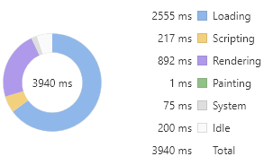
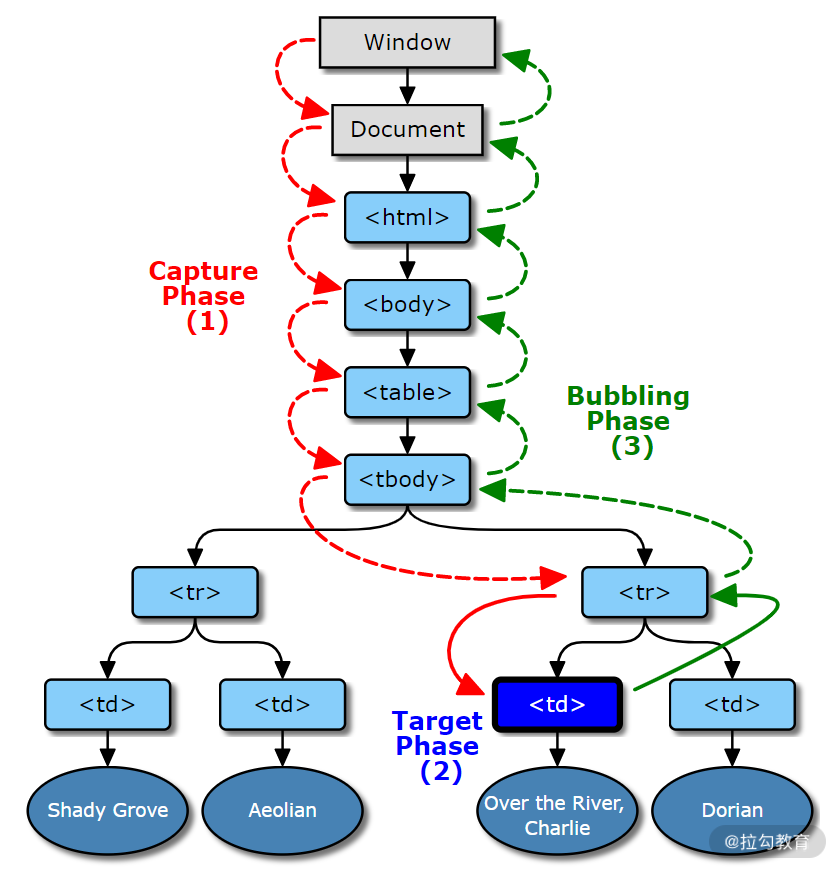

# DOM 概述

DOM（Document Object Model，文档对象模型）是 JavaScript 操作 HTML 的接口（这里只讨论属于前端范畴的 HTML DOM）。

如果你查看过 [DOM V3 标准](https://dom.spec.whatwg.org/)，会发现包含多个内容，但归纳起来常用的主要由 3 个部分组成：

- DOM 节点
- DOM 事件
- 选择区域

**选择区域**的使用场景有限，一般用于富文本编辑类业务；**DOM 事件**有一定的关联性；对于 **DOM 节点**，需与另外两个概念标签和元素进行区分：

- 标签是 HTML 的基本单位，比如 p、div、input；
- 节点是 DOM 树的基本单位，有多种类型，比如注释节点、文本节点；
- 元素是节点中的一种，与 HTML 标签相对应，比如 p 标签会对应 p 元素。

举例说明，在下面的代码中，“p” 是标签， 生成 DOM 树的时候会产生两个节点，一个是元素节点 p，另一个是字符串为“DOM”的文本节点。

```html
<p>DOM</p>
```

# DOM 操作耗时的原因

要解释 DOM 操作带来的性能问题，我们不得不提一下**浏览器的工作机制**。

## 线程切换

浏览器包含渲染引擎（也称浏览器内核）和 JavaScript 引擎，它们都是单线程运行。单线程的优势是开发方便，避免多线程下的死锁、竞争等问题，劣势是失去了并发能力。

浏览器为了避免两个引擎同时修改页面而造成渲染结果不一致的情况，增加了另外一个机制，这两个引擎具有互斥性，也就是说在某个时刻只有一个引擎在运行，另一个引擎会被阻塞。操作系统在进行线程切换的时候需要保存上一个线程执行时的状态信息并读取下一个线程的状态信息，俗称**上下文切换**。而这个操作相对而言是比较耗时的。

每次 DOM 操作就会引发线程的上下文切换——从 JavaScript 引擎切换到渲染引擎执行对应操作，然后再切换回 JavaScript 引擎继续执行，这就带来了**性能损耗**。单次切换消耗的时间是非常少的，但是如果频繁地大量切换，那么就会产生性能问题。

比如下面的测试代码，循环读取一百万次 DOM 中的 body 元素的耗时是读取 JSON 对象耗时的 10 倍。

```js
// 测试次数：一百万次
const times = 1000000
// 缓存body元素
console.time('object')
let body = document.body
// 循环赋值对象作为对照参考
for(let i=0;i<times;i++) {
  let tmp = body
}
console.timeEnd('object')// object: 1.77197265625ms

console.time('dom')
// 循环读取body元素引发线程切换
for(let i=0;i<times;i++) {
  let tmp = document.body
}
console.timeEnd('dom')// dom: 18.302001953125ms
```

虽然这个例子比较极端，循环次数有些夸张，但如果在循环中包含一些复杂的逻辑或者说涉及到多个元素时，就会造成不可忽视的性能损耗。

## 重新渲染

另一个更加耗时的因素是元素及样式变化引起的再次渲染，在渲染过程中最耗时的两个步骤为**重排**（Reflow）与**重绘**（Repaint）。

浏览器在渲染页面时会将 HTML 和 CSS 分别解析成 DOM 树和 CSSOM 树，然后合并进行排布，再绘制成我们可见的页面。如果在操作 DOM 时涉及到元素、样式的修改，就会引起渲染引擎重新计算样式生成 CSSOM 树，同时还有可能触发对元素的重新排布（简称“重排”）和重新绘制（简称“重绘”）。

可能会影响到其他元素排布的操作就会引起重排，继而引发重绘，比如：

- 修改元素边距、大小
- 添加、删除元素
- 改变窗口大小

与之相反的操作则只会引起重绘，比如：

- 设置背景图片
- 修改字体颜色
- 改变 visibility 属性值

如果想了解更多关于重绘和重排的样式属性，可以参看这个网址：https://csstriggers.com/。

下面是两段验证代码，我们通过 Chrome 提供的性能分析工具来对渲染耗时进行分析。

第一段代码，通过修改 div 元素的边距来触发重排，渲染耗时（粗略地认为渲染耗时为紫色 Rendering 事件和绿色 Painting 事件耗时之和）3045 毫秒。

```js
const times = 100000
let html = ''
for(let i=0;i<times;i++) {
  html+= `<div>${i}</div>`
}
document.body.innerHTML += html
const divs = document.querySelectorAll('div')
Array.prototype.forEach.call(divs, (div, i) => {
  div.style.margin = i % 2 ? '10px' : 0;
})
```


第二段代码，修改 div 元素字体颜色来触发重绘，得到渲染耗时 2359 ms。

```js
const times = 100000
let html = ''
for(let i=0;i<times;i++) {
  html+= `<div>${i}</div>`
}
document.body.innerHTML += html
const divs = document.querySelectorAll('div')
Array.prototype.forEach.call(divs, (div, i) => {
  div.style.color = i % 2 ? 'red' : 'green';
})
```


从两段测试代码中可以看出，重排渲染耗时明显高于重绘，同时两者的 Painting 事件耗时接近，也印证了重排会导致重绘。

# 高效操作 DOM

明白了 DOM 操作耗时之处后，要提升性能就变得很简单了，反其道而行之，减少这些操作即可。

## 在循环外操作元素

比如下面两段测试代码对比了读取 1000 次 JSON 对象以及访问 1000 次 body 元素的耗时差异，相差一个数量级。

```js
const times = 10000;
console.time('switch')
for (let i = 0; i < times; i++) {
  document.body === 1 ? console.log(1) : void 0;
}
console.timeEnd('switch') // 1.873046875ms
var body = JSON.stringify(document.body)
console.time('batch')
for (let i = 0; i < times; i++) {
  body === 1 ? console.log(1) : void 0;
}
console.timeEnd('batch') // 0.846923828125ms
```

当然即使在循环外也要尽量减少操作元素，因为不知道他人调用你的代码时是否处于循环中。

## 批量操作元素

比如说要创建 1 万个 div 元素，在循环中直接创建再添加到父元素上耗时会非常多。如果采用字符串拼接的形式，先将 1 万个 div 元素的 html 字符串拼接成一个完整字符串，然后赋值给 body 元素的 innerHTML 属性就可以明显减少耗时。

```js
const times = 10000;
console.time('createElement')
for (let i = 0; i < times; i++) {
  const div = document.createElement('div')
  document.body.appendChild(div)
}
console.timeEnd('createElement')// 54.964111328125ms
console.time('innerHTML')
let html=''
for (let i = 0; i < times; i++) {
  html+='<div></div>'
}
document.body.innerHTML += html // 31.919921875ms
console.timeEnd('innerHTML')
```

虽然通过修改 innerHTML 来实现批量操作的方式效率很高，但它并不是万能的。比如要在此基础上实现事件监听就会略微麻烦，只能通过事件代理或者重新选取元素再进行单独绑定。批量操作除了用在创建元素外也可以用于修改元素属性样式，比如下面的例子。

创建 2 万个 div 元素，以单节点树结构进行排布，每个元素有一个对应的序号作为文本内容。现在通过 style 属性对第 1 个 div 元素进行 2 万次样式调整。下面是直接操作 style 属性的代码：

```js
const times = 20000;
let html = ''
for (let i = 0; i < times; i++) {
  html = `<div>${i}${html}</div>`
}
document.body.innerHTML += html
const div = document.querySelector('div')
for (let i = 0; i < times; i++) {
  div.style.fontSize = (i % 12) + 12 + 'px'
  div.style.color = i % 2 ? 'red' : 'green'
  div.style.margin = (i % 12) + 12 + 'px'
}
```


如果将需要修改的样式属性放入 JavaScript 数组，然后对这些修改进行 reduce 操作，得到最终需要的样式之后再设置元素属性，那么性能会提升很多。代码如下：

```js
const times = 20000;
let html = ''
for (let i = 0; i < times; i++) {
  html = `<div>${i}${html}</div>`
}
document.body.innerHTML += html

let queue = [] //  创建缓存样式的数组
let microTask // 执行修改样式的微任务
const st = () => {
  const div = document.querySelector('div')
  // 合并样式
  const style = queue.reduce((acc, cur) => ({...acc, ...cur}), {})
  for(let prop in style) {
    div.style[prop] = style[prop]
  }
  queue = []
  microTask = null
}
const setStyle = (style) => {
  queue.push(style)
  // 创建微任务
  if(!microTask) microTask = Promise.resolve().then(st)
}
for (let i = 0; i < times; i++) {
  const style = {
    fontSize: (i % 12) + 12 + 'px',
    color: i % 2 ? 'red' : 'green',
    margin:  (i % 12) + 12 + 'px'
  }
  setStyle(style)
}
```

从下面的耗时占比图可以看到，紫色 Rendering 事件耗时有所减少。



virtualDOM 之所以号称高性能，其实现原理就与此类似。

## 缓存元素集合

比如将通过选择器函数获取到的 DOM 元素赋值给变量，之后通过变量操作而不是再次使用选择器函数来获取。

下面举例说明，假设我们现在要将上面代码所创建的 1 万个 div 元素的文本内容进行修改。每次重复使用获取选择器函数来获取元素，代码以及时间消耗如下所示。

```js
for (let i = 0; i < document.querySelectorAll('div').length; i++) {
  document.querySelectorAll(`div`)[i].innerText = i
}
```


如果能够将元素集合赋值给 JavaScript 变量，每次通过变量去修改元素，那么性能将会得到不小的提升。

```js
const divs = document.querySelectorAll('div')
for (let i = 0; i < divs.length; i++) {
  divs[i].innerText = i
}
```


对比两者耗时占比图可以看到，两者的渲染时间较为接近。但缓存元素的方式在黄色的 Scripting 耗时上具有明显优势。

**除了这些方法之外，还有一些原则也可能帮助我们提升渲染性能**，比如：

- 尽量不要使用复杂的匹配规则和复杂的样式，从而减少渲染引擎计算样式规则生成 CSSOM 树的时间；
- 尽量减少重排和重绘影响的区域；
- 使用 CSS3 特性来实现动画效果。

# DOM 事件

DOM 事件数量非常多，即使分类也有十多种，比如键盘事件、鼠标事件、表单事件等，而且不同事件对象属性也有差异度。

下面我们就从防抖、节流、代理 3 个场景出发，详细了解 DOM 事件。

## 防抖

试想这样的一个场景，有一个搜索输入框，为了提升用户体验，希望在用户输入后可以立即展现搜索结果，而不是每次输入完后还要点击搜索按钮。最基本的实现方式应该很容易想到，那就是绑定 input 元素的键盘事件，然后在监听函数中发送 AJAX 请求。伪代码如下：

```js
const ipt = document.querySelector('input')
ipt.addEventListener('input', e => {
  search(e.target.value).then(resp => {
    // ...
  }, e => {
    // ...
  })
})
```

但其实这样的写法很容易造成性能问题。比如当用户在搜索“lagou”这个词的时候，每一次输入都会触发搜索：

1. 搜索“l”
2. 搜索“la”
3. 搜索“lag”
4. 搜索“lago”
5. 搜索“lagou”

而实际上，只有最后一次搜索结果是用户想要的，前面进行了 4 次无效查询，浪费了网络带宽和服务器资源。

所以对于这类连续触发的事件，需要添加一个**“防抖”功能**，为函数的执行设置一个合理的时间间隔，避免事件在时间间隔内频繁触发，同时又保证用户输入后能即时看到搜索结果。

要实现这样一个功能我们很容易想到使用 setTimeout() 函数来让函数延迟执行。就像下面的伪代码，当每次调用函数时，先判断 timeout 实例是否存在，如果存在则销毁，然后创建一个新的定时器。

```js
// 代码1
const ipt = document.querySelector('input')
let timeout = null
ipt.addEventListener('input', e => {
  if(timeout) {
    clearTimeout(timeout)
    timeout = null
  }
  timeout = setTimeout(() => {
    search(e.target.value).then(resp => {
      // ...
    }, e => {
      // ...
    })
  }, 500)
})
```

问题确实是解决了，但这并不是最优答案，或者说我们需对这个防抖操作进行一些“优化”。

试想一下，如果另一个搜索框也需要添加防抖，是不是也要把 timeout 相关的代码再编写一次？而其实这个操作是完全可以抽取成**公共函数**的。

在抽取成公共函数的同时，还需要考虑更复杂的情况：

- 参数和返回值如何传递？
- 防抖化之后的函数是否可以立即执行？
- 防抖化的函数是否可以手动取消？

具体代码如下所示，首先将原函数作为参数传入 debounce() 函数中，同时指定延迟等待时间，返回一个新的函数，这个函数包含 cancel 属性，用来取消原函数执行。flush 属性用来立即调用原函数，同时将原函数的执行结果以 Promise 的形式返回。

```js
// 代码2
const debounce = (func, wait = 0) => {
  let timeout = null
  let args
  function debounced(...arg) {
    args = arg
    if(timeout) {
      clearTimeout(timeout)
      timeout = null
    }
    // 以Promise的形式返回函数执行结果
    return new Promise((res, rej) => {
      timeout = setTimeout(async () => {
        try {
          const result = await func.apply(this, args)
          res(result)
        } catch(e) {
          rej(e)
        }
      }, wait)
    })
  }
  // 允许取消
  function cancel() {
    clearTimeout(timeout)
    timeout = null
  }
  // 允许立即执行
  function flush() {
    cancel()
    return func.apply(this, args)
  }
  debounced.cancel = cancel
  debounced.flush = flush
  return debounced
}
// 防抖处理之后的事件绑定
const ipt = document.querySelector('input')
ipt.addEventListener('input', debounce(e => {
  search(e.target.value).then(resp => {
    // ...
  }, e => {
    // ...
  })
}, 500))
```

我们在写代码解决当前问题的时候，最初只能写出像代码 1 那样满足需求的代码。但要成为高级工程师，就一定要将问题再深想一层，比如代码如何抽象成公共函数，才能得到较为完善的代码 2，从而自身得到成长。

关于防抖函数还有功能更丰富的版本，比如 [lodash](https://github.com/lodash/lodash) 的 [debounce](https://github.com/lodash/lodash/blob/master/debounce.js)() 函数。

## 节流

现在来考虑另外一个场景，一个左右两列布局的查看文章页面，左侧为文章大纲结构，右侧为文章内容。现在需要添加一个功能，就是当用户滚动阅读右侧文章内容时，左侧大纲相对应部分高亮显示，提示用户当前阅读位置。

这个功能的实现思路比较简单，滚动前先记录大纲中各个章节的垂直距离，然后监听 scroll 事件的滚动距离，根据距离的比较来判断需要高亮的章节。伪代码如下：

```js
// 监听scroll事件
wrap.addEventListener('scroll', e => {
  let highlightId = ''
  // 遍历大纲章节位置，与滚动距离比较，得到当前高亮章节id
  for (let id in offsetMap) {
    if (e.target.scrollTop <= offsetMap[id].offsetTop) {
      highlightId = id
      break
    }
  }
  const lastDom = document.querySelector('.highlight')
  const currentElem = document.querySelector(`a[href="#${highlightId}"]`)
  // 修改高亮样式
  if (lastDom && lastDom.id !== highlightId) {
    lastDom.classList.remove('highlight')
    currentElem.classList.add('highlight')
  } else {
    currentElem.classList.add('highlight')
  }
})
```

功能是实现了，但这并不是最优方法，因为滚动事件的触发频率是很高的，持续调用判断函数很可能会影响渲染性能。实际上也不需要过于频繁地调用，因为当鼠标滚动 1 像素的时候，很有可能当前章节的阅读并没有发生变化。所以我们可以设置在指定一段时间内只调用一次函数，从而降低函数调用频率，这种方式我们称之为“**节流**”。

实现节流函数的过程和防抖函数有些类似，只是对于节流函数而言，有两种执行方式，在调用函数时执行最先一次调用还是最近一次调用，所以需要设置时间戳加以判断。我们可以基于 debounce() 函数加以修改，代码如下所示：

```js
const throttle = (func, wait = 0, execFirstCall) => {
  let timeout = null
  let args
  let firstCallTimestamp


  function throttled(...arg) {
    if (!firstCallTimestamp) firstCallTimestamp = new Date().getTime()
    if (!execFirstCall || !args) {
      console.log('set args:', arg)
      args = arg
    }
    if (timeout) {
      clearTimeout(timeout)
      timeout = null
    }
    // 以Promise的形式返回函数执行结果
    return new Promise(async(res, rej) => {
      if (new Date().getTime() - firstCallTimestamp >= wait) {
        try {
          const result = await func.apply(this, args)
          res(result)
        } catch (e) {
          rej(e)
        } finally {
          cancel()
        }
      } else {
        timeout = setTimeout(async () => {
          try {
            const result = await func.apply(this, args)
            res(result)
          } catch (e) {
            rej(e)
          } finally {
            cancel()
          }
        }, firstCallTimestamp + wait - new Date().getTime())
      }
    })
  }
  // 允许取消
  function cancel() {
    clearTimeout(timeout)
    args = null
    timeout = null
    firstCallTimestamp = null
  }
  // 允许立即执行
  function flush() {
    cancel()
    return func.apply(this, args)
  }
  throttled.cancel = cancel
  throttled.flush = flush
  return throttled
}
```

节流与防抖都是通过延迟执行，减少调用次数，来优化频繁调用函数时的性能。不同的是，对于一段时间内的频繁调用，防抖是延迟执行后一次调用，节流是延迟定时多次调用。

## 代理

下面的 HTML 代码是一个简单的无序列表，现在希望点击每个项目的时候调用 getInfo() 函数，当点击“编辑”时，调用一个 edit() 函数，当点击“删除”时，调用一个 del() 函数。

```html
<ul class="list">
  <li class="item" id="item1">项目1<span class="edit">编辑</span><span class="delete">删除</span></li>
  <li class="item" id="item2">项目2<span class="edit">编辑</span><span class="delete" >删除</span></li>
  <li class="item" id="item3">项目3<span class="edit">编辑</span><span class="delete">删除</span></li>
  ...
</ul>
```

要实现这个功能并不难，只需要对列表中每一项，分别监听 3 个元素的 click 事件即可。

但如果数据量一旦增大，事件绑定占用的内存以及执行时间将会成线性增加，而其实这些事件监听函数逻辑一致，只是参数不同而已。此时我们可以以**事件代理**或**事件委托**来进行优化。

在此之前，我们先复习一下 DOM 事件的触发流程

事件触发流程如图 1 所示，主要分为 3 个阶段：

- **捕获**，事件对象 Window 传播到目标的父对象，图 1 的红色过程；
- **目标**，事件对象到达事件对象的事件目标，图 1 的蓝色过程；
- **冒泡**，事件对象从目标的父节点开始传播到 Window，图 1 的绿色过程。



例如，在下面的代码中，虽然我们第二次进行事件监听时设置为捕获阶段，但点击事件时仍会按照监听顺序进行执行。

```html
<body>
  <button>click</button>
</body>
<script>
document.querySelector('button').addEventListener('click', function () {
  console.log('bubble')
})
document.querySelector('button').addEventListener('click', function () {
  console.log('capture')
}, true)
// 执行结果
// buble
// capture
</script>
```

我们再回到事件代理，事件代理的实现原理就是利用上述 DOM 事件的触发流程来对一类事件进行统一处理。比如对于上面的列表，我们在 ul 元素上绑定事件统一处理，通过得到的事件对象来获取参数，调用对应的函数。

```js
const ul = document.querySelector('.list')
ul.addEventListener('click', e => {
  const t = e.target || e.srcElement
  if (t.classList.contains('item')) {
    getInfo(t.id)
  } else {
    id = t.parentElement.id
    if (t.classList.contains('edit')) {
      edit(id)
    } else if (t.classList.contains('delete')) {
      del(id)
    }
  }
})
```

虽然这里我们选择了默认在冒泡阶段监听事件，但和捕获阶段监听并没有区别。对于其他情况还需要具体情况具体细分析，比如有些列表项目需要在目标阶段进行一些预处理操作，那么可以选择冒泡阶段进行事件代理。

## 关于 DOM 事件标准

下面 3 种事件监听方式的区别吗？

```js
// 方式1
<input type="text" onclick="click()"/>
// 方式2
document.querySelector('input').onClick = function(e) {
  // ...
}
// 方式3
document.querySelector('input').addEventListener('click', function(e) {
  //...
})
```

方式 1 和方式 2 同属于 DOM0 标准，通过这种方式进行事件监会覆盖之前的事件监听函数。

方式 3 属于 DOM2 标准，推荐使用这种方式。同一元素上的事件监听函数互不影响，而且可以独立取消，调用顺序和监听顺序一致。

