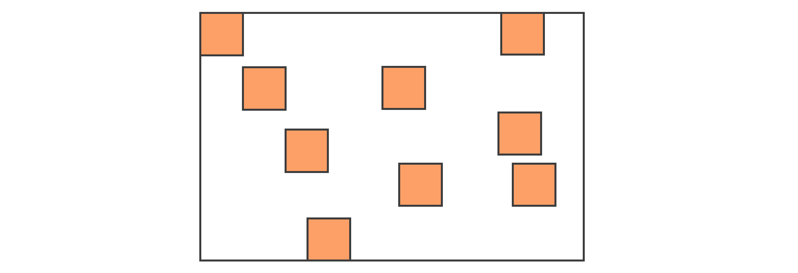

# JS的垃圾回收

JS 要进行垃圾回收，那么首先我们需要清楚的是，JS中的垃圾是什么

**JS中的垃圾**

JS中的内存管理都是自动的，**对象不再被引用时成为垃圾，对象不能从根上访问到是垃圾**

**JS中的可达对象**

可以访问到的对象就是可达对象（引用、作用域链） 可达的标准就是从根出发是否能被找到 JS中的根可理解为是全局变量对象

```js
let obj = {name: 'name'}
let obj1 = obj // obj1 引用了obj
obj = null // 由于obj1 在引用obj 所以这个时候obj 还是可达对象
```


# GC算法

> GC 就是垃圾回收机制的简写 
> GC可以找到内存中的垃圾、并释放和回收空间

**GC中的垃圾**

- 程序中不再需要使用的对象 
- 程序中不能再访问到的对象

**GC算法**

GC 是一种机制，垃圾回收器完成具体的工作

工作的内容就是查找垃圾释放空间、回收空间

算法就是工作时查找和回收所遵循的规则


## 常见的GC算法

### 引用计数

**原理** 

内部通过引用计数器维护当前对象的引用数，判断当前引用数是否为 0，决定是否开始 GC 工作[为 0 时则开始工作]

> 引用计数器 => 引用关系发生改变时会修改当前对象所对应的引用数字，引用数字为 0 时立即回收

```js
const obj1 = { age: 1 };
const obj2 = { age: 2 };
const obj3 = { age: 3 };
const objAge = [obj1.age, obj2.age, obj3.age]; // 由于当前对象引用了obj*中的值，所以obj*引用数字不会变为0，即不会回收
function func() {
  const a = 1,
    b = 2;
}
func(); // 函数执行完成后释放a,b
```

**优缺点**

- 优点
  1. 发现垃圾立即回收 
  2. 最大限度减少程序暂停【说明 1】
- 缺点 
  1. 无法回收循环引用的对象【栗子】 
  2. 时间开销大【说明 2】

> 说明:
>
> 1. 当发现垃圾的时候会进行及时清理释放空间，所以保证了内存空间的大小，不会因此导致程序的暂停
> 2. 需要维护对象的数值修改，当对象很多的情况下，所需要的时间开销是很大的

```js
// 栗子
function func() {
  const obj1 = {}, obj2 = {};
  obj1.name = obj2;
  obj2.name = obj1; // 由于obj1和obj2互相引用，所以无法修改计数为0，即不会释放当前空间
  return "test";
}
func();
```


### 标记清除（Mark-Sweep）

> 首先它会遍历堆上的所有的对象，分别对它们打上标记；然后在代码执行过程结束之后，对使用过的变量取消标记。那么没取消标记的就是没有使用过的变量，因此在清除阶段，就会把还有标记的进行整体清除，从而释放内存空间。

**原理** 

将整个垃圾回收分为两个阶段：标记阶段和清除阶段。

第一个阶段：遍历所有对象找到活动对象【可达对象】并标记；

第二个阶段：遍历所有对象清除掉没有标记的对象 & 抹掉第一个阶段所设置的标记【便于GC接下来的工作】然后回收相应的空间【将回收的空间放置在"空闲列表"上，方便后续申请使用】

**优缺点**

- 优点 
  解决对象循环引用不能回收的问题
- 缺点 
  1. 地址不连续 
     空间碎片化(由于当前所回收的垃圾对象在地址上本身是不连续的，所以在回收之后他们会分散在各个角落，后续在使用的时候，刚好新的生成空间与他们的空间大小匹配，就可以使用，如果多了或者少了就不太适合使用) 
  2. 不会立即回收垃圾对象


### 标记整理（Mark-Compact）

**原理**

> 标记整理可以看做是标记清除的增强

第一个阶段跟标记清除完全相同；清除阶段会先执行整理，移动对象位置，使它们的地址产生连续。处理过程中会将所有的活动对象往一端靠拢，整体移动完成后，直接清理掉边界外的内存


### 分代回收

将内存分为**新生代存储区**和**老生代存储区**，针对不同的对象采用不同的算法


# V8引擎

- V8是一款主流的JavaScript执行引擎
- V8采用即时编译-可以将源码直接翻译成机器码
- V8内存设限-根据不同的操作系统（操作系统有 64 位和 32 位的）内存大小会不同
  64位操作系统上限【1.5G】 - 32位操作系统上限【800M】
- V8内存分配 - V8内存空间一分为二 
  小空间用于存储新生代对象（32M | 16M） 
  老生代对象（1.4G | 700M）


<center style="font-size:12px">V8内存分配</center>

V8 为什么要去限制内存使用呢？大致是两个原因：V8 最开始是为浏览器而设计的引擎，早些年由于 Web 应用都比较简单，其实并未考虑占据过多的内存空间；另外又由于被 V8 的垃圾回收机制所限制，比如清理大量的内存时会耗费很多时间，这样会引起 JavaScript 执行的线程被挂起，会影响当前执行的页面应用的性能。


## V8 垃圾回收策略

> 采用分代回收的思想

将内存分为**新生代(存活时间较短的对象)存储区**和**老生代(老生代对象就是指存活时间较长的对象,比如全局对象、闭包等)存储区**，针对不同的对象采用不同的算法


## V8 中常用GC算法

- 分代回收
- 空间复制
- 标记清除
- 标记整理
- 标记增量


## 新生代内存的回收

新生代的内存回收的空间，在 64 位操作系统下分配为 32MB，正是因为新生代中的变量存活时间短，不太容易产生太大的内存压力，因此不够大也是可以理解的。首先系统会将分配给新生代的内存空间分为两部分


图中左边部分表示正在使用的内存空间，右边是目前闲置的内存空间。当浏览器开始进行内存的垃圾回收时，JavaScript 的 V8 引擎会将左边的对象检查一遍。如果引擎检测是存活对象，那么会复制到右边的内存空间去；如果不是存活的对象，则直接进行系统回收。当所有左边的内存里的对象没有了的时候，等再有新生代的对象产生时，上面的部分左右对调，这样来循环处理。

如果是顺序放置的那比较好处理，可以按照上面所说的处理方式。但是如果是下图这样零散的场景怎么处理呢？



图中橙色的块代表存活对象，白色地方代表未分配的内存。正常情况下，由于堆内存是连续分配的，但是也有可能出现上图的这种内存分配情况，这种零散的分配情况就造成了内存碎片，会影响比较大的内存对象的放置。

因此这里介绍一个算法 Scavenge，它主要就是解决上图中内存碎片的情况，在通过算法处理过后，内存中对象的排布都会变成下图这个排列方式


进行这样的算法处理，明显会让内存排布变得更整齐了，这样就非常方便之后新来的对象的内存分配。

<h4>📚 总结一夏</h4>

**# 回收实现**

- 回收过程采用复制算法 + 标记整理
- 新生代内存区分为两个等大小空间
- 使用空间为From，空闲空间为To
- 活动对象存储于From空间
- 标记整理后将活动对象拷贝到To
- From与To交换空间完成释放

**# 回收细节说明**

- 拷贝过程中可能出现晋升【晋升就是将新生代对象移动至老生代】
- 一轮GC还存活的新生代需要晋升
- To空间的使用率超过25%需要晋升
- 使用空间换时间


## 老生代对象的回收

新生代中的变量如果经过回收之后依然一直存在，那么就会被放入到老生代内存中。时间长了之后通过几个原因的判断，我们就会把这些变量进行 "晋升"，只要是已经经历过一次 Scavenge 算法回收的，就可以晋升为老生代内存的对象。那么在进入老生代的内存回收机制中，就不能再用 Scavenge 的算法了。Scavenge 的算法是有其适用的场景，而对于内存空间比较大的，就不适合用 Scavenge 算法了。

**# 回收实现**

- 回收过程采用标记清除、标记整理、增量标记算法
- 首先使用标记清除完成垃圾空间的回收
- 采用标记整理进行空间优化 当新生代对象想要晋升到老生代区时 & 老生代空间又不足的情况下触发标记整理算法
- 采用增量标记进行效率优化 - 当垃圾进行回收的时候会阻塞JS的执行 - 标记增量： 将当前一整段的垃圾回收工作拆分为多个小步组合着完成当前整个回收【替代之前一口气完成的垃圾回收工作】 - 可以实现垃圾回收与程序执行的交替完成 - 提升了时间的消耗

**# 回收细节说明**

- 不适合复制算法
- 空间比较大，如果将空间一分为二，会浪费很多空间
- 老生代中的对象更多，如果采用复制算法，那么消耗时间会很长


<center style="font-size:12px">标记增量如何优化垃圾回收</center>

老生代内存的管理方式和新生代的内存管理方式区别还是比较大的。Scavenge 算法比较适合内存较小的情况处理；而对于老生代内存较大、变量较多的时候，还是需要采用“标记-清除”结合“标记-整理”这样的方式处理内存问题，并尽量避免内存碎片的产生。


## 增量标记算法的工作原理

将当前一整段的垃圾回收工作拆分为多个小步组合完成当前的整个回收【替代之前一口气完成的垃圾回收工作】， 实现了垃圾回收与程序执行的交替完成，从而优化效率
