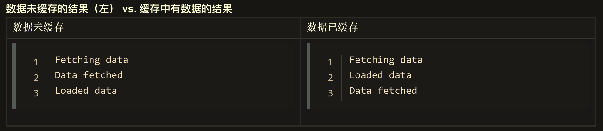

# 异步编程

**JS采用单线程模式工作的原因**

最早js语言就是运行在浏览器端的脚本语言，目的是为了实现页面上的动态交互。**实现页面交互的核心就是DOM操作，这就决定了它必须使用单线程模型**，否则就会出现很复杂的线程同步问题。

> 假设在js中有多个线程一起工作，其中一个线程修改了这个DOM元素，同时另一个线程又删除了这个元素，此时浏览器就无法明确该以哪个工作线程为准。所以为了避免线程同步的问题，从一开始，js就设计成了单线程的工作模式。

单线程指的是：js执行环境中负责执行代码的线程只有一个,如果有多个任务，那任务需要排队依次执行。


**单线程的优势和弊端**

1. 优势：**更安全，更简单**
2. 缺点：如果中间有一个特别耗时的任务，其他的任务就要等待很长的时间，出现假死的情况。**这里要强调，js是单线程的，浏览器不是单线程的，有一些API是有单独的线程去做的。**

为了解决这种问题，js有两种任务的执行模式：**同步模式（Synchronous）和异步模式（Asynchronous）**


## 同步模式与异步模式

### 同步模式（Synchronous）

> 代码的任务依次执行，后一个任务必须等待前一个任务结束才能开始执行。程序的执行顺序和代码的编写顺序是完全一致的。在单线程模式下，大多数任务都会以同步模式执行

```js
console.log('global begin')
function bar () {
    console.log('bar task') 
}
function foo () {
    console.log('foo task')
    bar()
}
foo()
console.log('global end')

// global begin
// foo task
// bar task
// global end

// 使用调用栈的逻辑
```


### 异步模式（Asynchronous）

> 不会去等待这个任务的结束才开始下一个任务，都是开启过后就立即往后执行下一个任务。耗时函数的后续逻辑会通过回调函数的方式定义。在内部，耗时任务完成过后就会自动执行传入的回调函数

js线程某个时刻发起了一个异步调用，它紧接着继续执行其他的任务，此时异步线程会单独执行异步任务，执行过后会将回调放到消息队列中，js主线程执行完任务过后会依次执行消息队列中的任务。**这里要强调，js是单线程的，浏览器不是单线程的，有一些API是有单独的线程去做的。**

*这里的同步和异步不是指写代码的方式，而是运行环境提供的API是以同步或异步模式的方式工作*

```js
console.log('global begin')
// 延时器
setTimeout(function timer1 () {
    console.log('timer1 invoke')
}, 1800)
// 延时器中又嵌套了一个延时器
setTimeout(function timer2 () {
    console.log('timer2 invoke')
    setTimeout(function inner () {
        console.log('inner invoke')
    }, 1000)
}, 1000)
console.log('global end')

// global begin
// global end
// timer2 invoke
// timer1 invoke
// inner invoke

// 除了调用栈，还用到了消息队列和事件循环
/** eventloop 负责监听调用栈和消息队列，一旦调用栈中的任务都结束了，事件循环就会从消息队列中取出第一个回调函数压入到调用栈 */
```


### 同步模式API和异步模式API的特点

**同步模式的API的特点:** 任务执行完代码才会继续往下走，例如：console.log

**异步模式的API的特点**: 下达这个任务开启的指令之后代码就会继续执行，代码不会等待任务的结束


## 事件循环与消息队列

### 事件循环EventLoop

JS是单线程，在I/O操作，网络请求，读取文件等过程中都是进行等待操作，这样容易引起阻塞。
JS事件循环是用来协调事件、用户交互、脚步执行、页面渲染、网络请求等。都是由一个叫做worker机制的代理去管理。
JS引入worker机制，可以实现多线程。worker中设置两个线程：一个负责程序本身的运行，称为”主线程”；另一个负责主线程与其它进程（主要是各种I/O操作）的通信，被称为”Event Loop线程”, 事件循环负责执行代码、收集和处理事件以及执行队列中的子任务。

*简单概括*：
主线程从"任务队列"中读取事件，这个过程是循环不断的，所以整个的这种运行机制又称为Event Loop（事件循环）。

Event Loop线程处理的任务被分为两类即 微任务（micro task）和宏任务（macro task)  这两个任务分别维护一个队列，都是采用先进先出的策略进行执行。


### 消息队列

一个 JavaScript 运行时包含了一个待处理消息的消息队列。每一个消息都关联着一个用以处理这个消息的回调函数。
在 *事件循环* 期间的某个时刻，运行时会从最先进入队列的消息开始处理队列中的消息。被处理的消息会被移出队列，并作为输入参数来调用与之关联的函数。
正如前面所提到的，调用一个函数总是会为其创造一个新的栈帧。
函数的处理会一直进行到执行栈再次为空为止；然后事件循环将会处理队列中的下一个消息（如果还有的话）

当前执行栈执行完毕时会立刻先处理所有微任务队列中的事件，然后再去宏任务队列中取出一个事件。
同一次事件循环中，微任务永远在宏任务之前执行。


### 微任务/ 宏任务

**常见的宏任务：**

- script 中的代码块
- setTimeout()
- setInterval()
- setImmediate() (非标准，IE 和 Node.js 中支持)
- 注册事件

**常见的微任务：**

- Promise

- [MutationObserver](https://developer.mozilla.org/zh-CN/docs/Web/API/MutationObserver)

- [queueMicrotask](https://developer.mozilla.org/zh-CN/docs/Web/API/WindowOrWorkerGlobalScope/queueMicrotask)()

  ```js
  queueMicrotask(() => {
    console.log('微任务')
  })
  ```

**[何时使用微任务](https://developer.mozilla.org/zh-CN/docs/Web/API/HTML_DOM_API/Microtask_guide#何时使用微任务)**

微任务的执行时机，晚于当前本轮事件循环的 Call Stack(调用栈) 中的代码(宏任务)，早于事件处理函数和定时器的回调函数。

使用微任务的最主要原因简单归纳为：

- 减少操作中用户可感知到的延迟
- 确保任务顺序的一致性，即便当结果或数据是同步可用的
- 批量操作的优化


**确保任务顺序的一致性**

```js
customElement.prototype.getData = url => {
  if (this.cache[url]) {
    this.data = this.cache[url];
    this.dispatchEvent(new Event("load"));
  } else {
    fetch(url).then(result => result.arrayBuffer()).then(data => {
      this.cache[url] = data;
      this.data = data;
      this.dispatchEvent(new Event("load"));
    )};
  }
};

element.addEventListener("load", () => console.log("Loaded data"));
console.log("Fetching data...");
element.getData();
console.log("Data fetched");
```



```js
customElement.prototype.getData = url => {
  if (this.cache[url]) {
    queueMicrotask(() => {
      this.data = this.cache[url];
      this.dispatchEvent(new Event("load"));
    });
  } else {
    fetch(url).then(result => result.arrayBuffer()).then(data => {
      this.cache[url] = data;
      this.data = data;
      this.dispatchEvent(new Event("load"));
    )};
  }
};
```

**批量操作**

```js
let messageQueue = []
let sendMessage = message => {
  messageQueue.push(message)
  if (messageQueue.length === 1) {
    queueMicrotask(() => {
      const json = JSON.stringify(messageQueue);
      messageQueue.length = 0;
      // fetch("url-of-receiver", json);
      console.log(json)
    });
  }
};

sendMessage('刘备')
sendMessage('关羽')
sendMessage('曹操')
```


## 异步编程的几种方式

### 1. 回调函数

> 由调用者定义，交给执行者执行的函数

**缺点**： 很容易形成回调地狱

回调实现异步编程的场景：

- ajax 请求的回调
- 定时器中的回调
- 事件回调
- Nodejs 中的一些方法回调

异步回调如果层级很少，可读性和代码的维护性暂时还是可以接受，一旦层级变多就会陷入回调地狱，上面这些异步编程的场景都会涉及回调地狱的问题。

```js
// callback就是回调函数
// 就是把函数作为参数传递，缺点是不利于阅读，执行顺序混乱。
function foo(callback) {
    setTimeout(function(){
        callback()
    }, 3000)
}

foo(function() {
    console.log('这就是一个回调函数')
    console.log('调用者定义这个函数，执行者执行这个函数')
    console.log('其实就是调用者告诉执行者异步任务结束后应该做什么')
})
```


### 2. Promise

> Promise是一个对象，用来表述一个异步任务执行之后是成功还是失败。
> 采用 Promise 的实现方式在一定程度上解决了回调地狱的问题

即便promise中没有任何的异步操作，then方法的回调函数仍然会进入到事件队列中排队。

***本质***：使用回调函数的方式去定义异步任务结束后所需要执行的任务。这里的回调函数是通过then方法传递过去的

🌰 案例：使用Promise去封装一个ajax的案例

```js
function ajax (url) {
  return new Promise((resolve, rejects) => {
    // 创建一个XMLHttpRequest对象去发送一个请求
    const xhr = new XMLHttpRequest()
    // 先设置一下xhr对象的请求方式是GET，请求的地址就是参数传递的url
    xhr.open('GET', url)
    // 设置返回的类型是json，是HTML5的新特性
    // 我们在请求之后拿到的是json对象，而不是字符串
    xhr.responseType = 'json'
    // html5中提供的新事件,请求完成之后（readyState为4）才会执行
    xhr.onload = () => {
      if(this.status === 200) {
        // 请求成功将请求结果返回
        resolve(this.response)
      } else {
        // 请求失败，创建一个错误对象，返回错误文本
        rejects(new Error(this.statusText))
      }
    }
    // 开始执行异步请求
    xhr.send()
  })
}

ajax('/api/user.json').then((res) => {
  console.log(res)
}, (error) => {
  console.log(error)
})
```


### 3. Generator

> 最大的特点就是可以交出函数的执行权，Generator 函数可以看出是异步任务的容器，需要暂停的地方，都用 yield 语法来标注。
> Generator 函数一般配合 yield 使用，Generator 函数最后返回的是迭代器。
> 参考文档：[迭代器和生成器 - JavaScript | MDN](https://link.zhihu.com/?target=https%3A//developer.mozilla.org/zh-CN/docs/Web/JavaScript/Guide/Iterators_and_Generators)
> 定义生成器函数就是在function 后面跟一个 * 
> Generator 函数会返回一个生成器对象，调用对象的next方法才会开始执行函数体内容，碰到yield关键词就会暂停执行，yield 后面的值将会作为next 的结果返回

```js
function * gen() {
  console.log("enter");
  let a = yield 1;
  let b = yield (function () {return 2})();
  return 3;
}
var g = gen()           // 阻塞住，不会执行任何语句
console.log(typeof g)   // 返回 object 这里不是 "function"
console.log(g.next())
console.log(g.next())
console.log(g.next())
console.log(g.next()) 
// output:
// { value: 1, done: false }
// { value: 2, done: false }
// { value: 3, done: true }
// { value: undefined, done: true }
```


### 4. async/await

> async 是 Generator 函数的语法糖，async/await 的优点是代码清晰（不像使用 Promise 的时候需要写很多 then 的方法链），可以处理回调地狱的问题

```js
function testWait() {
    return new Promise((resolve,reject)=>{
        setTimeout(function(){
            console.log("testWait");
            resolve();
        }, 1000);
    })
}
async function testAwaitUse(){
    await testWait()
    console.log("hello");
    return 123;
    // 输出顺序：testWait，hello
    // 第十行如果不使用await输出顺序：hello , testWait
}
console.log(testAwaitUse());
```


### 相关推文

[Promise](../es2015/Promise.md)

[Generator](../es2015/Generator.md)

[async/await](../es2017/async-await.md)


# 附录

- [异步 JavaScript](https://developer.mozilla.org/zh-CN/docs/learn/JavaScript/%E5%BC%82%E6%AD%A5)

- [并发模型与事件循环](https://developer.mozilla.org/zh-CN/docs/Web/JavaScript/EventLoop)

- [Microtasks and the JavaScript runtime environment](https://developer.mozilla.org/zh-CN/docs/Web/API/HTML_DOM_API/Microtask_guide/In_depth)
- [在 JavaScript 中通过 queueMicrotask() 使用微任务](https://developer.mozilla.org/zh-CN/docs/Web/API/HTML_DOM_API/Microtask_guide)
- [https://developer.mozilla.org/zh-CN/docs/Web/API/HTML_DOM_API/Microtask_guide/In_depth](https://developer.mozilla.org/zh-CN/docs/Web/API/HTML_DOM_API/Microtask_guide/In_depth)
- [Event loops](https://html.spec.whatwg.org/multipage/webappapis.html#event-loops)
