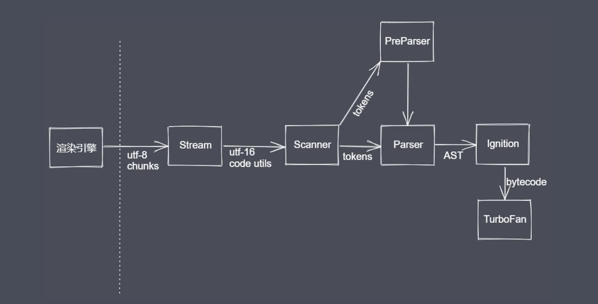
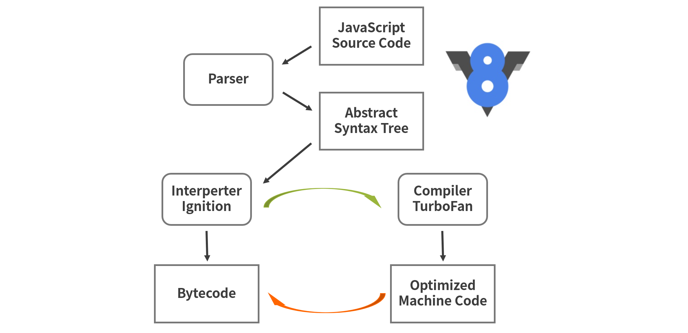
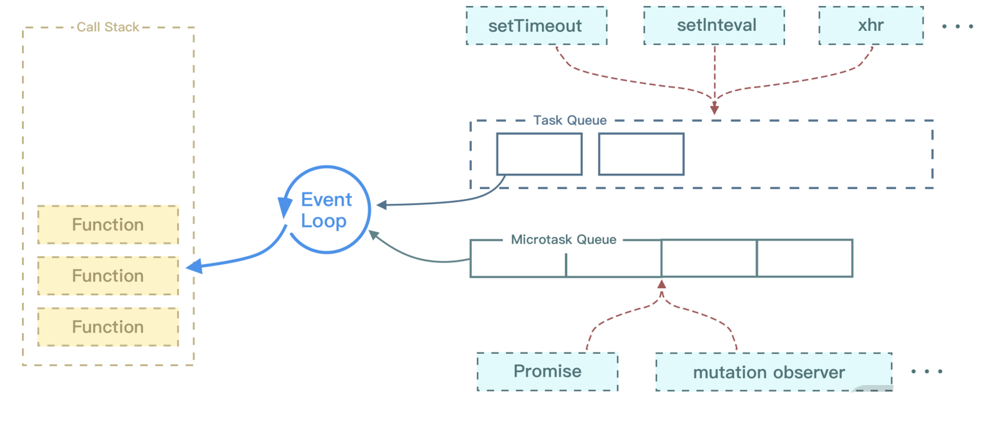

# 前言

此篇我们来看看浏览器引擎是如何编译、执行 JS 代码的，深入理解浏览器引擎所做的工作。

我们先分析引擎对 JS 代码的编译情况，并结合日常的 JavaScript 开发经验，重新理解底层的编译解析机制。


# V8 引擎

当前百花齐放的编程语言，主要分为编译型语言和解释型语言。

1. 编译型语言的特点是在代码运行前编译器直接将对应的代码转换成机器码，运行时不需要再重新翻译，直接可以使用编译后的结果。
2. 解释型语言也是需要将代码转换成机器码，但是和编译型的区别在于运行时需要转换。比较显著的特点是，解释型语言的执行速度要慢于编译型语言，因为解释型语言每次执行都需要把源码转换一次才能执行。

像 Java 和 C++ 都是编译型语言；而 JavaScript 和 ruby 都是解释性语言，它们整体的执行速度都会略慢于编译型的语言。

为了提高运行效率，很多浏览器厂商在也在不断努力。目前市面上有很多种 JS 引擎，例如 JavaScriptCore、chakra、V8 等。而比较现代的 JS 引擎，当数 V8，它引入了 Java 虚拟机和 C++ 编译器的众多技术，和早期的 JS 引擎工作方式已经有了很大的不同。

V8 是众多浏览器的 JS 引擎中性能表现最好的一个，并且它是 Chrome 的内核，Node.js 也是基于 V8 引擎研发的。

## V8 引擎工作流程

V8引擎本身也是一个应用程序，就是JS的执行环境。我们这里只考虑浏览器平台，比如说NodeJS平台下同样也是用的V8，我们暂不做深入研究。我们把它看做是浏览器的一个组成部分，用来解析和编译JS代码，在它内部也存在很多的子模块。如下图所示。



我们从最左侧开始看，放置的是浏览器的渲染引擎，V8引擎是浏览器渲染引擎的执行代码的组成部分。

Scanner：是一个扫描器，对于纯文本的JS代码进行词法分析。会将代码分析成不同的tockens

Parser: 是一个解析器，将 JS 代码转换成 AST（抽象语法树）；同时也会在语法分析的过程中进行语法的校验。

```tex
预解析优点
1. 跳过未被使用的代码
2. 不生成AST，创建无变量引用和声明的scopes
3. 依据规范抛出待定错误
4. 解析速度更快

全量解析
1. 解析被使用的代码
2. 生成AST
3. 构建具体 scopes 信息，变量引用、声明等
4. 抛出所有语法错误
```

Ignition: 是V8提供的一个解释器。

TurboFan：是V8提供的编译器模块

V8 引擎执行 JS 代码需要经过的几个阶段。

1. **Parse 阶段**：V8 引擎负责将 JS 代码转换成 AST（抽象语法树）；
2. **Ignition 阶段**：解释器将 AST 转换为字节码，解析执行字节码也会为下一个阶段优化编译提供需要的信息；
3. **TurboFan 阶段**：编译器利用上个阶段收集的信息，将字节码优化为可以执行的机器码；
4. **Orinoco 阶段**：垃圾回收阶段，将程序中不再使用的内存空间进行回收。

其中，生成 AST、生成字节码、生成机器码是比较重要的三个阶段，下面我们对其进行详细分析，看看每个底层阶段到底做了哪些操作，会影响 JS 代码执行的编译执行。


## 生成 AST

在日常工作中用过的 Eslint 和 Babel 这两个工具，这些工具每个都和 AST 脱不了干系。V8 引擎就是通过编译器（Parse）将源代码解析成 AST 的。

AST 在实际工作中应用场景也比较多，我们来看看抽象语法树的应用场景，大致有下面几个：

1. JS 反编译，语法解析；
2. Babel 编译 ES6 语法；
3. 代码高亮；
4. 关键字匹配；
5. 代码压缩。

这些场景的实现，都离不开通过将 JS 代码解析成 AST 来实现。生成 AST 分为两个阶段，一是词法分析，二是语法分析，我们来分别看下这两个阶段的情况。

1. 词法分析：这个阶段会将源代码拆成最小的、不可再分的词法单元，称为 token。比如这行代码 var a =1；通常会被分解成 var 、a、=、2、; 这五个词法单元。另外刚才代码中的空格在 JavaScript 中是直接忽略的。
2. 语法分析：这个过程是将词法单元转换成一个由元素逐级嵌套所组成的代表了程序语法结构的树，这个树被称为抽象语法树。

下面我们来简单看一下解析成抽象语法树之后是什么样子的，代码如下。

```js
// 第一段代码
var a = 1;
// 第二段代码
function sum (a,b) {
  return a + b;
}
```

将这两段代码，分别转换成 AST 抽象语法树之后返回的 JSON 格式如下。

**1**. 第一段代码，编译后的结果：

```js
{
  "type": "Program",
  "start": 0,
  "end": 10,
  "body": [
    {
      "type": "VariableDeclaration",
      "start": 0,
      "end": 10,
      "declarations": [
        {
          "type": "VariableDeclarator",
          "start": 4,
          "end": 9,
          "id": {
            "type": "Identifier",
            "start": 4,
            "end": 5,
            "name": "a"
          },
          "init": {
            "type": "Literal",
            "start": 8,
            "end": 9,
            "value": 1,
            "raw": "1"
          }
        }
      ],
      "kind": "var"
    }
  ],
  "sourceType": "module"
}
```

**2**. 第二段代码，编译出来的结果：

```js
{
  "type": "Program",
  "start": 0,
  "end": 38,
  "body": [
    {
      "type": "FunctionDeclaration",
      "start": 0,
      "end": 38,
      "id": {
        "type": "Identifier",
        "start": 9,
        "end": 12,
        "name": "sum"
      },
      "expression": false,
      "generator": false,
      "async": false,
      "params": [
        {
          "type": "Identifier",
          "start": 14,
          "end": 15,
          "name": "a"
        },
        {
          "type": "Identifier",
          "start": 16,
          "end": 17,
          "name": "b"
        }
      ],
      "body": {
        "type": "BlockStatement",
        "start": 19,
        "end": 38,
        "body": [
          {
            "type": "ReturnStatement",
            "start": 23,
            "end": 36,
            "argument": {
              "type": "BinaryExpression",
              "start": 30,
              "end": 35,
              "left": {
                "type": "Identifier",
                "start": 30,
                "end": 31,
                "name": "a"
              },
              "operator": "+",
              "right": {
                "type": "Identifier",
                "start": 34,
                "end": 35,
                "name": "b"
              }
            }
          }
        ]
      }
    }
  ],
  "sourceType": "module"
}
```

从上面编译出的结果可以看到，AST 只是源代码语法结构的一种抽象的表示形式，计算机也不会去直接去识别 JS 代码，转换成抽象语法树也只是识别这一过程中的第一步。

前面我提到了前端领域经常使用一个工具 Babel，比如现在浏览器还不支持 ES6 语法，需要将其转换成 ES5 语法，这个过程就要借助 Babel 来实现。将 ES6 源码解析成 AST，再将 ES6 语法的抽象语法树转成 ES5 的抽象语法树，最后利用它来生成 ES5 的源代码。另外 ESlint 的原理也大致相同，检测流程也是将源码转换成抽象语法树，再利用它来检测代码规范。

抽象语法树是一个很重要的概念，需要深入了解，才能更好地帮助我们理解所写代码。如果你想自己把代码翻译成 AST，我给你提供一个地址，代码帖进去就可以转换成相应的 AST：[AST 在线转换](https://astexplorer.net/)。

接下来我们看一下 AST 如何转换成字节码。


## 生成字节码

将抽象语法树转换为字节码，也就是上面提到的 Ignition 阶段。这个阶段就是将 AST 转换为字节码，但是之前的 V8 版本不会经过这个过程，最早只是通过 AST 直接转换成机器码，而后面几个版本中才对此进行了改进。如果将 AST 直接转换为机器码还是会有一些问题存在的，例如：

1. 直接转换会带来内存占用过大的问题，因为将抽象语法树全部生成了机器码，而机器码相比字节码占用的内存多了很多；
2. 某些 JavaScript 使用场景使用解释器更为合适，解析成字节码，有些代码没必要生成机器码，进而尽可能减少了占用内存过大的问题。

而后，官方在 V8 的 v5.6 版本中还是将抽象语法树转换成字节码这一过程又加上了，重新加入了字节码的处理过程。再然后，V8 重新引进了 Ignition 解释器，将抽象语法树转换成字节码后，内存占用显著下降了，同时也可以使用 JIT 编译器做进一步的优化。

其实字节码是介于 AST 和机器码之间的一种代码，需要将其转换成机器码后才能执行，字节码可以理解为是机器码的一种抽象。Ignition 解释器除了可以快速生成没有优化的字节码外，还可以执行部分字节码。


## 生成机器码

在 Ignition 解释器处理完之后，如果发现一段代码被重复执行多次的情况，生成的字节码以及分析数据会传给 TurboFan 编译器，它会根据分析数据的情况生成优化好的机器码。再执行这段代码之后，只需要直接执行编译后的机器码，这样性能就会更好。

这里简单说一下 TurboFan 编译器，它是 JIT 优化的编译器，因为 V8 引擎是多线程的，TurboFan 的编译线程和生成字节码不会在同一个线程上，这样可以和 Ignition 解释器相互配合着使用，不受另一方的影响。

由 Ignition 解释器收集的分析数据被 TurboFan 编译器使用，主要是通过一种推测优化的技术，生成已经优化的机器码来执行。这个过程我只是通过文字描述，可能你很难理解，你通过一张图来看下整个生成抽象语法树，再到转换成字节码以及机器码的一个过程。



上面这张图可以很清晰地看到整个 V8 引擎编译和解析代码的流程。

## 堆栈操作

在JS代码执行的时候，浏览器在内存层面上所做到的一些底层处理。

### 堆栈准备

- JS执行环境
- 执行环境栈（ECStack，execution constext stack）
- 执行上下文
- VO(G), 全局变量对象

# 探究宏任务 & 微任务的运行机制

宏任务和微任务的执行顺序基本是，在 EventLoop 中，每一次循环称为一次 tick，主要的任务顺序如下：

执行栈选择最先进入队列的宏任务，执行其同步代码直至结束；

检查是否有微任务，如果有则执行直到微任务队列为空；

如果是在浏览器端，那么基本要渲染页面了；

开始下一轮的循环（tick），执行宏任务中的一些异步代码，例如 setTimeout 等。

结合这个结论，以及 [EventLoop](./EventLoop.md) 的内容，来看下它们的运转流程效果图。



Call-Stack（调用栈）也就是执行栈，它是一个栈的结构，符合先进后出的机制，每次一个循环，先执行最先入队的宏任务，然后再执行微任务。不管微任务还是宏任务，它们只要按照顺序进入了执行栈，那么执行栈就还是按照先进后出的规则，一步一步执行。

因此根据这个原则，最先进行调用栈的宏任务，一般情况下都是最后返回执行的结果。那么从上面的代码中可以看到 setTimeout 的确最后执行了打印的结果。

这就是宏任务和微任务代码夹杂的情况下，代码的执行顺序。

下面我们来看看宏任务到底有哪些，有什么值得关注的点。

## 宏任务

如果在浏览器的环境下，宏任务主要分为下面这几个大类：

- 渲染事件（比如解析 DOM、计算布局、绘制）；

- 用户交互事件（比如鼠标点击、滚动页面、放大缩小等）；

- setTimeout、setInterval 等；

- 网络请求完成、文件读写完成事件。


为了让这些任务在主线程上执行，页面进程引入了消息队列和事件循环机制，我们把这些消息队列中的任务称为宏任务。宏任务基本上满足了日常的开发需求，而对于时间精度有要求的宏任务就不太能满足了，比如渲染事件、各种 I/O、用户交互的事件等，都随时有可能被添加到消息队列中，JS 代码不能准确掌控任务要添加到队列中的位置，控制不了任务在消息队列中的位置，所以很难控制开始执行任务的时间。

**🌰 Demo**

```js
function callback2(){
    console.log(2)
}

function callback(){
    console.log(1)
    setTimeout(callback2,0)
}

setTimeout(callback,0)
```

在上面这段代码中，目的是想通过 setTimeout 来设置两个回调任务，并让它们按照前后顺序来执行，中间也不要再插入其他的任务。但是实际情况我们难以控制，比如在调用 setTimeout 来设置回调任务的间隙，消息队列中就有可能被插入很多系统级的任务。如果中间被插入的任务执行时间过久的话，那么就会影响到后面任务的执行了。所以说宏任务的时间粒度比较大，执行的间隔是不能精确控制的。这就不适用于一些高实时性的需求了，比如监听 DOM 变化。


## 微任务

微任务就是一个需要异步执行的函数，执行时机是在主函数执行结束之后、当前宏任务结束之前。

当 JavaScript 执行一段脚本的时候，V8 会为其创建一个全局执行上下文，同时 V8 引擎也会在内部创建一个微任务队列。这个微任务队列就是用来存放微任务的，因为在当前宏任务执行的过程中，有时候会产生多个微任务，这时候就需要使用这个微任务队列来保存这些微任务了。不过这个微任务队列是给 V8 引擎内部使用的，所以是无法通过 JavaScript 直接访问的。

那么微任务是怎么产生的呢？在现代浏览器里面，**产生微任务有两种方式。**

1. 使用 MutationObserver 监控某个 DOM 节点，或者为这个节点添加、删除部分子节点，当 DOM 节点发生变化时，就会产生 DOM 变化记录的微任务。
2. 使用 Promise，当调用 Promise.resolve() 或者 Promise.reject() 的时候，也会产生微任务。

通过 DOM 节点变化产生的微任务或者使用 Promise 产生的微任务都会被 JS 引擎按照顺序保存到微任务队列中。现在微任务队列中有了微任务，那么接下来就要看看微任务队列是何时被执行的。

通常情况下，在当前宏任务中的 JavaScript 快执行完成时，也就是在 JavaScript 引擎准备退出全局执行上下文并清空调用栈的时候，JavaScript 引擎会检查全局执行上下文中的微任务队列，然后按照顺序执行队列中的微任务。

如果在执行微任务的过程中，产生了新的微任务，一样会将该微任务添加到微任务队列中，V8 引擎一直循环执行微任务队列中的任务，直到队列清空才算执行结束。也就是说**在执行微任务过程中产生的新的微任务并不会推迟到下一个循环中执行，而是在当前的循环中继续执行**，这点是需要注意的。

**📚 总结一夏**

1. 微任务和宏任务是绑定的，每个宏任务在执行时，会创建自己的微任务队列。
2. 微任务的执行时长会影响当前宏任务的时长。比如一个宏任务在执行过程中，产生了 10 个微任务，执行每个微任务的时间是 10ms，那么执行这 10 个微任务的时间就是 100ms，也可以说这 10 个微任务让宏任务的执行时间延长了 100ms。
3. 在一个宏任务中，分别创建一个用于回调的宏任务和微任务，无论什么情况下，微任务都早于宏任务执行。


## 监听 DOM 变化应用场景

MutationObserver 是用来监听 DOM 变化的一套方法。

虽然监听 DOM 的需求是比较频繁的，不过早期页面并没有提供对监听的支持，所以那时要观察 DOM 是否变化，唯一能做的就是轮询检测。比如使用 setTimeout 或者 setInterval 来定时检测 DOM 是否有改变。这种方式简单粗暴，但是会遇到两个问题：如果时间间隔设置过长，DOM 变化响应不够及时；反过来如果时间间隔设置过短，又会浪费很多无用的工作量去检查 DOM，会让页面变得低效。

从 DOM 4 开始，W3C 推出了 MutationObserver。MutationObserver API 可以用来监视 DOM 的变化，包括属性的变更、节点的增加、内容的改变等。因为上面我们分析过，在两个任务之间，可能会被渲染进程插入其他的事件，从而影响到响应的实时性。这时候，微任务就可以上场了，在每次 DOM 节点发生变化的时候，渲染引擎将变化记录封装成微任务，并将微任务添加进当前的微任务队列中。这样当执行到检查点的时候，V8 引擎就会按照顺序执行微任务了。

综上所述，MutationObserver 采用了“异步 + 微任务”的策略：

- 通过异步操作解决了同步操作的性能问题；
- 通过微任务解决了实时性的问题。


**📚 总结**

|                    | 宏任务                                                       | 微任务                                                       |
| ------------------ | :----------------------------------------------------------- | :----------------------------------------------------------- |
| 相应的方法事件     | 1. script<br />2.setTimeout/setInterval<br />3.UI rendering/UI 事件<br />4.postMessage,MessageChannel<br />5.setImmediate(Node.js) | 1. Promise<br />2. MutaionObserver<br />3.Object.observe（Proxy对象替代）<br />4. Process.nextTick(Node.js) |
| 运行顺序           | 后运行                                                       | 先运行                                                       |
| 是否触发新一轮Tick | 会                                                           | 🙅🏻‍♀️                                                          |


# 理解 Process.nextTick 的原理

## 基本语法

Process.nextick 的语法有两个参数：

> process.nextTick(callback[, ...args])

其中，第一个参数是 callback 回调函数，第二个参数是 args 调用 callback 时额外传的参数，是可选参数。

再来看下 Process.nextick 的运行逻辑：

1. Process.nextick 会将 callback 添加到“next tick queue”；
2. “next tick queue”会在当前 JavaScript stack 执行完成后，下一次 event loop 开始执行前按照 FIFO 出队；
3. 如果递归调用 Process.nextick 可能会导致一个无限循环，需要去适时终止递归。

可能你已经注意到 Process.nextick 其实是微任务，同时也是异步 API 的一部分。但是从技术上来说 Process.nextick 并不是事件循环（eventloop）的一部分，相反地，“next tick queue”将会在当前操作完成之后立即被处理，而不管当前处于事件循环的哪个阶段。


## 为什么使用 Process.nextTick()

为什么 Process.nextick 这样的 API 会被允许出现在 Node.js 中呢？

一部分原因是设计理念，Node.js 中的 API 应该总是异步的，即使是那些不需要异步的地方。下面的代码片段展示了一个例子：

```js
function apiCall(arg, callback) {
  if (typeof arg !== 'string')
  return process.nextTick(callback, new TypeError('argument should be     string'));
}
```

通过上面的代码检查参数，如果检查不通过，它将一个错误对象传给回调。Node.js API 最近进行了更新，其已经允许向 Process.nextick 中传递参数来作为回调函数的参数，而不必写嵌套函数。

我们所做的就是将一个错误传递给用户，但这只允许在用户代码被执行完毕后执行。使用 Process.nextick 我们可以保证 apicall() 的回调总是在用户代码被执行后，且在事件循环继续工作前被执行。为了达到这一点，JS 调用栈被允许展开，然后立即执行所提供的回调。该回调允许用户对 Process.nextick 进行递归调用，而不会达到 RangeError，即 V8 调用栈的最大值。

这种设计理念会导致一些潜在的问题，观察下面的代码片段：

```js
let bar;
function someAsyncApiCall(callback) { callback(); }
someAsyncApiCall(() => {
  console.log('bar', bar);   // undefined
});
bar = 1;
```

用户定义函数 someAsyncApiCall() 有一个异步签名，但实际上它是同步执行的。当它被调用时，提供给 someAsyncApiCall() 的回调函数会在执行 someAsyncApiCall() 本身的同一个事件循环阶段被执行，因为 someAsyncApiCall() 实际上并未执行任何异步操作。结果就是，即使回调函数尝试引用变量 bar，但此时在作用域中并没有改变量。因为程序还没运行到对 bar 赋值的部分。

将回调放到 Process.nextick 中，程序依然可以执行完毕，且所有的变量、函数等都在执行回调之前被初始化，它还具有不会被事件循环打断的优点。以下是将上面的例子改用 Process.nextick 的代码：

```js
let bar;

function someAsyncApiCall(callback) {
  process.nextTick(callback);
}

someAsyncApiCall(() => {
  console.log("bar", bar); // 1
});

bar = 1;
```

我们看下 EventEmitter 在 Node.js 的使用的一个例子。因为 Node.js 直接有 event 模块，其实就是一个 EventEmitter，下面代码是在造函数中触发一个事件：

```js
const EventEmitter = require("events");

const util = require("util");

function MyEmitter() {
  EventEmitter.call(this);

  this.emit("event");
}

util.inherits(MyEmitter, EventEmitter);

const myEmitter = new MyEmitter();

myEmitter.on("event", () => {
  console.log("an event occurred!");
});
```

你无法在构造函数中立即触发一个事件，因为此时程序还未运行到将回调赋值给事件的那段代码。因此，在构造函数内部，可以使用 Process.nextick 设置一个回调以在构造函数执行完毕后触发事件，下面的代码满足了我们的预期。

```js
const EventEmitter = require("events");

const util = require("util");

function MyEmitter() {
  EventEmitter.call(this);

  process.nextTick(() => {
    this.emit("event");
  });
}

util.inherits(MyEmitter, EventEmitter);

const myEmitter = new MyEmitter();

myEmitter.on("event", () => {
  console.log("an event occurred!");
});
```

通过上面的改造可以看出，使用 Process.nextick 就可以解决问题了，即使 event 事件还没进行绑定，但也可以让代码在前面进行触发，因为根据代码执行顺序，Process.nextick 是在每一次的事件循环最后执行的。因此这样写，代码也不会报错，同样又保持了代码的逻辑。


## Vue 的 nextick

Vue 官网最直白的解释：

> Vue 异步执行 DOM 的更新。当数据发生变化时，Vue 会开启一个队列，用于缓冲在同一事件循环中发生的所有数据改变的情况。如果同一个 watcher 被多次触发，只会被推入到队列中一次。这种在缓冲时去除重复数据对于避免不必要的计算和 DOM 操作上非常重要。然后在下一个的事件循环“tick”中。例如：当你设置 vm.someData = 'new value'，该组件不会立即重新渲染。当刷新队列时，组件会在事件循环队列清空时的下一个“tick”更新。多数情况我们不需要关心这个过程，但是如果你想在 DOM 状态更新后做点什么，这就可能会有些棘手。

根据 Vue 的官网理解一下，其实是不是有点像 EventLoop 的感觉，这里只不过是 Vue 开启了一个队列，当你在 nextick 方法中改变数据的时候，视图层不会立马更新，而是要在下次的时间循环队列中更新。

这点是不是类似上面讲的 Node.js 的 Process.nextick 的意思？虽然运行的环境不一样，但是这个意思你可以细品一下。这里我们再来看一段 Vue 代码

```VUE
<template>
  <div class="app">
    <div ref="msg">{{ msg }}</div>
    <div v-if="msg1">Message got outside $nextTick: {{ msg1 }}</div>
    <div v-if="msg2">Message got inside $nextTick: {{ msg2 }}</div>
    <button @click="changeMsg">Change the Message</button>
  </div>
</template>

<script>
new Vue({
  el: ".app",
  data: {
    msg: "Vue",
    msg1: "",
    msg2: "",
  },
  methods: {
    changeMsg() {
      this.msg = "Hello world.";
      this.msg1 = this.$refs.msg.innerHTML;
      this.$nextTick(() => {
        this.msg2 = this.$refs.msg.innerHTML;
      });
    },
  },
});
</script>
```

你可以将这一段代码放到自己的 Vue 的项目里执行一下，看看通过按钮点击之后，div 里面的 msg1 和 msg2 的变化情况。你会发现第一次点击按钮调用 changeMsg 方法时，其实 msg2 并没有变化，因为 msg2 的变化是在下一个 tick 才进行执行的。

最后我们再来看下 Vue 中 nextick 的源码。在 Vue 2.5+ 之后的版本中，有一个单独的 JS 文件来维护，路径是在 src/core/util/next-tick.js 中，源码如下：

```js
/* @flow */
/* globals MutationObserver */
import { noop } from "shared/util";
import { handleError } from "./error";
import { isIE, isIOS, isNative } from "./env";

export let isUsingMicroTask = false;

const callbacks = [];
let pending = false;
function flushCallbacks() {
  pending = false;
  const copies = callbacks.slice(0);
  callbacks.length = 0;
  for (let i = 0; i < copies.length; i++) {
    copies[i]();
  }
}

// Here we have async deferring wrappers using microtasks.
// In 2.5 we used (macro) tasks (in combination with microtasks).
// However, it has subtle problems when state is changed right before repaint
// (e.g. #6813, out-in transitions).
// Also, using (macro) tasks in event handler would cause some weird behaviors
// that cannot be circumvented (e.g. #7109, #7153, #7546, #7834, #8109).
// So we now use microtasks everywhere, again.
// A major drawback of this tradeoff is that there are some scenarios
// where microtasks have too high a priority and fire in between supposedly
// sequential events (e.g. #4521, #6690, which have workarounds)
// or even between bubbling of the same event (#6566).

let timerFunc;

// The nextTick behavior leverages the microtask queue, which can be accessed
// via either native Promise.then or MutationObserver.
// MutationObserver has wider support, however it is seriously bugged in
// UIWebView in iOS >= 9.3.3 when triggered in touch event handlers. It
// completely stops working after triggering a few times... so, if native
// Promise is available, we will use it:

/* istanbul ignore next, $flow-disable-line */

if (typeof Promise !== "undefined" && isNative(Promise)) {
  const p = Promise.resolve();

  timerFunc = () => {
    p.then(flushCallbacks);
    // In problematic UIWebViews, Promise.then doesn't completely break, but
    // it can get stuck in a weird state where callbacks are pushed into the
    // microtask queue but the queue isn't being flushed, until the browser
    // needs to do some other work, e.g. handle a timer. Therefore we can
    // "force" the microtask queue to be flushed by adding an empty timer.
    if (isIOS) setTimeout(noop);
  };

  isUsingMicroTask = true;
} else if (
  !isIE &&
  typeof MutationObserver !== "undefined" &&
  (isNative(MutationObserver) ||
    // PhantomJS and iOS 7.x
    MutationObserver.toString() === "[object MutationObserverConstructor]")
) {
  // Use MutationObserver where native Promise is not available,
  // e.g. PhantomJS, iOS7, Android 4.4
  // (#6466 MutationObserver is unreliable in IE11)

  let counter = 1;
  const observer = new MutationObserver(flushCallbacks);
  const textNode = document.createTextNode(String(counter));
  observer.observe(textNode, {
    characterData: true,
  });

  timerFunc = () => {
    counter = (counter + 1) % 2;
    textNode.data = String(counter);
  };

  isUsingMicroTask = true;
} else if (typeof setImmediate !== "undefined" && isNative(setImmediate)) {
  // Fallback to setImmediate.
  // Technically it leverages the (macro) task queue,
  // but it is still a better choice than setTimeout.

  timerFunc = () => {
    setImmediate(flushCallbacks);
  };
} else {
  // Fallback to setTimeout.
  timerFunc = () => {
    setTimeout(flushCallbacks, 0);
  };
}

export function nextTick(cb?: Function, ctx?: Object) {
  let _resolve;

  callbacks.push(() => {
    if (cb) {
      try {
        cb.call(ctx);
      } catch (e) {
        handleError(e, ctx, "nextTick");
      }
    } else if (_resolve) {
      _resolve(ctx);
    }
  });

  if (!pending) {
    pending = true;
    timerFunc();
  }

  // $flow-disable-line

  if (!cb && typeof Promise !== "undefined") {
    return new Promise((resolve) => {
      _resolve = resolve;
    });
  }
}
```

这段代码的核心在于 timerFunc 这个函数的逻辑实现，timerFunc 这个函数采用了好几种处理方式，主要是针对系统以及 Promise 的支持几个情况同时进行兼容性处理。处理逻辑情况是这样的：

1. 首先判断是否原生支持 Promise，支持的话，利用 promise 来触发执行回调函数；
2. 如果不支持 Promise，再判断是否支持 MutationObserver，如果支持，那么生成一个对象来观察文本节点发生的变化，从而实现触发执行所有回调函数；
3. 如果 Promise 和 MutationObserver 都不支持，那么使用 setTimeout 设置延时为 0。

## 总结

|                    | Process.nextick                                              | Vue nextick                                          |
| ------------------ | ------------------------------------------------------------ | ---------------------------------------------------- |
| 执行顺序           | 每一次 Eventloop 执行之前，如果有多个 Process.nextick,会影响下一次事件循环的执行时间 | nextick 方法中每次数据更新将会在下一次作用到视图更新 |
| 运行环境           | Node.js 服务器                                               | 浏览器Vue 框架内                                     |
| 是否轮询           | 是                                                           | 是                                                   |
| 对应实现的数据结构 | 类似队列                                                     | 队列                                                 |

