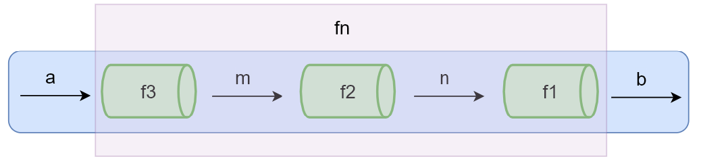

# 函数式编程

函数式编程其实就是利用纯函数来实现一些细粒度的函数，然后再通过函数的组合把这些细粒度的函数组合成功能更强大的函数

## 为什么需要学习函数式编程

***past***

函数式编程是一个非常古老的概念， 早于第一台计算机的诞生。

[函数式编程的历史](https://zhuanlan.zhihu.com/p/24648375?refer=marisa)

***today***

- 函数式编程是随着 React 的流行受到越来越多的关注 
  **React 中的高阶组件使用了高阶函数来实现，高阶函数就是函数式编程的一个特性**
- Vue 3也开始拥抱函数式编程 
- 函数式编程可以抛弃 this 
- 打包过程中可以更好的利用 tree shaking 过滤无用代码 
- 方便测试、方便并行处理 
- 有很多库可以帮助我们进行函数式开发：lodash、underscore、ramda 


## 什么是函数式编程

**函数式编程(Functional Programming, FP)**

- FP是一种编程范式（编程范式：思想 + 实现的方式）
  *可以认为它是一种编程风格*
- FP也是一种思维模式: 把现实世界的事物和事物之间的**联系**抽象到程序世界（对运算过程进行抽象）。

常听说的编程范式还有

- **面向过程编程**（按照步骤来实现）
- **面向对象编程**（把现实世界中的事物抽象成程序世界中的类和对象，通过封装、继承和多态来演示事物事件的联系）

**函数式编程思维方式**：

- 程序的本质：根据输入通过某种运算获得相应的输出，程序开发过程中会涉及很多有输入和输出的函数
- 函数式编程中的函数指的不是程序中的函数(方法)，而是**数学中的函数即映射关系**。例如：`y = sin(x)`，x和y的关系
- 纯函数**: 相同的输入始终要得到相同的输出
- 函数式编程是用来描述数据(函数)之间的映射

```js
// 非函数式
let num1 = 2 
let num2 = 3 
let sum = num1 + num2 
console.log(sum) 

// 函数式 
function add (n1, n2) { 
  return n1 + n2 
}
let sum = add(2, 3) 
console.log(sum)
```


## 前置知识

### 函数是一等公民 

[MDN First-class Function（头等函数）](https://link.zhihu.com/?target=https%3A//developer.mozilla.org/zh-CN/docs/Glossary/First-class_Function)

- 函数存储在变量中
- 函数作为参数
- 函数作为返回值

在 JavaScript 中**函数就是一个普通的对象** (可以通过 `new Function() `)，我们可以把函数存储到变量/数组中，它还可以作为另一个函数的参数和返回值，甚至我们可以在程序运行的时候通过 `new Function('alert(1)') `来构造一个新的函数。

```js
// 函数存储在变量中
let fn = function () { 
  console.log('Hello First-class Function')
}
fn()
// 2/3 示例同高阶函数示例
```


### 高阶函数 `higher-order function`

1. 可把函数**作为参数**传递给另一个函数

   **优点：**使函数变得更灵活，函数无需考虑内部具体的实现，通过命名可以使函数变得更加功能语义化

2. 可把函数作为另一个函数的**返回值**

```js
// 函数作为参数
function forEach (array, fn) { 
  for (let i = 0; i < array.length; i++) { 
    fn(array[i]) 
  } 
}

// 函数作为返回值
function once(fn) {
  let done = false;
  return function () {
    if (!done) {
      done = true;
      return fn.apply(this, arguments);
    }
  };
}
```

① **使用高阶函数的意义在于抽象通用的问题**

抽象可以帮我们屏蔽细节，只需要关注于我们的目标

② **常用的高阶函数**

forEach、map、filter、every、some、find/findIndex、reduce、sort、......

🖋 *可以自己尝试手写一下这些函数*


### 闭包 `Closure`

可以在另一个作用域中调用一个函数的内部函数并访问到该函数的作用域中的成员

**本质**

函数在执行的时候会放到一个执行栈上，当函数执行完毕之后会从执行栈上移除，**但是堆上的作用域成员因为被外部引用不能释放**，因此内部函数依然可以访问外部函数的成员

```tex
以高阶函数示例二参照，在返回的内部函数 function() 中可以访问外部方法 once 中的变量 done
```


## ☞ [纯函数](https://link.zhihu.com/?target=https%3A//zh.wikipedia.org/wiki/%E7%BA%AF%E5%87%BD%E6%95%B0)

> 函数式编程中的函数指的就是纯函数
>
> https://zh.wikipedia.org/wiki/%E7%BA%AF%E5%87%BD%E6%95%B0

<h4>概念</h4>

- **相同的输入永远会得到相同的输出**，而且没有任何可观察的副作用
  *让一个函数变得不纯-函数依赖外部条件数据就会变得不纯-就成为副作用*
- 纯函数就类似数学中的函数(用来描述输入和输出之间的关系)
  `y = f(x)`

<h4>好处</h4>

- 可缓存结果
  *因为纯函数对相同的输入始终有相同的结果。所以可以把纯函数的结果缓存起来*

- 测试更方便

- 并行处理
  *在多线程环境下并行操作共享的内存数据很可能会出现意外情况*

  *纯函数不需要访问共享的内存数据，所以在并行环境下可以任意运行纯函数(Web Worker)*


☞ 🆙 在程序设计中，若一个函数符合以下要求，则它可能被认为是**纯函数**

- 此函数在**相同**的**输入**值时，需产生**相同**的**输出**。函数的输出和输入值以外的其他隐藏信息或[状态](https://link.zhihu.com/?target=https%3A//zh.wikipedia.org/w/index.php%3Ftitle%3D%E7%A8%8B%E5%BC%8F%E7%8B%80%E6%85%8B%26action%3Dedit%26redlink%3D1)无关，也和由I/O设备产生的外部输出无关。
- 该函数不能有语义上可观察的函数副作用，诸如“触发事件”，使输出设备输出，或更改输出值以外物件的内容等。(**如果参数是引用传递，对参数的更改会影响函数以外的数据，因此不是纯函数**)

```js
// 数组的 slice 和 splice 分别是：纯函数和不纯的函数
// slice 返回数组中的指定部分，不会改变原数组 
// splice 对数组进行操作返回该数组，会改变原数组  
// 不纯的
let mini = 18;
function checkAge(age) {
  return age >= mini;
}
// 纯的(有硬编码，后续可以通过柯里化解决)
function checkAge(age) {
  let mini = 18;
  return age >= mini;
}
```

<h4>函数的副作用</h4>

副作用让一个函数变的不纯，纯函数是**根据相同的输入返回相同的输出**，如果函数依赖于外部的状态就无法保证输出相同，就会带来副作用

<h6>副作用来源</h6>

配置文件/数据库/获取用户的输入/...

所有的外部交互都有可能带来副作用，副作用也使得方法通用性下降不适合扩展和可重用性，同时副作用会给程序中带来安全隐患给程序带来不确定性，但是副作用不可能完全禁止，**尽可能控制它们在可控范围内发生**


## ☞ 柯里化(Haskell Brooks Curry)

> 当一个函数有多个参数的时候先传第一部分参数调用它(缓存)，然后返回一个新的函数接收剩余的参数，返回结果

- 柯里化可以让我们给一个函数传递较少的参数得到一个已经记住了某些固定参数的新函数 （多维函数降维）
- 是一种对函数参数的**缓存** 
- 让函数变的更灵活，让函数的粒度更小 
- 可以把多元函数转换成一元函数，可以组合使用函数产生强大的功能

```js
function checkAge (min) { 
  return function (age) { 
    return age >= min
  } 
}
let checkAge18 = checkAge(18)
checkAge18(24)
```


### [柯里化函数 lodash.curry](https://link.zhihu.com/?target=https%3A//www.lodashjs.com/docs/lodash.curry%23_curryfunc-arityfunclength)

> [Lodash](https://link.zhihu.com/?target=https%3A//www.lodashjs.com) 是一个纯函数的功能库，提供了对数组、数字、对象、字符串、函数等操作的一些方法 

- **功能**：创建一个函数，该函数接收一个或多个 func 的参数，如果 func 所需要的参数都被提供则执行 func 并返回执行的结果。否则继续返回该函数并等待接收剩余的参数
- **参数**：需要柯里化的函数
- **返回值**：柯里化后的函数

```js
// 注意：这里只抛出一个使用的demo 具体使用方法可以直接查看上述官方文档
const _ = require('lodash') 
// 要柯里化的函数 
function getSum (a, b, c) { return a + b + c }
// 柯里化后的函数 
let curried = _.curry(getSum) 
// 测试 
curried(1, 2, 3) 
curried(1)(2)(3) 
curried(1, 2)(3)
```

<h5>模拟实现_.curry(func)</h5>

```js
function curry(fn) {
  return function curriedFun(...args) {
    if (args.length < fn.length) {
      return curriedFun(...args.concat(Array.from(arguments)))
    }å
    return fn(...args);
  }
}
```

<h4>👁 应用</h4>

- Vue.js 源码中使用柯里化的位置【src/platform/web/patch.js】

```js
patch(操作各个平台下的api, vdom1, vdom2)

function createPatch (api) {
  return function patch (vdom1, vdom2) {
    ..
  }
}

const patch = createPatch(domApi) 
patch(v1, v2) 
```

- 固定不常变化的参数

```js
// 方法1
function isType (type) {
  return function (obj) {
return Object.prototype.toString.call(obj) === `[object ${type}]`
  }
}

const isObject = isType('Object')
const isArray = isType('Array')

// 方法2
function isType (type, obj) {
  return Object.prototype.toString.call(obj) === `[object ${type}]`
}

let isTypeCurried = curry(isType)

const isObject = isTypeCurried('Object')
// isObject(obj)

// 柯里化通用函数
function curry (func) {
  return function curriedFn (...args) {
    // 判断实参和形参的个数
    if (args.length < func.length) {
      // 实参个数小于形参个数，继续柯里化
      return function () {
        return curriedFn(...args.concat(Array.from(arguments)))
      }
    }
    // 形参个数等于实参个数执行 func
    return func(...args)
    }
}
```

- 延迟执行(模拟 bind 方法)
  \- 改变函数 this 的方法：bind(不调用)、call、apply

```js
  function fn (a, b, c) {
  }

  const f = fn.bind(context, 1, 2 ,3)
  f()

  const f = fn.bind(context, 1, 2)
  f(3)
  
  const f = fn.bind(context, 1)
  f(2, 3)

  // rest 参数
  Function.prototype.mybind = function (context, ...args) {
    return (...rest) => this.call(context, ...args, ...rest)
  }
  
  function t (a, b, c) {
    return a + b + c
  }
  
  t.mybind()
  
  const sumFn = t.mybind(this, 1, 2)
  const sum = sumFn(3)
  console.log(sum)
```


## ☞ 函数组合(compose)

***before***

纯函数和柯里化很容易写出**洋葱代码 h(g(f(x)))**

*获取数组的最后一个元素再转换成大写字母，` _.toUpper(.first(_.reverse(array)))`*

***after***

**函数组合**可以让我们把细粒度的函数重新组合生成一个新的函数

```tex
图1 表示程序中使用函数处理数据的过程，给 fn 函数输入参数 a，返回结果 b。可以想想 a 数据通过一个管道得到了 b 数据。
当 fn 函数比较复杂的时候，我们可以把函数 fn 拆分成多个小函数，此时多了中间运算过程产生的 m 和 n。
图2 中可以想象成把 fn 这个管道拆分成了3个管道 f1, f2, f3，数据 a 通过管道 f3 得到结果 m，m 再通过管道 f2 得到结果 n，n 通过管道 f1 得到最终结果 b
```


<center style="font-size: 0.9rem">图1</center>


<center style="font-size: 0.9rem">图12</center>

> 如果一个函数需要经过多个函数处理，可以将中间处理的函数合并成为一个函数，成为**函数组合** （解决了洋葱代码 h(g(f(x))) 的问题）

- 函数就像是数据的管道，函数组合就是把这些管道连接起来，让数据穿过多个管道形成最终结果
- 函数组合默认从右向左执行 
- 满足**结合律** (associativity)：既可以把 g 和 h 组合，还可以把 f 和 g 组合，结果都是一样的

```js
// 组合函数
function compose(f, g) {
  return function (x) {
    return f(g(x));
  };
}
function first(arr) {
  return arr[0];
}
function reverse(arr) {
  return arr.reverse();
}
// 从右到左运行
let last = compose(first, reverse);
console.log(last([1, 2, 3, 4]));

// 结合律（associativity） 
let f = compose(f, g, h) 
let associative = compose(compose(f, g), h) // == compose(f, compose(g, h))
```

**调试组合函数**

```js
const _ = require('lodash') 
const trace = _.curry((tag, v) => { 
  console.log(tag, v) 
  return v 
})
const split = _.curry((sep, str) => _.split(str, sep)) 
const join = _.curry((sep, array) => _.join(array, sep)) 
const map = _.curry((fn, array) => _.map(array, fn)) 
const f = _.flowRight(join('-'), trace('map 之后'), map(_.toLower), trace('split 之后'), split(' ')) 
console.log(f('NEVER SAY DIE'))
```


### lodash 中的组合函数

> [Lodash](https://link.zhihu.com/?target=https%3A//www.lodashjs.com) 是一个纯函数的功能库，提供了对数组、数字、对象、字符串、函数等操作的一些方法 

[lodash.flow([funcs]) ](https://link.zhihu.com/?target=https%3A//www.lodashjs.com/docs/lodash.flow%23_flowfuncs)从左到右运行

[lodash.flowRight([funcs])](https://link.zhihu.com/?target=https%3A//www.lodashjs.com/docs/lodash.flowRight%23_flowrightfuncs) 从右到左运行，使用的更多一些

**模拟实现 `_.flowRight([funcs])`**

```js
function compose(...fncs) {
  return function (value) {
    return fncs.reverse().reduce(function(acc, fn) {
      return fn(acc)
    }, value)
  };
}
```


### [lodash 中的fp模块](https://github.com/lodash/lodash/wiki/FP-Guide)

> [Lodash](https://link.zhihu.com/?target=https%3A//www.lodashjs.com) 是一个纯函数的功能库，提供了对数组、数字、对象、字符串、函数等操作的一些方法 

```tex
我们在使用函数组合解决问题的时候会使用到lodash 中提供的一些方法，但当这些方法有多个参数的时候，我们需要对这些方法进行柯里化的操作，会显得有些麻烦
lodash 提供了 fp 模块（functional program）
```

- lodash 的 fp 模块提供了实用的对**函数式编程友好**的方法 
- 提供了不可变 **auto-curried iteratee-fifirst data-last** 的方法 *（**函数优先，数据置后**）*
  lodash 中的方法遵循 ***数据优先，函数置后***

```js
// lodash 模块
const _ = require("lodash");
_.map(["a", "b", "c"], _.toUpper); // => ['A', 'B', 'C']
_.map(["a", "b", "c"]); // => ['a', 'b', 'c']
_.split("Hello World", " ");

// lodash/fp 模块
const fp = require("lodash/fp");
fp.map(fp.toUpper, ["a", "b", "c"]);
fp.map(fp.toUpper)(["a", "b", "c"]);
fp.split(" ", "Hello World");
fp.split(" ")("Hello World");
```

📢 注意下lodash 中的 map 和 fp 中的 map 的区别在于参数上面


### Point Free

> 是一种编程的风格，具体实现是函数组合

*我们可以把数据处理的过程定义成与数据无关的合成运算，不需要用到代表数据的那个参数，只要把简单的运算步骤合成到一起，在使用这种模式之前我们需要定义一些辅助的基本运算函数*

- 不需要指明处理的数据 
- **只需要合成运算过程** 
- 需要定义一些辅助的基本运算函数 

```js
// Hello World => hello_world
// 非 Point Free 模式
function f(word) {
  return word.toLowerCase().replace(/\s+/g, "_");
}
// Point Free
const fp = require("lodash/fp");
const f = fp.flowRight(fp.replace(/\s+/g, "_"), fp.toLower);
console.log(f("Hello World"));
```


## 函子(Functor)

### 为什么学函子

到目前为止已经知道了函数式编程的一些基础，但是我们还不知道编程中如何把副作用控制在可控的范围内、异常处理、异步操作等


### 什么是函子（Functor）

- 容器：包含值和值得关系变形(变形关系就是函数)
- 函子：是一个特殊的容器，通过一个普通的对象来实现，该对象具有**map**方法，map方法可以运行一个函数对值进行处理(关系变形)

```js
// 一个容器，包裹一个值
class Container {
  // of 静态方法，可以省略 new 关键字创建对象
  static of (value) {
    return new Container(value)
  }

  constructor (value) {
    this._value = value
  }
  
  // map 方法，传入变形关系，将容器里的每一个值映射到另一个容器
  map (fn) {
    return new Container(fn(this._value))
  }
}

let r = Container.of(5)
  .map(x => x + 1)
  .map(x => x * x)

console.log(r)

// 值如果不小心传入了空值(副作用) 
Container.of(null) 
  .map(x => x.toUpperCase()) // TypeError: Cannot read property 'toUpperCase' of null
```

📚**总结**

- 函数式编程的运算不直接操作值，而是由函子完成 
- 函子就是一个实现了 map 契约的对象 
- 我们可以把函子想象成一个盒子，这个盒子里封装了一个值 
- 想要处理盒子中的值，我们需要给盒子的 map 方法传递一个处理值的函数（纯函数），由这个函数来对值进行处理 
- 最终 map 方法返回一个包含新值的盒子（函子）


### MayBe函子

可以对外部空值的情况做处理（控制副作用在允许的范围）

```js
class MayBe {
  static of (value) {
    return new MayBe(value)
  }

  constructor (value) {
    this._value = value
  }

  map (fn) {
    // 如果对空值变形的话直接返回 值为 null 的函子
    return this.isNothing() ? MayBe.of(null) : MayBe.of(fn(this._value))
  }

  isNothing () {
    return this._value === null || this._value === undefined
  }
}
let r = MayBe.of(null)
          .map(x => x.toUpperCase())
console.log(r) //  MayBe { _value: null }

let m = MayBe.of('hello world')
          .map(x => x.toUpperCase())
          .map(x => null)
          .map(x => x.split(' '))
console.log(m) //  MayBe { _value: null }: 很难确认是哪一步产生的空值问题
```

**问题**：在 MayBe 函子中，我们很难确认是哪一步产生的空值问题


### Either函子

Either 两者中的任何一个，类似于 if...else...的处理

异常会让函数变的不纯，Either 函子可以用来做异常处理

```js
class Left {
  static of (value) {
    return new Left(value)
  }

  constructor (value) {
    this._value = value
  }

  map (fn) {
    return this
  }
}
class Right {
  static of (value) {
    return new Right(value)
  }

  constructor (value) {
    this._value = value
  }

  map (fn) {
    return Right.of(fn(this._value))
  }
}

// Either 用来处理异常
function parseJSON (str) {
  try {
    return Right.of(JSON.parse(str))
  } catch (e) {
    return Left.of({ error: e.message })
  }
}

let r = parseJSON('{ "name": "zs" }')
          .map(x => x.name.toUpperCase())
console.log(r)  // Right {_value: "ZS"}
```


### IO函子

- IO 函子中的 _value 是一个函数，这里是把函数作为值来处理 
- IO 函子可以把不纯的动作存储到 _value 中，延迟执行这个不纯的操作(惰性执行)，包装当前的操作 
- 把不纯的操作交给调用者来处理

```js
const fp = require('lodash/fp')

class IO {
  static of (value) {
    return new IO(function () {
      return value
    })
  }

  constructor (fn) {
    this._value = fn
  }

  map (fn) {
    // 把当前的 value 和 传入的 fn 组合成一个新的函数
    return new IO(fp.flowRight(fn, this._value))
  }
}

// 调用
let r = IO.of(process).map(p => p.execPath)
// console.log(r)
console.log(r._value())
```


### Task函子

函子可以帮我们控制副作用，进行异常处理，还可以处理异步任务，在异步任务中很容易形成回调地狱，使用task函子可以避免出现回调嵌套

异步任务的实现过于复杂，我们使用 folktale 中的 Task 来演示

[Folktale](https://link.zhihu.com/?target=https%3A//folktale.origamitower.com/) 一个标准的函数式编程库，和 lodash、ramda 不同的是，他没有提供很多功能函数只提供了一些函数式处理的操作，例如：compose、curry 等，一些函子 Task、Either、MayBe 等

`npm i folktale`

```js
const { compose, curry } = require('folktale/core/lambda')
const { toUpper, first } = require('lodash/fp')
// let f = curry(2, (x, y) => {
//   return x + y
// })

// console.log(f(1, 2))
// console.log(f(1)(2))


let f = compose(toUpper, first)
console.log(f(['one', 'two']))
```

**Task 异步执行**

> folktale(2.3.2) 2.x 中的 Task 和 1.0 中的 Task 区别很大，1.0 中的用法更接近我们现在演示的函子
>
> 这里以 2.3.2 来演示

```js
// Task 处理异步任务
const fs = require('fs')
const { task } = require('folktale/concurrency/task')
const { split, find } = require('lodash/fp')

function readFile (filename) {
  return task(resolver => {
    fs.readFile(filename, 'utf-8', (err, data) => {
      if (err) resolver.reject(err)

      resolver.resolve(data)
    })
  })
}

readFile('package.json')
  .map(split('\n'))
  .map(find(x => x.includes('version')))
  .run()
  .listen({
    onRejected: err => {
      console.log(err)
    },
    onResolved: value => {
      console.log(value)
    }
  })
```


### Pointed函子

- Pointed 函子是实现了 of 静态方法的函子 
- of 方法是为了避免使用 new 来创建对象，更深层的含义是 of 方法用来把值放到上下文Context（把值放到容器中，使用 map 来处理值）

```js
class Container { 
  static of (value) { 
    return new Container(value) 
  }
  …… 
}
Contanier.of(2) 
  .map(x => x + 5)
```


### Monad（单子）函子

- Monad 函子是可以变扁的 Pointed 函子，IO(IO(x)) 
- 一个函子如果具有 join 和 of 两个方法并遵守一些定律就是一个 Monad

```js
// IO Monad
const fs = require('fs')
const fp = require('lodash/fp')

class IO {
  static of (value) {
    return new IO(function () {
      return value
    })
  }

  constructor (fn) {
    this._value = fn
  }

  map (fn) {
    return new IO(fp.flowRight(fn, this._value))
  }

  join () {
    return this._value()
  }

  flatMap (fn) {
    return this.map(fn).join()
  }
}

let readFile = function (filename) {
  return new IO(function () {
    return fs.readFileSync(filename, 'utf-8')
  })
}

let print = function (x) {
  return new IO(function () {
    console.log(x)
    return x
  })
}

let r = readFile('package.json')
          // .map(x => x.toUpperCase())
          .map(fp.toUpper)
          .flatMap(print)
          .join()

console.log(r)
```


# 附录

[函数式编程指北](https://llh911001.gitbooks.io/mostly-adequate-guide-chinese/content/ch1.html)

[函数式编程入门](http://www.ruanyifeng.com/blog/2017/02/fp-tutorial.html)

[Pointfree 编程风格指南](http://www.ruanyifeng.com/blog/2017/03/pointfree.html)

[图解 Monad](http://www.ruanyifeng.com/blog/2015/07/monad.html)

[Functors, Applicatives, And Monads In Pictures](https://adit.io/posts/2013-04-17-functors,_applicatives,_and_monads_in_pictures.html)


# 尝试一夏

- 模拟实现`_.memoize` 方法
- 模拟实现`forEach、map、filter、every、some、find/findIndex、reduce、sort` 方法
- 模拟实现 `_.curry` 方法
- 模拟实现`_.flowRight([funcs])` 方法

