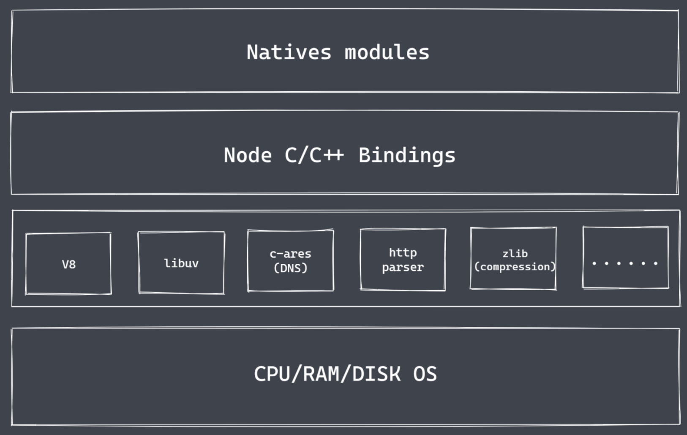
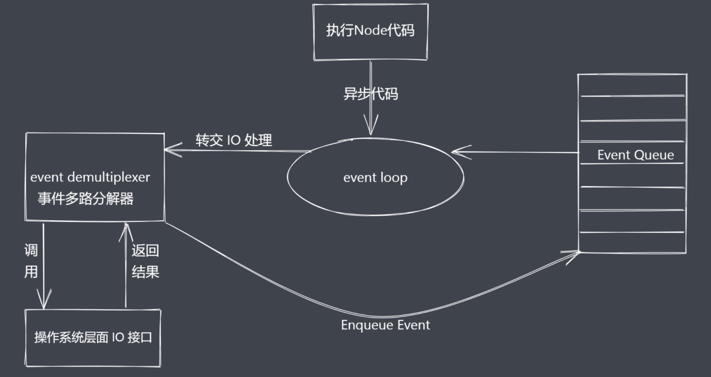

# 概述

通过 NodeJS 可以帮助我们实现

- 轻量级、高性能的 web 服务
- 前后端 JS 同构开发
- 便捷高效的前端工程化

本篇我们需要了解 **NodeJS 的架构和运行过程**，不仅限于记住NodeJS 是 JavaScript 运行时这样的说法。然后我们进入 **NodeJS 异步 IO 和事件驱动**，基于这些特点让NodeJS有了实现高性能web服务的前提，具体的体现就是NodeJS的底层有一个 libuv 库。之后我们会进入 **NodeJS 单线程**，NodeJS 单线程主要指的是主线程是单线程，而在 libuv 库中存在多个工作线程，配合事件循环来处理不同的事件回调函数。

通过上手实现一个由NodeJS 实现的简单应用，感受NodeJS带给我们的便捷好用。最后深入NodeJS 去认识**NodeJS 核心模块及 API使用**


## NodeJS 架构

我们将NodeJS的核心分为三大部分：Native modules、Builtin modules、底层。如下图所示



**Native modules**

> 暴露了相应的JS功能接口，供开发者进行调用

- 当前层内容由JS实现
- 提供应用程序可直接调用库【内置核心模块】，如 fs、path、http 等
- JS 语言无法直接操作底层硬件设置
- JS 核心模块与硬件设置之间通信需要一个桥梁： Builtin modules "胶水层"


**Builtin modules**

> 需要 V8 引擎配合实现

通过当前层，我们可以让NodeJS的核心模块获取到具体的服务支持，从而完成更底层的操作，例如文件的读写行为。在图中，我们使用 Node C 或者 C++ Bingdings 来进行表示。当前层中除了内置的模块还有很多第三方的模块来充当桥梁，我们只需要清楚里面的内容主要由C++的代码进行编写而成的。例如 soket、zlib、http、etc 等基础功能。在当前层中的 soket、zlib 等功能模块，他们并不是真正代码级别上的功能实现，更像是功能调用的对照表。

```tex
比如在JS层调用一个 `a` 功能，但是 `a` 功能的最终实现是通过 c 或者 c++ 语言实现的，并且实现之后的内容又被放在了另外的一个地方。这个时候我们需要有人来帮助我们找到`a`功能的实现。此时Builtin modules就起到了帮助我们调用 C++ 函数的作用。对于完整的实现不需要进行关注。
```


**底层**

底层包括 V8、libuv库和一些具体的功能模块

- V8 的主要功能有：执行JS代码，提供桥梁接口
  执行的代码一般分为三种情况：自己的coding、内置的coding、第三方的coding
- Libuv: 事件循环、事件队列、异步I/O
- 第三方模块：zlib、http、c-areas 等


## 为什么是NodeJS

如下图所示，用户通过客户端想服务器发送请求来获取数据，服务器端只需要在接受到请求后通过业务逻辑返回数据即可。在我们忽略掉网络带宽等硬件性能等客观因素后，影响用户去获取数据的速度的就是IO 的时间消耗。


IO是计算机操作过程中最缓慢的环节。访问RAM的时间消耗是为纳秒级别，在磁盘和网络中消耗时间是毫秒级别的。（数据的读写时间终归是有时间消耗的）。假设当前是一个串行模式，对于服务起来说，如果当前正在处理的请求中包含了一个需要长时间等待的IO行为，那么后续的任务就不能得到及时的响应。显然这是不友好的。并且我们当下使用的一些服务器都具备了并发处理事务的能力。在并发的实现上，传统的做法其他的语言就是采用多线程或者多进程的方式。


```tex
/* 餐馆服务 */
采用多线程来处理并发问题
有几个人来就餐，就准备几个服务员来完成相应的服务。之后客人进行点菜，服务员等待点菜结果。
有几个请求发送到服务端，服务端就准备几个进程\线程来接收请求。
这样的服务对用户的体验非常友好。缺点是如果某个时间内有很多人同时进行就餐，我们无法无限的准备服务员，会导致无人响应的问题。

分析点餐的问题后发现，大部分的时间消耗来自于客人点菜的行为等待中，此时服务员处于空闲状态。
基于这个问题出现了 Reactor 模式（应答者模式），核心思想就是只保留一个服务员。客人进行点餐，客人点餐行为结束后，只需要呼叫当前的服务员即可。此时我们使用了单线程完成了多线程的工作
```

NodeJS 基于 Reactor 模式，结合JS本身具备的单线程、事件驱动架构和异步编程等特性，让单线程远离阻塞。从而让异步非阻塞IO来更好地使用CPU资源，并且实现高并发请求的处理。

NodeJS更适用于IO密集型高并发请求。


## Nodejs 异步IO实现

- 对于操作系统来说，IO分为 阻塞 和 非阻塞

- **轮询：** 重复调用IO操作，判断IO是否结束
- 常见的轮询技术： read、select、poll、kqueue、event ports

**libuv 库**

可以看做是几种不同的异步IO实现方式的抽象封装层


**Node 中实现异步IO的过程**



**📚总结**

1. IO 是引用程序的瓶颈所在
2. 异步IO 提高性能，无需等待结果返回
3. IO 操作属于操作系统级别，平台都有对应实现
4. Nodejs  单线程配合事件驱动架构及libuv 实现了异步 IO


## 事件驱动架构

> 事件驱动架构是软件开发中的通用模式

类比 发布订阅、观察者模式（**三者并不是一回事**）使用中 发布者广播消息，其他监听者监听订阅消息
