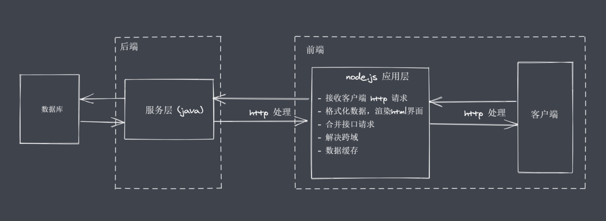

# 概述

通过 NodeJS 可以帮助我们实现

- 轻量级、高性能的 web 服务
- 前后端 JS 同构开发
- 便捷高效的前端工程化


# NodeJS 架构

我们将NodeJS的**核心**分为三大部分：**Native modules**、**Builtin modules**、**底层**。如下图所示


### Native modules

> 暴露了相应的JS功能接口，供开发者进行调用

- 当前层内容由JS实现
- 提供应用程序可直接调用库【内置核心模块】，如 fs、path、http 等
- JS 语言无法直接操作底层硬件设置
- JS 核心模块与硬件设置之间通信需要一个桥梁： **Builtin modules** "胶水层"

### Builtin modules

> 需要 V8 引擎配合实现

通过当前层，我们可以让NodeJS的核心模块获取到具体的服务支持，从而完成更底层的操作，例如文件的读写行为。在图中，我们使用 Node C 或者 C++ Bingdings 来进行表示。当前层中除了内置的模块还有很多第三方的模块来充当桥梁，我们只需要清楚里面的内容主要由C++的代码进行编写而成的。例如 soket、zlib、http、etc 等基础功能。在当前层中的 soket、zlib 等功能模块，他们并不是真正代码级别上的功能实现，更像是功能调用的对照表。

```tex
比如在JS层调用一个 `a` 功能，但是 `a` 功能的最终实现是通过 c 或者 c++ 语言实现的，并且实现之后的内容又被放在了另外的一个地方。这个时候我们需要有人来帮助我们找到`a`功能的实现。此时Builtin modules就起到了帮助我们调用 C++ 函数的作用。对于完整的实现不需要进行关注。
```

### 底层

底层包括 V8、libuv库和一些具体的功能模块

- V8 的主要功能有：执行JS代码，提供桥梁接口
  - 执行的代码一般分为三种情况：自己的coding、内置的coding、第三方的coding
  - 提供桥梁接口的作用：开发者在使用nodejs的时候，看起来在代码里直接“调用了”某个JS的函数，真正起作用的是由C或者C++编写的函数，中间的转换和调用的具体实现是由V8引擎赋能完成的。
    简单地说，V8为NodeJs提供了初始化的操作，创建了执行上下文环境和作用域等内容。有了V8 之后，nodeJS就具备了执行和调用功能的前提，最终nodeJS在执行的过程中还会存在“事件循环”等细节（需要Libuv库）
- Libuv: 事件循环、事件队列、异步I/O
- 第三方模块：zlib、http、c-areas 等（不同的模块对应不同的功能）

<span style="color: red; font-size: 12px">Node 只是一个平台，扩展了JS的功能</span>


# NodeJS

> nodeJS 诞生之初是为了实现高性能的web服务器，经历了长时间的发展之后，nodeJS 慢慢演化为一门服务端“语言”

下面以BS架构为基础，来说一下用户发送请求到获取数据的整个过程。

如下图所示，用户通过客户端想服务器发送请求来获取数据，服务器端只需要在接受到请求后通过业务逻辑返回数据即可。在我们忽略掉网络带宽等硬件性能等客观因素后，影响用户去获取数据的速度的就是IO 的时间消耗。


**IO是计算机操作过程中最缓慢的环节**。访问RAM的时间消耗是为纳秒级别，在磁盘和网络中消耗时间是毫秒级别的。（数据的读写时间终归是有时间消耗的）。假设当前是一个串行模式，对于服务器来说，如果当前正在处理的请求中包含了一个需要长时间等待的IO行为，那么后续的任务就不能得到及时的响应。显然这是不友好的。并且我们当下使用的一些服务器都具备了并发处理事务的能力。在并发的实现上，传统的做法其他的语言就是采用多线程或者多进程的方式。


```tex
/* 餐馆服务 */
采用多线程来处理并发问题
有几个人来就餐，就准备几个服务员来完成相应的服务。之后客人进行点菜，服务员等待点菜结果。
有几个请求发送到服务端，服务端就准备几个进程\线程来接收请求。
这样的服务对用户的体验非常友好。缺点是如果某个时间内有很多人同时进行就餐，我们无法无限的准备服务员，会导致无人响应的问题。

分析点餐的问题后发现：大部分的时间消耗来自于客人点菜的行为等待中，此时服务员处于空闲状态。
基于这个问题出现了 Reactor 模式（应答者模式），核心思想就是只保留一个服务员。客人进行点餐，客人点餐行为结束后，只需要呼叫当前的服务员即可。此时我们使用了单线程完成了多线程的工作，并且是非阻塞的。
```

NodeJS 基于 **Reactor 模式**，结合JS本身具备的单线程、事件驱动架构和异步编程等特性，让单线程远离阻塞。从而让异步非阻塞IO来更好地使用CPU资源，并且实现高并发请求的处理。

<span style="color: red">NodeJS更适用于IO密集型高并发请求</span>


# Nodejs 异步IO实现

> 基于 **NodeJS 异步 IO 和事件驱动**这些特点让NodeJS有了实现高性能web服务的前提，具体的体现就是NodeJS的底层有一个 libuv 库

- 对于操作系统来说，IO分为 阻塞 和 非阻塞
  当前是否能够立即获取到调用之后所返回的结果。当我们采用非阻塞IO后，CPU的时间片就可以被拿出来去处理其他事物，可以提升性能（问题：立即返回的内容并不是执行完毕后的结果，想要获取完整的结果数据就需要重复调用IO操作来判断IO是否结束）

- **轮询：** 重复调用IO操作，判断IO是否结束

  常见的轮询技术： read、select、poll、kqueue、event ports
  对于代码而言，还是同步效果。因为在轮询的过程中，程序在等待IO结果。我们期望的IO是代码可以直接发起非阻塞调用，并且无须通过遍历/唤醒的方式来轮询判断当前IO是否结束，而通过调用发起后直接进行下一个任务的处理，然后等待IO的处理完成之后 再通过某种信号/回调的方式将数据传回给代码进行使用


**libuv 库**

> 可以看做是几种不同的异步IO实现方式的抽象封装层

当运行了一段nodeJS编写的代码后最终会走到 **libuv** 库中的，走进来后可以根据当前平台进行判断，然后依据对应平台下相应的异步IO处理的方法


**Node 中实现异步IO的过程**


**📚总结**

1. IO 是引用程序的瓶颈所在
2. 异步IO 提高性能，无需等待结果返回
3. IO 操作属于操作系统级别，平台都有对应实现
4. Nodejs  单线程配合事件驱动架构及libuv 实现了异步 IO


# 事件驱动架构

> 事件驱动架构是软件开发中的通用模式

类比 事件驱动、发布订阅、观察者模式。注意**三者并不是一回事**，只是在使用中都有一个共通的特征：发布者广播消息，其他订阅者者监听订阅消息，当订阅消息发生改变后执行相应的处理程序。

**在NodeJS 中事件驱动的具体使用**

当libuv库接收到一个异步请求之后，多路分解器会开始工作。首先会找到当前平台下可用的IO处理接口，然后在等待IO操作结束之后将相应事件通过事件循环或其他方式添加到事件队列中，在这个过程中，事件循环是一直工作的；最后会按照一定的顺序从事件队列中取出相应的事件交给主线程进行执行，在这个过程中，事件驱动的体现就是：有人发布了事件，订阅者在将来接收到具体事件消息发布后就会执行订阅时注册的处理程序。

这样的架构很好的解决了在NodeJs 中由异步非阻塞操作所带来的数据最终获取的问题。具体的实现就是NodeJS 内置了一个 event 模块。

```js
const EventEmitter = require('events')

const myEvent = new EventEmitter()

// 事件订阅
myEvent.on('event1', () => {
  console.log('event1执行了')
})

myEvent.on('event1', () => {
  console.log('event1-2执行了')
})

// 事件触发
myEvent.emit('event1')
```


# NodeJS 单线程

> NodeJS 单线程主要指的是主线程是单线程，而在 libuv 库中存在多个工作线程，配合事件循环来处理不同的事件回调函数

**单线程如何实现高并发？**

在NodeJS底层通过异步IO、事件循环加上事件驱动架构通过回调通知的方式实现非阻塞的调用做到并发。具体的表现就是在程序代码中如果存在多个请求时无需阻塞，会由上向下执行然后等待libuv库完成工作之后再按照顺序通知相应事件回调去触发执行就可以了。这样一来，单线程就完成了多线程的工作。

我们这里说的单线程是指主线程是单线程的，而不是说Nodejs只有单线程或NodeJS只能做单线程任务。

NodeJS 的代码最终都是由V8进行执行的，在V8中是只有一个主线程来执行代码的。

在libuv库中存在一个线程池（如下图中右侧部分），默认情况下内部有四个线程，我们可以将node程序的异步请求先分为网络IO、非网络IO、非IO的一些异步操作。
针对网络IO操作，libuv库会调用当前平台相对应的IO接口进行处理。另外的两种操作会使用线程池里的线程完成处理。

如果四个线程不够用的话，可以修改相应的默认配置来增加默认的线程数（这个操作一般不需要执行）


**单线程的劣势：**

- 处理CPU密集型的任务时，会过多的占用CPU，会阻塞掉后续逻辑执行；
- 单线程无法体现出多核CPU的优势

~~这些劣势NodeJS 在后续也给出了相应的处理方案~~

```js
/* 处理CPU密集型任务阻塞现象演示 */
const http = require('http')

function sleepTime (time) {
  const sleep = Date.now() + time * 1000
  while(Date.now() < sleep) {}
  return 
}
// 休眠 4 秒
sleepTime(4)
const server = http.createServer((req, res) => {
  res.end('server starting......')
})

server.listen(8080, () => {
  console.log('服务启动了')
})
```

📚 **总结**

1. Nodejs 虽然是单线程的机制，但是配合异步IO和事件循环就可以实现高并发的请求
2. NodeJs 单线程指的是运行JS代码的主线程是单线程的
3. NodeJS 的单线程不适合处理CPU密集型的任务（比如说计算）


# NodeJS 应用场景

> Nodejs 更加适合IO密集型任务

**1. IO密集型高并发请求**

将Nodejs作为中间层：提高吞吐量，更方便处理数据



**2. 操作数据库提供API服务**

**3. 实时聊天应用程序**

## NodeJS 实现API服务

> 需求： 希望有一个服务，可以依据请求的接口内容返回响应的数据

### 初始化项目

```bash
npm init -y
```

安装相应依赖

```bash
npm install typescript express
npm install ts-node @types/express -D
```

初始化ts配置

```bahs
tsc --init
```

### 建立服务文件

> 项目上新需要使用JS进行运行，这里我们在测试阶段运行TS脚本-安装ts-node依赖

建立文件：`api_server.ts`

**测试脚本运行：**

1. 在脚本内部输出一些内容
2. 运行 `ts-node .\api_server.ts` 进行验证
3. 输出第一步相同的内容验证成功

```ts
import express from 'express'
import { DataStore } from './data'

const app = express()

app.get('/', (req, res) => {
  // res.end('1122')
  // 获取到的数据
  res.json(DataStore.list)
})

app.listen(8080, () => {
  console.log('服务已经开启了')
})
```


# Nodejs全局对象

> 全局对象是JS中的特殊对象
> 可以自己打印global 看一下， 打印信息会根据node版本不同，打印出的信息也会不同。

- 与浏览器平台的window不完全相同
- Nodejs 全局对象上挂载许多属性
- Nodejs 中全局对象是 global，global 的根本作用就是作为全局变量的宿主

## NodeJS 常见全局变量

| 变量名          | 含义                           |
| --------------- | ------------------------------ |
| __filename      | 返回正在执行脚本文件的绝对路径 |
| __dirname       | 返回正在执行脚本所在目录       |
| timer类函数     | 执行顺序与事件循环间的关系     |
| process         | 提供与当前进程互动的接口       |
| require         | 实现模块的加载                 |
| module、exports | 处理模块的导出                 |

```js
// 默认情况 this 是空对象，和 global 并不是一样的
console.log(this == global) // false

(function () {
  console.log(this == global) // true
})()
```

在node 环境下，每一个js 文件都是一个独立的模块，模块与模块之间都是独立的存在。nodejs 在模块化实现的时候将全局变量加入进去

## 全局变量 process


