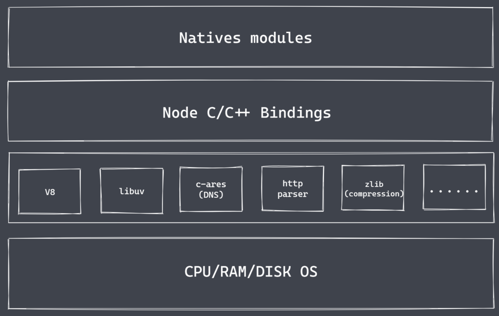
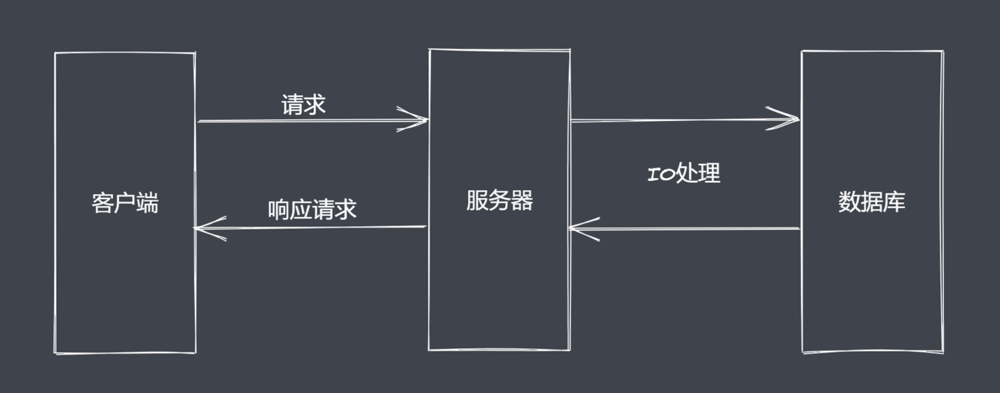
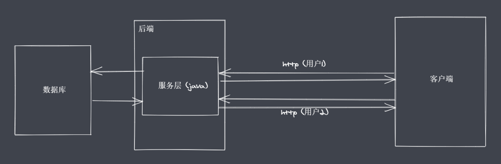
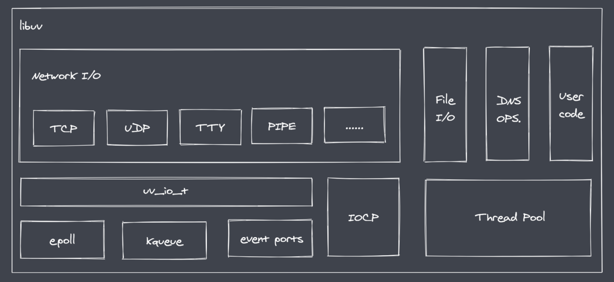
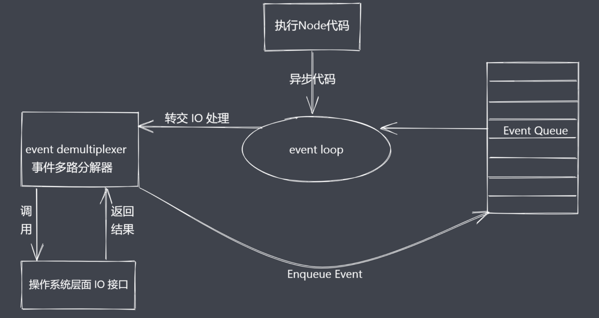

# 概述

通过 NodeJS 可以帮助我们实现

- 轻量级、高性能的 web 服务
- 前后端 JS 同构开发
- 便捷高效的前端工程化

本篇我们需要理解 **NodeJS 的架构和运行过程**，不仅限于记住NodeJS 是 JavaScript 运行时这样的说法。然后我们进入 **NodeJS 异步 IO 和事件驱动**，基于这些特点让NodeJS有了实现高性能web服务的前提，具体的体现就是NodeJS的底层有一个 libuv 库。之后我们会进入 **NodeJS 单线程**，NodeJS 单线程主要指的是主线程是单线程，而在 libuv 库中存在多个工作线程，配合事件循环来处理不同的事件回调函数。

通过上手实现一个由NodeJS 实现的简单应用，感受NodeJS带给我们的便捷。最后深入NodeJS 去认识**NodeJS 核心模块及 API使用**。


# NodeJS 架构

我们将NodeJS的**核心**分为三大部分：Native modules、Builtin modules、底层。如下图所示



### Native modules

> 暴露了相应的JS功能接口，供开发者进行调用

- 当前层内容由JS实现
- 提供应用程序可直接调用库【内置核心模块】，如 fs、path、http 等
- JS 语言无法直接操作底层硬件设置
- JS 核心模块与硬件设置之间通信需要一个桥梁： **Builtin modules** "胶水层"

### Builtin modules

> 需要 V8 引擎配合实现

通过当前层，我们可以让NodeJS的核心模块获取到具体的服务支持，从而完成更底层的操作，例如文件的读写行为。在图中，我们使用 Node C 或者 C++ Bingdings 来进行表示。当前层中除了内置的模块还有很多第三方的模块来充当桥梁，我们只需要清楚里面的内容主要由C++的代码进行编写而成的。例如 soket、zlib、http、etc 等基础功能。在当前层中的 soket、zlib 等功能模块，他们并不是真正代码级别上的功能实现，更像是功能调用的对照表。

```tex
比如在JS层调用一个 `a` 功能，但是 `a` 功能的最终实现是通过 c 或者 c++ 语言实现的，并且实现之后的内容又被放在了另外的一个地方。这个时候我们需要有人来帮助我们找到`a`功能的实现。此时Builtin modules就起到了帮助我们调用 C++ 函数的作用。对于完整的实现不需要进行关注。
```

### 底层

底层包括 V8、libuv库和一些具体的功能模块

- V8 的主要功能有：执行JS代码，提供桥梁接口
  - 执行的代码一般分为三种情况：自己的coding、内置的coding、第三方的coding
  - 提供桥梁接口的作用：开发者在使用nodejs的时候，看起来在代码里直接“调用了”某个JS的函数，真正起作用的是由C或者C++编写的函数，中间的转换和调用的具体实现是由V8引擎赋能完成的。
    简单地说，V8为NodeJs提供了初始化的操作，创建了执行上下文环境和作用域等内容。有了V8 之后，nodeJS就具备了执行和调用功能的前提，最终nodeJS在执行的过程中还会存在“事件循环”等细节（需要Libuv库）
- Libuv: 事件循环、事件队列、异步I/O
- 第三方模块：zlib、http、c-areas 等（不同的模块对应不同的功能）


~~Node 只是一个平台，扩展了JS的功能~~

# 为什么是NodeJS

> nodeJS 诞生之初是为了实现高性能的web服务器，经历了长时间的发展之后，nodeJS 慢慢演化为一门服务端“语言”

下面我们以BS架构为基础，来说一下用户发送请求到获取数据的整个过程。如下图所示，用户通过客户端想服务器发送请求来获取数据，服务器端只需要在接受到请求后通过业务逻辑返回数据即可。在我们忽略掉网络带宽等硬件性能等客观因素后，影响用户去获取数据的速度的就是IO 的时间消耗。



**IO是计算机操作过程中最缓慢的环节**。访问RAM的时间消耗是为纳秒级别，在磁盘和网络中消耗时间是毫秒级别的。（数据的读写时间终归是有时间消耗的）。假设当前是一个串行模式，对于服务起来说，如果当前正在处理的请求中包含了一个需要长时间等待的IO行为，那么后续的任务就不能得到及时的响应。显然这是不友好的。并且我们当下使用的一些服务器都具备了并发处理事务的能力。在并发的实现上，传统的做法其他的语言就是采用多线程或者多进程的方式。



```tex
/* 餐馆服务 */
采用多线程来处理并发问题
有几个人来就餐，就准备几个服务员来完成相应的服务。之后客人进行点菜，服务员等待点菜结果。
有几个请求发送到服务端，服务端就准备几个进程\线程来接收请求。
这样的服务对用户的体验非常友好。缺点是如果某个时间内有很多人同时进行就餐，我们无法无限的准备服务员，会导致无人响应的问题。

分析点餐的问题后发现：大部分的时间消耗来自于客人点菜的行为等待中，此时服务员处于空闲状态。
基于这个问题出现了 Reactor 模式（应答者模式），核心思想就是只保留一个服务员。客人进行点餐，客人点餐行为结束后，只需要呼叫当前的服务员即可。此时我们使用了单线程完成了多线程的工作，并且是非阻塞的。
```

NodeJS 基于 Reactor 模式，结合JS本身具备的单线程、事件驱动架构和异步编程等特性，让单线程远离阻塞。从而让异步非阻塞IO来更好地使用CPU资源，并且实现高并发请求的处理。

NodeJS更适用于IO密集型高并发请求。


# Nodejs 异步IO实现

- 对于操作系统来说，IO分为 阻塞 和 非阻塞

- **轮询：** 重复调用IO操作，判断IO是否结束
- 常见的轮询技术： read、select、poll、kqueue、event ports

**libuv 库**

可以看做是几种不同的异步IO实现方式的抽象封装层



**Node 中实现异步IO的过程**



**📚总结**

1. IO 是引用程序的瓶颈所在
2. 异步IO 提高性能，无需等待结果返回
3. IO 操作属于操作系统级别，平台都有对应实现
4. Nodejs  单线程配合事件驱动架构及libuv 实现了异步 IO


# 事件驱动架构

> 事件驱动架构是软件开发中的通用模式

类比 事件驱动、发布订阅、观察者模式。注意**三者并不是一回事**，只是在使用中都有一个共通的特征：发布者广播消息，其他监听者监听订阅消息从而当订阅消息发生改变后执行相应的处理程序。

