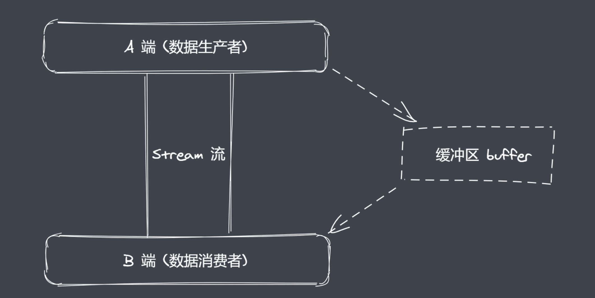

# process

> 无须 require 可直接使用
> 功能：获取进程信息、执行进程操作

## 资源

> 利用process获取进程工作的时候对资源产生的消耗
> 这里的资源指向为 cpu 和 内存

返回描述 Node.js 进程的内存使用量（以字节为单位）的对象: [process.memoryUsage()](http://nodejs.cn/api/process.html#processmemoryusage)

返回当前进程的用户和系统 CPU 时间使用情况: [process.cpuUsage()](http://nodejs.cn/api/process.html#processcpuusagepreviousvalue)

##  运行环境

> 可以获取到的信息：运行目录、node环境、cpu架构、用户环境、系统平台

当前工作目录(运行目录)： [process.cwd()](http://nodejs.cn/api/process.html#processcwd)

获取node版本：[process.version](http://nodejs.cn/api/process.html#processversion)

返回Node.js 的版本字符串及其依赖项：[process.versions](http://nodejs.cn/api/process.html#processversions)

获取操作系统 CPU 架构：[process.arch](http://nodejs.cn/api/process.html#processarch)

返回包含用户环境的对象：[process.env](http://nodejs.cn/api/process.html#processenv)

- process.env.NODE_ENV
- process.env.PATH（当前系统环境变量）
- process.env.USERPROFILE （mac 下获取使用HOME）（目录）

返回操作系统平台：[process.platform](http://nodejs.cn/api/process.html#processplatform)

## 运行状态

> 可以获取到的信息：启动参数、PID、运行时间

**[process.argv](http://nodejs.cn/api/process.html#processargv)**: 返回数组，其中包含启动 Node.js 进程时传入的命令行参数。 第一个元素将是 [`process.execPath`](http://nodejs.cn/api/process.html#processexecpath)

**[process.pid](http://nodejs.cn/api/process.html#processpid)**: 返回进程的 PID

**[process.uptime()](http://nodejs.cn/api/process.html#processuptime)** : 返回当前 Node.js 进程已经运行的秒数

## 事件

```js
// 监听事件
// 在当前脚本文件执行完成之后触发该事件
process.on('exit', (code) => {
  // 执行动作：code 为状态码
})
// 退出之前触发事件
// beforeExit 中可以执行异步代码，exit 不支持
process.on('beforeExit', (code) => {
  // 执行动作：code 为状态码
})
// 主动退出: 会将后续逻辑阻塞
process.exit()
```

## 标准输入输出、错误

**输出: [process.stdout](http://nodejs.cn/api/process.html#processstdout)** : 返回可写流

```js
// 对 console.log 进行方法重写
console.log = function (data) {
  process.stdout.write('---' + data + '\n')
}

const fs = require('fs')
fs.createReadStream('**.txt')
	.pipe(process.stdout)
```

**输入：[process.stdin](http://nodejs.cn/api/process.html#processstdin)**

```js
// 复印用户输入的内容
process.stdin.pipe(process.stdout)

// 设置编码格式
process.stdin.setEncoding('utf-8')
// 监听是否可读的事件
process.sedin.on('readable', () => {
  let chunk = process.sedin.read();
  if (chunk !== null) {
    process.stdout.write('data ' + chunk)
  }
})
```


# [Buffer](http://nodejs.cn/api/buffer.html)

> 一般称之为 Buffer缓冲区
> Buffer 的功能：让JS可以操作二进制

## 概述

<h3>为什么有Buffer</h3>

JS 语言期初服务于浏览器平台，因此在它的内部主要操作的数据类型是字符串。Nodejs的出现让我们在服务端也可以使用JS进行编程，在这种情况下我们就可以使用JS语言来完成具体的IO操作，例如文件的读写，网络服务中数据的传输等，在这个过程中我们就使用到了Buffer。

用户使用软件获取信息，开发者使用语言来处理和展示信息。这里的信息就是数据，以二进制的数据方式进行存储。IO行为操作的就是二进制数据。Stream 流操作类似于一种数据类型，Stream 流可以进行分段，当想要进行大数据传输的时候就可以使用流操作，这样的话就可以避免由于操作的数据内存过大而出现的把内存在短时间内占满的情况。流操作配合管道实现数据分段传输，典型的应用场景就是看视频的时候一般都是边下载边看的过程。

通过以上内容我们知道：程序运行就会进行二进制数据传输，数据的端到端的传输会有生产者和消费者，中间的话就会有流+管道进行连接。在这个过程中有时候数据的生产速度会低于数据的消费速度，或者相反，无论出现了哪种情况，生产和消费的过程往往存在等待的过程，等待的时候“多出”的数据（或不够一次消费的数据）就会存放在Buffer中。

<h3>在语言层面上Buffer是什么❓</h3>

NodeJS中的Buffer是一片内存空间。不占据V8内存空间。

Buffer的空间申请不由node 完成，在使用上空间分配是由编写的JS代码来控制的。所以在空间回收的时候依然由V8 的GC管理和回收。



## 创建Buffer

> Buffer 是 Nodejs 的内置类

**三种创建 Buffer 实例的方法**

> 不建议直接对当前类进行实例化创建Buffer，建议采用提供的方法进行创建Buffer

| 方法                                                         | 作用                         | 备注                                                         |
| ------------------------------------------------------------ | ---------------------------- | ------------------------------------------------------------ |
| [alloc](http://nodejs.cn/api/buffer.html#static-method-bufferallocsize-fill-encoding) | 创建指定字节大小的Buffer     |                                                              |
| [allocUnsafe](http://nodejs.cn/api/buffer.html#static-method-bufferallocunsafesize) | 创建指定大小的buffer(不安全) | 在内存空间中只要有一个空闲的空间就会被拿过来进行使用，在空间回收的时候由于算法的不同，并不能保证空间里都会进行全部回收，比如一些垃圾的区域确实已经没有在使用了，但是由于一些空间碎片的存在，里面的数据还是在的。有可能在创建的时候会使用到这样的空间。这样不会影响到使用的空间大小，但是会觉着这样的空间是“不干净”的 |
| [from](http://nodejs.cn/api/buffer.html#static-method-bufferfromarray) | 接收数据，创建buffer         | 01 可以接受三种数据类型</br>02 默认走 utf-8 编码             |

## 实例方法

| API                                                          | 作用                 | 备注                               |
| ------------------------------------------------------------ | -------------------- | ---------------------------------- |
| [fill](http://nodejs.cn/api/buffer.html#buffillvalue-offset-end-encoding) | 使用数据填充buffer   | 如果没有达到buffer的长度会反复填充 |
| [write](http://nodejs.cn/api/buffer.html#bufwritestring-offset-length-encoding) | 向buffer 中写入数据  |                                    |
| [toString](http://nodejs.cn/api/buffer.html#buftostringencoding-start-end) | 从buffer中提取数据   |                                    |
| [slice](http://nodejs.cn/api/buffer.html#bufslicestart-end)  | 截取 buffer          |                                    |
| [indexOf](http://nodejs.cn/api/buffer.html#bufindexofvalue-byteoffset-encoding) | 在 buffer 中查找数据 |                                    |
| [copy](http://nodejs.cn/api/buffer.html#bufcopytarget-targetstart-sourcestart-sourceend) | 拷贝 buffer 中的数据 |                                    |

## 静态方法

| API                                                          | 作用                               |
| ------------------------------------------------------------ | ---------------------------------- |
| [concat](http://nodejs.cn/api/buffer.html#static-method-bufferconcatlist-totallength) | 将多个buffer 拼接成一个新的 buffer |
| [isBuffer](http://nodejs.cn/api/buffer.html#static-method-bufferisbufferobj) | 判断当前数据是否为buffer           |

## 自定义Buffer-split实现

```js
// sep 传入分隔符
ArrayBuffer.prototype.split = function (sep) {
  let len = Buffer.from(sep).length;
  let ret = [];
  let start = 0;
  let offset = 0;

  while ((offset = this.indexOf(sep, start) !== -1)) {
    ret.push(this.slice(start, offset));
    start = offset + len;
  }
  ret.push(this.slice(start));
  return ret;
};
```

