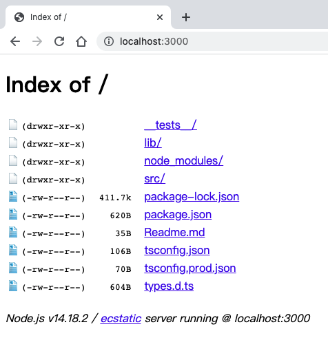
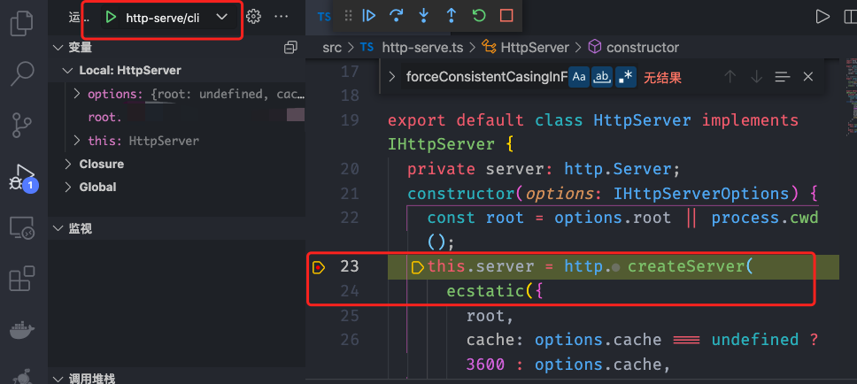

在实际业务中，经常需要使用 Node.js 的场景包括重量级后端应用以及各种 CLI 模块。因此，这一讲我们将引入 TypeScript 开发一个可以指定端口、文件目录、缓存设置等参数的 HTTP 静态文件服务 http-serve CLI NPM 模块。

# 开发 NPM 模块

在开发阶段，我们使用 ts-node 直接运行 TypeScript 源码就行。构建时，我们使用官方转译工具 tsc 将 TypeScript 源码转译为 JavaScript，并使用 TypeScript + Jest 做单元测试。

## 初始化模块

```bash
# 新建文件夹
mkdir http-serve
cd http-serve
# 初始化 package.json
npm init --y
# 创建放 TypeScript 源码的目录
mkdir src
# CLI 命令入口文件
touch src/cli.ts
# CLI 命令入口文件
touch src/http-serve.ts
# 转译工具自动创建放 JavaScript 代码的目录
mkdir lib
# 单元测试文件目录
mkdir __tests__
# 安装 基础 依赖
npm install typescript ts-node jest@24 ts-jest@24 @types/jest -D
```

这里是 TypeScript 开发模块的一个经典目录结构，极力推荐你使用。

安装完依赖后，我们需要把模块的 main/bin 等参数、start/build/test 等命令写入 package.json 中，如下代码所示：

```json
{
  ...
  "bin": "lib/bin.js",
  "main": "lib/http-serve.js",
  "files": ["lib"],
  "scripts": {
    "build": "tsc -p tsconfig.prod.json",
    "start": "ts-node src/cli.ts",
    "test": "jest --all"
  },
  ...
}
```

在上述示例第 3 行 bin 参数指定了 CLI 命令可执行文件指向的是转译后的 lib/cli.js；第 4 行 main 参数则指定了模块的主文件是转译后的 lib/http-serve.js；第 5 行指定了发布到 NPM 时包含的文件列表；第 7 行 build 命令则指定了使用 tsc 命令可以基于 tsconfig.prod.json 配置来转译 TypeScript 源码；第 8 行 start 命令则指定了使用 ts-node 可以直接运行 TypeScript 源码；第 9 行 test 命令则表示使用 Jest 可以执行所有单测。

如此配置之后，我们就可以通过以下命令进行构建、开发、单测了。

```tex
npm start; // 开发
npm run build; // 构建
npm test; // 单测
```

## 初始化 tsconfig

如果我们已经安装了全局的 TypeScript，那么就可以直接使用全局的 tsc 命令初始化。

当然，我们也可以直接使用当前模块目录下安装的 TypeScript 来初始化 tsconfig 配置。这里我推荐全局安装 npx，可以更方便地调用安装在当前目录下的各种 CLI 工具，如下代码所示：

```bash
# 使用全局
tsc --init
# 安装 npx
npm install npx -g
# 或者使用 npx 调用当前目录下 node_modules 目录里安装的 tsc 版本
npx tsc --init
```

以上命令会在当前目录下创建一个 tsconfig.json 文件用来定制 TypeScript 的行为。

一般来说，我们需要将 declaration、sourceMap 这两个配置设置为 true，这样构建时就会生成类型声明和源码映射文件。此时，即便模块在转译之后被其他项目引用，也能对 TypeScript 类型化和运行环境源码提供调试支持。

此外，一般我们会把 target 参数设置为 es5，module 参数设置为 commonjs，这样转译后模块的代码和格式就可以兼容较低版本的 Node.js 了。

然后，我们需要把 tsc 转译代码的目标目录 outDir 指定为 "./lib"。

除了构建行为相关的配置之外，我们还需要按照如下命令将 esModuleInterop 配置为 true，以便在类型检测层面兼容 CommonJS 和 ES 模块的引用关系，最终适用于 Node.js 开发的 tsconfig。

```json
{
  "compilerOptions": {
    "target": "es5",
    "module": "commonjs",
    "declaration": true,
    "sourceMap": true,
    "outDir": "./lib",
    "rootDir": "./src",
    "strict": true,
    "esModuleInterop": true,
    "skipLibCheck": true,
    "forceConsistentCasingInFileNames": true
  }
}
```

下面我们需要手动创建一个 tsconfig.prod.json，告诉 tsc 在转译源码时忽略 __tests__ 目录。当然，我们也可以根据实际情况把其他文件、目录添加到 exclude 配置中，如下代码所示：

```json
{
  "extends": "./tsconfig.json",
  "exclude": ["__tests__", "lib"]
}
```

<p style="color: red">在实际项目中，我们并不经常使用 tsc --init 初始化 tsconfig</p>

出于统一和可控性考虑，我们可以将通用的 tsconfig 配置抽离为单独的 NPM 或直接使用第三方封装的配置，再通过 extends 参数进行复用，比如可以安装https://www.npmjs.com/package/@tsconfig/node10等，如下代码所示：

```bash
npm install @tsconfig/node10 -D;
```

在当前模块的 tsconfig.json 中，我们只需保留路径相关的配置即可，其他配置可以继承自 node_modules 中安装的 tsconfig 模块，如下代码所示：

```json
{
  "extends": "@tsconfig/node10",
  "compilerOptions": {
    "baseUrl": ".",
    "outDir": "./lib"
  }
} 
```

接下来，我们需要使用 Node.js 内置的 http 模块和第三方 ecstatic、commander 模块实现 http-serve 静态文件服务器

## 接口设计和编码实现

安装以下相关依赖

```bash
# 会把 Node.js 内置模块类型声明文件作为开发依赖安装
npm install @types/node -D
# commander: CLI 需要用到; ecstatic: 用来处理静态文件请求
npm install commander ecstatic -S
```

ecstatic 并不是一个对 TypeScript 友好的模块，因为它没有内置类型声明文件，也没有第三方贡献的 @types/ecstatic 类型声明模块。因此，**我们需要在项目根目录下新建一个 types.d.ts 用来补齐缺失的类型声明，如下代码所示：**

```ts
// types.d.ts
declare module 'ecstatic' {
  export default (options?: {
    root?: string;
    baseDir?: string;
    autoIndex?: boolean;
    showDir?: boolean;
    showDotfiles?: boolean;
    humanReadable?: boolean;
    hidePermissions?: boolean;
    si?: boolean;
    cache?: string | number;
    cors?: boolean;
    gzip?: boolean;
    brotli?: boolean;
    defaultExt?: 'html' | string & {};
    handleError?: boolean;
    serverHeader?: boolean;
    contentType?: 'application/octet-stream' | string & {};
    weakEtags?: boolean;
    weakCompare?: boolean;
    handleOptionsMethod?: boolean;
  }) => any;
}
```

在上述示例中，我们通过 declare module 补齐了 ecstatic 类型声明，这样在引入 ecstatic 的时候就不会再提示一个 ts(2307) 的错误了。同时，IDE 还能自动补全。

很多时候因为类型声明补全的成本较高，所以我们也可以通过一行 “declare module 'ecstatic';”快速绕过 ts(2307) 错误提示。

<section style="color: orange">
  在业务实践中，如果碰到某个模块缺失类型声明文件，则会提示一个 ts(2307) 的错误，此时我们可以先尝试通过 npm i @types/模块名 -D 安装可能存在的第三方补齐类型声明。如果找不到，再通过 declare module 手动补齐。
</section>

接下来，我们在**src/http-serve.ts**中实现主逻辑。

首先，我们约定模块接收的参数及需要对外暴露的接口，如下示例：

```ts
export interface IHttpServerOptions {
  /** 静态文件目录，默认是当前目录 */
  root?: string;
  /** 缓存时间 */
  cache?: number;
}
/** 对外暴露的方法 */
export interface IHttpServer {
  /** 启动服务 */
  listen(port: number): void;
  /** 关闭服务 */
  close(): void;
}
```

因为这里仅仅需要支持设置文件目录、缓存时间这两个配置项，所以示例第 1～6 行中我们定义的接口类型 IHttpServerOptions 即可满足需求。然后，在第 9～14 行，我们约定了实例对外暴露接收端口参数的 listen 和没有参数的 close 两个方法。

以上定义的接口都可以通过 export 关键字对外导出，并基于接口约定实现主逻辑类 HttpServer，如下代码所示：

```ts
export default class HttpServer implements IHttpServer {
  private server: http.Server;
  constructor(options: IHttpServerOptions) {
    const root = options.root || process.cwd();
    this.server = http.createServer(ecstatic({
      root,
      cache: options.cache === undefined ? 3600 : options.cache,
      showDir: true,
      defaultExt: 'html',
      gzip: true,
      contentType: 'application/octet-stream',
    }));
  }
  public listen(port: number) {
    this.server.listen(port);
  }
  public close() {
    this.server.close();
  };
}
```

在示例中的第 1 行，我们定义了 HttpServer 类，它实现了 IHttpServer 接口约定。在第 15～21 行，我们实现了公共开放的 listen 和 close 方法。在第 2 行，因为 HttpServer 的 server 属性是 http.Server 的实例，并且我们希望它对外不可见，所以被标注为成了 private 属性。

在第 3～13 行，HttpServer 类的构造器函数接收了 IHttpServerOptions 接口约定的参数，并调用 Node.js 原生 http 模块创建了 Server 实例，再赋值给 server 属性。

最后，为了让 TypeScript 代码可以在 ts-node 中顺利跑起来，我们可以在 src/http-serve.ts 引入模块依赖之前，显式地引入手动补齐的缺失的类型声明文件，如下代码所示：

```ts
/// <reference path="../types.d.ts" />
import http from 'http';
import ecstatic from 'ecstatic';
```

在示例中的第 1 行，我们通过相对路径引入了前面定义的 types.d.ts 类型声明。

接下来，我们基于上边实现的 http-serve.ts 和 commander 模块编码实现 src/cli.ts，具体示例如下：

```ts
import { program } from 'commander';
import HttpServer, { IHttpServerOptions } from './http-serve';
program
  .option('--cache, <cache>', '设置缓存时间，秒数')
  .option('--root, <root>', '静态文件目录')
  .option('-p, --port, <port>', '监听端口', '3000')
  .action((options: Omit<IHttpServerOptions, 'cache'> & { cache?: string; port: string }) => {
    const { root, cache, port } = options;
    const server = new HttpServer({
      root,
      cache: cache && parseInt(cache)
    });
    server.listen(+port);
    console.log(`监听 ${port}`);
  });
program.parse(process.argv);
```

在示例中的第 5～7 行，首先我们指定了 CLI 支持的参数（commander 的更多用法可以查看其官方文档）。然后，在第 8 行我们通过 Omit 工具类型剔除了 IHttpServerOptions 接口中的 cache 属性，并重新构造 options 参数的类型。最后，在第 10～14 行我们创建了 HttpServer 的实例，并在指定端口启动了服务侦听。

接下来我们可以通过 npm start 直接运行 src/cli.ts 或通过 npm run build 将 TypeScript 代码转译为 JavaScript 代码，并运行 node lib/cli.js 启动静态服务，浏览器访问服务效果图如下：



在实际的开发过程中，我们肯定会碰到各种错误，不可能那么顺利。**因此，在定位错误时，我们除了可以结合之前介绍的 TypeScript 常见错误等实用技能之外，还可以通过 VS Code 免转译直接调试源码**。

下面我们一起看看如何使用 VS Code 调试源码。

## 使用 VS Code 调试

首先，我们需要给当前项目创建一个配置文件，具体操作方法为通过 VS Code 左侧或者顶部菜单 Run 选项添加或在 .vscode 目录中手动添加 launch.json，如图例所示：


然后，我们将以下配置添加到 launch.json 文件中。

```json
{
  "version": "0.2.0",
  "configurations": [
    {
      "type": "node",
      "request": "launch",
      "name": "http-serve/cli",
      "runtimeArgs": ["-r", "ts-node/register"],
      "args": ["${workspaceFolder}/src/cli.ts"]
    }
  ]
}
```

在上述配置中，我们唤起了 node 服务，并通过预载 ts-node/register 模块让 node 可以解析执行 TypeScript 文件（转译过程对使用者完全透明）。

此时，我们可以在源文件中添加断点，并点击 Run 运行调试，如图例所示：



TypeScript 并不是万能的，虽然它可以帮助我们减少低级错误，但是并不能取代单元测试。因此，我们有必要介绍一个单元测试的内容。

## 单元测试

在项目的根目录下通过如下代码新建一个 jest.config.js 配置。

```js
module.exports = {
  collectCoverageFrom: ['src/**/*.{ts}'],
  setupFiles: ['<rootDir>/__tests__/setup.ts'],
  testMatch: ['<rootDir>/__tests__/**/?(*.)(spec|test).ts'],
  testEnvironment: 'node',
  testURL: 'http://localhost:4444',
  transform: {
    '^.+\\.ts$': 'ts-jest'
  },
  transformIgnorePatterns: [
    '[/\\\\]node_modules[/\\\\].+\\.(js|jsx|mjs|ts|tsx)$',
  ],
  moduleNameMapper: {},
  moduleFileExtensions: ['js', 'ts'],
  globals: {
    'ts-jest': {
      tsConfig: require('path').join(process.cwd(), 'tsconfig.test.json'),
    },
  },
};
```

在配置文件中的第 3 行，我们指定了 setupFiles（需要手动创建 \__tests__/setup.ts）初始化单元测试运行环境、加载 polyfill 模块等。在第 4 行，我们指定了查找单测文件的规则。在第 8 行，我们指定了使用 ts-jest 转译 *.ts 文件。在第 16～18 行，我们配置了 ts-jest 基于项目目录下的 tsconfig.test.json 转译为 TypeScript。

一般来说，运行 Node.js 端的模块转译单测代码使用的 tsconfig.test.json 配置和转译生成代码使用的 tsconfig.prod.json 配置完全一样，因此我们可以直接将 tsconfig.prod.json 复制到 tsconfig.test.json。

**注意：以上配置文件依赖 jest@24、ts-jest@24 版本。**

配置好 Jest 后，我们就可以把 http-serve 模块单元测试编入 \_\_tests__/http-serve.test.ts 中，具体示例如下（更多的 Jest 使用说明，请查看官方文档）：

```ts
import http from 'http';
import HttpServer from "../src/http-serve";
describe('http-serve', () => {
  let server: HttpServer;
  beforeEach(() => {
    server = new HttpServer({});
    server.listen(8099);
  });
  afterEach(() => {
    server.close();
  });
  it('should listen port', (done) => {
    http.request({
      method: 'GET',
      hostname: 'localhost',
      port: 8099,
    }).end(() => {
      done();
    })
  });
});
```

在示例中的第 6～9 行，我们定义了每个 it 单测开始之前，需要先创建一个 HttpServer 实例，并监听 8099 端口。在第 10～12 行，我们定义了每个 it 单测结束后，需要关闭 HttpServer 实例。在第 13～21 行，我们定义了一个单测，它可以通过发起 HTTP 请求来验证 http-serve 模块功能是否符合预期。

**注意：源码中使用的路径别名，比如用“@/module”代替“src/sub-directory/module”，这样可以缩短引用路径，这就需要我们调整相应的配置。**

## 处理路径别名

首先，我们需要在 tsconfig.json 中添加如下所示 paths 配置，这样 TypeScript 就可以解析别名模块。

```json
{
  "compilerOptions": {
    ...,
    "baseUrl": "./",
    "paths": {
      "@/*": ["src/sub-directory/*"]
    },   
    ...
  }
}
```

**注意：需要显式设置 baseUrl，不然会提示一个无法解析相对路径的错误。**

接下来我们在 jest.config.js 中通过如下代码配置相应的规则，告知 Jest 如何解析别名模块。

```js
module.exports = {
  ...,
  moduleNameMapper: {
    '^@/(.*)$': '<rootDir>/src/sub-directory/$1'
  },
  ...
}
```

因为 tsc 在转译代码的时候不会把别名替换成真实的路径，所以我们引入额外的工具处理别名。此时我们可以按照如下命令安装 tsc-alias 和 tsconfig-paths 分别供 tsc 和 ts-node 处理别名。

```bash
npm install tsc-alias tsconfig-paths -D
```

最后，我们需要修改 package.json scripts 配置，如下代码所示：

```json
{
  ...,
  "scripts": {
    "build": "tsc -p tsconfig.prod.json && tsc-alias -p tsconfig.prod.json",
    "start": "node -r tsconfig-paths/register -r ts-node/register src/cli.ts",
    ...
  },
  ...
}
```

tsc 构建转译之后，第 4 行的 build 命令会使用 tsc-alias 将别名替换成相对路径。在载入 ts-node/register 模块之前，第 5 行会预载 tsconfig-paths/register，这样 ts-node 也可以解析别名了。

当然，除了选择官方工具 tsc 之外，我们也可以选择其他的工具构建 TypeScript 代码，比如说 Rollup、Babel 等

## 📚 总结

1. export 导出模块内的所有必要的类型定义，可以帮助我们减少 ts(4023) 错误。

2. 我们可以开启 importHelpers 配置，公用 tslib 替代内联 import 等相关 polyfill 代码，从而大大减小生成代码的体积，配置示例如下：

   ```json
   {
     "extends": "./tsconfig.json",
     "compilerOptions": {
       "importHelpers": true
     },
     "exclude": ["__tests__", "lib"]
   }
   ```

   如以上示例第 4 行，配置 importHelpers 为 true，**此时一定要把 tslib 加入模块依赖中：**

   ```ts
   npm install tslib -S; // 安装 tslib 依赖
   ```

3. 确保 tsconfig.test.json 和 tsconfig.prod.json 中代码转译相关的配置尽可能一致，避免逻辑虽然通过了单测，但是构建之后运行提示错误。

4. 慎用 import * as ModuleName，因为较低版本的 tslib 实现的 \__importStar 补丁有 bug。如果模块 export 是类的实例，经 __importStar 处理后，会造成实例方法丢失。另外一个建议是避免直接 export 一个类的实例，如下代码所示：

   ```ts
   exports = module.exports = new Command(); // bad
   ```

5. 推荐使用完全支持 TypeScript 的 NestJS 框架开发企业级 Node.js 服务端应用。


# 开发 Web 应用

## DOM 原生操作

> 实现一个简单的待办管理应用

**1. 初始化项目**

```bash
# 新建文件夹
mkdir todo-web
cd todo-web
# 初始化 package.json
npm init --y
# 创建放 TypeScript 源码的目录
mkdir src
# CLI 命令入口文件
touch src/cli.ts
# CLI 命令入口文件
touch src/http-serve.ts
# 转译工具自动创建放 JavaScript 代码的目录
mkdir lib
# 单元测试文件目录
mkdir __tests__
# 安装 基础 依赖
npm install typescript ts-node jest@24 ts-jest@24 @types/jest -D
```

安装完依赖后，我们需要把模块的 main/bin 等参数、start/build/test 等命令写入 package.json 中，如下代码所示：

```json
{
  ...
  "bin": "lib/bin.js",
  "main": "lib/http-serve.js",
  "files": ["lib"],
  "scripts": {
    "build": "tsc -p tsconfig.prod.json",
    "start": "ts-node src/cli.ts",
    "test": "jest --all"
  },
  ...
}
```

初始化 tsconfig

```json
{
  "compilerOptions": {
    "target": "es5",
    "module": "commonjs",
    "declaration": true,
    "sourceMap": true,
    "outDir": "./lib",
    "rootDir": "./src",
    "lib": ["ESNext", "DOM"], 
    "strict": true,
    "alwaysStrict": false,
    "esModuleInterop": true,
    "skipLibCheck": true,
    "forceConsistentCasingInFileNames": true
  }
}
```

**注意：因为设置了 target es5，所以这里我们还需要手动引入 ts-polyfill 为新特性打补丁，以兼容较低版本的浏览器。**

此外，如果我们想在函数中使用 this，则可以把 alwaysStrict 设置为 false，这样生成的代码中就不会有“use strict”（关闭严格模式）了。

### 编码实现

创建一个模型 src/model.ts，用来维护待办数据层的增删操作

```ts
class TodoModel {
  private gid: number = 0;
  public add = () => this.gid++;
  public remove = (id: number) => void 0
}
declare var todoModel: TodoModel;
todoModel = new TodoModel;
```

在上述示例中，我们定义了模型 TodoModel（示例中仅仅实现了架子，你可以按需丰富这个示例），并在第 7~8 行把模型实例赋值给了全局变量 todoModel。

接下来我们开始实现 src/view.ts，用来维护视图层操作 Dom 逻辑

```ts
const list = document.getElementById('todo') as HTMLUListElement | null;
const addButton = document.querySelector<HTMLButtonElement>('#add');
addButton?.addEventListener('click', add);
function remove(this: HTMLButtonElement, id: number) {
  const todo = this.parentElement;
  todo && list?.removeChild(todo) && todoModel.remove(id);
}
function add() {
  const id = todoModel.add();
  const todoEle = document.createElement('li');
  todoEle.innerHTML = `待办 ${id} <button>删除</button>`;
  const button = todoEle.getElementsByTagName('button')[0];
  button.style.color = 'red';
  if (button) {
    button.onclick = remove.bind(button, id);
  }
  list?.appendChild(todoEle);
}
```

上述示例中，我们在 tsconfig 的 lib 参数中添加了 DOM（如果 lib 参数缺省，则默认包含了 DOM；如果显式设置了 lib 参数，那么一定要添加 DOM），TypeScript 便会自动引入内置的 DOM 类型声明（node_modules/typescript/lib/lib.dom.d.ts），这样所有的 DOM 原生操作都将支持静态类型检测。

在第 1 行，我们把通过 id 获取 HTMLElement | null 类型的元素断言为 HTMLUListElement | null，这是因为 HTMLUListElement 是 HTMLElement 的子类型。同样，第 6 行、12 行、14 行的相关元素都也有明确类型。尤其是第 12 行的 createElement、第 14 行的 getElementsByTagName，它们都可以根据标签名返回更确切的元素类型 HTMLLIElement、HTMLButtonElement。

然后，在第 2 行我们通过给 querySelector 指定了明确的类型入参，其获取的元素类型也就变成了更明确的 HTMLButtonElement。

此外，因为 DOM 元素的 style 属性也支持静态类型检测，所以我们在第 15 行可以把字符串 'red' 赋值给 color。但是，如果我们把数字 1 赋值给 color，则会提示一个 ts(2322) 错误。

接下来，我们就可以转译代码，并新建一个 index.html 引入转译后的 lib/model.js、lib/view.js 中，再使用上文开发的 http-serve CLI 启动服务预览页面。

通过这个简单的例子，我们感受到了 TypeScript 对 DOM 强大的支持，并且官方也根据 JavaScript 的发展十分及时地补齐了新语法特性。因此，即便开发原生应用，TypeScript 也会是一个不错的选择。


## React 框架

React 作为目前非常流行的前端框架，TypeScript 对其支持也是超级完善。在 1.6 版本中，TypeScript 官方专门实现了对 React JSX 语法的静态类型支持，并在 tsconfig 中新增了一个 jsx 参数用来定制 JSX 的转译规则。

而且，React 官方及周边生态对 TypeScript 的支持也越来越完善，比如 create-react-app 支持 TypeScript 模板、babel 支持转译 TypeScript。要知道，在 2018 年我们还需要手动搭建 TypeScript 开发环境，现在通过以下命令即可快速创建 TypeScript 应用，并且还不用过分关心 tsconfig 和开发构建相关的配置，只需把重心放在 React 和 TypeScript 的使用上（坏处则是修改默认配置会比较麻烦）。

```bash
npm i create-react-app -g;
create-react-app my-ts-app --template typescript;
cd my-ts-app;
npm start; // 或者 yarn start
```

#### Service 类型化

> TypeScript 在 Service 层的应用, 实际就是把 JavaScript 编写的接口调用代码使用 TypeScript 实现。

举个例子， 以下是使用 JavaScript 编写的 getUserById 方法：

```js
export const getUserById = id => fetch(`/api/get/user/by/${id}`, { method: 'GET' });
```

在这个示例中，除了知道参数名 id 以外，我们对该方法接收参数、返回数据的类型和格式一无所知。

以上示例换成 TypeScript 实现后效果如下：

```ts
export const getUserById = (id: number): Promise<{ id: number; name: string }> =>
  fetch(`/api/get/user/by/${id}`, { method: 'GET' }).then(res => res.json());
async function test() {
  const { id2, name } = await getUserById('string'); // ts(2339) ts(2345)
} 
```

在使用 TypeScript 的示例中，我们可以清楚地知道 getUserById 方法接收了一个不可缺省、number 类型的参数 id，返回的数据是一个异步的包含数字类型属性 id 和字符串类型属性 name 的对象。而且如果我们错误地调用该方法，比如第 5 行解构了一个不存在的属性 id2，就提示了一个 ts(2339) 错误，入参 'string' 类型不匹配也提示了一个 ts(2345) 错误。

通过两个示例的对比，Service 类型化的优势十分明显。

但是，在实际项目中，我们需要调用的接口少则数十个，多则成百上千，如果想通过手写 TypeScript 代码的方式定义清楚参数和返回值的类型结构，肯定不是一件轻松的事情。此时，我们可以借助一些工具，并基于格式化的接口文档自动生成 TypeScript 接口调用代码。

在业务实践中，前后端需要约定统一的接口规范，并使用格式化的 Swagger 或者 YAPI 等方式定义接口格式，然后自动生成 TypeScript 接口调用代码。目前，这块已经有很多成熟、开源的技术方案，例如[Swagger Codegen](https://swagger.io/tools/swagger-codegen/)、[swagger-typescript-api](https://github.com/acacode/swagger-typescript-api)、[Autos](https://gogoyqj.github.io/auto-service/)、[yapi-to-typescript](https://github.com/fjc0k/yapi-to-typescript)。

此外，对于前后端使用 GraphQL 交互的业务场景，我们也可以使用[GraphQL Code Generator](https://graphql-code-generator.com/)等工具生成 TypeScript 接口调用代码。

**以上提到的 Service 类型化其实并未与 React 深度耦合，因此我们也可以在 Vue 或者其他框架中使用 TypeScript 手写或者基于工具生成接口调用代码。**

#### Component 类型化

> TypeScript 在 React Component 中的应用

Component 类型化的本质在于清晰地表达组件的属性、状态以及 JSX 元素的类型和结构。

**注意：TypeScript 中有专门的 .tsx 文件用来编写 React 组件，并且不能使用与 JSX 语法冲突的尖括号类型断言（“<类型>”）。此外，我们还需要确保安装了 @types/react、@types/react-dom 类型声明，里边定义了 React 和 ReactDOM 模块所有的接口和类型。**

##### class 组件

所有的 class 组件都是基于React.Component 和 React.PureComponent 基类创建的，下面我们看一个具体示例：

```ts
interface IEProps {
  Cp?: React.ComponentClass<{ id?: number }>;
}
interface IEState { id: number; }
const ClassCp: React.ComponentClass<IEProps, IEState> = class ClassCp extends React.Component<IEProps, IEState> {
  public state: IEState = { id: 1 };
  render() {
    const { Cp } = this.props as Required<IEProps>;
    return <Cp id={`${this.state.id}`} />; // ts(2322)
  }
  static defaultProps: Partial<IEProps> = {
    Cp: class extends React.Component { render = () => null }
  }
}
```

在示例中的第 5~14 行，因为 React.Component 基类接收了 IEProps 和 IEState 两个类型入参，并且类型化了 class 组件 E 的 props、state 和 defaultProps 属性，所以如果我们错误地调用了组件 props 中 Cp 属性，第 9 行就会提示一个 ts(2322) 错误。

然后我们可以使用接口类型 React.ComponentClass 来指代所有 class 组件的类型。例如在第 5 行，我们可以把 class 组件 ClassCp 赋值给 React.ComponentClass 类型的变量 ClassCp。

但在业务实践中，我们往往只使用 React.ComponentClass 来描述外部组件或者高阶组件属性的类型。比如在示例中的第 2 行，我们使用了 React.ComponentClass 描述 class 组件 E 的 Cp 属性，而不会像第 5 行那样，把定义好的 class 组件赋值给一个 React.ComponentClass 类型的变量。

此外，在定义 class 组件时，使用 public/private 控制属性/方法的可见性，以及使用Readonly 标记 state、props 为只读，都是特别推荐的实践经验。

下面我们看一个具体的示例：

```ts
class ClassCpWithModifier extends React.Component<Readonly<IEProps>, Readonly<IEState>> {
  private gid: number = 1;
  public state: Readonly<IEState> = { id: 1 };
  render() { return this.state.id = 2; } // ts(2540)
}
```

在示例中的第 2 行，如果我们不希望对外暴露 gid 属性，就可以把它标记为 private 私有。

如果我们想禁止直接修改 state、props 属性，则可以在第 1 行中使用 Readonly 包裹 IEProps、IEState。此时，如果我们在第 4 行直接给 state id 属性赋值，就会提示一个 ts(2540) 错误。

##### 函数组件

我们可以使用类型 React.FunctionComponent（简写为 React.FC）描述函数组件的类型。因为函数组件没有 state 属性，所以我们只需要类型化 props。

下面我们看一个具体的示例：

```ts
interface IEProps { id?: number; }
const ExplicitFC: React.FC<IEProps> = props => <>{props.id}</>; // ok
ExplicitFC.defaultProps = { id: 1 } // ok id must be number
const ExplicitFCEle = <ExplicitFC id={1} />; // ok id must be number
const ExplicitFCWithError: React.FC<IEProps> = props => <>{props.id2}</>; // ts(2399)
ExplicitFCWithError.defaultProps = { id2: 1 } // ts(2332)
const thisIsJSX2 = <ExplicitFCWithError id2={2} />; // ts(2332)
```

在上述示例中，因为我们定义了类型是 React.FC\<IEProps> 的组件 ExplicitFC、ExplicitFCWithError，且类型入参 IEProps 可以同时约束 props 参数和 defaultProps 属性的类型，所以第 2~4 行把 number 类型值赋予接口中已定义的 id 属性可以通过静态类型检测。但是，在第 5~7 行，因为操作了未定义的属性 id2，所以提示了 ts(2399)、 ts(2332) 错误。

**注意：函数组件返回值类型必须是 React.Element 或者 null，反过来如果函数返回值类型是 React.Element 或者 null，即便未显式声明类型，函数也是合法的函数组件。**

如以下示例中，因为我们定义了未显式声明类型、返回值分别是 null 和 JSX 的函数 ImplicitFCReturnNull、ImplicitFCReturnJSX，所以第 3 行、第 6 行的这两个组件都可以用来创建 JSX。但是，因为第 8 行定义的返回值类型是 number 的函数 NotAFC，所以被用来创建 JSX 时会在第 9 行提示一个 ts(2786) 错误。

```ts
function ImplicitFCReturnNull() { return null; }
ImplicitFCReturnNull.defaultProps = { id: 1 }
const ImplicitFCReturnNullEle = <ImplicitFCReturnNull id={1} />; // ok id must be number
const ImplicitFCReturnJSX = () => <></>;
ImplicitFCReturnJSX.defaultProps = { id2: 1 }
const ImplicitFCReturnJSXEle = <ImplicitFCReturnJSX id2={2} />; // ok
/** 分界线 **/
const NotAFC = () => 1; // 
const WithError = <NotAFC />; // ts(2786)
```

对于编写函数组件而言，显式注解类型是一个好的实践，另外一个好的实践是用 props 解构代替定义 defaultProps 来指定默认属性的值。

此外，组件和泛型 class、函数一样，也是可以定义成接收若干个入参的泛型组件。

以列表组件为例，我们希望可以根据列表里渲染条目的类型（比如说“User”或“Todo”），分别使用不同的视图组件渲染条目，这个时候就需要使用泛型来约束表示条目类型的入参和视图渲染组件之间的类型关系。

下面看一个具体的示例：

```ts
export interface IUserItem {
  username: string;
}
export function RenderUser(props: IUserItem): React.ReactElement {
  return <>{props.username}</>
}
export interface ITodoItem {
  taskName: string;
}
export function RenderTodo(props: ITodoItem): React.ReactElement {
  return <>{props.taskName}</>
}
export function ListCp<Item extends {}>(props: { Cp: React.ComponentType<Item> }): React.ReactElement {
  return <></>;
}
const UserList = <ListCp<IUserItem> Cp={RenderUser} />; // ok
const TodoList = <ListCp<ITodoItem> Cp={RenderTodo} />; // ok
const UserListError = <ListCp<ITodoItem> Cp={RenderUser} />; // ts(2322)
const TodoListError = <ListCp<IUserItem> Cp={RenderTodo} />; // ts(2322)
```

在示例中的第 13 行，定义的泛型组件 ListCp 通过类型入参 Item 约束接收了 props 的 Cp 属性的具体类型。在第 16 行、第 17 行，因为类型入参 IUserItem、ITodoItem 和 Cp 属性 RenderUser、RenderTodo 类型一一对应，所以可以通过静态类型检测。但是，在第 18 行、第 19 行，因为对应关系不正确，所以提示了一个 ts(2322) 错误。

class 组件和函数组件类型组成的联合类型被称之为组件类型 React.ComponentType，组件类型一般用来定义高阶组件的属性，如下代码所示：

```ts
React.ComponentType<P> = React.ComponentClass<P> | React.FunctionComponent<P>;
```

最后介绍几个常用类型：

- **元素类型 React.ElementType**：指的是所有可以通过 JSX 语法创建元素的类型组合，包括html 原生标签（比如 div、a 等）和 React.ComponentType，元素类型可以接收一个表示 props 的类型入参；
- **元素节点类型 React.ReactElement**：指的是元素类型通过 JSX 语法创建的节点类型，它可以接收两个分别表示 props 和元素类型的类型入参；
- **节点类型 React.ReactNode**：指的是由 string、number、boolean、undefined、null、React.ReactElement 和元素类型是 React.ReactElement 的数组类型组成的联合类型，合法的 class 组件 render 方法返回值类型必须是 React.ReactNode；
- **JSX 元素类型 JSX.Element**：指的是元素类型通过 JSX 语法创建的节点类型，JSX.Element 等于 React.ReactElement<any, any>。

在实际业务中，因为组件接收的 props 数据可能来自路由、Redux，所以我们还需要对类型进行更明确的分解。

下面我们看一个具体的示例：

```ts
import React from 'react'; 
import { bindActionCreators, Dispatch } from "redux";
import { connect } from "react-redux";
import { RouteComponentProps } from 'react-router-dom';
/** 路由 Props */
type RouteProps = RouteComponentProps<{ routeId: string }>;
/** Redux Store Props */
type StateProps = ReturnType<typeof mapStateToProps>;
function mapStateToProps(state: {}) {
  return {
    reduxId: 1
  };
}
/** Redux Actions Props */
type DispatchProps = ReturnType<typeof mapDispatchToProps>;
function mapDispatchToProps(dispatch: Dispatch) {
  return {
    actions: bindActionCreators({
      doSomething: () => void 0
    }, dispatch),
  };
}
/** 组件属性 */
interface IOwnProps {
  ownId: number;
}
/** 最终 Props */
type CpProps = IOwnProps & RouteProps & StateProps & DispatchProps;
const OriginalCp = (props: CpProps) => {
  const {
    match: { params: { routeId } }, // 路由 Props
    reduxId, // Redux Props
    ownId, // 组件 Props
    actions: {
      doSomething // Action Props
    },
  } = props;
  return null;
};
const ConnectedCp = connect<StateProps, DispatchProps, IOwnProps>(mapStateToProps, mapDispatchToProps)(OriginalCp as React.ComponentType<IOwnProps>);
const ConnectedCpJSX = <ConnectedCp ownId={1} />; // ok
```

在第 7 行，我们定义了 RouteProps，描述的是从路由中获取的属性。在第 9 行获取了 mapStateToProps 函数返回值类型 StateProps，描述的是从 Redux Store 中获取的属性。

在第 16 行，我们获取了 mapDispatchToProps 函数返回值类型 DispatchProps，描述的是 Redux Actions 属性。在第 25 行，我们定义的是组件自有的属性，所以最终组件 OriginalCp 的属性类型 CpProps 是 RouteProps、StateProps、DispatchProps 和 IOwnProps 四个类型的交叉类型。在第 31~38 行，我们解构了 props 中不同来源的属性、方法，并且可以通过静态类型检测.

**注意：在示例中的第 41 行，connect 之前，我们把组件 OriginalCp 断言为 React.ComponentType 类型，这样在第 42 行使用组件的时候，就只需要传入 IOwnProps 中定义的属性（因为 RouteProps、StateProps、DispatchProps 属性可以通过路由或者 connect 自动注入）。**

这里使用的类型断言是开发 HOC 高阶组件（上边示例中 connect(mapStateToProps, mapDispatchToProps) 返回的是一个高阶组件）的一个惯用技巧，一般我们可以通过划分 HOCProps、IOwnProps 或 Omit 来剔除高阶组件注入的属性，如下示例中的第 4 行、第 5 行。

```ts
interface IHOCProps { injectId: number; }
interface IOwnProps { ownId: number; }
const hoc = <C extends React.ComponentType<any>>(cp: C) => cp;
const InjectedCp1 = hoc(OriginalCp as React.ComponentType<IOwnProps>);
const InjectedCp2 = hoc(OriginalCp as React.ComponentType<Omit<IHOCProps & IOwnProps, 'injectId'>>); 
```

#### Redux 类型化

> 使用 Redux 进行状态管理技术方案的类型化

Redux 类型化涉及 state、action、reducer 三要素类型化，具体示例如下：

```ts
// src/redux/user.ts
// state
interface IUserInfoState {
  userid?: number;
  username?: string;
}
export const initialState: IUserInfoState = {};
// action
interface LoginAction {
  type: 'userinfo/login';
  payload: Required<IUserInfoState>;
}
interface LogoutAction {
  type: 'userinfo/logout';
}
export function doLogin(): LoginAction {
  return {
    type: 'userinfo/login',
    payload: {
      userid: 101,
      username: '乾元亨利贞'
    }
  };
}
export function doLogout(): LogoutAction {
  return {
    type: 'userinfo/logout'
  };
}
// reducer
export function applyUserInfo(state = initialState, action: LoginAction | LogoutAction): IUserInfoState {
  switch (action.type) {
    case 'userinfo/login':
      return {
        ...action.payload
      };
    case 'userinfo/logout':
      return {};
  }
}
```

在示例中的第 2~7 行，我们定义了 state 的详细类型，并在第 8~29 行分别定义了表示登入、登出的 action 类型和函数，还在第 30~40 行定义了处理前边定义的 action 的 reducer 函数。

然后，我们就将类型化后的 state、action、reducer 合并到 redux store，再通过 react-redux 关联 React，这样组件在 connect 之后，就能和 Redux 交互了。

不过，因为 state、action、reducer 分别类型化的形式写起来十分复杂，所以我们可以借助 typesafe-actions、redux-actions、rematch、dvajs、@ekit/model 等工具更清晰、高效地组织 Redux 代码。

## 单元测试

我们可以选择 Jest + Enzyme + jsdom + ReactTestUtils 作为 React + TypeScript 应用的单元测试技术方案，不过麻烦的地方在于需要手动配置 Jest、Enzyme。因此，我更推荐选择[react-testing-library](https://github.com/testing-library/react-testing-library)这个方案，这也是 create-react-app 默认内置的单元测试方案。

如下示例，我们为前边定义的 RenderUser 组件编写了单元测试。

```ts
import React from 'react';
import { render, screen } from '@testing-library/react';
import { RenderUser } from './Cp';
test('renders learn react link', () => {
  render(<RenderUser username={'cr'} />);
  const linkElement = screen.getByText(/cr/i);
  expect(linkElement).toBeInTheDocument();
});
```

**注意：以上介绍的单测执行环境是 Node.js，TypeScript 会被转译成 CommonJS 格式，而在浏览器端运行时，则会被转译成 ES 格式。因此，不同模块之间存在循环依赖时，转译后代码在浏览器端可以正确运行，而在 Node.js 端运行时可能会出现引入的其他模块成员未定义（undefined）的错误。**
