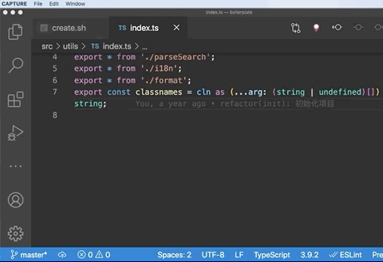

# 概述

在 TypeScript 中，我们不仅可以轻易复用 JavaScript 的代码、最新特性，还能使用可选的静态类型进行检查报错，使得编写的代码更健壮、更易于维护。比如在开发阶段，我们通过 TypeScript 代码转译器就能快速消除很多低级错误（如 typo、类型等）

## TypeScript 本质

TypeScript 与 JavaScript 本质并无区别，可以将 TypeScipt 理解为是一个添加了类型注解的 JavaScript，比如 `const num = 1`，它同时符合 TypeScript 和 JavaScript 的语法。

此外，TypeScript 是一门中间语言，最终它还需要转译为纯 JavaScript，再交给各种终端解释、执行。不过，TypeScript 并不会破坏 JavaScript 既有的知识体系，因为它并未创造迥异于 JavaScript 的新语法。

## TypeScript 更加可靠

在业务应用中引入 TypeScript 后，当我们收到 Sentry（一款开源的前端错误监控系统）告警，关于“'undefined' is not a function”“Cannot read property 'xx' of null|undefined” 之类的低级错误统计信息基本没有。而这正得益于 TypeScript 的静态类型检测，让至少 10% 的 JavaScript 错误（主要是一些低级错误）能在开发阶段就被发现并解决。

我们也可以这么理解: 在所有操作符之前，TypeScript 都能检测到接收的类型（在代码运行时，操作符接收的是实际数据；静态检测时，操作符接收的则是类型）是否被当前操作符所支持。

当 TypeScript 类型检测能力覆盖到整个文件、整个项目代码后，任意破坏约定的改动都能被自动检测出来（即便跨越多个文件、很多次传递），并提出类型错误。因此，你可以放心地修改、重构业务逻辑，而不用过分担忧因为考虑不周而犯下低级错误。

接手复杂的大型应用时，TypeScript 能让应用易于维护、迭代，且稳定可靠。

## 面向接口编程

编写 TypeScript 类型注解，本质就是接口设计。

以下是使用 TypeScript 设计的一个展示用户信息 React 组件示例，从中我们一眼就能了解组件接收数据的结构和类型，并清楚地知道如何在组件内部编写安全稳定的 JSX 代码。

```js
interface IUserInfo {
  /** 用户 id */
  id: number;
  /** 用户名 */
  name: string;
  /** 头像 */
  avatar?: string;
}

function UserInfo(props: IUserInfo) {
  // ...
}
```

**TypeScript 极大可能改变你的思维方式，从而逐渐养成一个好习惯**。比如，编写具体的逻辑之前，我们需要设计好数据结构、编写类型注解，并按照这接口约定实现业务逻辑。这显然可以减少不必要的代码重构，从而大大提升编码效率。

同时，你会更明白接口约定的重要性，也会约束自己/他人设计接口、编写注解、遵守约定，乐此不疲。

## TypeScript 正成为主流

相比竞争对手 Facebook 的 Flow 而言，TypeScript 更具备类型编程的优势，而且还有 Microsoft、Google 这两家国际大厂做背书。

另外，**越来越多的主流框架**（例如 React、Vue 3、Angular、Deno、Nest.js 等）**要么选用 TypeScript 编写源码，要么为 TypeScript 提供了完美的支持**。

随着 TypeScript 的普及，TypeScript 在国内（国内滞后国外）成了一个主流的技术方向，国内各大互联网公司和中小型团队都开始尝试使用 TypeScript 开发项目，且越来越多的人正在学习和使用它。


# IDE for TypeScript

### 1. VS Code

VS Code 中内置了特定版本的 TypeScript 语言服务，所以它天然支持 TypeScript 语法解析和类型检测，且这个内置的服务与手动安装的 TypeScript 完全隔离。因此，**VS Code 支持在内置和手动安装版本之间动态切换语言服务，从而实现对不同版本的 TypeScript 的支持**。

如果当前应用目录中安装了与内置服务不同版本的 TypeScript，我们就可以点击 VS Code 底部工具栏的版本号信息，从而实现 “use VS Code's Version” 和 “use Workspace's Version” 两者之间的随意切换。



我们也可以在当前应用目录下的 “.VS Code/settings.json” 内添加命令（如下所示）配置 VS Code 默认使用应用目录下安装的 TypeScript 版本，以便提供语法解析和类型检测服务。

```js
{
  "typescript.tsdk": "node_modules/typescript/lib"
}
```

在实际编写 TypeScript 代码时，我们可以使用“Shift + Command + M”快捷键打开问题面板查看所有的类型错误信息概览，如下图所示：


**这里请注意：不同操作系统、不同 VS Code 版本的默认快捷键可能不一致，我们可以点击菜单栏中的“视图（View）| 问题（Problems）” 查看具体快捷键。**

当然，VS Code 也基于 TypeScript 语言服务提供了准确的代码自动补全功能，并显示详细的类型定义信息，如下图所示：


除了类型定义之外，TypeScript 语言服务还能将使用 JSDoc 语法编写的结构化注释信息提供给 VS Code，而这些信息将在对应的变量或者类型中通过 hover 展示出来，极大地提升了代码的可读性和开发效率，如下图所示：


我们还可以通过 “Ctrl + `” 快捷键打开 VS Code 内置的命令行工具，以便在当前应用路径下执行各种操作

📢 特别需要注意的是，VS Code 默认使用自身内置的 TypeScript 语言服务版本，而在应用构建过程中，构建工具使用的却是应用路径下 node_modules/typescript 里的 TypeScript 版本。如果两个版本之间存在不兼容的特性，就会造成开发阶段和构建阶段静态类型检测结论不一致的情况，因此，我们务必将 VS Code 语言服务配置成使用当前工作区的 TypeScript 版本

---

在 Mac 电脑上，如果你习惯使用命令行，可以将 VS Code bin 目录添加到环境变量 PATH 中，以便更方便地唤起它，如下代码所示：

```js
export PATH="$PATH:/Applications/Visual Studio Code.app/Contents/Resources/app/bin"
```

然后，在 Mac 命令行工具中，我们使用 Vim 编辑“source ~/.bash_profile”即可让配置的环境变量生效。

```js
source ~/.bash_profile
```

Vim 保存退出后，输入`code 应用路径`，我们就可以快速打开和编辑指定路径下的应用了。


### 2. WebStorm

WebStorm 具备开箱即用、无须做任何针对性的配置即可开发、执行和调试 TypeScript 源码这两大优势。

WebStorm 也是基于标准的 TypeScript Language Service 来支持 TypeScript 的各种特性，与其他 IDE 在类型检测结果、自动完成提示上没有任何差异。比如，它同样可以准确地进行代码自动补全、同样支持 hover 提示类型及 JSDoc 注释等功能。

WebStorm 毕竟是一款商业化（收钱的）软件，所以它还集成了很多强大的 TypeScript 开发功能，具体内容[可点击这里查看](https://www.jetbrains.com/zh-cn/webstorm/features/?fileGuid=xxQTRXtVcqtHK6j8)。

WebStorm 与 VS Code 相比，最大的优势在于开箱即用，这点可谓是选择困难症患者的福音。不过，它对电脑配置要求较高，对于 Mac 用户来说比较适合。


### 3. Playground

> [中文版地址](https://www.typescriptlang.org/zh/play/?target=1&module=1&ts=3.9.7#code/Q&fileGuid=xxQTRXtVcqtHK6j8)
>
> [英文版地址](https://www.typescriptlang.org/play?alwaysStrict=false&target=1&module=1&ts=3.9.7#code/Q)

官方也提供了一个在线开发 TypeScript 的云环境——Playground。

基于它，我们无须在本地安装环境，只需要一个浏览器即可随时学习和编写 TypeScript，同时还可以方便地选择 TypeScript 版本、配置 tsconfig，并对 TypeScript 实时静态类型检测、转译输出 JavaScript 和在线执行。


# 安装 TypeScript

全局安装TS  `npm i -g typescript`

TypeScript 安装完成后，我们输入如下所示命令即可查看当前安装的 TypeScript 版本。

```bash
tsc -v
```

我们也可以通过安装在 Terminal 命令行中直接支持运行 TypeScript 代码（Node.js 侧代码）的 ts-node 来获得较好的开发体验。

通过 npm 全局安装 ts-node 的操作如下代码所示：

```bash
npm i -g ts-node
```

如果你是 Mac 或者 Linux 用户，就极有可能在 npm i -g typescript 中遭遇 “EACCES: permission denied” 错误，此时我们可以通过以下 4 种办法进行解决：

- 使用 nvm 重新安装 npm
- 修改 npm 默认安装目录
- 执行 sudo npm i -g xx
- 执行 sudo chown -R [user]:[user] /usr/local/lib/node_modules

[你可以点击这里了解更多相关建议](https://docs.npmjs.com/resolving-eacces-permissions-errors-when-installing-packages-globally?fileGuid=xxQTRXtVcqtHK6j8)


# Demo 练习

新建一个文件，在文件夹下使用 `tsc --init` 命令创建一个tsconfig.json 文件，或者在 VS Code 应用窗口新建一个空的 tsconfg.json**配置 TypeScript 的行为**

为了让 TypeScript 的行为更加严格、简单易懂，要求我们在 tsconfig.json 中开启如下所示设置，该设置将决定了 VS Code 语言服务如何对当前应用下的 TypeScript 代码进行类型检测。

```json
{
  "compilerOptions": {
    /* Strict Type-Checking Options */
    "strict": true,                           /* Enable all strict type-checking options. */
    "noImplicitAny": true,                 /* Raise error on expressions and declarations with an implied 'any' type. */
    "strictNullChecks": true,              /* Enable strict null checks. */
    "strictFunctionTypes": true,           /* Enable strict checking of function types. */
    "strictBindCallApply": true,           /* Enable strict 'bind', 'call', and 'apply' methods on functions. */
    "strictPropertyInitialization": true,  /* Enable strict checking of property initialization in classes. */
    "noImplicitThis": true,                /* Raise error on 'this' expressions with an implied 'any' type. */
    "alwaysStrict": false,                  /* Parse in strict mode and emit "use strict" for each source file. */
  }
}
```

然后，我们输入如下所示代码即可新建一个 HelloWorld.ts 文件：

```ts
function say(word: string) {
  console.log(word);
}

say('Hello, World');
```

在以上代码中，word 函数参数后边多出来的 “: string” 注解直观地告诉我们，这个变量的类型就是 string。如果你之前使用过其他强类型的语言（比如 Java），就能快速理解 TypeScript 语法。

当然，在当前目录下，我们也可以通过如下代码创建一个同名的 HelloWorld.js 文件，而这个文件中抹掉了类型注解的 TypeScript 代码。

```js
function say(word) {
  console.log(word);
}

say('Hello, World');
```

这里我们可以看到，TypeScript 代码和我们熟悉的 JavaScript 相比，并没有明显的差异。

.ts 文件创建完成后，我们就可以使用 tsc（TypeScript Compiler） 命令将 .ts 文件转译为 .js 文件。

**注意：指定转译的目标文件后，tsc 将忽略当前应用路径下的 tsconfig.json 配置，因此我们需要通过显式设定如下所示的参数，让 tsc 以严格模式检测并转译 TypeScript 代码。**

```bash
tsc HelloWorld.ts --strict --alwaysStrict false
```

同时，我们可以给 tsc 设定一个 watch 参数监听文件内容变更，实时进行类型检测和代码转译，如下代码所示：

```bash
tsc HelloWorld.ts --strict --alwaysStrict false --watch
```

我们也可以直接使用 ts-node 运行 HelloWorld.ts，如下代码所示：

```bash
ts-node HelloWorld.ts
```

运行成功后，ts-node 就会输出如下所示内容：

```tex
Hello, World
```

当然，我们也可以唤起“直接运行”（本质上是先自动进行转译，再运行）TypeScript 的 ts-node 命令行来编写代码，这就跟我们在 Node.js 命令行或者浏览器中调试工具一样。

然后，我们再回车立即执行如下所示代码：

```bash
> ts-node
> function say(word: string) {
>   console.log(word);
> }
> say('Hello, World');
Hello, World
undefined
```

**这里请注意：TypeScript 的类型注解旨在约束函数或者变量，在上面的例子中，我们就是通过约束一个示例函数来接收一个字符串类型（string）的参数。**
