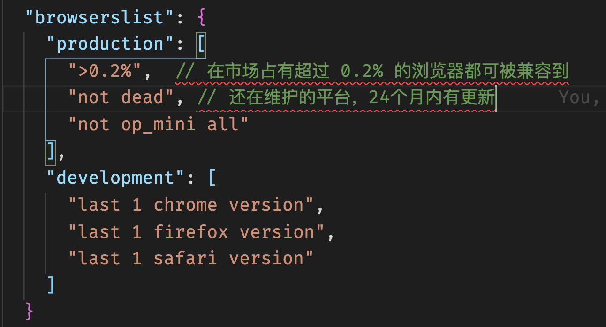

# Webpack 的出现

在前端初期，前端只需要编写静态页面，对JS也仅需要进行表单验证和动效做出处理，不存在太多的工程化的问题；
伴随着 Ajax 技术的诞生，前端的工作模式发生了很大的变化，前端不需要仅渲染页面，也可以管理数据以及和用户进行交互，也诞生了 JQuery 这样的工具库；
趋于现阶段大前端开发，前端的工作面向多样化、复杂化的发展，不仅要开发PC端的Web界面，还有移动端的Web界面以及小程序公众号等，伴随着事情越来越多，流程也越来越复杂，就出现了一些问题：

- 采用模块化开发
  不同的浏览器对模块化的支持的不同的，而且模块化存在多种实现规范（详见[模块化概述](../前端模块化/模块化概述.md)）都给最终产出产生了一定的影响
- 使用新特性提高效率保证安全性
  面对新特性 less\sass\ES6新特性...浏览器也无法提供原生支持
- 实时监听开发过程使用热更新
- 项目结果打包压缩优化

这个时候我们需要一个工具实现项目工程化（webpack）

# Webpack 使用

> Webpack 是为现代 JS 应用提供静态模块打包的工具。
> 核心功能就是进行打包操作：
>
> - 打包： 将不同类型资源安模块处理进行打包
> - 静态： 打包后最终产出静态资源
> - 模块： webpack支持不同规范的模块化开发

- webpack5 支持零配置使用
- 想要自定义修改webpack配置相关内容可以通过参数的形式进行处理（比如修改配置文件名为a.js, 命令修改为 webpack --config a.js即可）

## path

```js
module.exports = {
  /* 1. output 中的 path */
  output: {
    filename: 'main.js',
    // 将来打包后的结果输出的目录,用于本地访问资源
    path: path.resolve(__dirname, 'dist'),
    // 默认为空字符串：index.html 内部的引用路径
    // 规则想当于资源查找路径为：域名 + publicPath + filename
    // 如果这里写成 '/',回导致本地查找不到资源，可以改为'./'(从绝对路径改为相对路径，但是在devServer 下会访问不到)
    publicPath: ''
  },
  /* 2. devServer 中的 path */
  // 建立本地开发服务
  devServer: {
    // 指定本地服务所在的目录，默认为 '/'(当前项目所在的目录)
    // 通过devServer对资源进行访问
    publicPath: '/',
    // 对于直接访问打包后的资源来说，设置 contentBase 的值的意义不是很大
    // 打包之后的资源如果依赖了其他的资源，告知去哪找
    // 写绝对路径
    contentBase: path.resolve(__dirname, 'public'),
    // 监听contentBase中的内容更改
    watchContentBase: true
  }
}
```

假设将devServer的publicPath改为`/demo` ，此时打开网址会发现资源是没有加载出来的。原因是：资源查找会从服务器 `/demo` 目录下进行查找，但是我们的资源是打包到了 output 下的 publicPath 下查找的（有冲突啦~~）。所以可以将output下的publicPath改为 `/demo`

contentBase：比如有一些资源不需要打包，想要直接进行访问，在index.html 中进行了直接引用，可以使用contentBase 进行查找

## asset module type

> webpack5 处理资源内置模块
> asset/resource 相当于 file-loader 实现
> asset/inline 相当于 url-loader 实现
> asset/source 相当于 raw-loader 实现

**配置：**

```js
module.exports = {
  // ... 
  output: {
    filename: 'main.js',
    path: path.resolve(__dirname, 'dist'),
    // asset 的全局处理
    assetModuleFilename: 'img/[name].[hash:4][ext]'
  },
  module: {
    rules: [
      ...
      // asset/resource 使用
      {
        test: /\.(png|svg|gif|jpe?g)$/,
        type: "asset/resource",
        generator: {
          filename: 'img/[name].[hash:4][ext]'
        }
      },
      // asset/inline 使用
      {
        test: /\.(png|svg|gif|jpe?g)$/,
        type: "asset/inline"
      },
      {
        test: /\.(png|svg|gif|jpe?g)$/,
        type: "asset",
        generator: {
          filename: 'img/[name].[hash:4][ext]'
        },
        parser: {
          dataUrlCondition: {
            maxSize: 30 * 1024 
          }
        }
      },
      /* asset 对图标字体的处理 */
      {
        test: /\.(ttf|woff2?)$/,
        // 直接做拷贝处理即可
        type: "asset/resource",
        generator: {
          filename: 'font/[name].[hash:3][ext]'
        },
      }
    ]
  }
}
```


## Loader

**为什么需要loader**


**loader 是什么**

```tex
webpack4 中对于loader的使用分为三种形式
1. 行内 loader
2. 配置文件中的 loader
3. 命令行（cli 工具）中使用的 loader（webpack5 不建议使用！！）
```

**功能**

对特定的模块类型进行转换

### css-loader

> 将 CSS 语法处理为 JS 可以使用的模块类型，不能将样式放在界面上进行使用

**安装依赖：** `yarn add css-loader --dev`

**行内loader使用：**

```js
import "css-loader!../css/login.css"

function login() {
  ...
}
```

**配置文件中的 loader使用：**

```js
module.exports = {
  // ... 
  /**
   * 放置匹配规则 以及 相应规则下需要添加的属性和属性值
  */
  module: {
    rules: [
      {
        test: /\.css$/, // 一般就是一个正则表达式，用于匹配我们需要处理的文件类型
        use: [
          {
            loader: 'css-loader'
          }
        ]
      },
      // 简写方式 一
      {
        test: /\.css$/,
        loader: 'css-loader'
      },
      // 简写方式 二
      {
        test: /\.css$/,
        use: ['css-loader']
      },
    ]
  }
}
```

#### importLoaders 属性

将 CSS 文件分成两个部分处理，处理完成之后使用 @import 引入使用，此时会发现打包出来的样式是不正确的

```tex
1. login.css @import 语句导入了 test.css
2. login.css 可以匹配，当他被匹配到之后就是 postcss-loader 进行工作
3. 基于当前的代码，postcss-loader 拿到了 login.css 当中的代码之后，分析基于我们的筛选条件并不需要做额外的处理
4. 最终就将代码直接交给了 css-loader
5. 此时 css-loader 可以处理 @import media url... 这时候它又拿到了 test.css 文件，但是loader不会回头找（不会再次使用 postcss-loader）
6. 最终将处理好的 css 代码交给 style-loader 进行展示
```

```js
module.exports = {
  // ... 
  /**
   * 放置匹配规则 以及 相应规则下需要添加的属性和属性值
  */
  module: {
    rules: [
      {
        test: /\.css$/,
        use: [
          'style-loader', 
          {
            loader: 'css-loader',
            options: {
              importLoaders: 1, // 当css-loader工作时，如果又找到了需要处理的css文件，就往前找 “一个” Loader(找到 postcss-loader)
              esModule: false  // 处理背景图片资源文件
            }
          }, 
          'postcss-loader'
        ]
      }
    ]
  }
}
```

### style-loader

> 让 css-loader 处理之后的 css 能在界面上展示出来
> 作用：生成一个 style 标签

**安装依赖：** `yarn add style-loader --dev`

**配置：**

```js
module.exports = {
  // ... 
  /**
   * 放置匹配规则 以及 相应规则下需要添加的属性和属性值
  */
  module: {
    rules: [
      {
        test: /\.css$/,
        // 执行顺序 从右/下往左/上 执行
        use: ['style-loader', 'css-loader']
      },
    ]
  }
}
```

### less-loader

> less-loader 中使用 less 将 less 转换为 css，所以需要同时依赖 less

**安装依赖：** `yarn add less less-loader --dev`

**配置：**

```js
module.exports = {
  // ... 
  /**
   * 放置匹配规则 以及 相应规则下需要添加的属性和属性值
  */
  module: {
    rules: [
      {
        test: /\.css$/,
        // 执行顺序 从右/下往左/上 执行
        use: ['style-loader', 'css-loader']
      },
      {
        test: /\.less$/,
        // 执行顺序 从右/下往左/上 执行
        use: ['style-loader', 'css-loader', 'less-loader']
      }
    ]
  }
}
```

### postcss-loader

#### Browserslistrc 工作流程

在 package.json 中配置



或创建 .browserslistrc 文件配置

```json
>0.2%
last 2 version
not dead
```

针对以上实例的配置，我们接下来描述一下其原理。

```tex
当前我们在做前端开发的时候，大多采用的都是工程化的方式；
面对兼容性的问题（CSS新特性 JS新特性 不同平台的支持不同），我们分解开来就是
1. 如何实现兼容： babel processenv
2. 到底要兼容哪些平台: 项目针对性平台 或 市场主流平台 - caniuse.com（(到这里查看市场占有率)[https://caniuse.com/usage-table]）

node_modules/browserslist/index.js
当我们用脚手架创建完了一个项目后，默认会帮我们安装好 browserlist. browserlist 在工作的时候会调用 caniuse 的 lite 工具，到 caniuse.com 发送请求，得到相应数据后结合相应配置做兼容性的处理
```

测试指令（mac 电脑下可以添加相应条件）

```bash
# 逗号表示或者的意思，市场占有率大于 1% 或者某一个平台的最新2个版本
npx browserlist ">1%, last 2 version" 
```

#### postcss 工作流程

> 针对 CSS 的兼容性处理，我们可以使用 postcss
> postcss 是通过 javascript 转换样式的工具

**安装**： `npm i postcss postcss-cli -D`

postcss-cli 的安装就是为了可以在命令行终端使用postcss相关指令

`npx postcss -o ret.css .src/css/test.css`

**安装自动添加前缀的插件**： `npm i autoprefixer -D`

`npx postcss --use autoprefixer -o ret.css .src/css/test.css`

#### postcss-loader

**安装依赖：** `yarn add postcss-loader --dev`

postcss 在 css-loader 之前进行工作

**配置：**

```js
module.exports = {
  // ... 
  /**
   * 放置匹配规则 以及 相应规则下需要添加的属性和属性值
  */
  module: {
    rules: [
      {
        test: /\.css$/,
        // 执行顺序 从右/下往左/上 执行
        use: [
          'style-loader', 
          'css-loader', 
          {
            loader: 'postcss-loader',
            options: {
              postcssOptions: {
                plugins: [
                  require('autoprefixer')
                ]
              }
            }
          }
        ]
      }
    ]
  }
}
```

**新需求**

兼容 color: #12345678 的写法特性

可以使用 postcss-preset-env 插件集进行处理

**安装依赖**： `yarn add postcss-preset-env -D`

**配置：**

```js
module.exports = {
  // ... 
  /**
   * 放置匹配规则 以及 相应规则下需要添加的属性和属性值
  */
  module: {
    rules: [
      {
        test: /\.css$/,
        // 执行顺序 从右/下往左/上 执行
        use: [
          'style-loader', 
          'css-loader', 
          {
            loader: 'postcss-loader',
            options: {
              postcssOptions: {
                // 写法一
                plugins: [
                  require('autoprefixer'),
                  require('postcss-preset-env')
                ]
                // 简写
                plugins: ['postcss-preset-env']
              }
            }
          }
        ]
      }
    ]
  }
}
```

**配置简写：**

```js
module.exports = {
  // ... 
  /**
   * 放置匹配规则 以及 相应规则下需要添加的属性和属性值
  */
  module: {
    rules: [
      {
        test: /\.css$/,
        // 执行顺序 从右/下往左/上 执行
        use: [
          'style-loader', 
          'css-loader', 
          'postcss-loader'
        ]
      },
      {
        test: /\.less$/,
        // 执行顺序 从右/下往左/上 执行
        use: ['style-loader', 'css-loader', 'postcss-loader', 'less-loader']
      }
    ]
  }
}
```

**新建文件 postcss.config.js**

```js
module.exports = {
  plugins: [
    require('postcss-preset-env')
  ]
}
```

### file-loader

> 处理图片
> 把图片的名称或路径返回，将相应的图片资源拷贝到打包路径下

**安装依赖：** `yarn add file-loader --dev`

**配置：**

```js
module.exports = {
  // ... 
  /**
   * 放置匹配规则 以及 相应规则下需要添加的属性和属性值
  */
  module: {
    rules: [
      ...
      {
        test: /\.(png|svg|gif|jpe?g)$/,
        // esModule 形式 require 引入需要结构到 .default 属性
        use: [
          {
            loader: 'file-loader',
            // 使用 import 方式使用就不需要这步配置了
            options: {
              esModule: false, // 不转为 esModule
              /**
               * 占位说明
               * [ext] 扩展名（和打包之前一样）
               * [name] 文件名（和打包之前一样）
               * [hash] 以文件的内容和md算法生成128位哈希值
               * [contentHash] 和使用 hash 结果一样
               * [hash:<length>] 可以限制生成哈希文件名的长度
               * [path] 配置文件路径
              */
              name: '[name].[hash:6].[ext]', // 图片名称
              outputPath: 'img' // 输出文件路径
              // 简写处理
              name: 'img/[name].[hash:6].[ext]'
            }
          }
        ]
      }
    ]
  }
}
```

### url-loader

> 处理图片
> 将要打包的图片资源以base64URI 的方式加载到代码中
> 相比 file-loader 的好处是减少了请求的次数
> 缺点是如果图片资源很大，请求时间就会增加

**安装依赖：** `yarn add url-loader --dev`

**配置：**

```js
module.exports = {
  // ... 
  module: {
    rules: [
      ...
      {
        test: /\.(png|svg|gif|jpe?g)$/,
        use: [
          {
            loader: 'url-loader',
            // 使用 import 方式使用就不需要这步配置了
            options: {
              esModule: false, // 不转为 esModule
              // 简写处理
              name: 'img/[name].[hash:6].[ext]',
              limit: 25 * 1024 // 超过 25 kb 就使用 file-loader
            }
          }
        ]
      }
    ]
  }
}
```

### babel-loader

**安装依赖：** `yarn add babel-loader --dev`

**配置：**

```js
module.exports = {
  // ... 
  module: {
    rules: [
      ...
      {
        test: /\.js$/,
        exclude: '/node_modules/', // 不要处理 node_modules 下的文件 || 不要被 node_modules 下的文件 进行处理
        use: [
          {
            loader: 'babel-loader',
            options: {
              // 或者使用 plugins: [...插件]
              presets: [
                '@babel/preset-env',
                {
                  // 针对 ** 平台做转换，在和 browserslist 同时存在的情况下，最终以当前配置为主作用
                  // 建议都写在配置文件中
                  targets: 'chrome 91'
                }
              ]
            }
          }
        ]
      }
    ]
  }
}
```

**babelloader 相关配置**

- babel.config.js(json cjs mjs)

  ```js
  module.exports = {
    presets: [
      '@babel/preset-env'
    ]
  }
  ```

- .babelrc.json(js cjs mjs)【babel7之前使用的更多】

#### ployfill 配置

> Webpack5 之前不需要我们自己处理 ployfill 为了优化打包速度 webpack5 将这部分内容进行抽离
> ployfill: 对功能进行填充，比如我们写了一个 Promise 函数，当前项目需要支持在IE78 上进行支持，但是IE78版本并不支持 promise 方法，此时就需要自动填充(plofill)一个 promise 函数出来

**安装：** `npm i core-js regenerator-runtime`

**配置：** 到 `babel-loader` 中进行配置

babel.config.js(json cjs mjs)

```js
module.exports = {
  presets: [
    '@babel/preset-env',
    {
      // 默认值： false -> 不对当前的JS做polyfill 填充
      // usage: 根据源代码中使用情况做填充
      // entry: 依据筛选出来的浏览器进行填充
      useBuiltIns: 'entry',
      corejs: 3 // 默认版本为2 版本设置为3
    }
  ]
}
```


## plugins

### clean-webpack-plugin

> 自动清除打包过后的目录

**安装依赖：** `yarn add clean-webpack-plugin --dev`

**配置：**

```js
const { CleanWebpackPlugin } = require('clean-webpack-plugin')
module.exports = {
  // ... 
  plugins: [
    new CleanWebpackPlugin()
  ]
}
```

### Html-webpack-plugin

> 打包后会在打包目录下自动创建一个 index.html 文件

**安装依赖：** `yarn add html-webpack-plugin --dev`

**配置：**

```js
const HtmlWebpackPlugin = require('html-webpack-plugin')
const { DefinePlugin } = require('webpack')
module.exports = {
  // ... 
  plugins: [
    // ...
    new HtmlWebpackPlugin({
      title: 'demo',
      template: './public/index.html' // 模板路径
    }),
    // 常量定义
    new DefinePlugin({
      BASE_URL: '"./"'
    })
  ]
}
```

### copy-webpack-plugin

**安装依赖：** `yarn add copy-webpack-plugin --dev`

**配置：**

```js
const CopyWebpackPlugin = require('copy-webpack-plugin')
module.exports = {
  // ... 
  plugins: [
    // ...
    new CopyWebpackPlugin({
      // 拷贝配置项
      patterns: [
        {
          from: 'public',
          // to: 'dist'// 可以不写，不写的话会默认查找 output 输出目录
          globOptions: {
            // 忽略规则（忽略掉不需要拷贝的内容）
            ignore: [
              '**/index.html' // 从当前文件夹（public）下查找
            ]
          }
        }
      ]
    })
  ]
}
```

## webpack-dev-server

> 搭建本地服务器
> 期望：当项目文件内容发生改变后自动完成编译并刷新浏览器

**期望实现方案一： 配置 --watch + vscode live server 插件**

和 webpack dev server 比较不足之处

1. 所有源码都会重新编译
2. 每次编译成功之后都需要进行文件读写（对性能影响较大）
3. 不能实现局部刷新

**安装：** `yarn add webpack-dev-server --dev`

**使用**

package.json

```json
// 配置相关指令
{
  "scripts": {
    // 不配置 --config 的话默认查找 webpack.config.js
    "serve": "webpack serve --config dev.webpack.js"
  }
}
```

执行 `yarn serve` 命令即可

⭐️ webpack dev server 对文件的操作在内存中

## [webpack-dev-middleware](https://webpack.js.org/guides/development/#using-webpack-dev-middleware)

> 作为自由度更高的本地服务器中间件提供
> 思路： 在本地开启一个服务，将webpack打包后的结果交给服务让浏览器访问即可

**安装：** `yarn add webpack-dev-middleware express`

**使用案例：**

```js
// server.js
const express = require('express');
const webpack = require('webpack');
const webpackDevMiddleware = require('webpack-dev-middleware');

const app = express();
const config = require('./webpack.config.js');
const compiler = webpack(config);

// Tell express to use the webpack-dev-middleware and use the webpack.config.js
// configuration file as a base.
app.use(
  webpackDevMiddleware(compiler, {
    publicPath: config.output.publicPath,
  })
);

// Serve the files on port 3000.
app.listen(3000, function () {
  console.log('Example app listening on port 3000!\n');
});
```

## HMR

**配置：**

```js
module.exports = {
  // ... 
  target: 'web',
  // 如果在开发模式下，有 browserlist 配置的情况下会产生冲突，可以加上 target: 'web' 的配置做处理
  devServer: {
    hot: true // 默认还是刷新整个页面
  }
}
```

**使用：**

```js
/* index.js */
import './other'

if (module.hot) {
  module.hot.accept(['./other.js', '...'], () => {
    // to do other things..
  })
}
```

### React 支持 HMR

**安装依赖：**

```bash
yarn add @babel/preset-react @pmmmwh/react-refresh-webpack-plugin react-refresh --dev
```

配置：

```js
const ReactRefreshWebpackPlugin = require('@pmmmwh/react-refresh-webpack-plugin')
module.exports = {
  // ... 
  target: 'web',
  // 如果在开发模式下，有 browserlist 配置的情况下会产生冲突，可以加上 target: 'web' 的配置做处理
  devServer: {
    hot: true // 默认还是刷新整个页面
  }
  module: {
    rules: [
      ...
      {
        test: /\.jsx?$/,
        exclude: '/node_modules/', // 不要处理 node_modules 下的文件 || 不要被 node_modules 下的文件 进行处理
        use: ['babel-loader']
      }
    ]
  },
  plugins: [
    // ...
    new ReactRefreshWebpackPlugin()
  ]
}
```

babel.config.js

```js
module.exports = {
  presets: [
    ['@babel/preset-env'],
    ['@babel/preset-react']
  ],
  plugins: [
    ['react-refresh/babel']
  ]
}
```

### Vue 支持 HMR

**安装依赖：**

```bash
# vue-loader 注意版本的匹配
yarn add vue-template-compiler vue-loader@14  --dev
# 安装 vue2 版本
yarn add vue 
```

vue-loader@16 适配于 vue3

配置：

```js
const ReactRefreshWebpackPlugin = require('@pmmmwh/react-refresh-webpack-plugin')
module.exports = {
  // ... 
  target: 'web',
  // 如果在开发模式下，有 browserlist 配置的情况下会产生冲突，可以加上 target: 'web' 的配置做处理
  devServer: {
    hot: true // 默认还是刷新整个页面
  }
  module: {
    rules: [
      ...
      {
        test: /\.vue$/,
        use: ['vue-loader']
      }
    ]
  }
}
```

```js
// vue-loader@15 版本
const VueLoaderPlugin = require('vue-loader/lib/plugin')
module.exports = {
  // ... 
  target: 'web',
  // 如果在开发模式下，有 browserlist 配置的情况下会产生冲突，可以加上 target: 'web' 的配置做处理
  devServer: {
    hot: true // 默认还是刷新整个页面
  }
  module: {
    rules: [
      ...
      {
        test: /\.vue$/,
        use: ['vue-loader']
      }
    ]
  },
  plugins: [
    // ...
    new VueLoaderPlugin()
  ]
}
```

## [devServer 常用配置](https://webpack.docschina.org/configuration/dev-server/#devserver)

```json
devServer: {
  hot: true, // 默认还是刷新整个页面
  // 比如在整个页面的某个组件发生了错误后，会将整个页面进行刷新，这种体验感是不好的，我们只希望刷新当前组件即可，这时候可以将hotOnly 打开
  hotOnly: true,
  // 指定在某个端口开启服务，默认为8080
  port: 4000,
  // 可以自动帮我们打开浏览器：每一次更新都会打开一个浏览器窗口
  open: true,
  // 开启服务端的gzip压缩: 默认为false
  compress: true,
  // 将路由转为前端处理
  historyApiFallback: true,
  // proxy 代理设置
  proxy: {
    // 所有以api开头的接口都走代理设置
    '/api': {
      // 转到对应服务下请求数据
      target: 'https://api.**.com',
      // 对 /api 进行重写
      // 服务器下可能没有 /api 的接口，需要根据服务器下需要的规则转换
      pathRewrite: {
        '^/api': ''
      },
      // 建议改为 true
      changeOrigin: true
    }
  }
}
```

## [resolve 模块解析规则](https://webpack.docschina.org/configuration/resolve/#resolve)

```js
module.exports = {
  //...
  resolve: {
    extensions: ['.js', '.json', '.wasm'],
    mainFiles: ['index'],
  },
};
```

**resolve 解析规则：**

1. 相对路径：按照当前文件上下文进行查找
2. 模块名称：从 `node_modules` 下查找（resolve.modules 可以进行扩展）
3. 绝对路径：直接查找

**相对路径文件查找规则：**

1. 如果匹配到文件，查找对应的文件扩展名，如果没有文件扩展名，从 `extensions` 中进行匹配查找
2. 如果匹配到文件夹，从 `mainFiles` 中进行匹配文件，匹配到文件后，到第一步，匹配文件路径

# 附

## babel 的使用

**为什么需要babel?**

项目中可能会使用到 jsx, ts, es6+ 新特性的语法 等，这些特性在浏览器平台是不可以被直接使用的；这时候需要 babel 来帮助我们处理 JS 的兼容问题。

**安装**

```bash
# 核心模块: 源代码转换
npm i @babel/core -D
# 支持命令行操作 
# npx babel src(查找目录) --out-dir build(输出目录)
npm i @babel/cli -D
# 转换 箭头函数 的工具包
# npx babel src(查找目录) --out-dir build(输出目录) --plugins=@babel/plugin-transform-arrow-functions
npm i @babel/plugin-transform-arrow-functions -D
# 转换 const 作用域声明 的工具包(将 const 和 let 转换成 var)
# npx babel src(查找目录) --out-dir build(输出目录) --plugins=@babel/plugin-transform-arrow-functions,@babel/plugin-transform-block-scoping
npm i @babel/plugin-transform-block-scoping -D
# 工具集 安装
# npx babel src(查找目录) --out-dir build(输出目录) --presets=@babel/preset-env
npm i @babel/preset-env -D
```

