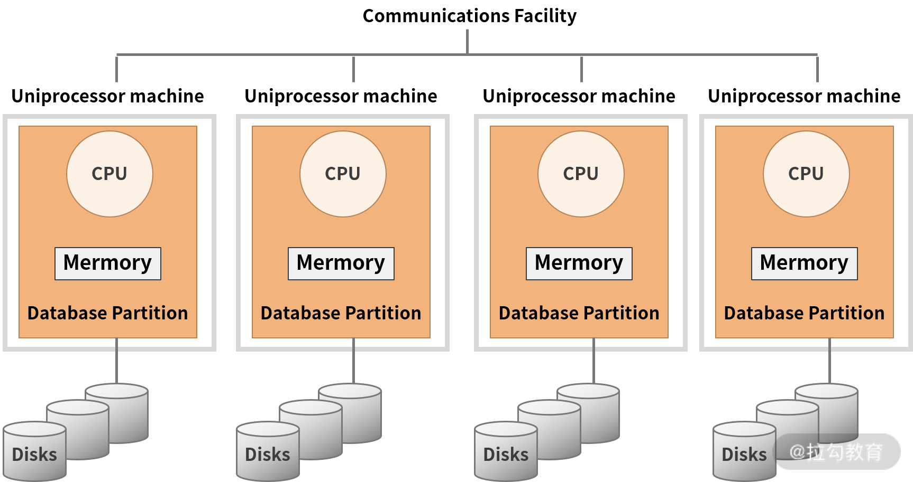
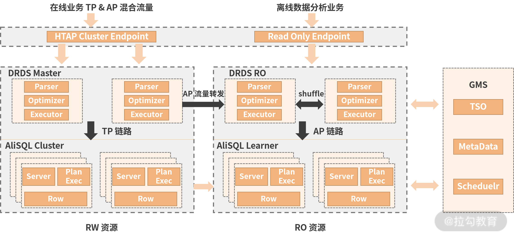
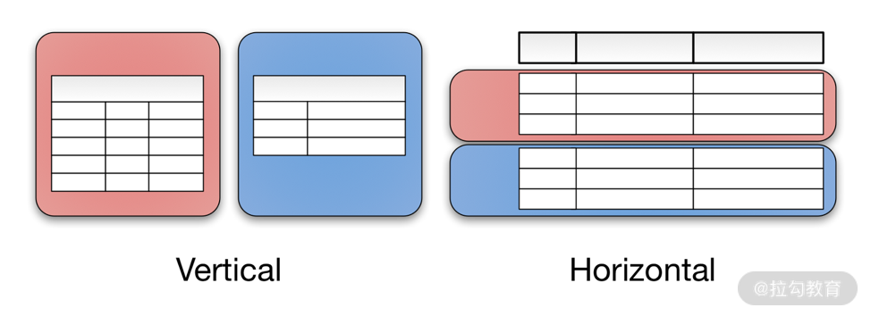
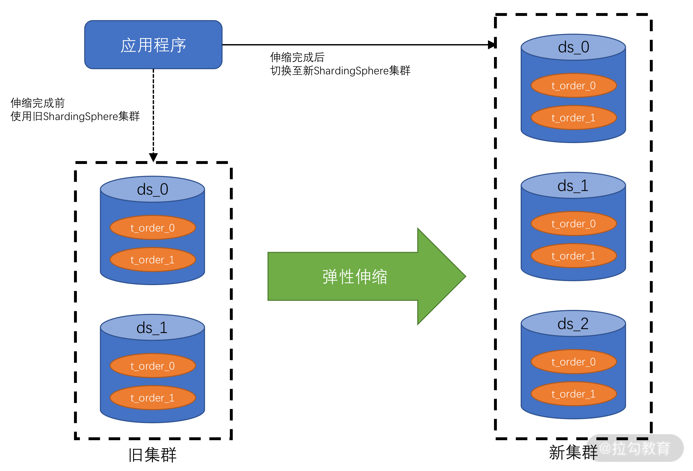
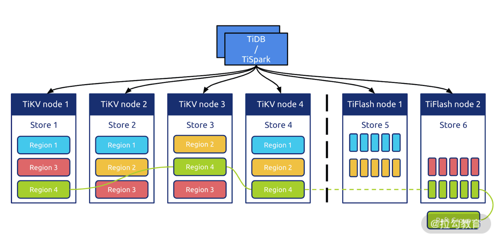
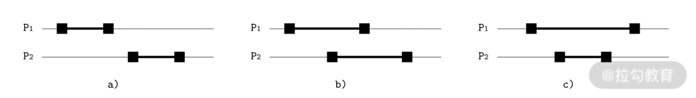
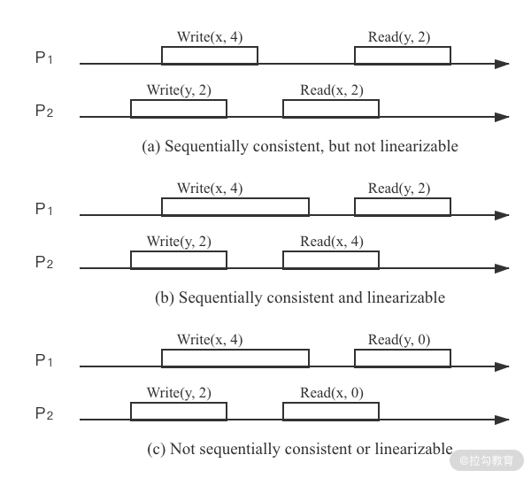

# 什么是分布式数据库

## 基本概念

分布式数据库，从名字上可以拆解为：分布式+数据库。用一句话总结为：**由多个独立实体组成，并且彼此通过网络进行互联的数据库**。

下表对比了熟悉的分布式数据库与集中式数据库之间主要的 5 个差异点。

| 分布式数据库                           | 集中式数据库                             |
| -------------------------------------- | ---------------------------------------- |
| 由位于不同站点的多个数据文件组成       | 有单个中央数据库文件组成                 |
| 允许多个用户访问和操作数据             | 多个用户同时访问同一文件时发生瓶颈问题   |
| 从离用户最近的位置快速传送文件         | 文件传递给用户可能需要更长时间           |
| 如果其中一个站点发生故障，数据可以恢复 | 单站点意味着系统发生故障时停机           |
| 来自分散数据哭的多个文件必须同步       | 在单一的中央系统中更简单的更新和管理数据 |

从表中，我们可以总结出**分布式数据库的核心——数据分片、数据同步**

**1. 数据分片**

该特性是分布式数据库的技术创新。它可以突破中心化数据库单机的容量限制，从而将数据分散到多节点，以更灵活、高效的方式来处理数据。这是分布式理论带给数据库的一份礼物。

分片方式包括两种：

- 水平分片：按行进行数据分割，数据被切割为一个个数据组，分散到不同节点上。

- 垂直分片：按列进行数据切割，一个数据表的模式（Schema）被切割为多个小的模式。

**2. 数据同步**

它是分布式数据库的底线。由于数据库理论传统上是建立在单机数据库基础上，而引入分布式理论后，一致性原则被打破。因此需要引入数据库同步技术来帮助数据库恢复一致性。

简而言之，就是使分布式数据库用起来像“正常的数据库”。所以数据同步背后的推动力，就是人们对数据“一致性”的追求。这两个概念相辅相成，互相作用。

## 分布式数据库的前世今生

### 商业数据库

互联网浪潮之前的数据库，特别是前大数据时代。谈到分布式数据库绕不开的就是 Oracle RAC。

Oracle RAC 是典型的大型商业解决方案，且为软硬件一体化解决方案。它是那个时代数据库性能的标杆和极限，是完美方案与商业成就的体现。

我们试着用上面谈到的两个特性来简单分析一下 RAC：它确实是做到了数据分片与同步。每一层都是离散化的，特别在底层存储使用了 ASM 镜像存储技术，使其看起来像一块完整的大磁盘。

这样做的好处是实现了极致的使用体验，即使用单例数据库与 RAC 集群数据库，在使用上没有明显的区别。它的分布式存储层提供了完整的磁盘功能，使其对应用透明，从而达到扩展性与其他性能之间的平衡。甚至在应对特定规模的数据下，其经济性又有不错的表现。

**这种分布式数据库设计被称为“共享存储架构”（share disk architecture）**。它既是 RAC 强大的关键，又是其“阿喀琉斯之踵”，DBA 坊间流传的 8 节点的最大集群限制可以被认为是 RAC 的极限规模。

该规模在当时的环境下是完全够用的，但是随着互联网的崛起，一场轰轰烈烈的“运动”将会打破 Oracle RAC 的不败金身。

### 大数据

我们知道 Oracle、DB2 等商业数据库均为 OLTP 与 OLAP 融合数据库。而首先在分布式道路上寻求突破的是 OLAP 领域。在 2000 年伊始，以 Hadoop 为代表的大数据库技术凭借其“无共享”（share nothing）的技术体系，开始向以 Oracle 为代表的关系型数据库发起冲击。

这是一次水平扩展与垂直扩展，通用经济设备与专用昂贵服务，开源与商业这几组概念的首次大规模碰撞。拉开了真正意义上分布式数据库的帷幕。

当然从一般的观点出发，Hadoop 一类的大数据处理平台不应称为数据库。但是从前面我们归纳的两点特性看，它们又确实非常满足。因此我们可以将它们归纳为早期面向商业分析场景的分布式数据库。**从此 OLAP 型数据库开始了自己独立演化的道路**。

除了 Hadoop，另一种被称为 MPP（大规模并行处理）类型的数据库在此段时间也经历了高速的发展。MPP 数据库的架构图如下：

我们可以看到这种数据库与大数据常用的 Hadoop 在架构层面上非常类似，但理念不同。简而言之，它是对 SMP（对称多处理器结构）、NUMA（非一致性存储访问结构）这类硬件体系的创新，采用 shared-nothing 架构，通过网络将多个 SMP 节点互联，使它们协同工作。

MPP 数据库的特点是首先支持 PB 级的数据处理，同时支持比较丰富的 SQL 分析查询语句。同时，该领域是商业产品的战场，其中不仅仅包含独立厂商，如 Teradata，还包含一些巨头玩家，如 HP 的 Vertica、EMC 的 Greenplum 等。

大数据技术的发展使 OLAP 分析型数据库，从原来的关系型数据库之中独立出来，形成了完整的发展分支路径。而随着互联网浪潮的发展，OLTP 领域迎来了发展的机遇。

### 互联网化

国内数据库领域进入互联网时代第一个重大事件就是“去 IOE”。

其中尤以“去 Oracle 数据库”产生的影响深远。十年前，阿里巴巴喊出的这个口号深深影响了国内数据库领域，这里我们不去探讨其中细节，也不去评价它正面或负面的影响。但从对于分布式数据库的影响来说，它至少带来两种观念的转变。

1. 应用成为核心：去 O 后，开源数据库需要配合数据库中间件（proxy）去使用，但这种组合无法实现传统商业库提供的一些关键功能，如丰富的 SQL 支持和 ACID 级别的事务。因此应用软件需要进行精心设计，从而保障与新数据库平台的配合。应用架构设计变得非常关键，整个技术架构开始脱离那种具有调侃意味的“面向数据库” 编程，转而变为以应用系统为核心。

2. 弱一致性理念普及：虽然强一致性仍然需求旺盛，但人们慢慢接受了特定场景下可以尝试弱一致性来解决系统的吞吐量问题。而这带来了另外一个益处，一线研发与设计人员开始认真考虑业务需要什么样的一致性，而不是简单依靠数据库提供的特性。

以上两个观念都是在破除了对于 Oracle 的迷信后产生的，它们本身是正面的，但是如果没有这场运动，其想要在普通用户之中普及确实有很大困难。而这两种观念也为日后分布式数据库，特别是国产分布式数据的发展带来了积极的影响。

而与此同期，全球范围内又上演着 NoSQL 化浪潮，它与国内去 IOE 运动一起推动着数据库朝着横向分布的方向一路狂奔。

与上一部分中提到的大数据技术类似，随着互联网的发展，去 IOE 运动将 OLTP 型数据库从原来的关系型数据库之中分离出来，但这里需要注意的是，**这种分离并不是从基础上构建一个完整的数据库，而是融合了旧有的开源型数据库，同时结合先进的分布式技术，共同构造了一种融合性的“准”数据库**。它是面向具体的应用场景的，所以阉割掉了传统的 OLTP 数据库的一些特性，甚至是一些关键的特性，如子查询与 ACID 事务等。

而 NoSQL 数据库的重点是支持非结构化数据，如互联网索引，GIS 地理数据和时空数据等。这种数据在传统上会使用关系型数据库存储，但需要将此种数据强行转换为关系型结构，不仅设计烦琐，而且使用效率也比较低下。**故NoSQL 数据库被认为是对整个数据库领域的补充**，从而人们意识到数据库不应该仅仅支持一种数据模式。

随着分布式数据库的发展，一种从基础上全新设计的分布式 OLTP 数据库变得越来越重要，而云计算更是为这种数据库注入新的灵魂，两者的结合将会给分布式数据库带来美妙的化学反应。

### 云原生是未来

从上文可以看到人们真正具有广泛认知的分布式数据库，即 OLTP 型交易式分布式数据库，依然是分布式数据库领域一个缺失的片段，且是一个重要的片段。一个真正的 OLTP 数据库应该具备什么特点呢？

实际上人们需要的是**它既具有一个单机的关系型数据库的特性，又有分布式的分片与同步特性**。 DistributedSQL 和 NewSQL 正是为了这个目的而生的 。它们至少具有如下两点引人注目的特性：

1. SQL 的完整支持

2. 可靠的分布式事务。

典型的代表有 Spanner、NuoDB、TiDB 和 Oceanbase 等。

与此同时，随着云计算的纵向深入发展，分布式数据库又迎来新的革命浪潮——云原生数据库。

首先，由于云服务天生的“超卖”特性，造成其采购成本较低，从而使终端用户尝试分布式数据库的门槛大大降低。

其次，来自云服务厂商的支撑人员可以与用户可以进行深度的合作，形成了高效的反馈机制。这种反馈机制促使云原生的分布式数据库有机会进行快速的迭代，从而可以积极响应客户的需求。

这就是云原生带给分布式数据库的变化，它是**通过生态系统的优化完成了对传统商业数据库的超越**。以下来自 DB-Engines 的分析数据说明了未来的数据库市场属于分布式数据库，属于云原生数据库。

随着分布式数据库的发展，我们又迎来了新的一次融合：那就是 OLTP 与 OLAP 将再一次合并为 HTAP（融合交易分析处理）数据库。

该趋势的产生主要来源于云原生 OLTP 型分布式数据库的日趋成熟。同时由于整个行业的发展，客户与厂商对于实时分析型数据库的需求越来越旺盛，但传统上大数据技术包括开源与 MPP 类数据库，强调的是离线分析。

如果要进行秒级的数据处理，那么必须将交易数据与分析数据尽可能地贴近，并减少非实时 ELT 的引入，这就促使了 OLTP 与 OLAP 融合为 HTAP。下图就是阿里云 PolarDB 的 HTAP 架构。

### 总结

用《三国演义》的第一句话来说：“天下大势，分久必合，合久必分。”而我们观察到的分布式数据库，乃至数据库本身的发展正暗合了这句话。

分布式数据库发展就是一个由合到分，再到合的过程：

1. 早期的关系型商业数据库的分布式能力可以满足大部分用户的场景，因此产生了如 Oracle 等几种巨无霸数据库产品；

2. OLAP 领域首先寻求突破，演化出了大数据技术与 MPP 类型数据库，提供功能更强的数据分析能力；

3. 去 IOE 引入数据库中间件，并结合应用平台与开源单机数据库形成新一代解决方案，让商业关系型数据库走下神坛，NoSQL 数据库更进一步打破了关系型数据库唯我独尊的江湖地位；

4. 新一代分布式 OLTP 数据库正式完成了分布式领域对数据库核心特性的完整支持，它代表了分布式数据库从此走向了成熟，也表明了 OLAP 与 OLTP 分布式场景下，分别在各自领域内取得了胜利；

5. HTAP 和多模式数据处理的引入，再一次将 OLAP 与 OLTP 融合，从而将分布式数据库推向如传统商业关系型数据库数十年前那般的盛况，而其产生的影响要比后者更为深远。

# SQL vs NoSQL

> SQL 是所有数据库的“核心”

## SQL 的黄金年代

先抛出一个简单的定义：SQL 数据库就是一种支持 SQL 的数据库，它是一种用于查询和处理关系数据库中“数据”的特定领域语言。关系数据库中的“关系”是指由 IBM 研究人员 E.F. Codd 在 20 世纪 70 年代初设计的数据管理的“关系模型”，并在 System R 及后续许多数据库系统中得到了普及。

那么 SQL 与关系型数据库有哪些优缺点呢？

先来谈谈优点：由于 Schema（模式）的预定义，数据库获得存储相对紧凑，从而导致其性能较为优异；之后就是经典的 ACID 给业务带来了可控性，而基于标准化 SQL 的数据访问模式给企业级应用带来了更多的红利，因为“**标准即是生产力**”。

它的缺点是：对前期设计要求高，因为后期修改 Schema 往往需要停机，没有考虑分布式场景，在扩展性和可用性层面缺乏支持；而分布式是 21 世纪应用必备的技能**，这就是区分新老数据库的重要切入点。**

自 20 世纪 70 年代末以来，SQL 和关系型数据库一直是行业标准。大多数流行的“企业”系统都是 System R 的直接后代，继承了 SQL 作为其查询语言。SQL 的意义是提供了一套结构化数据的访问标准，它是脱离特定厂商束缚的客观标准，虽然不同数据库都会对标准 SQL 进行扩充和改造，但是最为常用的部分还是与最初设计保持一致。

随着 SQL 的发展，它被广泛使用在各种商业、开源数据库中。长期的生产实践与其本身优秀的设计产生了美妙的化学作用，从而生发出如下两个现象。

**1. 群众基础优秀**

由于 SQL 被广泛地使用，于是形成了一类可以熟练使用该技术的人群，该人群数量众多，其中不仅包含了研发技术人员，一些其他行业人员，如财务、物流和数据分析等，都以掌握 SQL 作为从业必备技能。所以说 SQL 的群众基础相当深厚。

**2. 应用生态丰富**

SQL 客观上并不利于程序开发，这是由于应用系统需要编写大量的原始代码与 SQL 系统进行交互，从而形成了一个客观上存在的数据访问层，该层增加了系统复杂度，对维护造成了负面的影响。

针对这个问题，应用系统内往往会引入抽象层来屏蔽其数据访问层的复杂度，从而使业务研发人员能够更轻松地使用 SQL 类数据库。从数据访问框架、ORM，到数据库中间件，一大波该类技术组件频频进入人们的视野，从而构建出了极为丰富的生态。

以上两点相互作用，共同打造了 SQL 与关系型数据库的黄金年代。在其巅峰时期，几乎所有类型的应用都需要与数据库打交道，甚至有人戏称这是“面向数据库编程”。但随着互联网的悄然崛起，情况慢慢地发生了变化。

## NoSQL 破土而出

NoSQL 数据库大概是在 2009 年被开发出来的，是一种非关系型数据库。它专注于分布式场景下数据存储与查询，不需要预先定义 Schema，一般不支持连接且易于扩展。开发人员通常被允许频繁地在线更改 Schema，从而更容易地实现业务需求。

NoSQL 数据库因具有庞大的数据存储需求，常被用于大数据和 C 端互联网应用。例如，Twitter、Facebook、阿里和腾讯这样的公司，每天都利用其收集几十甚至上百 TB 的用户数据。

那么 NoSQL 数据库与 SQL 数据库的区别表现在哪呢？如下表所示。

NoSQL 除了不是 SQL 外，另外一个广泛的解释是 Not Only SQL。其背后暗含：我们没有 SQL，但是有一项比 SQL 要吸引人的东西——分布式。

在 NoSQL 出现之前的商业数据库，多节点部署的难度很大且费用高昂，甚至需要使用专用的硬件。虽然理论上规模应该足够大，但其实不然。而后出现的 NoSQL，大部分在设计层面天然考虑了使用廉价硬件进行系统扩容，同时由于其放弃了 ACID，性能才没有随着系统规模的扩大而衰减。

当然 NoSQL 的缺点也比较明显：由于缺乏 ACID，应用时需要非常小心地处理数据一致性问题；同时由于其数据模型往往只针对特定场景，一般不能使用一种 NoSQL 数据库来完成整个应用的构建，导致设计层面的复杂和维护的困难。

当我们审视 NoSQL 数据库时，会发现一个有趣的事实：它们之间最大的共同点，其实是没有任何共同点，而“No”就成为它们的最大公约数。从而我有理由怀疑，NoSQL 本质上是一个为了做宣传而创造的概念——它将一种新鲜的事物打造为一个反传统、反权威的形象，从而达到宣传的目的。

由此，NoSQL 的概念大于其内涵，虽然招致了很多批评的声音，但其意义却也是重大的。我认为主要体现在以下 3 个方面。

**第一，打破了固有思维**

有许多应用其实使用数据库是非常烦琐的，比如互联网场景下的社交应用，它要处理大量非结构化场景。该场景其实可以使用关系型数据库实现，但却需要设计高扩展性的应用来支撑该场景，同时需要有丰富经验的 DBA 来配合，基于这两点才能使系统稳定运行。

使用 MongoDB 可以很好地解决场景问题，简化研发，在一定数量级的访问下，可以实现平滑的系统扩展，减少运维压力。这给当年资金有限的互联网公司，特别是创业公司带来了新的选择。同时也能看到，并不是任何系统都要面向关系型数据库、面向 SQL。可以说 NoSQL 一举打破了整个行业的桎梏，让技术回归人性，回归了本心。

**第二，打破了大公司的垄断**

当时整个行业都在诸如 Oracle、IBM 等大型数据库服务商的控制之下，大部分商业场景都可以看到它们的身影。而新兴互联网行业以解决实际问题出发，心中的束缚少，步子可以迈得大。通过反复试错和迭代，NoSQL 门类中有多种数据库得到了验证，从而在真实的商业场景中发挥了作用。

这种趋势在一定程度上打破了垄断，使行业生机勃勃，更加倒逼大型数据库服务商加快了前进的脚步，从而获得一个多赢的结果。

**第三，将分布式引入到数据库中**

从那之后，分布式数据库的概念开始流行，甚至整个技术圈都无法回避“分布式数据”这一理念，进而催生出 NewSQL 等类型。

NoSQL 作为一个宣传手段，向我们揭示了那一代创新数据存储的窘境：它们其实与 SQL 相去甚远，但不得不与其发生深刻的关系。从而证明了我一开始给出的论断：NoSQL 数据库们的唯一核心与共同点其实就是 SQL。

但近十年来，随着 NoSQL 的发展，其中部分数据库已经摆脱了 SQL 的阴影，如 Elasticsearch、Redis 等。谈到它们的时候，人们往往不会将其与 NoSQL 概念联系起来，显然，它们已经得到了时间的认可，最终为自己正名。

## NewSQL 的进击

人们常常批评 NoSQL“为了倒掉洗澡水，却把婴儿一起冲进了下水道”（Throwing the baby out with the bathwater）。SQL 类数据库应用如此广泛，为了分布式特性就需要抛弃 SQL 显得非常得不偿失。

因此一些组织开始构建基于 SQL 的分布式数据库，从表面看它们都支持 SQL，但是根据实现方式，其发展出了两种路线：NewSQL 和 Distributed SQL。

NewSQL 是基于 NoSQL 模式构建的分布式数据库，它通常采用现有的 SQL 类关系型数据库为底层存储或自研引擎，并在此之上加入分布式系统，从而对终端用户屏蔽了分布式管理的细节。Citus 和 Vitess 就是此种类型的两个著名案例。

此外，一些数据库中间件，如 MyCAT、Apache ShardingShpere，由于其完全暴露了底层的关系型数据库，因此不能将它们称为 NewSQL 数据库，不过可以作为此种模式的另类代表。

大概在 2010 年年初的时候，人们尝试构建此类数据库。而后，451 ResEArch 的 Matthew Aslett 于 2011 年创造了“NewSQL”这个术语，用于对这些新的“可扩展” SQL 数据库进行定义。

**NewSQL 数据库一般有两种**:

第一种是在一个个独立运行的 SQL 数据库实例之上提供了一个自动数据分片管理层。例如，Vitess 使用了 MySQL，而 Citus 使用 PostgreSQL。由于每个独立实例仍然是单机关系型数据库，因此一些关键特性无法得到完美支持，如本地故障转移 / 修复，以及跨越分片的分布式事务等。更糟糕的是，甚至一些单机数据库的功能也无法进行使用，如 Vitess 只能支持子查询的一个“子集”。

第二种包括 NuoDB、VoltDB 和 Clustrix 等，它们构建了新的分布式存储引擎，虽然仍有或多或少的功能阉割，但可以给用户一个完整的 SQL 数据库体验。

NewSQL 数据库最初构建的目的是解决分布式场景下，写入 SQL 数据库所面临的挑战。它可以使用多个传统单机 SQL 数据库作为其存储节点，在此基础上构建起可扩展的分布式数据库。在它产生的年代，云技术还处于起步阶段，因此这类 NewSQL 得到了一定程度的发展。但是，随着多可用区、多区域和多云的云部署成为现代应用程序的标准，这些数据库也开始力不从心起来。

与此同时，像 Google Spanner 和 TiDB 这样的 Distributed SQL 数据库的崛起，NewSQL 数据库的地位就受到了进一步挑战。因为后者是被设计利用云组价的特性，并适应在不可靠基础设施中稳定运行的“云原生”数据库。

可以看到 NewSQL 回归了以 SQL 为核心的状态，这次回归展示了 SQL 的魅力，即可以穿越数十年时光。但这次革命是不彻底的，我们可以看到传统单机数据库的身影，还有对 SQL 功能的阉割。而革命者本身也往往来自应用领域，而不是专业数据库机构。所以**NewSQL 更像是用户侧的狂欢，它可以解决一类问题，但并不完备，需要小心地评估和使用。**

## Distributed SQL 的崛起

Distributed SQL 数据库，此种使用的是特殊的底层存储引擎，来构建水平可伸缩的数据库。它在 NewSQL 的功能基础上，往往提供的是“地理分布”功能，用户可以跨可用区、区域甚至在全球范围内分布数据。CockroachDB、Google的Spanner、OceanBase 和 PingCAP 的 TiDB 就是很好的例子，这些引擎通常比 NewSQL 的目标更高。

但需要强调的是，NoSQL 和 NewSQL 是建立在一个假设上，即构建一个完备功能的分布式数据库代价是高昂的，需要进行某种妥协。而商用 Distributed SQL 数据库的目标恰恰是要以合理的成本构建这样一种数据库，可以看到它们的理念是针锋相对的。

相比于典型的 NewSQL，一个 Distributed SQL 数据库看起来更像一个完整的解决方案。它的功能一般包括可扩展性、数据一致性、高可用性、地理级分布和 SQL 支持，它们并非一些工具的组合。一个合格的 Distributed SQL 数据库应该不需要额外工具的支持，就可以实现上述功能。

此外，由于 Distributed SQL 天然适合与云计算相结合，因此一些云原生数据库也可以归为此门类，如 AWS 的 Aurora 等。不论是云还是非云数据库，Distributed SQL 几乎都是商业数据库，而 NewSQL 由于其工具的本质，其中开源类型的数据库占有不小的比重。

这一方面反映了 Distributed SQL 非常有潜力且具有商业价值，同时也从一个侧面说明了它才是黄金年代 SQL 关系型数据库最为正统的传承者。

新一代的 SQL 已经冉冉升起，它来自旧时代。但除了 SQL 这一个面孔外，其内部依然发生了翻天覆地的改变。不过这正是 SQL 的魅力：穿越时光，依然为数据库的核心，也是数据库经典理论为数不多的遗产。

## 总结

本章，我们一起回顾了数据库与 SQL 的前世今生，了解了当今分布式数据库与 SQL 之间的关系，搞清楚了这些纷繁复杂的 SQL 蕴含的意义。

SQL 是在 20 世纪 70 年代被关系型数据库所引入，在随后的几十年里一直被看作是数据库标准的查询接口，从而形成了深厚的群众基础。而后 2000 年左右出现的 NoSQL 潮流，本质上与 SQL 没有实际联系，但讽刺的是，它们不得不依靠 SQL 这个“对手”来定义自身的价值，从而使我们感叹 SQL 那顽强的生命力。又随着近十年 NewSQL 和 Distributed SQL 的发展，SQL 回归本源，从旧时代的霸主摇身变为新时代的先锋。

SQL 在这漫长的时间内当然不是一成不变的，甚至可以说当今 SQL 已经与最早版本天差地别。但其核心理念未有异化，所以我们还是称其为 SQL 而不是给它新的名字。

我们确信，任何成功的数据库都需要与 SQL 产生天然联系，而 SQL 美妙的设计，也将帮助新一代的分布式数据库乘风破浪。

# 数据分片

随着互联网时代，特别是移动互联网的到来，形形色色的企业都在将自己的系统平台快速升级迭代，以此作为向互联网转型的一部分。

在此背景下，这类应用平台所依赖的数据库系统就需要支持突然增加的巨量交易数据，但是在这种情况下单体的数据库往往会很快过载，而用于扩展数据库最常见的技术手段就是“数据分片”。

## 数据分片概论

分片是将大数据表分解为较小的表（称为分片）的过程，这些分片分布在多个数据库集群节点上。分片本质上可以被看作传统数据库中的分区表，是一种水平扩展手段。每个分片上包含原有总数据集的一个子集，从而可以将总负载分散在各个分区之上。

数据分片的方式一般有两种。

1. 水平分片：在不同的数据库节点中存储同一表的不同行。

2. 垂直分片：在不同的数据库节点中存储表不同的表列。

如下图所示，水平和垂直这两个概念来自原关系型数据库表模式的可视化直观视图。

分片理念其实来源于经济学的边际收益理论：如果投资持续增加，但收益的增幅开始下降时，被称为边际收益递减状态。而刚好要开始下降的那个点被称为边际平衡点。

该理论应用在数据库计算能力上往往被表述为：如果数据库处理能力遇到瓶颈，最简单的方式是持续提高系统性能，如更换更强劲的 CPU、更大内存等，这种模式被称为垂直扩展。当持续增加资源以提升数据库能力时，垂直扩展有其自身的限制，最终达到边际平衡，收益开始递减。

而此时，对表进行水平分片意味着可以引入更多的计算能力处理数据与交易。从而，将边际递减扭转为边际递增状态。同时，通过持续地平衡所有节点上的处理负载和数据量，分片模式还可以获得 1+1>2 的效果，即集群平均处理能力大于单节点处理能力。

这样就使得规模较小、价格便宜的服务器组成的水平扩展集群，可能比维护一台大型商用数据库服务器更具成本效益（“去 IOE 运动”的核心技术背景）。

除了解决扩展难题，分片还可以缓解计划外停机，大大降低系统 RTO（目标恢复时间）。即使在计划内的停机期，如果没有分片的加持，数据库整体上还是处于不可访问状态的，这就无法满足业务上对 SLO（目标服务级别）的要求。

如果分片可以如我们所希望的那样正常工作，它就可以确保系统的高可用。即使数据库集群部分节点发生故障，只要其他节点在其中运行，数据库整体仍可对外提供服务。当然，这还需要复制与一致性服务的保证。

总而言之，分片可以增加数据库集群的总容量并加快处理速度，同时可以使用比垂直扩展更低的成本提供更高的可用性。

## 分片算法

分片算法一般指代水平分片所需要的算法。经过多年的演化，其已经在大型系统中得到了广泛的实践。下面我将介绍两种最常见的水平分片算法，并简要介绍一些其他的分片算法优化思路。

### 哈希分片

哈希分片，首先需要获取分片键，然后根据特定的哈希算法计算它的哈希值，最后使用哈希值确定数据应被放置在哪个分片中。数据库一般对所有数据使用统一的哈希算法（例如 ketama），以促成哈希函数在服务器之间均匀地分配数据，从而降低了数据不均衡所带来的热点风险。通过这种方法，数据不太可能放在同一分片上，从而使数据被随机分散开。

这种算法非常适合随机读写的场景，能够很好地分散系统负载，但弊端是不利于范围扫描查询操作。下图是这一算法的工作原理。

### 范围分片

范围分片根据数据值或键空间的范围对数据进行划分，相邻的分片键更有可能落入相同的分片上。每行数据不像哈希分片那样需要进行转换，实际上它们只是简单地被分类到不同的分片上。下图是范围分片的工作原理。

范围分片需要选择合适的分片键，这些分片键需要尽量不包含重复数值，也就是其候选数值尽可能地离散。同时数据不要单调递增或递减，否则，数据不能很好地在集群中离散，从而造成热点。

范围分片非常适合进行范围查找，但是其随机读写性能偏弱。

### 融合算法

这时我们应该意识到，以上介绍的哈希和范围的分片算法并不是非此即彼，二选一的。相反，我们可以灵活地组合它们。

例如，我们可以建立一个多级分片策略，该策略在最上层使用哈希算法，而在每个基于哈希的分片单元中，数据将按顺序存储。

这个算法相对比较简单且灵活

### 地理位置算法

该算法一般用于 NewSQL 数据库，提供全球范围内分布数据的能力。

在基于地理位置的分片算法中，数据被映射到特定的分片，而这些分片又被映射到特定区域以及这些区域中的节点。

然后在给定区域内，使用哈希或范围分片对数据进行分片。例如，在美国、中国和日本的 3 个区域中运行的集群可以依靠 User 表的 Country_Code 列，将特定用户（User）所在的数据行映射到符合位置就近规则的区域中。

## 手动分片 vs 自动分片
手动分片，顾名思义，就是设置静态规则来将数据根据分片算法分散到数据库节点。这一般是由于用户使用的数据库不支持自动的分片，如 MySQL、Oracle 等。这个问题可以在应用层面上做数据分片来解决，也可以使用简单的数据库中间件或 Proxy 来设置静态的分片规则来解决。

手动分片的缺点是数据分布不均匀。数据分布不均可能导致数据库负载极其不平衡，从而使其中一些节点过载，而另一些节点访问量较少。

因此，最好避免在部分节点上存储过多数据，否则会造成这些节点成为访问热点，进而导致其运行速度降低，甚至使服务器崩溃。此外，当整体数据集过小时，也会导致这个问题，因为集群中只有部分节点才有数据。

这在开发和测试环境中是可以接受的，但在生产环境中是不可以接受的。因为数据分布不均，热点以及将数据存储在太少的分片上，都会导致数据库集群内的节点计算资源耗尽，造成系统不稳定。

但如果精心设计，且数据分布变化不大，采用手动分片也是一个较为简单、维护成本低廉的方案。

而使用自动分片意味着计算节点与分片算法可以相互配合，从而使数据库进行弹性伸缩。

使用基于范围的分片很容易实现自动分片：只需拆分或合并每个分片。

假设现在有一个范围为 [1，100）的分片，我们想要将它分裂为两个范围，先选择 50 作为切分点；然后将该区域分为 [1，50）和 [50，100）之后，将两个区域移动到两台不同的数据库节点中，从而使系统负载达到平衡。

基于范围的分片可能会带来读取和写入热点，我们可以通过拆分和移动分片消除这些热点。

而使用基于哈希的分片的系统实现自动分片代价很高昂。我们现在使用上面图 1 中的例子来说明。

当前系统有 4 个节点，然后添加一个新的数据库节点。在哈希函数中，“ n”从 4 更改为 5，这会导致较大的系统抖动。尽管你可以使用像 Ketama 这样的一致性哈希算法来尽可能减少系统抖动，但数据迁移与再平衡操作还是必须要有的。

这是因为在应用哈希函数后，数据是随机分布的，并且调整散列算法肯定会更改大多数数据的分布情况。

自动分片是分布式数据库的主流功能，所有主要的分布式数据库，甚至数据库中间件都在尝试自动分片。下面结合几个案例来说明。

### 分片算法案例

数据分片是数据库中间件的核心功能，且该领域开源项目较多。这里以 Apache ShardingShpere 的分片内容为例，介绍分片算法的相关实践案例。

#### 分片键生成

ShardingShpere 首先提供了分布式的主键生成，这是生成分片键的关键。由于分布式数据库内一般由多个数据库节点参与，因此基于数据库实例的主键生成并不适合分布式场景。

常用的算法有 UUID 和 Snowfalke 两种无状态生成算法。

UUID 是最简单的方式，但是生成效率不高，且数据离散度一般。因此目前生产环境中会采用后一种算法。下图就是用该算法生成的分片键的结构。

其中有效部分有三个。

1. 时间戳：算法类似 UNIX 时间的表示形式，它是从一个特定时间开始到当前时间点之间的毫秒数，本案例中该算法可以使用近 70 年。

2. 工作节点 ID：保证每个独立工作的数据库节点不会产生重复的数据。

3. 访问序列：在同一个进程、同一个毫秒内，保证产生的 ID 不重复。

#### 灵活的分片算法

为了保证分片计算的灵活性，ShardingShpere 提供了标准分片算法和一些工具，帮助用户实现个性化算法。

1. PreciseShardingAlgorithm 配合哈希函数使用，可以实现哈希分片。RangeShardingAlogrithm 可以实现范围分片。

2. 使用 ComplexShardingStrategy 可以使用多个分片键来实现融合分片算法。

3. 有的时候，数据表的分片模式不是完全一致。对于一些特别的分片模式，可以使用 HintShardingStrategy 在运行态制定特殊的路由规则，而不必使用统一的分片配置。

4. 如果用户希望实现诸如地理位置算法等特殊的分片算法，可以自定义分片策略。使用 inline 表达式或 Java 代码进行编写，前者基于配置不需要编译，适合简单的个性化分片计算；后者可以实现更加复杂的计算，但需要编译打包的过程。

用户通过以上多种分片工具，可以灵活和统一地制定数据库分片策略

### 自动分片

ShardingShpere 提供了 Sharding-Scale 来支持数据库节点弹性伸缩，该功能就是其对自动分片的支持。下图是自动分片功能展示图，可以看到经过 Sharding-Scale 的特性伸缩，原有的两个数据库扩充为三个。

自动分片包含下图所示的四个过程。

从上图 中可以看到，通过该工作量，ShardingShpere 可以支持复杂的基于哈希的自动分片。同时我们也应该看到，没有专业和自动化的弹性扩缩容工具，想要实现自动化分片是非常困难的。

以上就是分片算法的实际案例，使用的是经典的水平分片模式。而目前水平和垂直分片有进一步合并的趋势，下面要介绍的 TiDB 正代表着这种融合趋势。

## 垂直与水平分片融合案例

TiDB 就是一个垂直与水平分片融合的典型案例，同时该方案也是 HATP 融合方案。

其中水平扩展依赖于底层的 TiKV，如下图所示。

TiKV 使用范围分片的模式，数据被分配到 Region 组里面。一个分组保持三个副本，这保证了高可用性。当 Region 变大后，会被拆分，新分裂的 Region 也会产生多个副本。

TiDB 的水平扩展依赖于 TiFlash，如下图所示。

从上图 中可以看到 TiFlash 是 TiKV 的列扩展插件，数据异步从 TiKV 里面复制到 TiFlash，而后进行列转换，其中要使用 MVCC 技术来保证数据的一致性。

上文所述的 Region 会增加一个新的异步副本，而后该副本进行了数据切分，并以列模式组合到 TiFlash 中，从而达到了水平和垂直扩展在同一个数据库的融合。这是两种数据库引擎的融合。

以上的融合为 TiDB 带来的益处主要体现在查询层面，特别对特定列做聚合查询的效率很高。TiDB 可以很智能地切换以上两种分片引擎，从而达到最优的查询效率。

# 数据复制

> 复制的主要目的是在几个不同的数据库节点上保留相同数据的副本，从而提供一种数据冗余。这份冗余的数据可以提高数据查询性能，而更重要的是保证数据库的可用性。
>
> 本章主要介绍两种复制模式：单主复制与多主复制，并通过 MySQL 复制技术的演化来进行相应的展示。

## 单主复制

单主复制，也称主从复制。写入主节点的数据都需要复制到从节点，即存储数据库副本的节点。当客户要写入数据库时，他们必须将请求发送给主节点，而后主节点将这些数据转换为复制日志或修改数据流发送给其所有从节点。从使用者的角度来看，从节点都是只读的。下图就是经典的主从复制架构。

这种模式是最早发展起来的复制模式，不仅被广泛应用在传统数据库中，如 PostgreSQL、MySQL、Oracle、SQL Server；它也被广泛应用在一些分布式数据库中，如 MongoDB、RethinkDB 和 Redis 等。

接下来，我们从复制同步模式、复制延迟、复制与高可用性以及复制方式几个方面来具体说说这个概念。

### 复制同步模式

复制是一个非常耗费时间而且很难预测完成情况的操作。虽然其受影响的因素众多，但一个复制操作是同步发生还是异步发生，被认为是极为重要的影响因素，可以从以下三点来分析。

1. 同步复制：如果由于从库已崩溃，存在网络故障或其他原因而没有响应，则主库也无法写入该数据。

2. 半同步复制：其中部分从库进行同步复制，而其他从库进行异步复制。也就是，如果其中一个从库同步确认，主库可以写入该数据。

3. 异步复制：不管从库的复制情况如何，主库可以写入该数据。而此时，如果主库失效，那么还未同步到从库的数据就会丢失。

可以看到不同的同步模式是在性能和一致性上做平衡，三种模式对应不同场景，并没有好坏差异。用户需要根据自己的业务场景来设置不同的同步模式。

### 复制延迟

如果我们想提高数据库的查询能力，最简便的方式是向数据库集群内添加足够多的从节点。这些从节点都是只读节点，故查询请求可以很好地在这些节点分散开。

但是如果使用同步复制，每次写入都需要同步所有从节点，会造成一部分从节点已经有数据，但是主节点还没写入数据。而异步复制的问题是从节点的数据可能不是最新的。

以上这些问题被称为“复制延迟”，在一般的材料中，我们会听到诸如“写后读”“读单增”等名词来解决复制延迟。但是这些概念其实是数据一致性模型的范畴。

### 复制与高可用性

高可用（High availablity）是一个 IT 术语，指系统无中断地执行其功能的能力。系统中的任何节点都可能由于各种出其不意的故障而造成计划外停机；同时为了要维护系统，我们也需要一些计划内的停机。采用主从模式的数据库，可以防止单一节点挂起导致的可用性降低的问题。

系统可用程度一般使用小数点后面多个 9 的形式，如下表所示。

| **可用性** | **年故障时间** |
| ---------- | -------------- |
| 99.9999%   | 32秒           |
| 99.999%    | 5分15秒        |
| 99.99%     | 52分34秒       |
| 99.9%      | 8小时46分      |
| 99%        | 3天15小时36分  |

一般的生产系统都会至少有两个 9 的保证，追求三个 9。想要做到 4 个 9 是非常最具有挑战的。

在主从模式下，为了支撑高可用，就需要进行故障处理。我这里总结了两种可能的故障及其处理方案。

1. **从节点故障**。由于每个节点都复制了从主库那里收到的数据更改日志，因此它知道在发生故障之前已处理的最后一个事务，由此可以凭借此信息从主节点或其他从节点那里恢复自己的数据。
2. **主节点故障**。在这种情况下，需要在从节点中选择一个成为新的主节点，此过程称为故障转移，可以手动或自动触发。其典型过程为：第一步根据超时时间确定主节点离线；第二步选择新的主节点，这里注意**新的主节点通常应该与旧的主节点数据最为接近**；第三步是重置系统，让它成为新的主节点。

### 复制方式

为了灵活并高效地复制数据，下面我介绍几种常用的复制方式。

**1. 基于语句的复制**

主库记录它所执行的每个写请求（一般以 SQL 语句形式保存），每个从库解析并执行该语句，就像从客户端收到该语句一样。但这种复制会有一些潜在问题，如语句使用了获取当前时间的函数，复制后会在不同数据节点上产生不同的值。

另外如自增列、触发器、存储过程和函数都可能在复制后产生意想不到的问题。但可以通过预处理规避这些问题。使用该复制方式的分布式数据库有 VoltDB、Calvin。

**2. 日志（WAL）同步**

WAL 是一组字节序列，其中包含对数据库的所有写操作。它的内容是一组低级操作，如向磁盘的某个页面的某个数据块写入一段二进制数据，主库通过网络将这样的数据发送给从库。

这种方法避免了上面提到的语句中部分操作复制后产生的一些副作用，但要求主从的数据库引擎完全一致，最好版本也要一致。如果要升级从库版本，那么就需要计划外停机。PostgreSQL 和 Oracle 中使用了此方法。

**3. 行复制**

它由一系列记录组成，这些记录描述了以行的粒度对数据库表进行的写操作。它与特定存储引擎解耦，并且第三方应用可以很容易解析其数据格式。

**4. ETL 工具**

该功能一般是最灵活的方式。用户可以根据自己的业务来设计复制的范围和机制，同时在复制过程中还可以进行如过滤、转换和压缩等操作。但性能一般较低，故适合处理子数据集的场景。

## 多主复制

也称为主主复制。数据库集群内存在多个对等的主节点，它们可以同时接受写入。每个主节点同时充当主节点的从节点。

多主节点的架构模式最早来源于 DistributedSQL 这一类多数据中心，跨地域的分布式数据库。在这样的物理空间相距甚远，有多个数据中心参与的集群中，每个数据中心内都有一个主节点。而在每个数据中心的内部，却是采用常规的单主复制模式。

这么设计该类系统的目的在于以下几点。

1. 获得更好的写入性能：使数据可以就近写入。
2. 数据中心级别的高可用：每个数据中心可以独立于其他数据中心继续运行。
3. 更好的数据访问性能：用户可以访问到距离他最近的数据中心。

但是，此方法的最大缺点是，存在一种可能性，即两个不同的主节点同时修改相同的数据。这其实是非常危险的操作，应尽可能避免。这就需要一致性模型，配合冲突解决机制来规避。

还有一种情况是处理客户端离线操作的一致性问题。为了提高性能，数据库客户端往往会缓存一定的写入操作，而后批量发送给服务端。这种情况非常类似于大家使用协作办公文档工具的场景。在这种情况下，每个客户端都可以被看作是具有主节点属性的本地数据库，并且多个客户端之间存在一种异步的多主节点复制的过程。这就需要数据库可以协调写操作，并处理可能的数据冲突。

典型的多主复制产品有 MySQL 的 Tungsten Replicator、PostgreSQL 的 BDR 和 Oracle 的 GoldenGate。

目前，大部分 NewSQL、DistributedSQL 的分布式数据库都支持多主复制，但是大部分是用 Paxos 或 Raft 等协议来构建复制组，保证写入线性一致或顺序一致性；同时传统数据库如 MySQL 的 MGR 方案也是使用类似的方式，可以看到**该方案是多主复制的发展方向**。关于一致性协议的内容我们将在后续课程中详细介绍。

历史的发展潮流是从单主复制向多主复制演变的，以上我们抽象地总结了复制的发展模式和需要关注的技术点。下面我将通过 MySQL 高可用技术的发展路径，直观地展示数据库复制技术的发展脉络。

## MySQL 复制技术的发展

MySQL 由于其单机机能的限制，很早就发展了数据复制技术以提高性能。同时依赖该技术，MySQL 可用性也得到了长足的发展。

截止到现在，该技术经历了四代的发展。第一代为传统复制，使用 MHA（Master High Available）架构；第二代是基于 GTID 的复制，即 GTID+Binlog server 的模式；第三代为增强半同步复制，GTID+增强半同步复制；第四代为 MySQL 原生高可用，即 MySQL InnoDB Cluster。

数据库的复制技术需要考虑两个因素：数据一致 RPO 和业务连续性 RTO。所以，就像前面的内容所强调的，复制与一致性是一对如影随形的概念。

下面我就从第一代复制技术开始说起。

### MHA 复制控制

下图是 MHA 架构图。

MHA 作为第一代复制架构，有如下适用场景：

1. MySQL 的版本≤5.5，这一点说明它很古老；
2. 只用于异步复制且一主多从环境；
3. 基于传统复制的高可用。

MHA 尽最大能力做数据补偿，但并不保证一定可以成功；它也尽最大努力在实现 RPO，有 RTO 概念支持。可以看到它只是一个辅助工具，本身的架构与机制对 RPO 和 RTO 没有任何保障。

那么由此可知，它会存在如下几个问题：

1. 它的 GTID 模型强依赖 binlog server，但是对于 5.7 后的 binlog 却不能识别，同时对并行复制支持不好；
2. 服务 IP 切换依赖自行编写的脚本，也可以与 DNS 结合，其运维效果取决于运维人员的经验；
3. 运维上需要做 SSH 信任、切换判断等人工操作，总体上处于“刀耕火种”的状态，自动化程度较低，维护难度高；
4. 现在项目基本无维护。

从上述问题中可以看到，MHA 作为第一代复制架构，功能相对原始，但已经为复制技术的发展开辟了道路，特别是对 GTID 和 binlog 的应用。但如果不是维护比较古老的 MySQL 集群，目前已经不推荐采用它了。

### 半同步复制

这是第二代复制技术，它与第一代技术的差别表现在以下几点。

1. binlog 使用半同步，而第一代是异步同步。它保障了数据安全，一般至少要同步两个节点，保证数据的 RPO。
2. 同时保留异步复制，保障了复制性能。并通过监控复制的延迟，保证了 RTO。
3. 引入配置中心，如 consul。对外提供健康的 MySQL 服务。
4. 这一代开始需要支持跨 IDC 复制。需要引入监控 Monitor，配合 consul 注册中心。多个 IDC 中 Monitor 组成分布式监控，把健康的 MySQL 注册到 consul 中，同时将从库复制延迟情况也同步到 consul 中。

下图就是带有 consul 注册中心与监控模块的半同步复制架构图。

第二代复制技术也有自身的一些缺陷。

1. 存在幻读的情况。当事务同步到从库但没有 ACK 时，主库发生宕机；此时主库没有该事务，而从库有。
2. MySQL 5.6 本身半同步 ACK 确认在 dump_thread 中，dump_thread 存在 IO 瓶颈问题。

基于此，第三代复制技术诞生。

### 增强半同步复制

这一代需要 MySQL 是 5.7 以后的版本。有一些典型的框架来支持该技术，如 MySQL Replication Manager、GitHub-orchestrator 和国内青云开源的 Xenon 等。

这一代复制技术采用的是增强半同步。首先主从的复制都是用独立的线程来运行；其次主库采用 binlog group commit，也就是组提交来提供数据库的写入性能；而从库采用并行复制，它是基于事务的，通过数据参数调整线程数量来提高性能。这样主库可以并行，从库也可以并行。

这一代技术体系强依赖于增强半同步，利用半同步保证 RPO，对于 RTO，则取决于复制延迟。

下面我们用 Xenon 来举例说明，请看下图（图片来自官网）。

从图中可以看到。每个节点上都有一个独立的 agent，这些 agent 利用 raft 构建一致性集群，利用 GTID 做索引选举主节点；而后主节点对外提供写服务，从节点提供读服务。

当主节点发生故障后，agent 会通过 ping 发现该故障。由于 GTID 和增强半同步的加持，从节点与主节点数据是一致的，因此很容易将从节点提升为主节点。

第三代技术也有自身的缺点，如增强半同步中存在幽灵事务。这是由于数据写入 binlog 后，主库掉电。由于故障恢复流程需要从 binlog 中恢复，那么这份数据就在主库。但是如果它没有被同步到从库，就会造成从库不能切换为主库，只能去尝试恢复原崩溃的主库。

### MySQL 组复制

组复制是 MySQL 提供的新一代高可用技术的重要组成。其搭配 MySQL Router 或 Proxy，可以实现原生的高可用。

从这一代开始，MySQL 支持多主复制，同时保留单主复制的功能。其单主高可用的原理与第三代技术类似，这里我们不做过多分析了。

现在说一下它的多主模式，原理是使用 MySQL Router 作为数据路由层，来控制读写分离。而后组内部使用 Paxos 算法构建一致性写入。

它与第三代复制技术中使用的一致性算法的作用不同。三代中我们只使用该算法来进行选主操作，数据的写入并不包含在其中；而组复制的多主技术需要 Paxos 算法深度参与，并去决定每一次数据的写入，解决写入冲突。

组复制有如下几个优点。

- 高可用分片：数据库节点动态添加和移除。分片实现写扩展，每个分片是一个复制组。可以结合上一章中对于 TiDB 的介绍，原理类似。
- 自动化故障检测与容错：如果一个节点无法响应，组内大多数成员认为该节点已不正常，则自动隔离。
- 方案完整：前面介绍的方案都需要 MySQL 去搭配一系列第三方解决方案；而组复制是原生的完整方案，不需要第三方组件接入。

当然，组复制同样也有一些限制。主要集中在需要使用较新的特性，一些功能在多组复制中不支持，还有运维人员经验缺乏等。

相信随着 MySQL 的发展，将会有越来越多的系统迁移到组复制中，多主模式也会逐步去替代单主模式。

# 一致性与 CAP 模型

> 一致性模型是复制一致性和分布式事务的理论基础

## 一致性是高可用的必备条件

在现实世界中，分布式数据库的节点并不总是处于活动状态且相互能够通信的。但是，以上这些故障不应该影响数据库的可用性。换言之，从用户的角度来看，整个系统必须像没有遭到任何故障一样继续运行。系统高可用性是分布式数据库一个极其重要的特性，甚至在软件工程中，我们始终致力于实现高可用性，并尽量减少停机时间。

为了使系统高度可用，系统需要被设计成允许一个或多个节点的崩溃或不可访问。为此，我们需要引入如上一讲所说的复制技术，其核心就是使用多个冗余的副本来提高系统的可用性。但是，一旦添加了这些副本，我们将面临使多个数据副本保持同步的问题，并且遭遇故障后如何恢复系统的问题。

这就是 MySQL 复制发展历程所引入的 RPO 概念，也就是系统不仅仅要可用，而且数据还需要一致。所以**高可用必须要尽可能满足业务连续性和数据一致性这两个指标**。

而 CAP 理论会告诉我们还有第三个因素——网络分区会对可用性产生影响。它会告诉我们可用性和一致性在网络分区下是不能同时满足的。

## CAP 理论与注意事项

首先，**可用性是用于衡量系统能成功处理每个请求并作出响应的能力**。可用性的定义是用户可以感知到的系统整体响应情况。但在实践中，我们希望组成系统的各个组件都可以保持可用性。

其次，**我们希望每个操作都保持一致性**。一致性在此定义为原子一致性或线性化一致性。线性一致可以理解为：分布式系统内，对所有相同副本上的操作历史可以被看作一个日志，且它们在日志中操作的顺序都是相同的。线性化简化了系统可能状态的计算过程，并使分布式系统看起来像在单台计算机上运行一样。

最后，**我们希望在容忍网络分区的同时实现一致性和可用性**。网络是十分不稳定的，它经常会分为多个互相独立的子网络。在这些子网中，节点间无法相互通信。在这些被分区的节点之间发送的某些消息，将无法到达它的目的地。

那么总结一下，**可用性要求任何无故障的节点都可以提供服务，而一致性要求结果需要线性一致**。埃里克·布鲁尔（Eric Brewer）提出的 CAP 理论讨论了一致性、可用性和分区容错之间的抉择。

其中提到了，异步系统是无法满足可用性要求的，并且在存在网络分区的情况下，我们无法实现同时保证可用性和一致性的系统。不过我们可以构建出，在尽最大努力保证可用性的同时，也保证强一致性的系统；或者在尽最大努力保证一致性的同时，也保证可用性的系统。

这里提到的“最大努力”意味着，如果一切正常，系统可以提供该特性的保证，但是在网络分区的情况下，允许削弱和违反这个保证。换句话说，CAP 描述了一种组合性选择，也就是要有取舍。从 CAP 理论的定义，我们可以拥有以下几种系统。

- CP 系统：一致且容忍分区的系统。更倾向于减少服务时间，而不是将不一致的数据提供出去。一些面向交易场景构建的 NewSQL 数据库倾向于这种策略，如 TiDB、阿里云 PolarDB、AWS Aurora 等。但是它们会生成自己的 A，也就是可用性很高。
- AP 系统：可用且具有分区容忍性的系统。它放宽了一致性要求，并允许在请求期间提供可能不一致的值。一般是列式存储，NoSQL 数据库会倾向于 AP，如 Apache Cassandra。但是它们会通过不同级别的一致性模式调整来提供高一致性方案。

CP 系统的场景实现思路是需要引入共识算法，需要大多数节点参与进来，才能保证一致性。如果要始终保持一致，那么在网络分区的情况下，部分节点可能不可用。

而 AP 系统只要一个副本就能启动，数据库会始终接受写入和读取服务。它可能最终会丢失数据或产生不一致的结果。这里可以使用客户端模式或 Session 模型，来提供一致性的解决方案。

**使用 CAP 理论时需要注意一些限制条件**。

CAP 讨论的是网络分区，而不是节点崩溃或任何其他类型的故障。这意味着网络分区后的节点都可能接受请求，从而产生不一致的现象。但是崩溃的节点将完全不受响应，不会产生上述的不一致问题。也就是说，分区后的节点并不是都会面临不一致的问题。而与之相对的，网络分区并不能包含真实场景中的所有故障。

CAP 意味着即使所有节点都在运行中，我们也可能会遇到一致性问题，这是因为它们之间存在连接性问题。CAP 理论常常用三角形表示，就好像我们可以任意匹配三个参数一样。然而，尽管我们可以调整可用性和一致性，但分区容忍性是我们无法实际放弃的。

如果我们选择了 CA 而放弃了 P，那么当发生分区现象时，为了保证 C，系统需要禁止写入。也就是，当有写入请求时，系统不可用。这与 A 冲突了，因为 A 要求系统是可用的。因此，分布式系统理论上不可能选择 CA 架构，只能选择 CP 或者 AP 架构。

如下图所示，其实 CA 类系统是不存在的，这里你需要特别注意。

CAP 中的可用性也不同于上述的高可用性，CAP 定义对请求的延迟没有任何限制。此外，与 CAP 相反，数据库的高可用性并不需要每个在线节点都可以提供服务。

CAP 里面的 C 代表线性一致，除了它以外，还有其他的一致模式，我们现在来具体介绍一下。

## 一致性模型

一致性模型是分布式系统的经典内容，也是入门分布式数据库的重要知识点。但很少有人知道，其实一致性模型来源于单机理论中的共享内存。

从用户的角度看，分布式数据库就像具有共享存储的单机数据库一样，节点间的通信和消息传递被隐藏到了数据库内部，这会使用户产生“分布式数据库是一种共享内存”的错觉。一个支持读取和写入操作的单个存储单元通常称为寄存器，我们可以把代表分布式数据库的共享存储看作是一组这样的寄存器。

每个读写寄存器的操作被抽象为“调用”和“完成”两个动作。如果“调用”发生后，但在“完成”之前该操作崩溃了，我们将操作定义为失败。如果一个操作的调用和完成事件都在另一个操作被调用之前发生，我们说这个操作在另一个操作之前，并且这两个操作是顺序的；否则，我们说它们是并发的。

如下图所示，a）是顺序操作，b）和 c）是并发操作。

多个读取或写入操作可以同时访问一个寄存器。对寄存器的读写操作不是瞬间完成的，需要一些时间，即调用和完成两个动作之间的时间。由不同进程执行的并发读/写操作不是串行的，根据寄存器在操作重叠时的行为，它们的顺序可能不同，并且可能产生不同的结果。

当我们讨论数据库一致性时，可以从两个维度来区别。

1. 滞后性。它是数据改变的时刻与其副本接收到数据的时刻。这是上一讲所介绍的复制延迟场景，一般被归类为“客户端一致性”范畴。我们将在“15 | 再谈一致性：除了 CAP 之外的一致性模型还有哪些”中进一步讨论。
2. 顺序性。讨论的是各种操作在系统所有副本上执行的顺序状态。这是本讲一致性模型所讨论的重点。

现在我们对顺序性再做进一步的探讨。

当面对一系列读写操作时，作为人类，我们对它们的执行顺序是有一个主观判断的。甚至，对于一个单机数据而言，这些操作的顺序也是可以确定的。但是，在分布式系统中做出这种判断就不是那么容易了，因为很难知道什么时候确切地发生了什么，并且很难在整个集群中立刻同步这些操作。

为了推理操作顺序并指出真正的结果，我们必须定义一致性模型来保障顺序性。

我们怎么来理解模型中“保障”的含义呢？它是将一致性模型视为用户与数据库之间的一种约定，每个数据库副本如何做才能满足这种顺序保障？并且用户在读取和写入数据时期望得到什么？也就是说，即使数据是被并发读取和写入的，用户也可以获得某种可预测的结果。

需要注意，我们将要讨论单一对象和单一操作一致性模型，但现实的数据库事务是多步操作的，我们将在下面“事务与一致性”部分进一步讨论。

下面我按照顺序性的保障由强到弱来介绍一致性模型。

### 严格一致性

严格的一致性类似于不存在复制过程：任何节点的任何写入都可立即用于所有节点的后续读取。它涉及全局时钟的概念，如果任何节点在时刻 T1 处写入新数据 A，则所有节点在 T2 时刻（T2 满足 T2>T1），都应该读到新写入的 A。

不幸的是，这只是理论模型，现实中无法实现。因为各种物理限制使分布式数据不可能一瞬间去同步这种变化。

### 线性一致性

线性一致性是最严格的且可实现的单对象单操作一致性模型。在这种模型下，写入的值在调用和完成之间的某个时间点可以被其他节点读取出来。且所有节点读到数据都是原子的，即不会读到数据转换的过程和中间未完成的状态。

线性一致需要满足的是，新写入的数据一旦被读取出来，那么所有后续的读操作应该能读取到这个数据。也就是说，一旦一个读取操作读到了一个值，那么后续所有读取操作都会读到这个数值或至少是“最近”的一个值。

上面的定义来自早期的论文，我将里面的关键点提炼一下，如下所示。

1. 需要有全局时钟，来实现所谓的“最近”。因为没有全局一致的时间，两个独立进程没有相同的“最近”概念。
2. 任何一次读取都能读到这个“最近”的值。

下面我通过一个例子来说明线性一致性。

现在有三个节点，其中一个共享变量 x 执行写操作，而第三个节点会读取到如下数值。

1. 第一个读操作可以返回 1、2 或空（初始值，两个写操作之前的状态），因为两个写操作仍在进行中；第一次读取可以在两次写入之前，第一次写入与第二次写入之间，以及两次写入之后。
2. 由于第一次写操作已完成，但第二次写操作尚未完成，因此第二次读操作只能返回 1 和 2。
3. 第三次读只能返回 2，因为第二次写是在第一次写之后进行的。

下图正是现象一致性的直观展示。

线性一致性的代价是很高昂的，甚至 CPU 都不会使用线性一致性。有并发编程经验的朋友一定知道 CAS 操作，该操作可以实现操作的线性化，是高性能并发编程的关键，它就是通过编程手段来模拟线性一致。

一个比较常见的误区是，使用一致性算法可以实现线性一致，如 Paxos 和 Raft 等。但实际是不行的，以 Raft 为例，算法只是保证了复制 Log 的线性一致，而没有描述 Log 是如何写入最终的状态机的，这就暗含状态机本身不是线性一致的。

这里推荐你阅读 TiKV 关于线性一致的实现细节，由于线性一致性价比不高，这里就不进行赘述了，我们接下来说说顺序一致性和因果一致性。

### 顺序一致性

由于线性一致的代价高昂，因此人们想到，既然全局时钟导致严格一致性很难实现，那么顺序一致性就是放弃了全局时钟的约束，改为分布式逻辑时钟实现。顺序一致性是指所有的进程以相同的顺序看到所有的修改。读操作未必能及时得到此前其他进程对同一数据的写更新，但是每个进程读到的该数据的不同值的顺序是一致的。

下图展示了 P1、P2 写入两个值后，P3 和 P4 是如何读取的。以真实的时间衡量，1 应该是在 2 之前被写入，但是在顺序一致性下，1 是可以被排在 2 之后的。同时，尽管 P3 已经读取值 1，P4 仍然可以读取 2。但是需要注意的是这两种组合：1->2 和 2 ->1，P3 和 P4 从它们中选择一个，并保持一致。下图正是展示了它们读取顺序的一种可能：2->1。

我们使用下图来进一步区分线性一致和顺序一致。

其中，图 a 满足了顺序一致性，但是不满足线性一致性。原因在于，从全局时钟的观点来看，P2 进程对变量 x 的读操作在 P1 进程对变量 x 的写操作之后，然而读出来的却是旧的数据。但是这个图却是满足顺序一致性，因为两个进程 P1 和 P2 的一致性并没有冲突。

图 b 满足线性一致性，因为每个读操作都读到了该变量的最新写的结果，同时两个进程看到的操作顺序与全局时钟的顺序一样。

图 c 不满足顺序一致性，因为从进程 P1 的角度看，它对变量 y 的读操作返回了结果 0。那么就是说，P1 进程的对变量 y 的读操作在 P2 进程对变量 y 的写操作之前，x 变量也如此。因此这个顺序不满足顺序一致性。

在实践中，你就可以使用上文提到的一致性算法来实现顺序一致。这些算法可以保证操作在每个节点都是按照一样的顺序被执行的，所以它们能保证顺序一致。

如 Google Megastore 这类系统都是使用 Paxos 算法实现了顺序一致性。也就是说在 Megastore 内部，如果有一个数据更新，所有节点都会同步更新，且操作在各个节点上执行顺序是一致的。

### 因果一致性

相比于顺序一致性，因果一致性的要求会低一些：它仅要求有因果关系的操作顺序是一致的，没有因果关系的操作顺序是随机的。

因果相关的要求有如下几点。

1. 本地顺序：本进程中，事件执行的顺序即为本地因果顺序。
2. 异地顺序：如果读操作返回的是写操作的值，那么该写操作在顺序上一定在读操作之前。
3. 闭包传递：和时钟向量里面定义的一样，如果 a->b、b->c，那么肯定也有 a->c。

那么，为什么需要因果关系，以及没有因果关系的写法如何传播？下图中，进程 P1 和 P2 进行的写操作没有因果关系，也就是最终一致性。这些操作的结果可能会在不同时间，以乱序方式传播到读取端。进程 P3 在看到 2 之前将看到值 1，而 P4 将先看到 2，然后看到 1。

而下图显示进程 P1 和 P2 进行因果相关的写操作并按其逻辑顺序传播到 P3 和 P4。因果写入除了写入数据外，还需要附加一个逻辑时钟，用这个时钟保证两个写入是有因果关系的。这可以防止我们遇到上面那张图所示的情况。你可以在两个图中比较一下 P3 和 P4 的历史记录。

而实现这个逻辑时钟的一种主要方式就是向量时钟。向量时钟算法利用了向量这种数据结构，将全局各个进程的逻辑时间戳广播给所有进程，每个进程发送事件时都会将当前进程已知的所有进程时间写入到一个向量中，而后进行传播。

因果一致性典型案例就是 COPS 系统，它是基于 causal+一致性模型的 KV 数据库。它定义了 dependencies，操作了实现因果一致性。这对业务实现分布式数据因果关系很有帮助。另外在亚马逊 Dynamo 基于向量时钟，也实现了因果一致性。

## 事务隔离级别与一致性模型

现在我们谈论了一致性模型，但是它与数据库领域之中的事务有什么区别呢？我先说结论：有关系但又没有关系。

怎么理解呢？我先来论证它们之间的无关性。

ACID 和 CAP 中的“C”是都是一致性，但是它们的内涵完全不同。其中 ADI 都是数据库提供的能力保障，但是 C（一致性）却不是，它是业务层面的一种逻辑约束。

以转账这个最为经典的例子而言，甲有 100 元 RMB，乙有 0 元 RMB，现在甲要转给乙 30 元。那么转账前后，甲有 70，乙有 30，合起来还是 100。显然，这只是业务层规定的逻辑约束而已。

而对于 CAP 这里的 C 上文已经有了明确说明，即线性一致性。它表示副本读取数据的即时性，也就是对“何时”能读到“正确”的数据的保证。越是即时，说明系统整体上读取数据是一致的。

那么它们之间的联系如何呢？其实就是事务的隔离性与一致模型有关联。

如果把上面线性一致的例子看作多个并行事务，你会发现它们是没有隔离性的。因为在开始和完成之间任意一点都会读取到这份数据，原因是一致性模型关心的是单一操作，而事务是由一组操作组成的。

现在我们看另外一个例子，这是展示事务缺乏一致性后所导致的问题。

其中三个事务满足隔离性。可以看到 T2 读取到了 T1 入的值。但是这个系统缺乏一致性保障，造成 T3 可以读取到早于 T2 读取值之前的值，这就会造成应用的潜在 Bug。

那现在给出结论：事务隔离是描述并行事务之间的行为，而一致性是描述非并行事务之间的行为。其实广义的事务隔离应该是经典隔离理论与一致性模型的一种混合。

比如，我们会在一些文献中看到如“one-copy serializability”“strong snapshot isolation”，等等。前者其实是 serializability 隔离级别加上顺序一致，后者是 snapshot 隔离级别加上线性一致。

所以对分布式数据库来说，原始的隔离级别并没有舍弃，而是引入了一致性模型后，扩宽数据库隔离级别的内涵。

# 设计一个最简单的分布式数据库

### 分布式数据库核心总结

现在让我们来总结一下第一模块的核心知识。

这个模块介绍了什么是分布式数据库。主要从历史发展的角度，介绍了传统数据库的分布式模式、大数据背景下的分析型分布式数据库，而后以去 IOE 为背景聊到了数据库中间件，以及开源数据库模式，接着说到了 DistributedSQL 与 NewSQL，最后介绍了 HTAP 融合型数据库，它被看作是分布式数据库未来发展的趋势。

通过第 1 讲的学习，我想你不仅了解了分布式数据库由合到分、再到合的发展历史，更重要的收获是知道了到底什么是分布式数据库，这个最根本的问题。

从广义上讲，在不同主机或容器上运行的数据库就是分布式数据库，故我们能看到其丰富的产品列表。但是，正是由于其产品线过于丰富，我不可能面面俱到地去讲解所有知识点。同时由于数据库在狭义上可以被理解为 OLTP 型交易类数据库，**因此本课程更加聚焦于 DistributedSQL 与 NewSQL 的技术体系**，也就是 OLTP 类分布式数据库。在后续的模块中我会着重介绍它们涉及的相关知识，这里给你一个预告。

同时，这一模块也点出了**分片与同步两种特性是分布式数据库的重要特性**。

我们还一起学习了关于 SQL 的历史沿革，了解了什么是 NoSQL。这部分主要是对一些历史性的概念进行的“拨乱反正”，说明了**NoSQL 本身是一个营销概念**。而后我们介绍了 NewSQL、DistributedSQL 的特点。如前所述，这其实才是本课程所要学习的重点。

SQL 的重要性如我介绍的那样，这使得它的受众非常广泛。如果数据库想要吸引更多的用户，想要在影响力上或在商业领域寻求突破，那 SQL 可以说是一个必然的特性。反之，如果是专业领域的分布式数据库，那么 SQL 就不如分片与同步这两个特性重要了。

在分片那一讲中，我们首先学习了分片的意义，它是**分布式数据库提高数据容量的关键特性**。我们学习了主要的分片算法，包括范围分片与哈希分片；也介绍了一些优化方法；最后用 Apache ShardingShpere 的例子来直观介绍了分片算法的应用，包含了分布式唯一 ID 的生成算法等相关内容。

数据分片是分布式数据库两个核心内容之一，但其概念是比较直观的。学习难度相比数据同步来讲不是很大。

我们会经常遇到一个问题：设计一套分库分片的结构，保证尽可能少地迁移数据库。其实这个需求本质上在分布式数据库语境下是毫无意义的，自动弹性的扩缩数据库节点应该是这种数据库必要特性。过分地使用分片算法来规避数据库迁移固然可以提高性能，但总归是一种不完整的技术方案，具有天然的缺陷。

模块一的最后我们学习了同步数据的概念。**同步其实是复制+一致性两个概念的综合**。这两个概念互相配合造就了分布式数据库数据同步多样的表现形式。其中，复制是它的前提与必要条件，也就是说，如果一份数据不需要复制，也就没有所谓一致性的概念，那么同步技术也就不存在了。

在同步那一讲中，最先进入我们视野的是异步复制，这类似于没有一致性的参与，是一种单纯的、最简单的复制方式。后面说的其他的同步、半同步等复合技术，多少都有一致性概念的参与。而除了复制模式以外，我们还需要关注诸如复制协议、复制方式等技术细节。最后我们用 MySQL 复制技术的发展历程，总结了多种复制技术的特点，并点明了**以一致性算法为核心的强一致性复制技术是未来的发展方式**。

接着我们介绍了一致性相关知识，这是模块一中最抽象的部分。因为 CAP 理论与一致性模型都是抽象化评估分布式数据库的工具。它们的好处之一就是可以是帮助我们快速评估数据库的一致性，比如一个数据库号称自己是线性一致的 CP 数据库，那么对于其特性，甚至大概的实现方式，我们就会心中有数了；另一个益处就是设计数据库时，你可以根据需要解决的问题，设计数据库一致性方面的特点。

CAP 理论首先要明确，其中的**C 指的是一致性模型中最强的线性一致**。正因为是线性一致这样的强一致，才不会同时满足 CAP 三个特性。同时要注意可用性和高可用性的区别，可用性是抽象评估概念，网络分区后，每个分区只有一个副本，只要它提供服务，我们就可以说它其实是可用的，而不能说它是高可用。最后我提到了世界上只有 CP 和 AP 两种数据库，因为 P，即网络分区是客观规律，无法排除，不会存在 CA 类数据库。

说完了 CAP 理论后，我介绍了一致性模型。它来源于共享内存设计，但其理论可以被分布式数据库乃至一般的分布式系统所借鉴。你需要知道，这部分介绍的三种一致性都是强一致性，其特点解决了复制部分提到的复制延迟，使用户不管从哪个节点写入或查询数据，看起来都是一致的。另外，这三种一致性又是数据一致，与其相对的还有客户端一致，这个我会在之后的分布式模块中具体介绍。

最后，作为数据库，一个重要的概念就是事务。它与一致性是什么关系呢？其实事务的 ACID 特性中，AID 是数据库提供的对于 C 的保证。其中 I，即隔离性才是事务的关键特性。而隔离性其实解决的是并行事务的问题，一致性模型研究是单对象、单操作的问题，解决的是非并行的事务之间的问题。故**隔离性加上一致性模型才是分布式数据库事务特点的总和**。

至此，我们总结了模块一主要的内容。那么学习了这些知识后，除了可以帮助你评估分布式数据库外，还有什么用呢？现在让我们来试着设计一个分布式数据库吧。

### 为什么要自己实现分布式数据库？

分布式数据库，特别是 NoSQL 和 NewSQL 数据库，是目前主要的发展方向。同时，这两种数据库的品种也极为丰富。其中很多都是针对特定场景服务的，比如 NoSQL 中 Elasticsearch 针对的是搜索场景，Redis 针对缓存场景。而 NewSQL 更是百花齐放，如国内的滴滴、字节跳动等企业，都针对自己的业务特点实现了 NewSQL 数据库。更不要说如 BAT、Google 这样的大厂，他们都有自己的 NewSQL 类数据库。

这背后的动力来源于**内驱需求与外部环境**，这两者共同叠加而产生了目前这种局面。

内驱需求是，随着某种特定业务的产生并伴随其使用规模的扩大，从数据库这种底层解决该问题的需求逐步强烈。因为从数据库层面可以保证写入和查询满足某种一致性特性，而分布式数据库天然的服务化特性，又给使用者带来极大便利，从而可以加速这类业务快速发展。

外部环境是，分布式数据库使用的技术逐步成熟化，且可选开源产品众多。早先构造数据库的一个难点是，几乎所有涉及的技术类别都需要从基础开始构建，比如 SQL 解析、分布式协议和存储引擎等。而目前，有众多的开源项目、丰富的技术路线可供挑选，这样就大大降低了构造分布式数据库的门槛。

以上两点互相作用，从而使现在很多组织和技术团队都开始去构建属于自己的分布式数据库。

### 设计分布式数据库案例

熟悉我的朋友可能知道，我另外一个身份是 Apache SkyWalking 的创始成员，它是一个开源的 APM 系统。其架构图可以在官网找到，如下所示。

可以看到其中的 Storage Option，也就是数据库层面可以有多种选择。除了单机内存版本的 H2 以外，其余生产级别的数据库均为分布式数据库。

选择多一方面证明了 SkyWalking 有很强的适应能力，但更重要的是目前业界没有一款数据库可以很好地满足其使用场景。

那么现在我们来尝试给它设计一个数据库。这里我简化了设计流程，只给出了需求分析与概念设计，目的是展示设计方式，帮助你更好地体会分布式数据库的关键点。

#### 需求分析

我们先来介绍一下 SkyWalking 处理数据的特点。

由于 SkyWalking 的 APM 特性，其对写入有很高的诉求。不管是最早使用的 HBase，还是现在的主力存储 Elasticsearch，都对写入很友好。为了保证数据写入高速且一致，OAP 节点层已经将计算指标进行了分片，也就是同一个指标是在相同的节点计算出来的。另外，该应用还采用了批量写入的模式，即每 10 秒进行一些批量写入。

SkyWalking 在使用场景下可以被看成一个查询少写入多的系统，查询很少发生，可以容忍一定的查询延迟。可用性方面是允许牺牲一定的可用性来换取性能的，比如目前对 Elasticsearch 的副本数量建议为 0，也就是说不进行数据复制。

如果开启复制，一致性方面要求也比较低。因为对于最大的工作负载写入来说，几乎不在写入的时候进行数据查询。但是一些低负载操作需要保证一致性，比如写入监控结果，写入后需要马上能查询出来。

由于查询协议的数据结构是非关系型的，且查询种类不多，故不需要一定支持 SQL 语句。

以上围绕着第一模块的核心内容，分析了 SkyWalking 的数据库应该具备的特点。现在让我们来针对需求分析中提到的要点，来设计针对 SkyWalking 的分布式数据库。

#### 概要设计

首先 OAP 节点实际上已经做过哈希分片，这样我们可以将数据库节点与 OAP 节点组成一对一，甚至多对一（二次哈希）的结构，保障一个指标只写入一个数据库节点，这样就避免了数据迁移的麻烦。甚至我们可以将数据库节点与 OAP 节点部署在一起，从而最大限度降低网络延迟，同时提高资源的利用率。

对于弹性扩缩容，由于 SkyWalking 可以容忍部分数据不可用，可以直接增加分片节点，而无须迁移数据。如果想要保证老数据可以查询，可以将扩容时间点做记录；而后老数据查询老节点，新数据查询新节点。由于 SkyWalking 所有数据都有生命周期，一旦节点上旧的数据被删除，缩容场景下，该节点也可以被安全移除。

虽然 SkyWalking 不强制要求可用性，但一些数据如果一旦遭遇故障，也会给使用者带来不好的体验。特别是对于类似一天内的平均响应时间，一旦某个节点故障，在没有副本的情况下，该指标的数据将会有非常大的偏差。

一旦开启数据复制，应该使用什么一致性呢？这个问题需要区分来看。对于大量写入的指标数据来说，弱一致是满足条件的。因为写入和读取是由不同的端点发起的，且写入可以认为是单对象单操作，故弱一致就满足条件。

但告警场景却不是这样，告警产生后会通知相关人员，他们希望能马上查询到数据。如果采用弱一致，很可能无法查询。这里我们不需要使用特别强的一致性，采用因果一致就可以满足需求。实现方式是，将写入告警产生的数据时间戳页传递给用户。用户查询的时候将时间戳发送给一个数据库节点，如果该节点没有该时间戳的数据，它会尝试请求其他节点去同步。

最后关于查询接口，由于不一定需要 SQL，故我们可以使用简单的 RESTful 风格的 API 去实现查询和写入。但为了写入高效，可以独立设计写入协议，采用高效的二进制长连接的协议风格。

#### 案例总结

以上就是根据第一模块学习的知识并结合 SkyWalking 的需求特点，设计的针对该系统的分布式数据库。设计层面我只强调了关键设计要点，并未进行详细说明。而关于底层的存储引擎，相信你在学习完模块二之后，会有自己的答案。

通过这个案例，我们可以看到设计分布式数据库只要结合分片和同步两个特点，就可以大概勾画出一个分布式数据库的外貌。你可以自己在工作和学习中，尝试设计分布式数据库来解决具有一定共性的数据问题。

### 留言答疑

开课以来，我收到了大家积极的反馈，其中有些问题非常专业，让我很惊喜。这里首先非常感谢你对课程的喜爱，你的积极反馈就是我写下去的动力。

这里我总结了一些共性问题，为你解答。

第一，有人提出了名词概念第一次出现应该给出全称的问题。

这里先向你道歉，出于个人习惯，我脑海中会将自己比较熟悉的概念直接以缩写或别名输出。这确实对第一次接触该知识的同学不太友好。在以后的写作中，我会尽量避免该问题。

第二个比较集中的问题是关于 MySQL InnoDB Cluster 是不是分布式数据库。

我在文章中提到，分布式的基础定义非常宽泛。如果从它出发，那么 InnoDB Cluster 是分布式数据库。但是从我们说的两个特性来看，它并不具有分片的特点，严格来说它不是分布式数据库，更不要说它是 NewSQL。但是我们可以为其引入分片的功能，比如利用分库分表中间件，以 InnoDB Cluster 为基础去构建分布式数据库，即 NewSQL 数据库。

这里我要强调一下，你不需要陷入概念区分的陷阱里，这不是考试，但现实生活比考试要复杂。把握住关键特点，才可以以不变应万变。

好了，答疑就先到这里。最后再次感谢你的积极反馈，希望在下一个模块结束后也能看到你精彩的留言。

### 总结

本讲首先回顾了模块一的主要内容，帮助你将各个部分串联起来，形成完整的知识拼图。而后通过一个案例介绍了如何使用这些知识设计一个分布式数据库，将所学知识应用到实际工作和学习中。

下一讲，我要为你介绍数据库的底层存储引擎，你将学习到什么特点的存储引擎才适用于分布式数据库。

希望你能有所收获，每天可以强大一点，谢谢。