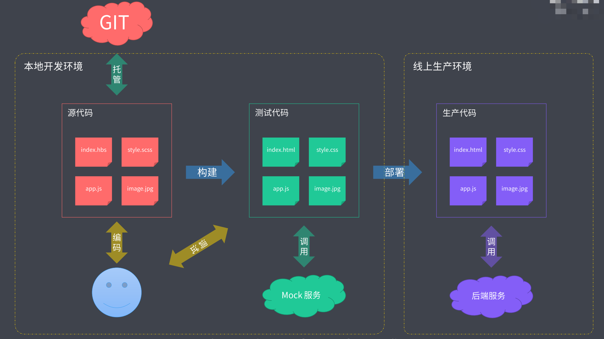
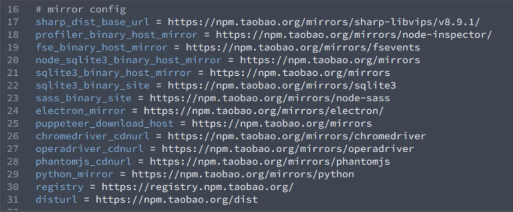
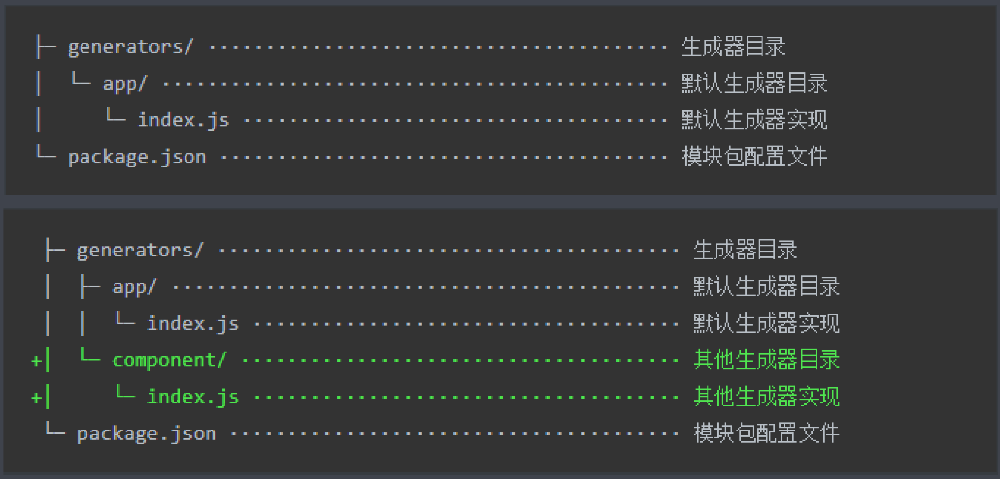

# 概述

> 前端工程化是指遵循一定标准和规范，通过工具提高效率、降低成本的一种手段

## 产生的原因

> 当今前端功能不断提高，业务逻辑日益复杂

**前端工程化主要解决的问题**

- 传统语言或语法的弊端
- 无法使用模块化\组件化
- 重复的机械式工作
- 代码风格统一、质量保证
- 依赖后端服务接口支持
- 整体依赖后端项目
- ...


## 工程化的表现

> 一切以提高效率、降低成本、质量保证为目的的手段都属于“工程化”


## 工程化！= 某个工具

现阶段有一些工具十分强大，比如webpack。这让很多人误认为工程化就是指webpack，只要用了webpack就代表有了工程化。其实不是这样的，工具并不是工程化的核心。工程化的核心应该是项目的整体规划或者是架构，工具只是帮助我们实现这种规划或架构的一种手段。




**一些成熟的工程化集成**

- create-react-app
- vue-cli
- angular-cli
- gatsby-cli


# 脚手架工具

脚手架的本质作用就是创建项目基础结构、提供项目规范和约定。

通常我们在开发享用类型的项目都会有一些相同的约定和规范，包括了：

- 相同的组织结构
- 相同的开发范式
- 相同的模块依赖
- 相同的工具配置
- 相同的基础代码

可以通过脚手架工具快速搭建特定类型的项目骨架，然后基于骨架进行开发


## 常用的脚手架工具

根据信息创建对应的项目基础结构

```tex
React项目：create-react-app
Vue项目：vue-cli
Angular：angular-cli
```

根据一套模板生成一个对应的项目结构，比较灵活、易扩展

```ts
通用型项目脚手架工具：Yeoman
```

在项目开发过程中用于创建一些特定类型的文件

```ts
Plop
```

### [Yeoman](https://yeoman.io/)

> yeoman 需要搭配特定的 generator 使用

**安装：** `npm install -g yo` | `yarn global add yo`

**生成一个nodemodule的项目**

1. 安装对应的 **generator** `generator-node`

   ```bash
   npm install -g generator-node
   ```

2. 创建项目文件夹并进入

   ```bash
   mkdir product
   cd product
   ```

3. 运行**generator**

   ```bash
   yo node
   ```

**在已有的项目之上创建一些特定类型的文件**

运行 **sub Generator**

```bash
yo node:cli
```

📢 并不是每一个 generator 都提供子级的生成器，使用的时候需要查看官方文档明确当前 generator 是否提供子级生成器

📚 **总结 Yeoman 常规使用步骤**

1. 明确需求
2. [找到合适的 Generator](https://yeoman.io/generators/)
3. 全局范围安装找到的 Generator
4. 通过 yo 运行对应的 Generator
5. 通过命令行交互填写选项
6. 生成所需要的项目结构




#### 自定义 Generator

通过以上内容的了解，我们知道不同的Generator 可以用来生成不同的项目，我们可以创建自己的Generator来生成自定义的项目结构。

<h5 style="color: orange">创建 Generator 模块</h5>

> Generator 本质上就是一个 NPM 模块。

**Generator拥有特定的结构**: 需要在根目录下有一个 generators 的文件夹，再下一级有一个app的文件夹用来存放生成器的代码，如果需要提供多个server generator ，可以在app 同级目录下添加一个新的生成器目录

**Yeoman 的 Generator 的模块名称必须是 `generator-<name>` 的格式**，如果没有采用对应格式的名称，Yeoman 在后续工作中无法找到当前生成器模块



🌰 实例演示

```bash
mkdir generator-sample
cd generator-sample
yarn init
# yeoman-generator 提供了生成器的基类，提供了一些工具函数，让我们在创建生成器的时候更加便捷
yarn add yeoman-generator
# 创建相应的结构
# ...
# 书写 app/index 文件
# ...
# 将模块链接到全局
yarn link

# 创建一个新的文件夹用来测试
mkdir prd
cd prd
# 测试: 在当前目录下创建了文件
yo sample
```

```js
// app/index 文件内容
// 此文件作为 Generator 的核心入口
// 需要导出一个继承自 Yeoman Generator 的类型
// Yeoman Generator 在工作时会自动调用我们在此类型中定义的一些生命周期方法
// 我们在这些方法中可以通过调用父类提供的一些工具方法实现一些功能，例如文件写入

const Generator = require('yeoman-generator')

module.exports = class extends Generator {
  writing () {
    // Yeoman 自动在生成文件阶段调用此方法
    // 我们这里尝试往项目目录中写入文件
    this.fs.write(
      this.destinationPath('temp.txt'), // 写入文件的绝对路径
      Math.random().toString() // 写入文件的内容
    )
  }
}
```

在很多情况下，我们需要自动创建的文件有很多，这个时候我们就可以通过模板创建文件

<h5 style="color: orange">根据模板创建文件</h5>

在app文件夹下创建templates目录，将需要生成的文件都放入当前文件夹下。**模板中遵循 ejs 的语法**

```js
// app/index 文件内容
const Generator = require('yeoman-generator')

module.exports = class extends Generator {
  writing () {
    // 通过模板方式写入文件到目标目录
    // 模板文件路径
    const tmpl = this.templatePath('foo.txt')
    // 输出目标路径
    const output = this.destinationPath('foo.txt')
    // 模板数据上下文
    const context = { title: 'Hello zce~', success: false }
    this.fs.copyTpl(tmpl, output, context)
  }
}
```

之后在测试文件夹中运行 `yo sample` 命令即可测试当前输出

<h5 style="color: orange">接收用户输入数据</h5>

对于模板中的一些动态数据（例如项目的标题、名称）一般通过命令行的方式询问使用者从而获取。它的实现基于  Generator 的 prompting 方法

```js
// app/index 文件内容
const Generator = require('yeoman-generator')

module.exports = class extends Generator {
  prompting () {
    // Yeoman 在询问用户环节会自动调用此方法
    // 在此方法中可以调用父类的 prompt() 方法发出对用户的命令行询问
    return this.prompt([
      {
        type: 'input',
        name: 'name',
        message: 'Your project name',
        default: this.appname // appname 为项目生成目录名称
      }
    ])
    .then(answers => {
      // answers => { name: 'user input value' }
      this.answers = answers
    })
  }
  writing () {
    // 模板文件路径
    const tmpl = this.templatePath('bar.html')
    // 输出目标路径
    const output = this.destinationPath('bar.html')
    // 模板数据上下文
    const context = this.answers

    this.fs.copyTpl(tmpl, output, context)
  }
}
```


<h3 style="color: red"> Vue Generator 实例</h3>

1. 通过原始的方法创建理想的项目结构，将需要重复使用的基础代码全部包含在里面
2. 封装Generator

```bash
# 1. 创建一个全新的文件
mkdir generator-vue
cd generator-vue
# 2. 创建 package.json
yarn init
# 3. 安装yeoman的依赖
yarn add yeoman-generator
# 4. 打开文件夹并创建主入口文件
generators/app/index.js
# 5. 创建templates文件夹并将需要重复使用的文件全部copy到里面
# 6. 将文件中需要发生变化的地方通过模板引擎的语法进行挖坑
<%= name %>
# 7. 书写 generators/app/index.js
# 8. 将当前模块link 到全局
yarn link
# 9. 在全新的目录下运行命令
yo vue
```

📢注意：如果遇到template 文件中含有ejs 语法的内容需要完整输出，在后面添加%即可。例： `<%%= BASE_URL %>`

```js
// generators/app/index.js
const Generator = require('yeoman-generator')

module.exports = class extends Generator {
  prompting () {
    return this.prompt([
      {
        type: 'input',
        name: 'name',
        message: 'Your project name',
        default: this.appname
      }
    ])
    .then(answers => {
      this.answers = answers
    })
  }

  writing () {
    // 把每一个文件都通过模板转换到目标路径

    const templates = [
      '.browserslistrc',
      '.editorconfig',
      '.env.development',
      '.env.production',
      '.eslintrc.js',
      '.gitignore',
      'babel.config.js',
      'package.json',
      'postcss.config.js',
      'README.md',
      'public/favicon.ico',
      'public/index.html',
      'src/App.vue',
      'src/main.js',
      'src/router.js',
      'src/assets/logo.png',
      'src/components/HelloWorld.vue',
      'src/store/actions.js',
      'src/store/getters.js',
      'src/store/index.js',
      'src/store/mutations.js',
      'src/store/state.js',
      'src/utils/request.js',
      'src/views/About.vue',
      'src/views/Home.vue'
    ]

    templates.forEach(item => {
      // item => 每个文件路径
      this.fs.copyTpl(
        this.templatePath(item),
        this.destinationPath(item),
        this.answers
      )
    })
  }
}
```

<h5 style="color: orange">发布 Generator</h5>

1. 创建git 仓库并提交
2. 发布： `yarn publish --registry=https//registry.yarnpkg.com`
3. 在npm 官网就可以找到开发的模块啦~
4. 如果需要自己的generator 在官方的仓库列表中出现的话，在项目中添加一个 yeoman-generator 的关键词，yeoman 官方就会发现到当前项目


### Plop

> 小而美的脚手架工具

主要用于创建项目中特定类型文件的小工具。有点类似Yeoman 中的 sub Generator。一般不会独立使用，会将其集成于项目中，用来自动化创建同类型的项目文件

**1. 安装 plop**

```bash
yarn add plop --dev
```

**2. 在项目根目录下创建文件** `plopfile.js`

```js
// Plop 入口文件，需要导出一个函数
// 此函数接收一个 plop 对象，用于创建生成器任务

module.exports = plop => {
  // 第一个参数是生成器的名字，第二个是生成器的配置选项
  plop.setGenerator('component', {
    description: 'create a component', // 生成器的描述
    prompts: [ // 交互
      {
        type: 'input',
        name: 'name',
        message: 'component name',
        default: 'MyComponent' // 默认答案
      }
    ],
    actions: [ // 命令行交互之后执行的动作
      {
        type: 'add', // 代表添加文件
        path: 'src/components/{{name}}/{{name}}.js',
        templateFile: 'plop-templates/component.hbs'
      },
      {
        type: 'add', // 代表添加文件
        path: 'src/components/{{name}}/{{name}}.css',
        templateFile: 'plop-templates/component.css.hbs'
      },
      {
        type: 'add', // 代表添加文件
        path: 'src/components/{{name}}/{{name}}.test.js',
        templateFile: 'plop-templates/component.test.hbs'
      }
    ]
  })
}
```

**3. 使用命令行操作**

```bash
# yarn plop <生成器的名字>
yarn plop component
```

📚 总结一夏

- 将 plop 模块作为项目开发依赖安装
- 在项目根目录下创建一个 plopfile.js 文件
- 在 plopfile.js 文件中定义脚手架任务
- 编写用于生成特定类型文件的模板
- 通过 Plop 提供的 cli 运行脚手架任务

## 脚手架的工作原理

> 脚手架工具实际上就是一个 node cli 应用

大部分的脚手架都是启动过后会询问一些特定的问题，然后将回答的内容结合模板文件生成一个项目的结构。

接下来我们通过Node.js 来开发一个小型脚手架工具：

**1. 创建自定义文件夹**

```bash
mkdir scaffolding-sample
cd scaffolding-sample
```

**2. 初始化 package.json**

```bash
yarn init
```

**3. 指定 cli 入口文件**

```bash
# 1. 修改 package.json 添加 bin 字段
{
	...
	"bin": "cli.js",
	...
}

# 2. 创建 cli.js
```

```js
#!/usr/bin/env node

// Node CLI 应用入口文件必须要有这样的文件头
// 如果是 Linux 或者 macOS 系统下还需要修改此文件的读写权限为 755
// 具体就是通过 chmod 755 cli.js 实现修改
console.log("cli working")
```

```bash
# test
# 1. 将模块link 到全局
yarn link
# 2. 使用命令进行测试
scaffolding-sample
# 输出"cli working"说明文件正常执行
```

**4. 实现脚手架具体业务**

脚手架的工作过程：

1. 通过命令行交互询问用户问题

2. 根据用户回答的结果生成文件

```bash
# 安装必要依赖
yarn add inquirer ejs
# 创建模板文件 templates/...
```

```JS
#!/usr/bin/env node

const fs = require('fs')
const path = require('path')
const inquirer = require('inquirer')
const ejs = require('ejs')

inquirer.prompt([
  {
    type: 'input',
    name: 'name',
    message: 'Project name?'
  }
])
.then(anwsers => {
  // console.log(anwsers)
  // 根据用户回答的结果生成文件

  // 模板目录
  const tmplDir = path.join(__dirname, 'templates')
  // 目标目录
  const destDir = process.cwd()

  // 将模板下的文件全部转换到目标目录
  fs.readdir(tmplDir, (err, files) => {
    if (err) throw err
    files.forEach(file => {
      // 通过模板引擎渲染文件
      ejs.renderFile(path.join(tmplDir, file), anwsers, (err, result) => {
        if (err) throw err

        // 将结果写入目标文件路径
        fs.writeFileSync(path.join(destDir, file), result)
      })
    })
  })
})
```

**5. 运行测试**

1. 进入测试文件夹
2. 运行命令 `scaffolding-sample`