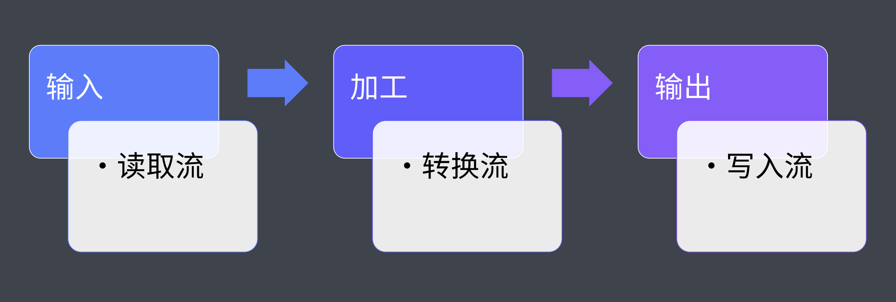

# 概述

**自动化构建**就是指将开发代码自动转化成为生产环境可以运行的代码或程序。一般我们将这样的过程称为“**自动化构建工作流**”。

**作用**：让开发人员尽可能脱离运行环境兼容所带来的的问题，在开发阶段使用提高效率的语法、规范和标准。通过自动化构建工具，可以构建转换浏览器不被支持的特性，比如ES最新标准、SCSS 等


# 自动化体验

> 说明：先通过CSS进行样式的书写，我们希望能够通过 SCSS 进行对 CSS 增强。通过在开发时添加一个构建的环节，将 SCSS 构建为 CSS 即可。

**1. 建立个人测试项目**

```tex
|-scss
	|- main.scss
|-index.html
|-package.json
```

**2. 转换开发阶段SCSS**

> 浏览器不支持 SCSS 语法，所以需要通过工具将其进行转化

```bash
# 安装相应依赖
yarn add sass --dev
# 运行工具指令
.\node_modules\.bin\sass scss/main.scss css/style.css
```

以上命令太过复杂，通过 NPM Scripts 将其优化一下：

> scripts 可以自动发现 node_modules 里面的命令

```json
// 修改 package.json
{
  "scripts": {
    "build": "sass scss/main.scss css/style.css",
    "serve": "browser-sync .",
  },
}
```

```bash
# browser-sync 用来启动测试服务器
yarn add browser-sync --dev
```

以上，运行 `yarn serve` 命令后，就会自动启动一个web服务器并且唤起浏览器

**3. 优化相应指令**

**3.1 在页面启动之前生成CSS文件**

使用  NPM Scripts 的钩子机制，添加 `preserve` 命令。 `preserve` 会在 serve 执行之前进行执行。

```json
{
  "scripts": {
    "build": "sass scss/main.scss css/style.css",
    "preserve": "yarn build",
    "serve": "browser-sync .",
  },
}
```

运行 `yarn serve` 命令后，就能得到想要的效果了

**3.2 SCSS文件修改后自动编译代码**

```bash
# 安装所需依赖
yarn add npm-run-all --dev
```

```json
// 添加 start 命令：同时执行多个命令
// --files 可以让浏览器启动后监听文件的相应变化做出响应
{
  "scripts": {
    "build": "sass scss/main.scss css/style.css --watch",
    "serve": "browser-sync . --files \"css/*.css\"",
    "start": "run-p build serve"
  },
}
```


# 常用的自动化构建工具

- Grunt
  插件生态完善
  构建速度相对较慢，基于临时文件进行磁盘读写操作
- Gulp
  相对Grunt构建速度较快，基于内存进行操作
  支持同时执行多任务
- FIS
  大而全

## Grunt

### 基本使用

```bash
# 初始化 package.json
yarn init --y
# 安装相应依赖
yarn add grunt
# 创建grunt入口文件
code gruntfile.js
# 书写 gruntfile.js
# 运行相应命令 yarn grunt <task name>
yarn grunt foo
```

```js
// gruntfile.js
// Grunt 的入口文件
// 用于定义一些需要 Grunt 自动执行的任务
// 需要导出一个函数
// 此函数接收一个 grunt 的对象类型的形参
// grunt 对象中提供一些创建任务时会用到的 API

module.exports = (grunt) => {
  /**
   * 注册任务
   * 任务的名字
   * 任务的描述 | 任务的函数 通过 yarn grunt --help 在 Available tasks 中可以看到
   */
  grunt.registerTask("foo", "a sample task", () => {
    console.log("hello grunt");
  });

  grunt.registerTask("bar", () => {
    console.log("other task");
  });

  // // default 是默认任务名称
  // // 通过 grunt 执行时可以省略
  // grunt.registerTask('default', () => {
  //   console.log('default task')
  // })

  // 第二个参数可以指定此任务的映射任务，
  // 这样执行 default 就相当于执行对应的任务
  // 这里映射的任务会按顺序依次执行，不会同步执行
  grunt.registerTask("default", ["foo", "bar"]);

  // 也可以在任务函数中执行其他任务
  grunt.registerTask("run-other", () => {
    // foo 和 bar 会在当前任务执行完成过后自动依次执行
    grunt.task.run("foo", "bar");
    console.log("current task runing~");
  });

  // 默认 grunt 采用同步模式编码
  // 如果需要异步可以使用 this.async() 方法创建回调函数
  // grunt.registerTask('async-task', () => {
  //   setTimeout(() => {
  //     console.log('async task working~')
  //   }, 1000)
  // })

  // 由于函数体中需要使用 this，所以这里不能使用箭头函数
  grunt.registerTask("async-task", function () {
    const done = this.async();
    setTimeout(() => {
      console.log("async task working~");
      done();
    }, 1000);
  });
};
```

### 标记任务失败

- 可以在函数体中`return false` 进行实现
- 如果当前任务是在任务列表中的话，会导致后续任务不再继续执行
- 异步函数中标记当前任务执行失败的方式: 为回调函数指定一个 false 的实参

```js
// gruntfile.js
module.exports = grunt => {
  // 任务函数执行过程中如果返回 false
  // 则意味着此任务执行失败
  grunt.registerTask('bad', () => {
    console.log('bad working~')
    return false
  })

  grunt.registerTask('foo', () => {
    console.log('foo working~')
  })

  grunt.registerTask('bar', () => {
    console.log('bar working~')
  })

  // 如果一个任务列表中的某个任务执行失败
  // 则后续任务默认不会运行
  // 除非 grunt 运行时指定 --force 参数强制执行
  grunt.registerTask('default', ['foo', 'bad', 'bar'])

  // 异步函数中标记当前任务执行失败的方式是为回调函数指定一个 false 的实参
  grunt.registerTask('bad-async', function () {
    const done = this.async()
    setTimeout(() => {
      console.log('async task working~')
      done(false)
    }, 1000)
  })
}
```

### 配置选项方法

> grunt.initConfig()

```js
// gruntfile.js
module.exports = grunt => {
  // grunt.initConfig() 用于为任务添加一些配置选项
  grunt.initConfig({
    // 键一般对应任务的名称
    // 值可以是任意类型的数据
    foo: {
      bar: 'baz'
    }
  })

  grunt.registerTask('foo', () => {
    // 任务中可以使用 grunt.config() 获取配置
    console.log(grunt.config('foo'))
    // 如果属性值是对象的话，config 中可以使用点的方式定位对象中属性的值
    console.log(grunt.config('foo.bar'))
  })
}
```

### 多目标任务

如果想要运行指定的目标，如下示例可以使用 `yarn grunt build:foo`
在 build 中指定的每一个键都会成为一个目标，除了options。在 options 中指定的信息会作为任务的配置选项出现
子目标任务的配置选项会覆盖目标任务的配置选项

```js
// gruntfile.js
module.exports = grunt => {
  // 多目标模式，可以让任务根据配置形成多个子任务

  // grunt.initConfig({
  //   build: {
  //     foo: 100,
  //     bar: '456'
  //   }
  // })

  // grunt.registerMultiTask('build', function () {
  //   console.log(`task: build, target: ${this.target}, data: ${this.data}`)
  // })

  grunt.initConfig({
    build: {
      options: {
        msg: 'task options'
      },
      foo: {
        options: {
          msg: 'foo target options'
        }
      },
      bar: '456'
    }
  })

  grunt.registerMultiTask('build', function () {
    console.log(this.options()) // 可以获取到相应的配置选项
  })
}
```

### 插件

插件机制是 Grunt 的核心。插件内部封装了很多通用的构建任务，一般我们的构建过程都是由这些通用的构建任务组成的。

**插件的使用步骤：**

1. 通过 npm 安装相应插件
2. 在 gruntfile 中载入插件提供的任务
3. 通过插件的文档配置好需要的配置选项

**🌰 栗子**

```bash
# 1. 安装插件
yarn add grunt-contrib-clean
```

```js
// 2. 载入插件
module.exports = grunt => {
  // 3. 配置选项
  grunt.initConfig({
    clean: {
      temp: 'temp/**' // 可以指定文件 temp/read.txt、或者通配某类型文件 temp/*.txt
    }
  })
  
  grunt.loadNpmTasks('grunt-contrib-clean')
}
```

#### 常用插件

##### grunt-sass

**安装**

```bash
yarn add grunt-sass sass --dev
```

```js
const sass = require('sass')
const loadGruntTasks = require('load-grunt-tasks')

module.exports = grunt => {
  grunt.initConfig({
    sass: {
      options: {
        sourceMap: true,
        implementation: sass
      },
      main: {
        files: {
          // 输出的路径: 原路径
          'dist/css/main.css': 'src/scss/main.scss'
        }
      }
    }
  })

  grunt.loadNpmTasks('grunt-sass')
}
```

##### grunt-babel

**安装** `yarn add grunt-babel @babel/core @babel/preset-env --dev`

```bash
yarn add load-grunt-tasks --dev
```

```js
const sass = require('sass')
const loadGruntTasks = require('load-grunt-tasks')

module.exports = grunt => {
  grunt.initConfig({
    ...
    babel: {
      options: {
        sourceMap: true,
        presets: ['@babel/preset-env']
      },
      main: {
        files: {
          'dist/js/app.js': 'src/js/app.js'
        }
      }
    }
  })
  loadGruntTasks(grunt) // 自动加载所有的 grunt 插件中的任务
}
```

##### grunt-contrib-watch

```bash
yarn add grunt-contrib-watch --dev
```

```js
const sass = require('sass')
const loadGruntTasks = require('load-grunt-tasks')

module.exports = grunt => {
  grunt.initConfig({
    ...
    watch: {
      js: {
        files: ['src/js/*.js'],
        tasks: ['babel']
      },
      css: {
        files: ['src/scss/*.scss'],
        tasks: ['sass']
      }
    }
  })

  loadGruntTasks(grunt) // 自动加载所有的 grunt 插件中的任务

  grunt.registerTask('default', ['sass', 'babel', 'watch'])
}
```


## Gulp

### 基本使用

```bash
# 初始化 package.json
yarn init --y
# 安装相应依赖
yarn add gulp --dev
# 创建gulp入口文件
code gulpfile.js
# 书写 gulpfile.js
# 运行相应命令 yarn gulp <task name>
yarn gulp foo
```

```js
// 导出的函数都会作为 gulp 任务
// gulp 的任务函数都是异步的
// 可以通过调用回调函数标识任务完成
exports.foo = done => {
  console.log('foo task working~')
  done() // 标识任务执行完成
}

// default 是默认任务
// 在运行是可以省略任务名参数
exports.default = done => {
  console.log('default task working~')
  done()
}

// -----
// v4.0 之前需要通过 gulp.task() 方法注册任务
const gulp = require('gulp')

gulp.task('bar', done => {
  console.log('bar task working~')
  done()
})
```

### 创建组合任务

```js
const { series, parallel } = require('gulp')

const task1 = done => {
  setTimeout(() => {
    console.log('task1 working~')
    done()
  }, 1000)
}

const task2 = done => {
  setTimeout(() => {
    console.log('task2 working~')
    done()
  }, 1000)  
}

const task3 = done => {
  setTimeout(() => {
    console.log('task3 working~')
    done()
  }, 1000)  
}

// 让多个任务按照顺序依次执行
exports.foo = series(task1, task2, task3)

// 让多个任务同时执行
exports.bar = parallel(task1, task2, task3)
```

### 异步任务

```js
const fs = require('fs')

exports.callback = done => {
  console.log('callback task')
  done()
}

exports.callback_error = done => {
  console.log('callback task')
  done(new Error('task failed'))
}

exports.promise = () => {
  console.log('promise task')
  return Promise.resolve()
}

exports.promise_error = () => {
  console.log('promise task')
  return Promise.reject(new Error('task failed'))
}

const timeout = time => {
  return new Promise(resolve => {
    setTimeout(resolve, time)
  })
}

exports.async = async () => {
  await timeout(1000)
  console.log('async task')
}

exports.stream = () => {
  const read = fs.createReadStream('yarn.lock')
  const write = fs.createWriteStream('a.txt')
  read.pipe(write)
  return read
}

// exports.stream = done => {
//   const read = fs.createReadStream('yarn.lock')
//   const write = fs.createWriteStream('a.txt')
//   read.pipe(write)
//   read.on('end', () => {
//     done()
//   })
// }
```

### 构建过程核心工作原理

```js
const fs = require('fs')
const { Transform } = require('stream')

exports.default = () => {
  // 文件读取流
  const readStream = fs.createReadStream('normalize.css')

  // 文件写入流
  const writeStream = fs.createWriteStream('normalize.min.css')

  // 文件转换流
  const transformStream = new Transform({
    // 核心转换过程
    transform: (chunk, encoding, callback) => {
      const input = chunk.toString()
      const output = input.replace(/\s+/g, '').replace(/\/\*.+?\*\//g, '')
      callback(null, output)
    }
  })

  return readStream
    .pipe(transformStream) // 转换
    .pipe(writeStream) // 写入
}
```



### 文件操作API + 插件的使用
