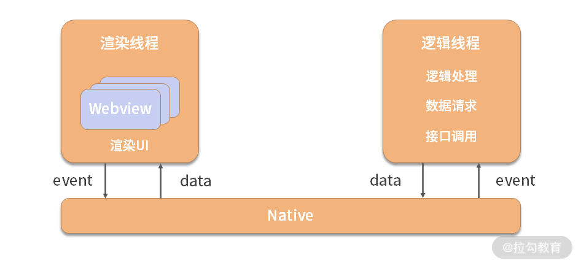

# 小程序原理

## 双线程模型

<h4>小程序主要技术需求：</h4>

- 限制 UI 组件类型，只允许声明指定的几个组件
  小程序在声明组件时并不是使用原生的 HTML 标签，而是只能够通过微信提供的几种内置基础组件，当然你也可以自定义组件，但也是通过对内置基础组件的组合来实现。

- 保证逻辑线程安全，不允许直接操作 UI 组件
  小程序更新 UI 的方式与 Vue/React 等 MVVM 框架类似，JavaScript 代码不能直接操作 DOM，而是通过更新状态（ setState ）的方式异步更新 UI ，这个过程中会用到 VDOM 和高效的 diff 算法。

- 能够在线更新，不依赖微信
  小程序的宿主是微信，如果使用纯 Native 实现，那么小程序的版本更新必须依赖微信，跟微信的代码一起发版，这样肯定是不行的。如果是纯 Web 实现，安全和性能就很难得到保障。
  小程序需要既能够像 Web 一样将资源托管在云端，更新独立；同时又能够保证足够好的安全性和性能。所以最终小程序采用了 Hybrid-混合的架构模式：**使用 Webview 渲染 UI、使用类似Web Worker 的独立线程运行逻辑，这就是双线程模型**。

- 性能需尽量提升，保证用户体验
  基于 Web Worker 的简易双线程模型性能是很大的问题，小程序的双线程模型并不是使用 Web Worker 子线程，而是一个独立的“主线程”，这样能够保证相对较好的性能。

<h4>渲染线程和逻辑线程</h4>

小程序的双线程指的就是渲染线程和逻辑线程，这两个线程分别承担UI的渲染和执行 JavaScript 代码的工作。如下图所示：



渲染线程使用 Webview 进行 UI 的渲染呈现。Webview 是一个完整的类浏览器运行环境，本身具备运行 JavaScript 的能力，但是小程序并不是将逻辑脚本放到 Webview 中运行，而是将逻辑层独立为一个与 Webview 平行的线程，使用客户端提供的 JavaScript 引擎运行代码，iOS 的JavaScriptCore、安卓是腾讯 X5 内核提供的 JsCore 环境以及 IDE 工具的 nwjs 。

并且逻辑线程是一个只能够运行 JavaScript 的沙箱环境，不提供 DOM 操作相关的 API，所以不能直接操作 UI，只能够通过 setData 更新数据的方式异步更新 UI。

<h4>事件驱动的通信方式</h4>

注意上图渲染线程和逻辑线程之间的通信方式，与 Vue/React 不同的是，小程序的渲染层与逻辑层之间的通信并不是在两者之间直接传递数据或事件，而是由 Native 作为中间媒介进行转发。

整个过程是典型的事件驱动模式：

- 渲染层（也可以称为视图层）通过与用户的交互触发特定的事件 event；

- 然后 event 被传递给逻辑层；

- 逻辑层继而通过一系列的逻辑处理、数据请求、接口调用等行为将加工好的数据 data 传递给渲染层；

- 最后渲染层将 data 渲染为可视化的 UI。

这种数据驱动 UI 的模式是近几年前端编程领域较为推崇的编程范式。这样逻辑与渲染分离的线程分工模式一方面能够保证运行在逻辑线程沙箱内的 JavaScript 代码是线程安全的，另一方面由于渲染线程的计算量非常小从而保证了对用户交互行为的快速响应，提高了用户体验。

总的来说，跟浏览器的线程模型相比，小程序的双线程模型解决了或者说规避了 Web Worker 堪忧的性能同时又实现了与 Web Worker 相同的线程安全，从性能和安全两个角度实现了提升。可以概括地说，双线程模式是受限于浏览器现有的进程和线程管理模式之下，在小程序这一具体场景之内的一种改进的架构方案。

## 授权模型： 小程序的用户体系与 OAuth 规范

> 登录认证是一个完整应用必备的模块，除非你的应用程序不需要任何与用户相关的功能（比如hao123 这种静态导航网站一般不会涉及用户体系）。

小程序和微信是一种类似应用与平台的关系，小程序属于微信公众平台，同一个平台下还有微信公众号：

- 在技术角度上，小程序与微信的关系比公众号更密切，因为公众号的文章本质上是一个 H5 网页，对微信底层的依赖比小程序弱；
- 从产品角度上，二者与微信的关系一致，都是运行在微信平台上的第三方应用。

既然小程序是微信平台的第三方应用，那么在接入微信登录时就要严格遵守官方的接入规范。而在互联网技术领域，对于支持第三方应用接入的平台，在登录授权上有一套标准的技术规范：OAuth 2.0。

### 搭建微信小程序的登录流程

#### 1.小程序使用微信登录的优势

小程序是微信平台上的一款第三方应用，在登录方式的选择上有很高的自由度，微信登录仅仅是其中一个选择，你完全可以使用跟其他应用（网站、App）一样的登录方式，比如手机号、邮箱、用户名密码等。

事实上，对于很多公司来说，微信小程序仅仅是其产品矩阵中的一个应用端，同时存在的还有网站、App 等应用端。

**从生态系统的角度上，** 相对于其他应用端，以微信为入口的小程序最大的优势是拥有微信完善的生态系统，用户使用微信登录后可以使用微信提供给小程序的各种平台级能力，比如订阅消息、微信支付等。

**从用户体验的角度上，** 用户能够很大程度上降低登录的复杂程度。想象一下，对比在小程序内用用户名密码登录和一键微信登录，哪种方式更容易被用户接受呢？结果不言而喻。

**从产品策略的角度上，** 使用微信登录小程序能够根据用户的来源，制定特殊的产品策略，比如对于小程序的用户发放专属的优惠券。

所以，由此得出小程序使用微信登录的三个主要优势：

- 融入微信生态；
- 提高用户体验；
- 制定产品策略。

下面这张图清晰地描绘了微信小程序完整的登录流程、角色以及相关术语。


整个登录流程中描述了三种角色和六个术语，**了解它们的定位和作用，是理解小程序登录流程的基础。**


#### 2.登录流程里的三个角色

客户端在整个登录流程中主要承担两种行为：

- 作为整个流程的发起者，获取临时登录凭证 code；
- 作为整个流程的终结者，存储登录态令牌 token。

不过客户端的所有信息和网络请求几乎都是可以被破解或拦截的，所以出于安全的考虑，小程序登录流程中的一些接口被限制不能在客户端中直接调用，而是需要在服务端发起，开发者服务的工作便是处理这些安全敏感的网络请求，体现为上图中使用code 获取 openid 和 session_key的请求，这个请求使用了微信提供的 auth.code2Session 接口。

而微信接口服务的工作对于开发者来说是不透明的，你需要做的仅仅是根据接口的规范，组装网络请求发送给它，然后根据返回的接口执行分发逻辑。微信服务器会验证网络请求的合法性，对于合法请求下发密钥 session_key 和用户 openid。

#### 3.登录流程的六个术语

- **code**

它是在客户端（即小程序）内通过 wx.login API 获取的，然后通过 HTTP 请求发送给开发者服务器。code 的作用体现在“临时”两字上，它的有效期限仅有 5 分钟，并且仅能够使用一次（即请求一次 auth.code2Session 接口）。

- **appid**

每个微信小程序在创建之后（即在微信公众平台注册并初始化完成）便同时生成了一appid，这个 ID 标记了小程序的唯一性，等同于网站的URL（经过备案的）、App 的包名等标记应用唯一性的信息。

- **appsecret**

它是小程序的密钥，可以在微信公众平台的后台管理系统中获取。appsecret　是非常私密的信息，所以微信在制定小程序登录的流程时，将携带此信息的网络请求限制在只能通过开发者服务器发送给微信接口服务，这样对于客户端来说是不可见的，进而降低了被泄露的可能性。与appid 不同的是，appsecret 可以被重置，但每次重置之后，历史的 appsecret 便会失效，所以请谨慎操作。

- **openid**

**这里你要注意，很多开发者容易走入一个误区：**误将 openid 理解为用户的唯一 ID。这句话如果放在某个小程序的特定语境下是没有问题的，但是如果放在微信生态的全局角度上是错误的。为什么呢？

微信对于用户 openid 的定义是：微信号在某个应用程序中的唯一 ID。这里的“某个应用程序”指的是小程序、公众号、接入开放平台的应用。微信生态中目前有公众平台和开放平台两种，其中公众平台又细分为小程序和公众号，开放平台可以接入网站、移动应用等。同一个微信号在不同的应用程序中有不同的 openid。

在微信生态下另外有一个标记微信号的唯一 ID：UnionId。这个 ID 跟应用程序无关。所以，可以简单地理解为 UnionId 与 appid 综合加密后的结果，见下图：


UnionId 通常用来关联在不同应用程序中各个 openid ，比如同一个微信号在小程序和公众号内需要配置同样的权限，仅通过 openid 无法实现，便需要获取此微信号的 UnionId。

- **session_key**

session_key 是对用户数据进行加密签名的密钥，微信服务器使用它将用户的数据进行加密和解密。你可以简单地将 session_key 理解为获取用户数据的“绿卡”，登录之后所有涉及访问微信服务器的请求一般都需要带上它，微信服务器会校验 session_key 的合法性。

其实到这一步（即拿到了 openid 和 session_key）已经完成了小程序的登录流程，但对于一个应用程序来说，用户进行登录操作应该是“一劳永逸”的，即登录过一次之后在一定时间之内的后续操作都不需要再次登录，用技术语言描述就是应该保存用户的登录态。这个时候就需要用到接下来的一个术语：token。

- **token**

登录态是个逻辑词汇，token 可以理解为登录态的具象化、数据化。在小程序的登录流程图中，可以看出，token是由开发者服务器创建的一个字符串，而且需要跟 openid 和 session_key 相关联。其实这里并不是强制关联 openid，因为 openid 并不算是私密信息，可以放心地下发到客户端（即小程序）。但是 session_key 是非常私密的信息，一旦泄露有很大的安全隐患，**所以强烈建议不要把它下发到客户端。**

在获取到 openid 和 session_key 之后，开发者服务器创建一个 token，然后与 openid 和session_key 进行关联，具体的方法根据服务器编程语言的不同有多种实现方案。咱们以JavaScript 语言作为示例，可以创建一个对象，对象的 key 是 token 的值，value 是一个包含 openid 和 session_key 的对象，如下：

```js
{
    "token_1": {
        "openid": "获取到的openid 1",
        "session_key": "获取到的session_key 1"
    }，
    "token_2": {
        "openid": "获取到的openid 2",
        "session_key": "获取到的session_key 2"
    }，
}
```

关联完成之后开发者服务器将 token下发到客户端，客户端保存在本地，后续的所有请求均需要携带此 token，携带的方法并没有既定的规范，可以通过 URL Query、HTTP Body、Header 等，但通常建议通过 Header 传递，这样相对来说更安全一些。

### OAuth 2.0 规范

#### 1.OAuth 2.0 规范中的角色划分

咱们先思考一个问题：小程序登录之后如果需要访问用户的数据（比如昵称、地域、性别等）需要得到谁的授权？是微信？还是用户？

答案是用户。用户的数据虽然存放在微信的服务器之上，但是这些数据的所有权属于用户自己，而不是微信。这里其实引出了 OAuth 2.0 规范中的两个基本概念。

- Resource Owner：资源所有者，即用户；
- Resource Server：资源服务器，即微信。

而小程序在获取用户数据中的角色是作为微信平台的第三方应用程序，在 OAuth 2.0 规范中的术语为 Third-party application。

除了以上三种角色之外，OAuth 2.0规范中还有另外三种角色：

- 小程序依托于微信提供的底层技术平台（即双线程模型），微信为小程序提供了与用户（即Resource Owner）沟通的工具，它在 OAuth 2.0 规范中的角色被称为 User Agent（用户代理）。
- 微信服务器不仅仅作为 Resource Server 保存用户数据，同时在登录授权过程中又提供了HTTP服务以及授权认证功能，这两个功能的角色在 OAuth 2.0 规范中分别被称为 HTTP Service（HTTP服务提供商）和Authorization server（认证服务器）。

以上便是 OAuth 2.0 规范中的所有角色，为了加强了解，我们再梳理一遍：

- Resource Owner（资源所有者）：在小程序场景下代表小程序的用户。
- Resource Server（资源服务器，即存放用户数据、资源的服务器）：在小程序场景下这个角色由微信服务器承担。
- Third-party application（第三方应用程序/又称客户端）：在小程序场景下代表小程序。
- User Agent（用户代理）：在小程序场景下代表微信。
- Authorization server（认证服务器）：在小程序场景下，这个角色由微信服务器承担。
- HTTP Service（HTTP 服务提供商）：在小程序场景下，这个角色由微信服务器承担。

**为什么 OAuth 2.0 规范中的角色与小程序登录流程中角色不一样？**

其实，小程序登录流程中的三个角色是按照实体划分的，而 OAuth 2.0 规范的角色是按照功能划分的，同一个实体可以担任一种或多种功能。

在小程序登录流程中的 3 个实体角色中，微信服务器同时担任 Resource Server、Authorization server 和HTTP Service 的功能；开发者服务器比较特殊，它即担任 HTTP Service 的功能，同时在认证流程中由于需要转发和关联 token，所以也充当了客户端的一部分功能。

#### 2.OAuth 2.0 规范要解决什么问题

想一下这样的场景：

比如你向邻居借了衣架忘了还，某天邻居着急使用所才打电话向你要回，不巧的是你正在外地出差家里没人。但好在你家的门锁是智能门锁，你可以将密码告诉邻居让他自己去你家里取。但是你本着“防人之心不可无”的心理，担心邻居是否会趁机记下甚至修改你家的门锁密码。左右为难的时候，你突然想起来你家的智能门锁可以创建临时密码，这种临时密码只能在 10 分钟之内有效，而且没有修改原本密码的权限。所以，最终你在手机上创建了一个临时智能门锁的密码发给你的邻居。

OAuth 2.0 规范要解决的问题与上面提到的这个现实案例非常相似，简单概括就是：OAuth 2.0是一个授权机制，资源所有者告诉认证服务器，临时授予某个第三方应用访问资源服务器获取资源的权限，认证服务器给第三方应用颁发一个临时令牌，拥有这个令牌便可以获取资源数据，一旦令牌过期或失效便收回权限。

OAuth 2.0 规范中的令牌与小程序登录场景下的 token 作用是一致的，只不过 OAuth 规范只定义了令牌的作用，并没有限制它的具体使用方法，微信把 token 与 session_key 相关联，开发者服务器通过 token 取到 session_key 进而解密用户资源数据，这种使用方法是在遵循 OAuth 规范前提下的一种具体实践。

## 自定义组件

> 目前流行的几个前端框架（ Vue / React / Angular ）都在一定程度上遵循了这套规范，微信小程序的自定义组件也是如此，而且，微信小程序渲染自定义组件使用的是 Shadow DOM，这项技术是 Web Components 规范的一部分。

### 自定义组件的资源管理

创建微信小程序自定义组件需要使用 Component 构造器，这是微信小程序结构体系内最小粒度的构造器，外层是 Page 构造器，最外层的是 App 构造器，三者的关系如下图：


从外到内依次是 App > Page > Component，每次递进是 1:N 的关系：

- 1 个 App（也就是 1 个小程序）可包含 N（ N >= 1 ）个 Page；
- 1 一个 Page 可包含N（N>=1）个 Component。

每个自定义组件的资源必须包括四个基本文件：

- 用于描述组件结构的 wxml 文件；
- 用于描述组件样式的 wxss 文件；
- 用于描述组件行为的 js 文件；
- 用于声明组件配置的 json 文件。

这里我多说一句，跟传统前端开发相比，小程序自定义组件的 wxml 和 wxss 文件的编写方式与 HTML 和 CSS 编写基本类似，不要特别关注，差异性主要体现在 js 和 json 文件上。

接着说回来，在 json 文件中必须通过 component 字段声明此组件为自定义组件，如下：

```java
{
  "component": true
}
```

js 文件中通过 Component 构造器创建组件的逻辑实体，如下：

```java
Component({
  behaviors:[],
  properties:{},
  data: {},
  lifetimes: {},
  pageLifetimes: {},
  methods: {}
});
```

我们可以对照 Vue 和 React 讲解 Component 构造器的几个属性，这样更容易理解：

- behaviors 类似于 Vue 和 React 中的 mixins，用于定义多个组件之间的共享逻辑，可以包含一组 properties、data、lifetimes 和 methods 的定义；
- properties 类似于 Vue 和 React 中的 props ，用于接收外层（父组件）传入的数据；
- data 类似于 Vue 中的 data 以及 React 中的 state ，用于描述组件的私用数据（状态）；
- lifetimes 用于定义组件自身的生命周期函数，这种写法是从小程序基础库 2.2.3 版本引入的，原本的写法与 Vue 和 React 类似，都是直接挂载到组件的一级属性上（下一小节我们将详细讲解生命周期函数的相关知识）；
- pageLifetimes 是微信小程序自定义组件独创的一套逻辑，用于监听此组件所在页面的生命周期。一般用于在页面特定生命周期时改变组件的状态，比如在页面展示时（show）把组件的状态设置为 A，在页面隐藏时（hide）设置为 B；
- methods 与 Vue 的 methods 类似，用于定义组件内部的函数。

除 4 个基础文件以外，自定义组件还可以包含一些其他必要的资源，比如图片，下图展示的是自定义组件 chatroom 的资源列表：


你可以看到，除了 wxml/wxss/js/json 文件以外，还有两个图片文件，在 wxml 中可以直接使用相对目录引用，如下：

```java
<image src="./photo.png"></image>
```

### 自定义组件的生命周期

而对一个组件来说，生命周期指的是这个组件从被创建到销毁的过程，在这个过程中的里程碑阶段暴露出一些钩子函数，方便开发者针对不同阶段编写逻辑，这些函数就是所谓的“生命周期函数”。微信小程序自定义组件的生命周期函数有以下几个：


**那你要怎么理解这些生命周期呢？**

跟 Vue 和 React 相比，小程序自定义组件的生命周期更贴近 Web Components 规范。所以接下来我们结合 Web Components 规范来理解小程序自定义组件的生命周期。

Web Components 规范引入了一个概念：自定义 HTML 元素。目的跟小程序类似，都是为了创建一种自定义的 UI 组件。浏览器环境中，每个 HTML 标签都存在一个对应的类（Class），比如段落节点

对应 HTMLParagraphElement 类，继承这个类所创建的元素便是自定义 HTML 元素，如下代码：

```java
// 创建自定义元素
class MyCustomParagraphElement extends HTMLParagraphElement {
   //...
}
// 注册自定义元素
customElements.define('custom-p', MyCustomParagraphElement);
```

自定义元素必须被注册（或者叫作定义）之后才可以被使用，上述代码的最后一行便是注册逻辑，第一个参数是该元素被注册后的 HTML 标签名称。注册成功后便可以直接在 HTML 中使用该元素，如下：

```java
<custom-p></custom-p>
```

这个流程与微信小程序的自定义组件非常相似，只不过注册组件的行为是由小程序底层处理的，开发者仅需要编写组件本身的代码就可以了。

Web Components 规范对于自定义 HTML 元素的生命周期描述为下图所示的流程：


详细解释一下：


我们对比 Web Components 规范和小程序自定义组件的生命周期，两者有一定相似之处但并不完全一致，总结出这样几点：

1. 小程序自定义组件的 attached 和 detached 函数分别对应 Web Components 规范的connectedCallback 和 disconnectedCallback，功能上是一致的；
2. 小程序自定义组件的 moved 函数与 Web Components 规范的 adoptedCallback 类似但作用并不完全相同。由于小程序不支持 iframe，所以不存在组件在文档范畴上的迁移，只能在同一个文档的不同父节点之间迁移。所以也就不存在 adopted 状态，moved 函数可以理解为adopted 的一种变体；
3. 小程序自定义组件独有的生命周期函数，created、ready 和 error；
4. Web Components 规范独有的生命周期函数，attributeChangedCallback。

可见小程序自定义组件与 Web Components 规范的主要差异体现在第 3 点和第 4 点。为什么会有这样的差异呢？

**差异点一：为什么小程序的自定义组件没有attributeChangedCallback函数？**

首先我们要明确 attributeChangedCallback 函数的触发时机，Web Components 规范对这个函数的描述为“当自定义元素的任一属性发生改变（包括新增、删除、更新）时触发”。而更新元素属性这种行为是传统 DOM 编程中常见的，在目前倡导数据驱动 UI 的背景下，绝大多数框架都是通过 VDOM 来间接操作 DOM，所以更新属性在目前的时代背景下非常少见。

微信小程序与 Vue/React 一样，同样不允许直接操作 DOM，从根本上就不可能发生 DOM 属性改变的情况。这就解释了为何小程序自定义组件的生命周期中没有 attributeChangedCallback 函数。

**差异点二：Web Components 规范为何没有 created/ready/error 三个函数？**

技术规范是一种指导方针，具体的实现方式往往需要根据现实情况决定，这一点对于前端开发者来说再熟悉不过了（比如　CSS　规范在不同浏览器上的各种语法）。

Web Components 规范同样如此，它脱离于业务，单纯从技术的角度提供了最基础的标准和参考，具体到实现层面，Vue/React 之类的框架有各自的理解，微信小程序同样也有独到之处。

之所以有差异，一方面是出于各框架开发者对规范的理解和延伸，另一方面是考虑到实际的业务需要，所以往往会有一些规范未覆盖的“创新”之处，最典型的就是 document.ready 事件。在DOMContentLoad 规范推出之前，jQuery 的 $(document).ready 事件已经在前端技术圈盛行了很久，这个事件发生了 window.onload 之前，此时的文档状态处于渲染未完成但是可交互，所以这个事件在优化网站性能的 FIT（First Load Time，提高加载速度）方面被频繁使用。

回到这个问题本身，小程序自定义组件的 created、ready 和 error 三个函数与 document.ready 有异曲同工之妙，都是结合框架本身特色以及业务需求所开发的超越标准规范之外的“创新”。

总的来说，以上两个差异点的核心原因可以概括为一句话：**理论上的规范在实现的时候需要结合现实的客观条件**。规范是上层实现的参考标准，但并没有限制和框定上层实现的具体模式。差异点一是由于小程序不存在操作 DOM 的情况，差异点二是由于created、ready 和 error 三个函数是超出规范之外、小程序根据自身技术特色的一种“创新”。

通过上面的学习，理解了自定义组件的资源管理和生命周期之后，你便可以开发出一个优秀的自定义组件了。但是正如上文提到的，一个 Page 中可能存在多个自定义组件，这些组件都是服务于同一个页面，难免会有一些数据上的流通。**这时候就会遇到一个组件化领域非常典型的问题：各组件之间如何通信？**

### 组件间的通信流程

与 Vue/React 不同，小程序没有类似 Vuex 或 Redux 数据流管理模块，所以小程序的自定义组件之间的通信流程采用的是比较原始的**事件驱动模式**，即子组件通过抛出事件将数据传递给父组件，父组件通过 properties 将数据传递给子组件。

假设小程序的某个页面中存在两个组件，两个组件均依赖父组件（Page）的部分属性，这部分属性通过 properties 传递给子组件，如下图所示：


当组件 A 需要与组件 B 进行通信时，会抛出一个事件通知父组件 Page，父组件接收到事件之后提取事件携带的信息，然后通过 properties 传递给组件 B。这样便完成了子组件之间的消息传递。

除了事件驱动的通信方式以外，小程序还提供了一种更加简单粗暴的方法：父组件通过selectComponent 方法直接获取某个子组件的实例对象，然后就可以访问这个子组件的任何属性和方法了。随后将这个子组件的某个属性通过 properties传递个另外一个子组件。相较而言，事件驱动的方法更加优雅，在流程上也更加可控，**所以通常建议使用事件驱动的通信方式。**

## 性能优化

结合微信开发者工具（简称微信 IDE）提供的小程序评分功能，**来讲解一款高性能小程序背后的优化技巧。**

微信 IDE 的小程序评分功能位于调试器-> Audits 面板中：


点击“运行”之后，微信 IDE 会对当前的小程序项目进行评测（包括代码层面的检测、通过记录用户交互行为的体验检测）。最终从性能、体验和最佳实践三个维度分别打分以及综合分：

- 性能评分是通过对页面渲染、网络、JS 脚本等方面的评估综合得来的；
- 体验评分是从设计和交互等方面的评估而来，由于设计和交互存在一定的主观因素，所以体验的评分权当建议；
- 最佳实践涉及的方面更宽泛，除了代码编写方面的建议（比如 尽量减少或聚合 setData 的调用），还有安全（比如尽量使用 HTTPS 增强安全性）和用户体验（比如适配不同宽度的屏幕）方面的建议。

除了性能评分外，微信 IDE 给出的最佳实践方案中也有一部分与性能相关。接下来我就提取所有和性能相关的部分，剖分小程序性能优化的一些具体措施（用户体验跟这节课无关，我就不讲了）。

### 小程序性能优化的具体维度

微信 IDE 对小程序性能进行评分有以下几个维度：

1. 避免过大的 WXML 节点数目
2. 避免执行脚本的耗时过长的情况
3. 避免首屏时间太长的情况
4. 避免渲染界面的耗时过长的情况
5. 对网络请求做必要的缓存以避免多余的请求
6. 所有请求的耗时不应太久
7. 避免 setData 的调用过于频繁
8. 避免 setData 的数据过大
9. 避免短时间内发起太多的图片请求
10. 避免短时间内发起太多的请求

其实这 10 个性能的评分标准并不仅仅适用于微信小程序，有几条（2~6、9和10）是前端开发领域的通用性能指标，而且如果你用过 Vue/React 之类的MVVM 框架，以上指标可以全部应用到基于 Vue/React 框架开发的 Web 应用程序中。**接下来我们一条条地剖析这几个指标对于性能优化的意义以及对应的解决方案。**

当然了，有些条目的优化方向是一致的（比如 7 和 8 是为了提高渲染性能），在剖析过程中我们会进行必要的聚合，这样更利于从全局的角度了解这些性能评分标准之间的关联。

### 避免过大的 WXML 节点数目

WXML 是基于 HTML 的一种 DSL（Domain Specific Language，领域专属语言），除了原生组件（比如 Camera 相机组件）以外，常规组件最终会被小程序的渲染线程。通过 WebView 渲染为 HTML ，所以从性能优化的角度上，HTML 的大部分性能优化方案均适用于 WXML，**尽量减少节点数目就是方案之一。**

节点数目会影响渲染性能，要理解这句话，你要对浏览器的渲染流程有大概了解，来看下面这张图：


HTML 是 XML 的变体，在渲染的时候首先会被浏览器内核解析为 DOM 树，这是一种树形结构，然后会解析每个节点标签的类型、属性等要素，最后与 JavaScript 脚本和 CSS 结合起来进而在经过布局和绘制完成整个渲染流程。

理论上 HTML 的节点数目和深度是没有限制的，但是从浏览器的渲染流程中不难看出，DOM 树的结构越复杂，渲染的管线就会越慢。我们再回想一下，当渲染线程执行的同时，逻辑线程是被阻塞的，也就是说如果渲染线程长时间占用了队列，这期间浏览器处于无法响应用户交互行为的“假死”状态，这对于用户体验是致命的。

降低节点数目对于性能优化的另外一个原因，是与小程序 /Vue/React 这种 MVVM 框架的 DOM更新机制有关。这类框架在更新 UI 时不直接操作 DOM ，而是使用 VDOM（ Virtual DOM，虚拟 DOM ）技术来实现，VDOM 的高性能来源于高效的 Diff 算法，在内存中对 VDOM 树结构进行对比后提取差异点再映射到真实 DOM 中。

而你不用关注 Diff 算法的细节，只需要知道它是基于树这种数据结构进行的，而树结构的复杂度会直接影响算法的执行耗时。所以如果你的小程序节点数目过多或者层次太深，那么在调用setData 更新 UI 时就会给 CPU 和内存过多的压力，进而可能造成小程序的假死。

### 避免执行脚本的耗时过长

执行脚本的耗时过长对于性能的不良影响主要体现在两个时期：

- 第一是在小程序加载完成后的首次渲染期间；
- 第二是小程序运行过程中的处理用户交互时期。

JavaScript 脚本对小程序首次渲染的影响与浏览器环境下 `<script>` 标签对 HTML 渲染的影响类似，虽然小程序中不允许使用 `<script>` 标签，双线程模型下 JavaScript 脚本也并不会完全阻塞 UI 线程的行为，但是逻辑线程执行 JavaScript 代码时仍旧是单线程的，通过任务队列管理代码的有序执行。如果某一段 JavaScript 代码逻辑占时太长，造成任务队列过长，最终会影响小程序在响应用户交互行为上的长延时或卡顿。

### 避免首屏时间太长

加快首屏的加载时间是前端开发领域最核心的目标之一，从用户打开 Web 网站或小程序的时刻为计时起点，屏幕内容渲染完成为计时终点，起终点之间的时长即为首屏时间。

影响首屏时间的因素非常多（比如 DNS 解析耗时、TCP 链接的建立耗时……）对于小程序开发者来说，有些因素是不可控的（比如 DNS 解析），那么在可控的众多因素当中，最核心的两个优化方向是：

- 代码优化；
- 网络优化。

代码方向的优化措施重点关注这样几点：

- 降低 WXML 的结构复杂度，比如节点个数和深度；
- 降低首次渲染的数据规模，首次渲染只包含核心数据，非核心数据的渲染可推迟到首屏渲染完成之后进行；
- 从设计和交互的角度出发，在实际内容被渲染之前展示友好的 loading 效果。

而网络方向的优化核心是为了降低 RTT（ Road-Trip Time，往返时延），也就是微信 IDE 给出的“6.所有请求的耗时不应太多”这条建议。由于小程序的所有资源均托放在微信的服务器，所以不存在 CDN 和 DNS 优化问题，对于开发者来说，降低 RTT 最有效的两个措施是：

- 减少网络请求所携带的数据体积，**这是最直观的网络优化方案；**
- 提高服务器处理网络请求的速度，这一点是对服务端的要求，除了服务端代码本身的性能以外，当用户量上升到一定规模之后，还需要服务器有处理高并发的能力。对于专注于端侧的传统前端和小程序开发者来说，这些知识是相对陌生的，往往需要后端的同学配合完成。这也是云开发相较于传统开发模式的主要优势之一，使用云开发可以让端侧的开发者也能够开发出弹性伸缩、高并发、高 QPS 处理的服务层（更多云开发相关的内容我会在模块四详细讲解，这里就不多说了）。

### 避免渲染界面的耗时过长的情况

这是一条综合性能指标，渲染主要包括两个角度：一是首屏的渲染时间；二是小程序运行期间的界面更新所需的渲染时间，我们不妨称之为动态渲染。

动态渲染是由 JavaScript 脚本中调用 setData 更新数据所触发，所以优化动态渲染的切入点便一目了然：优化 setData。**至于具体的优化方案，便是微信 IDE 给出的两点建议：**

- **避免 setData 的调用过于频繁**。频繁调用 setData 会造成逻辑线程与渲染线程之间过多的通信，01讲我们提到双线程之间的通行需要借助微信原生平台作转发，中间必然是有一定的性能损耗和时延。除此之外，渲染线程在接收到逻辑线程传递的数据之后，需要进行解析、VDOM 对比、更新 UI 等一套管线流程，在前一条流程执行完结之前，后面的数据只能排队等待执行。所以频繁调用 setData 就会造成队列加长，用户交互行为触发的 UI 更新就会缓慢甚至可能由于计算量太大造成卡顿。
- **避免 setData 的数据量太大**。频繁调用 setData 会造成队列中的任务太多，而如果 setData 的数据量太大，则会造成单个任务的处理耗时加长。与上一条相比，一个是任务数量过多，一个是单个任务过重，两者最终对于性能产生的负面影响是一致的。此外，由于双线程之间需要借助微信原生平台转发，所以 setData 数据量过大也会造成通信时延的加长。

### 对网络请求做必要的缓存以避免多余的请求

小程序的资源文件托管在微信的服务器，所以小程序开发者不需要关注前端开发领域中对于静态资源的 HTTP 缓存策略，这件事情微信会帮助开发者完成。

这一条建议所指的是在代码层面，将部分重复使用的网络请求结果在代码或 storage 中进行合理缓存以实现复用，对于使用同一个网络请求结果的代码可以直接从缓存中读取，进而减少了不必要的网络请求个数。每次网络请求不论时间长短，均需要用户等待，减少网络请求的个数相当于减少了用户等待时间，提升了用户体验。

### 避免短时间内发起太多的图片请求

这一条与微信 IDE 给出的另一条建议“10.避免短时间内发起太多的请求”的方向是一致的，均是为了解决过多 HTTP 请求造成用户等待时间过长的问题。图片资源相对特殊的一个特点是体积较大，前端领域最早的懒加载方案便是主要针对图片资源，所以图片资源的请求对性能的影响更加直观一些。

目前前端和小程序领域中使用的仍旧是 HTTP 1.1 协议，一个 TCP 链接同时只能处理一个 HTTP 请求，在前一个请求得到服务器的响应之后才会发起第二个请求，如果同一时间的 HTTP 请求太多就会产生排队。

浏览器为了应对这种问题，提供了建立多个 TCP 连接以实现并行发送 HTTP 请求的目的，目前市面上的浏览器最多支持同时建立 4~8 个 TCP 连接。也就是说，最多可以同时处理 4~8 个HTTP 请求。如果同一时刻需要发送的 HTTP 请求数量远大于这个数字，那么还是会产生排队。前面的内容我们重复地提到了“排队”一词，不论是线程间的通信排队、任务队列的排队、还是 HTTP 请求的排队，这些行为都是需要用户等待的，对于用户的切身体验来说，便是响应缓慢甚至卡顿。

### 总结

通过以上内容我们不难看出来，微信 IDE 的体验评分功能给出的性能优化方案跟 Web 应用的性能优化方案大同小异，尤其是使用 Vue/React 这类 MVVM 框架的 Web 应用。

微信 IDE 给出的这些建议能够很好地帮助我们写出性能更好的小程序代码以及搭建高性能的前后端架构，不过现实中小程序的业务类型多种多样，这些性能优化的方案也只是从单纯的技术角度出发，对于不同类型的业务来说，通常会有一些专属的优化措施，比如视频类小程序的分片加载、游戏类小程序的 canvas 优化等等。