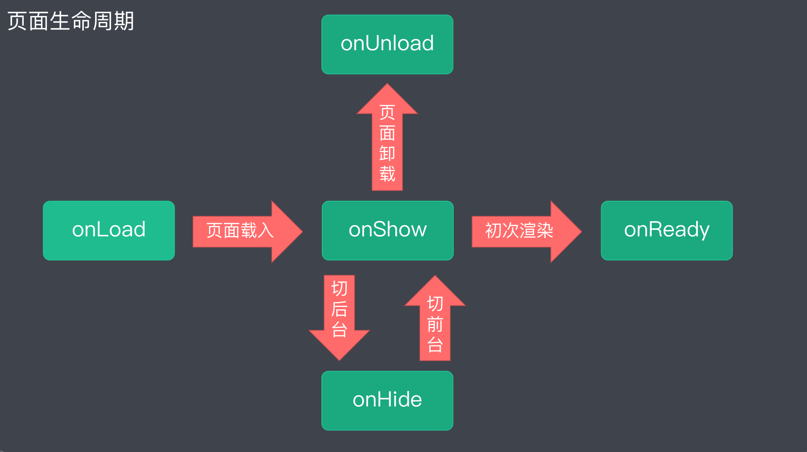
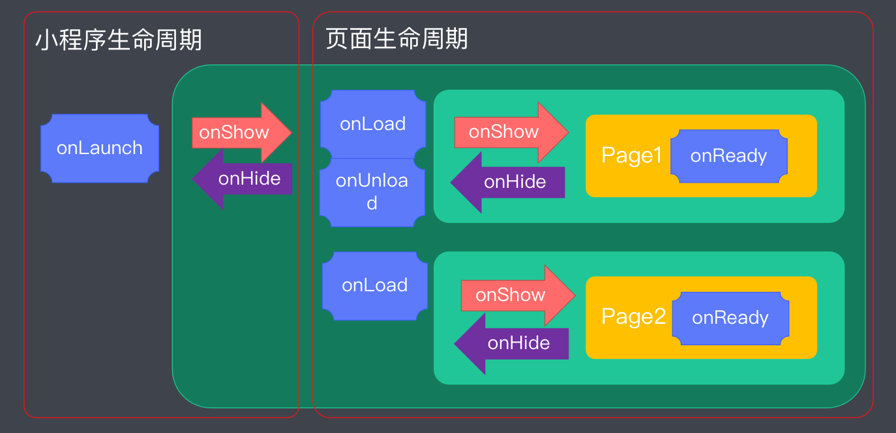

# 小程序基础

## 注册小程序账号

> 注册地址：https://mp.weixin.qq.com/wxopen/waregister?action=step1

注册成功后，在后台，获取小程序的AppID（设置-基本设置-账号信息）

## 搭建开发环境

**下载微信开发者工具**

https://developers.weixin.qq.com/miniprogram/dev/devtools/download.html

**初始化小程序-创建小程序**

目录： 设置本地空目录（用来存储初始化后的小程序代码）

## 目录结构解读

> WXML 语法：
> https://developers.weixin.qq.com/miniprogram/dev/reference/wxml/
> https://developers.weixin.qq.com/miniprogram/dev/framework/view/wxml/
>
> WXSS 语法：
> https://developers.weixin.qq.com/miniprogram/dev/framework/view/wxss.html

### 全局文件

app.js - 小程序入口文件

app.json - 小程序全局配置

app.wxss - 小程序全局样式

### 页面文件

> 在小程序中，每个具体的页面都由四个文件组成。**页面的四个文件必须具有相同的路径与文件名**

index.js - 页面入口

index.json - 页面配置

index.wxml - 页面内容（相当于浏览器端的html）

index.wxss - 页面样式

<h4>生成页面文件</h4>

与其他项目不同，小程序中的页面文件无需自己创建。如果要新建页面文件，只需要在app.json中的 pages 字段中指定，然后保存app.json。这样页面文件就会自动创建出来。

# 生命周期

小程序的生命周期是指小程序生命的不同阶段。这里的周期主要指两个循环状态: 前台到后台; 初始化到销毁。

在小程序生命的不同阶段, 都会自动触发函数，可以在生命周期函数中, 添加相应业务逻辑。小程序的生命周期可以分为两类：

- **项目生命周期**：描述小程序整个项目的不同阶段

- **页面生命周期**：描述页面的不同阶段

## 小程序（项目）的生命周期

> https://developers.weixin.qq.com/miniprogram/dev/framework/app-service/app.html

**onLaunch**: 全局只调用一次（逻辑只执行一次）

**onShow**: 应用初始化完成; 从后台切换到前台

**onHide**: 从前台切换到后台（小程序应用转到别的应用）

## **页面生命周期**

> https://developers.weixin.qq.com/miniprogram/dev/framework/app-service/page.html

**onLoad**: 小程序注册完成后，加载页面，一个页面只会调用一次

**onShow**: 页面载入后，显示页面，每次打开页面都会调用一次

**onReady**: 首次显示页面，会触发onReady方法，渲染页面元素和样式，一个页面只会调用一次

**onHide**: 小程序后台运行或跳转到其他页面时，触发onHide方法

**onUnload**: 当使用重定向方法wx.redirectTo(OBJECT)或关闭当前页返回上一页

wx.navigateBack()，触发onUnload, 页面卸载（内存释放）

## 小程序的启动流程

1、小程序初始化完成后，页面首次加载触发onLoad，只会触发一次。

2、当小程序进入到后台，先执行页面onHide方法再执行应用onHide方法。 

3、当小程序从后台进入到前台，先执行应用onShow方法再执行页面onShow方法。

# 初始化项目解读

**app.js**

1. 本地文件存储

   可以将全局应用的数据，存储到本地缓存中。操作本地缓存数据，可以通过 云API 实现

   设置本地缓存数据：wx.setStorageSync(key, value)
   获取本地缓存数据：wx.getStorageSync(key)

2. 获取用户信息
   wx.getUserInfo() 可以返回用户的昵称、头像、所在城市等。

**app.json**

> https://developers.weixin.qq.com/miniprogram/dev/reference/configuration/app.html

app.json 负责全局配置，例如：设置小程序的导航条、标题、窗口背景色

**云API**

> https://developers.weixin.qq.com/miniprogram/dev/api/

官方推出的，供小程序调用的，云端API（不需要自己开发和部署）

**WXML**

> WXML：https://developers.weixin.qq.com/miniprogram/dev/reference/wxml/
>
> 组件：https://developers.weixin.qq.com/miniprogram/dev/component/

- WXML（WeiXin Markup Language）是框架设计的一套标签语言
- WXML 中展示内容的具体标签，我们称为组件
- WXML 与组件之间的关系，就相当于 HTML 与标签
- WXML 相当于小程序中的模板引擎
  - 数据绑定
  - 数据展示（条件渲染、列表渲染）
- WXML 的列表渲染
  wx:for

**模块化开发**： 小程序中的模块化开发遵循 CommonJS 规范 （exports、require）

**页面级别的配置**

- .json 文件配置页面
- .wxss 文件设置样式