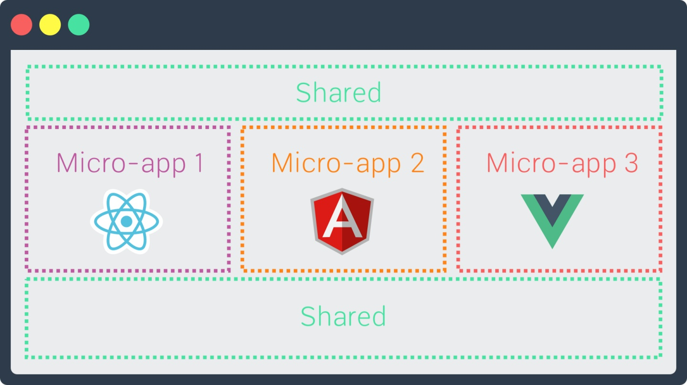
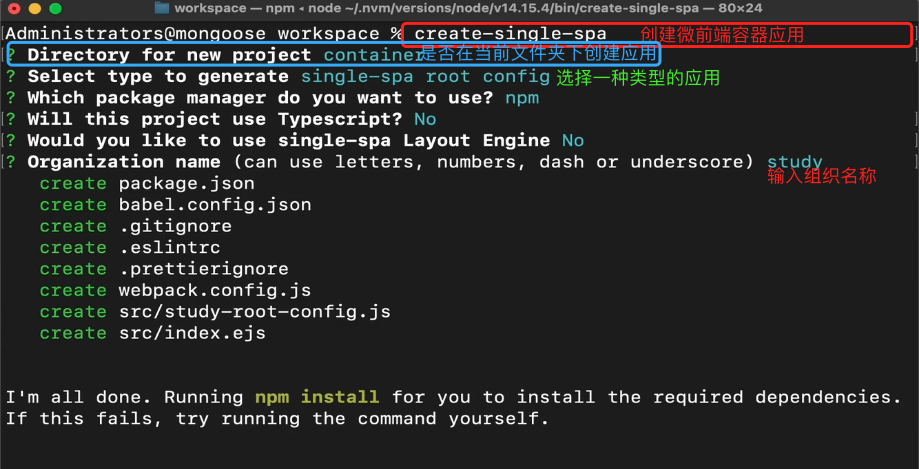
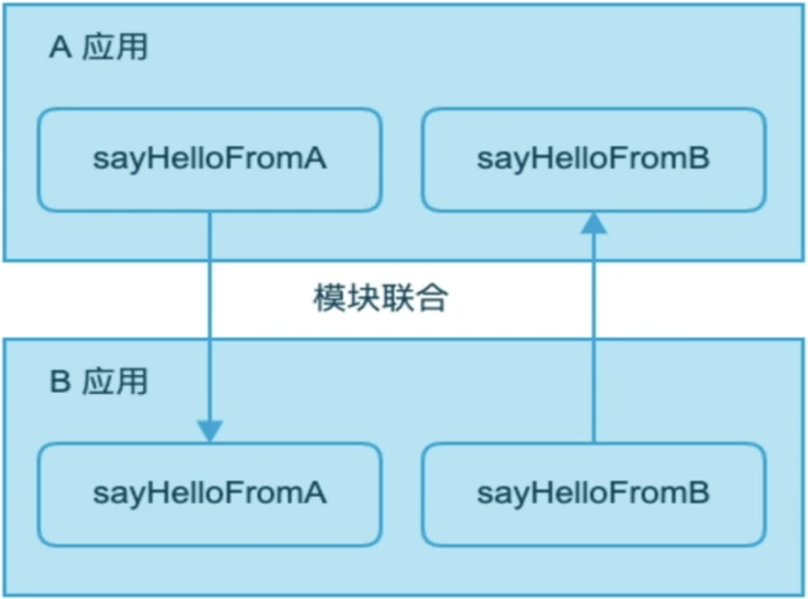
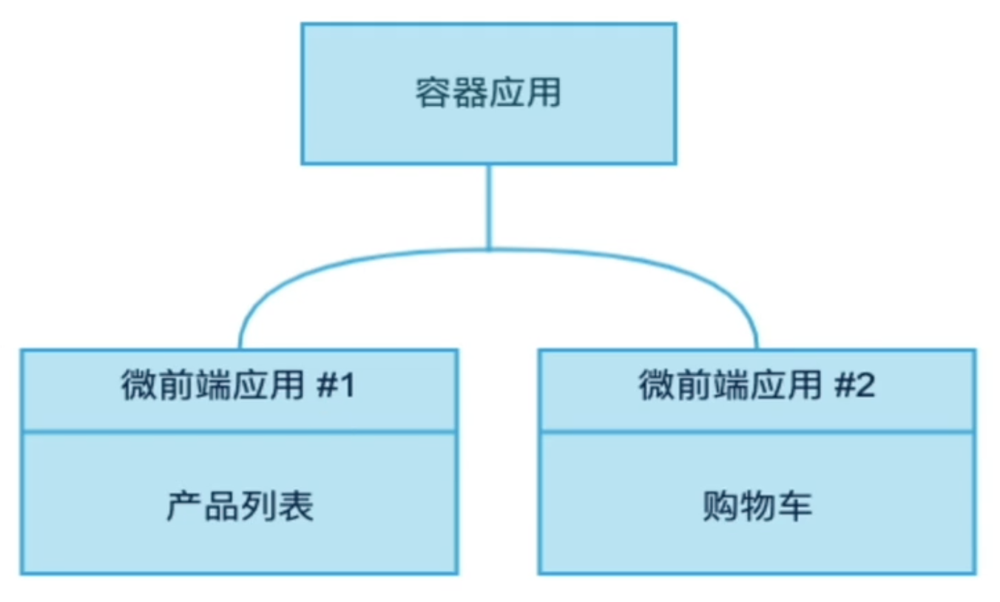
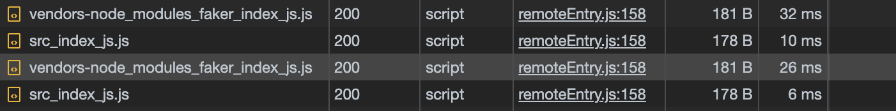

# 微前端

## what - 什么是微前端

微前端是一种软件架构，可以将前端应用拆解成一些更小的能够独立开发部署的微型应用，然后再将这些微应用进行组合使其成为整体应用的架构模式。

```text
怎么理解呢？
就是说当前我们在使用框架进行单页应用开发时，我们采用的是组件的方式进行构建用户界面的，在微前端里面我们需要将这些组件升级为一个个独立的应用。
比如下面的页面中有五个部分，使用组件的方式进行构建的话就会有五个不同的组件。在微前端架构中，我们需要将这五个组件升级成为五个独立的应用
```



微前端架构类似于组件架构，但不同的是，组件不能独立构建和发布，但是微前端中的应用是可以的。

微前端架构与框架无关，每个微应用都可以使用不同的框架。


## why - 微前端的价值

**1. 增量迁移**

迁移是一项非常耗时且艰难的任务，比如有一个管理系统使用 AngularJS 开发维护已经有几年时间，但是随时间的推移和团队成员的变更，无论从开发成本还是用人需求上，AngularJS 已经不能满足要求，于是团队想要更新技术栈，想在其他框架中实现新的需求，但是现有项目怎么办？直接迁移是不可能的，在新的框架中完全重写也不太现实。

使用微前端架构就可以解决问题，在保留原有项目的同时，可以完全使用新的框架开发新的需求，然后再使用微前端架构将旧的项目和新的项目进行整合。这样既可以使产品得到更好的用户体验，也可以使团队成员在技术上得到进步，产品开发成本也降到的最低。

**2. 独立发布**

在目前的单页应用架构中，使用组件构建用户界面，应用中的每个组件或功能开发完成或者bug修复完成后，每次都需要对整个产品重新进行构建和发布，任务耗时操作上也比较繁琐。

在使用了微前端架构后，可以将不能的功能模块拆分成独立的应用，此时功能模块就可以单独构建单独发布了，构建时间也会变得非常快，应用发布后不需要更改其他内容应用就会自动更新，这意味着你可以进行频繁的构建发布操作了。

**3. 允许单个团队做出技术决策**

因为微前端构架与框架无关，当一个应用由多个团队进行开发时，每个团队都可以使用自己擅长的技术栈进行开发，也就是它允许适当的让团队决策使用哪种技术，从而使团队协作变得不再僵硬。


📢 **微前端的使用场景：**

1. 拆分巨型应用，使应用变得更加可维护

2. 兼容历史应用，实现增量开发


## how - 如何实现微前端

> 和微前端架构相关的四个问题

**1. 多个微应用如何进行组合 ?**

在微前端架构中，除了存在多个微应用以外，还存在一个**容器应用**，每个微应用都需要被注册到容器应用中。

微前端中的每个应用在浏览器中都是一个独立的 JavaScript 模块，通过模块化的方式被容器应用启动和运行。

使用模块化的方式运行应用可以防止不同的微应用在同时运行时发生冲突。

**2. 在微应用中如何实现路由 ？**

在微前端架构中，当路由发生变化时，容器应用首先会拦截路由的变化，根据路由匹配微前端应用，当匹配到微应用以后，再启动微应用路由，匹配具体的页面组件。

**3. 微应用与微应用之间如何实现状态共享 ?**

在微应用中可以通过**发布订阅模式**实现状态共享，比如使用 RxJS。

**4. 微应用与微应用之间如何实现框架和库的共享？**

通过 `import-map` 和 webpack 中的 `externals` 属性。

```
在微应用架构中我们要使用模块化的方式去加载应用。
在最新的模块化当中新增了 import-map 特性，允许我们加载网络模块，而不是一定要将模块下载到本地，我们只需要配置好模块名字和对应的模块地址即可，这样每个微应用在引用公共模块时都可以引用提前配置好的公共模块了~
我们还需要修改微应用本身的 webpack 配置，通过 webpack 的 externals 属性告诉 webpack 在打包应用时哪些模块是不需要被打包的
```


# [Systemjs](https://github.com/systemjs/systemjs) 模块化解决方案

> systemjs 是一个动态模块加载器

在微前端架构中，微应用会被打包为模块，但浏览器不支持模块化，需要使用 systemjs 实现浏览器中的模块化。

systemjs 是一个用于实现模块化的 JavaScript 库，有属于自己的模块化规范。

在开发阶段我们可以使用 ES 模块规范，然后使用 webpack 将其转换为 systemjs 支持的模块。


❤❤❤ 

📢 这里说明一下：完整demo 的书写是和文档中的名称不一致，逻辑都是一样的哈

❤❤❤


🌰 **栗子**

> 通过 webpack 将 react 应用打包为 systemjs 模块，在通过 systemjs 在浏览器中加载模块

一、安装依赖

```bash
npm install webpack@5.17.0 webpack-cli@4.4.0 webpack-dev-server@3.11.2 html-webpack-plugin@4.5.1 @babel/core@7.12.10 @babel/cli@7.12.10 @babel/preset-env@7.12.11 @babel/preset-react@7.12.10 babel-loader@8.2.2
```

二、创建文件

```tex
1. 创建入口文件 src/index.js
2. 创建html模板文件 src/index.html
```

```html
<!DOCTYPE html>
<html lang="en">
  <head>
    <meta charset="UTF-8" />
    <meta name="viewport" content="width=device-width, initial-scale=1.0" />
    <title>systemjs-react</title>
    /**
    	原生 JS 中也出了 importmap 这个特性，但是浏览器对于原生的特性支持程度不太好，所以我们使用 systemjs 提供的 importmap 
    **/
    <script type="systemjs-importmap">
    	// 在微前端架构中 react、react-dom 这些属于公共框架，我们不希望在每一个微应用中都去下载、打包
      {
        "imports": {
          "react": "https://cdn.jsdelivr.net/npm/react/umd/react.production.min.js",
          "react-dom": "https://cdn.jsdelivr.net/npm/react-dom/umd/react-dom.production.min.js",
          "react-router-dom": "https://cdn.jsdelivr.net/npm/react-router-dom@5.2.0/umd/react-router-dom.min.js"
        }
      }
    </script>
    <script src="https://cdn.jsdelivr.net/npm/systemjs@6.8.0/dist/system.min.js"></script>
  </head>
  <body>
    <div id="root"></div>
    <script>
      System.import("./index.js")
    </script>
  </body>
</html>
```

```js
// index.js
import React from "react"
import ReactDOM from "react-dom"
import App from "./App.js"

/** 从这一步开始就是react 方面的内容 */
ReactDOM.render(<App />, document.getElementById("root"))

// App.js
import React from "react"

export default function App() {
  return <div>Hello World</div>
}
```

三、配置 webpack

```js
// webpack.config.js
const path = require("path")
const HtmlWebpackPlugin = require("html-webpack-plugin")

module.exports = {
  mode: "development",
  entry: "./src/index.js",
  output: {
    filename: "index.js",
    path: path.join(__dirname, "build"),
    libraryTarget: "system" // !!! 1. 将 es-module 转换成 system module
  },
  devtool: "source-map",
  devServer: {
    port: 9000, // 应用运行的端口
    contentBase: path.join(__dirname, "build"), // 静态资源文件夹
    historyApiFallback: true
  },
  module: {
    rules: [
      {
        test: /\.js$/,
        exclude: /node_modules/,
        use: {
          loader: "babel-loader",
          options: {
            presets: ["@babel/preset-env", "@babel/preset-react"]
          }
        }
      }
    ]
  },
  plugins: [
    new HtmlWebpackPlugin({
      template: "./src/index.html", // 在默认情况下会帮我们将 ./src/index.html 文件打包到 build 中，并且会把我们打包的JS 文件通过 script 标签引入到 html 文件中，但是在微前端架构中引 JS 文件的行为是不需要的，因为我们需要通过 systemjs 去加载该模块 
      inject: false // !!! 3.阻止 JS 文件的引入
    })
  ],
  externals: ["react", "react-dom", "react-router-dom"] // !!! 2. 哪些模块是不需要打包的
}
```

四、添加启动命令

```json
"scripts": {
  "start": "webpack serve"
},
```

五、测试

`npm start`

☞ [完整版Demo Link](https://github.com/CrystalAngelLee/crystal-micro-frontend/tree/main/crystal-systemjs)


# 微前端框架 [single-spa](https://single-spa.js.org/)

## single-spa 概述

single-spa 是一个**实现微前端架构的框架**。

在 single-spa 框架中有三种类型的微前端应用：

1. single-spa-application / parcel：微前端架构中的微应用，可以使用 vue、react、angular 等框架。

   ```
   single-spa-application 是和路由相关联的，比如说当访问/a 路由的时候要访问A 微应用，访问 /b 路由的时候要访问 B 微应用
   single-spa-parcel 是和 single-spa-application 相关联的一种类型，两者使用方式都是一样的，区别是 single-spa-parcel 不跟路由相关联，主要用于跨应用共享UI组件
   ```

2. single-spa root config：创建微前端容器应用。

   ```
   微前端架构中的容器应用。通过容器应用来加载和管理微应用
   ```

3. utility modules：公共模块应用，非渲染组件，用于跨应用共享 javascript 逻辑的微应用。

📢 这三种微应用都是独立的应用，均可单独的开发、构建和发布


⭐️ 接下来让我们创建几个应用来体验使用一下吼~~ ❤


## 创建容器应用

1. 安装 single-spa 脚手架工具： `npm install create-single-spa@2.0.3 -g `
   查看版本 `npm info create-single-spa`

2. 创建微前端应用目录：`mkdir workspace && cd "$_" `

   不同的微应用可以放置在不同的文件夹中

3. 创建微前端容器应用： `create-single-spa` 
   1. 应用文件夹填写 container

   2. 应用选择 single-spa root config

   3. 组织名称填写 study

      组织名称可以理解为团队名称，微前端架构允许多团队共同开发应用，组织名称可以标识应用由哪个团队开发。
      应用名称的命名规则为 @组织名称/应用名称 ，比如 @study/todos 

   

4. 启动应用： `npm start `

5. 访问应用：` localhost:9000 `

   📢  1. 在容器应用中默认注册了一个微应用

   ​		2. 在整个微前端项目中只有一个模板文件

6. 默认代码解析
   1. root-config.js

      ```js
      // workspace/container/src/study-root-config.js 
      import { registerApplication, start } from "single-spa"
      
      /**
       * 注册微前端应用
       * 1. name: 字符串类型, 微前端应用名称 "@组织名称/应用名称"
       * 2. app: 函数类型, 返回 Promise, 通过 systemjs 引用打包好的微前端应用模块代码 (umd)
       * 3. activeWhen: 路由匹配时激活应用
       */
      registerApplication({ 
        name: "@single-spa/welcome", 
        app: () => System.import( "https://unpkg.com/single-spa-welcome/dist/single-spa-welcome.js" ),
        activeWhen: ["/"] 
      })
      
      // start 方法必须在 single spa 的配置文件中调用
      // 在调用 start 之前, 应用会被加载, 但不会初始化, 挂载或卸载.
      // 启动微应用
      start({
        // 是否可以通过 history.pushState() 和 history.replaceState() 更改触发 single-spa 路由 
        // true 不允许 false 允许
        urlRerouteOnly: true
      })
      ```

   2. index.ejs

      ```ejs
      <!-- 导入微前端容器应用 -->
      <script>
        // 加载模块
        System.import("@study/root-config")
      </script>
      
      <!--
        import-map-overrides 可以覆盖导入映射 
        当前项目中用于配合 single-spa Inspector 调试工具使用. 
        可以手动覆盖项目中的 JavaScript 模块加载地址, 用于调试. 
      -->
      <import-map-overrides-full
        show-when-local-storage="devtools"
        dev-libs
      ></import-map-overrides-full>
      ```

      ```ejs
      <!-- 模块加载器 --> 
      <script src="https://cdn.jsdelivr.net/npm/systemjs@6.8.0/dist/system.min.js"></script> 
      <!-- systemjs 用来解析 AMD 模块的插件 --> 
      <script src="https://cdn.jsdelivr.net/npm/systemjs@6.8.0/dist/extras/amd.min.js" ></script> 
      <!-- 用于覆盖通过 import-map 设置的 JavaScript 模块下载地址 --> 
      <script src="https://cdn.jsdelivr.net/npm/import-map- overrides@2.2.0/dist/import-map-overrides.js"></script> 
      <!-- 用于支持 Angular 应用 --> 
      <script src="https://cdn.jsdelivr.net/npm/zone.js@0.10.3/dist/zone.min.js"> </script>
      ```

      ```ejs
      <!-- single-spa 预加载 --> 
      <link 
         rel="preload" 
         href="https://cdn.jsdelivr.net/npm/single-spa@5.8.3/lib/system/single- spa.min.js" 
         as="script" 
      />
      ```

      ```ejs
      <!-- JavaScript 模块下载地址 此处可放置微前端项目中的公共模块 --> 
      <script type="systemjs-importmap">
        {
          "imports": {
            "single-spa": "https://cdn.jsdelivr.net/npm/single- spa@5.8.3/lib/system/single-spa.min.js"
          }
        }
      </script>
      ```

      📢 single-spa 框架可以支持angular.js 到 11，目前对最新的 Anugular 11 支持还不是太好，所以目前不推荐在 single-spa 中加载 最新的 angular 应用，但是可以做兼容

☞ [完整版Demo Link](https://github.com/CrystalAngelLee/crystal-micro-frontend/tree/main/container)


## 创建不基于框架的微应用

1. 应用初始化： `mkdir application && cd "$_" `

2. 安装依赖

   ```json
   {
     "name": "application",
     "version": "1.0.0",
     "description": "",
     "main": "webpack.config.js",
     "scripts": {
       "start": "webpack serve"
     },
     "keywords": [],
     "author": "",
     "license": "ISC",
     "dependencies": {
       "@babel/core": "^7.12.10",
       "single-spa": "^5.9.0",
       "webpack": "^5.8.0",
       "webpack-cli": "^4.2.0",
       "webpack-config-single-spa": "^2.0.0",
       "webpack-dev-server": "^4.0.0-beta.0",
       "webpack-merge": "^5.4.0"
     }
   }
   ```

3. 配置 webpack

   ```js
   const singleSpaDefaults = require("webpack-config-single-spa")
   const { merge } = require("webpack-merge")
   
   module.exports = () => {
     const defaultConfig = singleSpaDefaults({
       orgName: "study", // 组织名称
       projectName: "application" // 微应用的名字
     })
     return merge(defaultConfig, {
       devServer: {
         port: 9001
       }
     })
   }
   ```

4. 建立入口文件，文件名称规则：`组织名称-项目名称` （要和配置的地方对应哦~）`src/study-application.js`

5. 在应用入口文件中导出微前端应用所需的生命周期函数（是应用级别的生命周期函数哦~），生命周期函数必须返回 Promise

   ```js
   let div_container = null
   
   export async function bootstrap () {
       console.log('I am starting up...')
   }
   
   export async function mount () {
       console.log("I'm mounting...")
       div_container = document.createElement('div')
       div_container.innerHTML = 'hello world'
       document.body.appendChild(div_container)
   }
   
   export async function unmount () {
       console.log('I will be unmount')
       document.body.removeChild(div_container)
   }
   ```

6. 在 package.json 文件中添加应用启动命令

   ```json
   "scripts": {
     "start": "webpack serve"
   },
   ```

7. 在微前端容器应用中注册微前端应用

   ```js
   registerApplication({
     name: "@study/application",
     app: () => System.import("@study/application"),
     activeWhen: ["/application"]
   })
   ```

8. 在模板文件中指定模块访问地址

   ```ejs
   <script type="systemjs-importmap">
     {
       "imports": {
         "@study/application": "//localhost:9001/study-application.js",
       }
     }
   </script>
   ```

9. 修改默认应用代码

   ```js
   // 注意: 参数的传递方式发生了变化, 原来是传递了一个对象, 对象中有三项配置, 现在是传递了三 个参数 
   registerApplication( 
     "@single-spa/welcome", 
     () => System.import( "https://unpkg.com/single-spa-welcome/dist/single-spa-welcome.js" ), 
     location => location.pathname === "/" 
   )
   ```

☞ [完整版Demo Link](https://github.com/CrystalAngelLee/crystal-micro-frontend/tree/main/noframe)


## 创建基于 React 的微应用

1. 创建应用： create-single-spa
   1. 应用目录输入 todos
   2. 框架选择 react

2. 修改应用端口 && 启动应用

   ```json
   "scripts": {
       "start": "webpack serve --port 9002",
   }
   ```

3. 注册应用，将 React 项目的入口文件注册到基座应用中

   ```js
   registerApplication({
     name: "@study/todos",
     app: () => System.import("@study/todos"),
     activeWhen: ["/todos"]
   })
   ```

4. 指定微前端应用模块的引用地址

   ```ejs
   <!--
   	在注册应用时 systemjs 引用了 @study/todos 模块, 所以需要配置该模块的引用地址
   -->
   <script type="systemjs-importmap">
         {
           "imports": {
             "@study/todos": "//localhost:9002/study-todos.js",
           }
         }
   </script>
   ```

5. 指定公共库的访问地址
   默认情况下，应用中的 react 和 react-dom 没有被 webpack 打包， single-spa 认为它是公共库，不应该单独打包。

   ```ejs
   <script type="systemjs-importmap">
     {
       "imports": {
         "single-spa": "https://cdn.jsdelivr.net/npm/single-spa@5.9.0/lib/system/single-spa.min.js",
         "react": "https://cdn.jsdelivr.net/npm/react@17.0.1/umd/react.production.min.js",
         "react-dom": "https://cdn.jsdelivr.net/npm/react-dom@17.0.1/umd/react-dom.production.min.js",
         "react-router-dom": "https://cdn.jsdelivr.net/npm/react-router-dom@5.2.0/umd/react-router-dom.min.js"
       }
     }
   </script>
   ```

6. 微前端 React 应用入口文件代码解析

   ```js
   // react、react-dom 的引用是 index.ejs 文件中 import-map 中指定的版本
   import React from "react"
   import ReactDOM from "react-dom"
   // single-spa-react 用于创建使用 React 框架实现的微前端应用
   import singleSpaReact from "single-spa-react"
   // 用于渲染在页面中的根组件
   import Root from "./root.component"
   
   // 创建基于 React 框架的微前端应用, 返回生命周期函数对象
   const lifecycles = singleSpaReact({
     React,
     ReactDOM,
     rootComponent: Root,
     // 错误边界函数
     errorBoundary(err, info, props) {
       // Customize the root error boundary for your microfrontend here.
       return null
     },
     // 指定根组件的渲染位置
     domElementGetter: () => document.getElementById("root")
   })
   
   // 暴露必要的生命周期函数
   export const { bootstrap, mount, unmount } = lifecycles
   
   ```

7. 路由配置

   ```js
   // root.component.js
   import React from "react"
   import Parcel from "single-spa-react/parcel"
   import {
     BrowserRouter,
     Route,
     Link,
     Redirect,
     Switch
   } from "react-router-dom"
   import Home from "./Home"
   import About from "./About"
   
   export default function Root(props) {
     return (
       <BrowserRouter basename="/todos">
         <Parcel config={System.import("@study/navbar")} />
         <div>
           <Link to="/home">Home</Link>
           <Link to="/about">About</Link>
         </div>
         <Switch>
           <Route path="/home">
             <Home />
           </Route>
           <Route path="/about">
             <About />
           </Route>
           <Route path="/">
             <Redirect to="/home" />
           </Route>
         </Switch>
       </BrowserRouter>
     )
   }
   ```

8. 修改 webpack 配置

   ```js
   const { merge } = require("webpack-merge");
   const singleSpaDefaults = require("webpack-config-single-spa-react");
   
   module.exports = (webpackConfigEnv, argv) => {
     const defaultConfig = singleSpaDefaults({
       orgName: "mic-demo",
       projectName: "reactframe",
       webpackConfigEnv,
       argv,
     });
   
     return merge(defaultConfig, {
       externals: ["react-router-dom"]
     });
   };
   ```

☞ [完整版Demo Link](https://github.com/CrystalAngelLee/crystal-micro-frontend/tree/main/reactframe)


## 创建基于 Vue 的微应用

1. 创建应用： create-single-spa
   1. 项目文件夹填写 vueframe
   2. 框架选择 Vue
   3. 生成 Vue 2 项目

2. 修改 webpack, 提取 vue && vue-router

   ```js
   // touch vue.config.js
   module.exports = {
       chainWebpack: config => {
         config.externals(["vue", "vue-router"])
       }
   }
   ```
   
3. 配置vue && vue-router

   ```ejs
   <script type="systemjs-importmap">
       {
         "imports": {
           "vue": "https://cdn.jsdelivr.net/npm/vue@2.6.10/dist/vue.js",
           "vue-router": "https://cdn.jsdelivr.net/npm/vue-router@3.0.7/dist/vue-router.min.js"
         }
       }
   </script>
   ```

4. 修改启动命令 && 启动应用

   ```json
   "scripts": {
   		"start": "vue-cli-service serve --port 9003",
   }
   ```

5. 配置到容器应用中

   ```js
   registerApplication({
     name: "@study/vueframe",
     app: () => System.import("@mic-demo/vueframe"),
     activeWhen: ["/vueframe"]
   });
   ```

   配置应用到模板中

   ```ejs
   <script type="systemjs-importmap">
       {
         "imports": {
           "@study/vueframe": "//localhost:9003/js/app.js"
         }
       }
     </script>
   ```

6. 取消访问限制

   ```ejs
   // 注释掉这一句就好啦~ 在container 的 index.ejs 中哦~
   <meta http-equiv="Content-Security-Policy" content="default-src 'self' https: localhost:*; script-src 'unsafe-inline' 'unsafe-eval' https: localhost:*; connect-src https: localhost:* ws://localhost:*; style-src 'unsafe-inline' https:; object-src 'none';">
   ```

7. Vue 应用配置路由

   ```js
   // main.js
   import Vue from 'vue';
   import VueRouter from "vue-router"
   import singleSpaVue from 'single-spa-vue';
   
   import App from './App.vue';
   
   Vue.use(VueRouter)
   
   Vue.config.productionTip = false;
   
   // 组件
   const Foo = { template: "<div>Foo</div>" }
   const Bar = { template: "<div>Bar</div>" }
   
   // 规则
   const routes = [
     { path: "/foo", component: Foo },
     { path: "/bar", component: Bar }
   ]
   
   // 实例: 记住要配置 base 昂~~
   const router = new VueRouter({ routes, mode: "history", base: "/vueframe" })
   
   const vueLifecycles = singleSpaVue({
     Vue,
     appOptions: {
       // 路由
       router,
       // 渲染组件
       render(h) {
         return h(App, {
           // 向组件中传递数据
           props: {
             /*
             name: this.name,
             mountParcel: this.mountParcel,
             singleSpa: this.singleSpa,
             */
           },
         });
       },
     },
   });
   
   // 导出生命周期函数
   export const bootstrap = vueLifecycles.bootstrap;
   export const mount = vueLifecycles.mount;
   export const unmount = vueLifecycles.unmount;
   ```

   ```vue
   // App.vue
   <template>
     <div id="app">
       <router-link to="/foo">foo</router-link>&nbsp;
       <router-link to="/bar">bar</router-link>
       <router-view></router-view>
     </div>
   </template>
   ```

☞ [完整版Demo Link](https://github.com/CrystalAngelLee/crystal-micro-frontend/tree/main/vueframe)


## 创建 Parcel 应用

Parcel 用来创建公共 UI，涉及到跨框架共享 UI 时需要使用 Parcel。

Parcel 的定义可以使用任何 single-spa 支持的框架，它也是单独的应用，需要单独启动，但是它不关联路由。

Parcel 应用的模块访问地址也需要被添加到 import-map 中，其他微应用通过 System.import 方法进行引用。

**栗子 🌰**

> 需求：创建 navbar parcel，在不同的应用中使用它。

1. 使用 React 创建 Parcel 应用

   1. `create-single-spa`

   2. 编辑`navbar/src/root.component.js`

      ```js
      import React from 'react'
      import { Link, BrowserRouter } from 'react-router-dom'
      
      const Navbar = () => {
        return (
          <BrowserRouter>
            <Link to="/">@single-spa/welcome</Link>&nbsp;
            <Link to="/application">@study/application</Link>&nbsp;
            <Link to="/todos">@study/todos</Link>&nbsp;
            <Link to="/vueframe">@study/vueframe</Link>
          </BrowserRouter>
        )
      }
      
      export default Navbar
      ```

   3. 修改启动命令

      ```json
      "scripts": {
          "start": "webpack serve --port 9004",
      }
      ```

2. 在 webpack 配置文件中去除 react-router-dom

   ```js
   externals: ["react-router-dom"]
   ```

3. 启动应用: `npm start`

4. 在模板文件中指定应用模块地址

   ```ejs
   {
     "imports": {
     	"@study/navbar": "//localhost:9004/study-navbar.js"
     }
   }
   ```

5. 在 React 应用中使用它

   ```js
   import Parcel from "single-spa-react/parcel"
   <Parcel config={System.import("@study/navbar")} />
   ```

6. 在 Vue 应用中使用它

   ```vue
   <Parcel :config="parcelConfig" :mountParcel="mountParcel" />
   <script>
   import Parcel from "single-spa-vue/dist/esm/parcel"
   import { mountRootParcel } from "single-spa"
   export default {
     components: {
     	Parcel
     },
     data() {
       return {
         parcelConfig: window.System.import("@study/navbar"),
         mountParcel: mountRootParcel
       }
     }
   }
   </script>
   ```

   - 需要排除single spa 的包

     ```js
     // vue.config.js
     config.externals(["vue", "vue-router", 'single-spa'])
     ```


☞ [完整版Demo Link](https://github.com/CrystalAngelLee/crystal-micro-frontend/tree/main/navbar)


## 创建 utility modules

> 用于放置跨应用共享的 JavaScript 逻辑，它也是独立的应用，需要单独构建单独启动。

1. 创建应用： `create-single-spa`

   1. 文件夹填写 tools
   2. 应用选择 `in-browser utility module (styleguide, api cache, etc)`

2. 修改端口，启动应用

   ```json
   "scripts": {
   	"start": "webpack serve --port 9005",
   }
   ```

3. 应用中导出方法

   ```js
   export function consoleFunc(param) {
       console.log(`%c${param} wahahah~`, "color: skyblue")
   }
   ```

4. 在模板文件中声明应用模块访问地址

   ```ejs
   <script type="systemjs-importmap">
   {
     "imports": {
     	"@study/tools": "//localhost:9005/study-tools.js"
     }
   }
   </script>
   ```

5. 在 React 应用中使用该方法

   ```js
   import React, {useState, useEffect} from 'react'
   
   function useToolsModule() {
       const [tools, setTools] = useState()
       useEffect(() => {
           System.import('@study/tools').then(setTools)
       }, [])
       return tools
   }
   
   const Home = () => {
       const tools = useToolsModule();
       if (tools) tools.consoleFunc('react yyds')
       return (
           <div>
               Home
           </div>
       )
   }
   
   export default Home
   ```

6. 在 Vue 应用中使用该方法

   ```vue
   <template>
     <div id="app">
       ...
       <h2 @click="handleClick">hello a~~</h2>
     </div>
   </template>
   
   <script>
   export default {
     ...
     methods: {
       async handleClick() {
         const toolsModule = await window.System.import("@mic-demo/tools")
         toolsModule.consoleFunc("@mic-demo/vue~~~")
       }
     },
   }
   </script>
   ```

☞ [完整版Demo Link](https://github.com/CrystalAngelLee/crystal-micro-frontend/tree/main/tools)


## 实现跨应用通信

> 要实现跨应用通信需要借助 utility modules 和 rxJS，因为在微前端架构的应用当中我们通常使用发布订阅模式来实现跨应用通信和状态共享的，rxJS 就是基于这样的一个设计模式的，并且它无关于框架，也就是可以在任何其他框架中使用。

1. 在 index.ejs 文件中添加 rxjs 的 import-map

   ```ejs
   {
         "imports": {
           "rxjs": "https://cdn.jsdelivr.net/npm/rxjs@6.6.3/bundles/rxjs.umd.min.js"
         }
   }
   ```

2. 在 utility modules 中导出一个 ReplaySubject，它可以广播历史消息，就算应用是动态加载进来的，也可以接收到数据。

   ```js
   import { ReplaySubject } from 'rxjs'
   
   export const sharedSubject = new ReplaySubject()
   ```

3. 在 React 应用中订阅它

   ```js
   useEffect(() => {
       let subjection = null
       if (tools) {
           tools.consoleFunc('react yyds')
           subjection = tools.sharedSubject.subscribe(console.log)
       }
       return () => subjection.unsubscribe()
   }, [])
   ```

4. 在 Vue 应用中订阅它

   ```js
   async mounted() {
     const toolsModule = await window.System.import("@study/tools")
     toolsModule.sharedSubject.subscribe(console.log)
   }
   ```

5. 注册事件

   > 这里作为示例将事件注册到了react 相关的应用中

   ```js
   <button
     onClick={() => toolsModule.sharedSubject.next("Hello Hello Hello")}
   >
     button
   </button>
   ```

6. 验证
   现在你可以点击button 然后再控制台里看你的输出啦~


## [Layout Engine(布局引擎)](https://single-spa.js.org/docs/layout-overview/)

> 允许使用组件的方式声明顶层路由(类似于 react 中配置路由的方式：访问什么样的地址跳转什么应用)，并且提供了更加便捷的路由API用来注册应用。

1. 下载布局引擎 `npm install single-spa-layout`

2. 构建路由

   ```ejs
   <-- index.ejs -->
   <html>
     <head>
       <template id="single-spa-layout">
         <single-spa-router>
           <nav class="topnav">
             <application name="@study/navbar"></application>
           </nav>
           <div class="main-content">
             <route default>
             	<application name="@single-spa/welcome"></application>
             </route>
             <route path="application">
             <application name="@study/application"></application>
             </route>
             <route path="todos">
             <application name="@study/todos"></application>
             </route>
             <route path="realworld">
             <application name="@study/realworld"></application>
             </route>
           </div>
         </single-spa-router>
       </template>
     </head>
   </html>
   ```

   ```ejs
   // 注册首页
   {
         "imports": {
           "@single-spa/welcome": "https://unpkg.com/single-spa-welcome/dist/single-spa-welcome.js"
         }
   }
   ```

3. 获取路由信息 && 注册应用

   ```js
   import { registerApplication, start } from "single-spa";
   import { constructApplications, constructRoutes } from "single-spa-layout"
   
   // 获取路由配置对象
   const routes = constructRoutes(document.querySelector("#single-spa-layout"))
   // 获取路由信息数组
   const applications = constructApplications({
     routes,
     loadApp({ name }) {
       return System.import(name)
     }
   })
   // 遍历路由信息注册应用
   applications.forEach(registerApplication)
   
   start({
     urlRerouteOnly: true,
   });
   ```


# Module Federation 模块联邦

> 通过 模块联邦 也可以实现微前端架构

## 概述

Module Federation 即为模块联邦，是 Webpack 5 中新增的一项功能，可以实现跨应用共享模块。

```tex
我们有两个应用：A应用和B应用。
A应用中提供了一个方法：sayHelloFromA
B应用中提供了一个方法：sayHelloFromB
我们想要在A应用中调用B应用提供的方法，B应用调用A应用提供的方法【跨应用调用方法】
我们可以把一个应用当做一个模块，这样我们就可以在一个应用中加载另一个应用了，只要我们可以在一个应用中加载另一个应用我们就可以实现微前端架构
```




## 快速上手

> 需求：通过模块联邦在容器应用中加载微应用

   

### 1. **创建应用结构**
   按照以下目录结构构建好三个微应用的应用结构，`package.json` 和 `package-lock.json` 文件初始体验可以直接 copy 完成demo 中的文件
   html 中初始化好各自的内容
   安装各自的依赖

   ```bash
   products
   ├── package-lock.json
   ├── package.json
   ├── public       // 静态资源文件
   │   └── index.html
   ├── src          // 源码
   │   └── index.js
   └── webpack.config.js
   ```

### 2. **应用初始化**

   1. 在入口 JavaScript 文件中加入产品列表
   
      ```js
      // faker 可以用来随机生成数据
      import faker from 'faker'
      
      let products = '';
      
      for (let i = 1; i <= 5; i++) {
          products += `<div>${faker.commerce.productName()}</div>`
      }
      
      document.querySelector("#products").innerHTML = products
      ```
   
   2. 在入口 html 文件中加入盒子
   
      ```html
      <div id="products"></div>
      ```
   
   3. webpack 配置
   
      ```js
      const HtmlWebpackPlugin = require("html-webpack-plugin")
      
      module.exports = {
          mode: "development",
          devServer: {
              port: 8081
          },
          plugins: [
              new HtmlWebpackPlugin({
                  template: "./public/index.html"
              })
          ]
      }
      ```
   
   4. 添加应用启动命令
   
      ```json
      "scripts": {
          "start": "webpack serve"
      },
      ```
   
   5. 通过 copy 的方式创建 container 和 cart

### 3. **Module Federation**

   通过配置模块联邦实现在容器应用中加载产品列表微应用。

   1. 在产品列表微应用中将自身作为模块进行导出
   
      ```js
      // webpack.config.js
      // 导入模块联邦插件
      const ModuleFederationPlugin = require("webpack/lib/container/ModuleFederationPlugin");
      // 将 products 自身当做模块暴露出去
      new ModuleFederationPlugin({
        // 模块文件名称, 其他应用引入当前模块时需要加载的文件的名字
        filename: "remoteEntry.js",
        // 模块名称, 具有唯一性, 相当于 single-spa 中的组织名称
        name: "products",
        // 当前模块具体导出的内容
        exposes: { "./index": "./src/index" },
      });
      // 在容器应用中要如何引入产品列表应用模块?
      // 1. 在容器应用中加载产品列表应用的模块文件
      // 2. 在容器应用中通过 import 关键字从模块文件中导入产品列表应用模块
      ```

   2. 在容器应用的中导入产品列表微应用
   
      ```js
      // webpack.config.js
      // 导入模块联邦插件
      const ModuleFederationPlugin = require("webpack/lib/container/ModuleFederationPlugin");
      new ModuleFederationPlugin({
        name: "container",
        // 配置导入模块映射
        remotes: {
          // 字符串 "products" 和被导入模块的 name 属性值对应
          // 属性 products 是映射别名, 是在当前应用中导入该模块时使用的名字
          products: "products@http://localhost:8081/remoteEntry.js",
        },
      });
      ```
   
      ```js
      // src/index.js 
      // 因为是从另一个应用中加载模块, 要发送请求所以使用异步加载方式 
      import("products/index").then(products => console.log(products))
      ```
   
      通过上面这种方式加载在写法上多了一层回调函数, 不是很方便, 所以一般都会在 src 文件夹中建立bootstrap.js，在形式上将写法变为同步
   
      ```js
      // src/index.js 
      import('./bootstrap.js') 
      
      // src/bootstrap.js 
      import "products/index"
      ```

3. 实现 Cart 微应用加载
   注意:cart/index.html 和 products/index.html 仅仅是在开发阶段中各自团队使用的文件，而 container/index.html 是在开发阶段和生产阶段都要使用的文件。


## 共享模块

### 实现模块共享

在 Products 和 Cart 中都需要 Faker，当 Container 加载了这两个模块后，Faker 被加载了两次。



```js
// 分别在 Products 和 Cart 的 webpack 配置文件中的模块联邦插件中添加以下代码 
// 如果遇到版本不一致的问题，强制使用高版本
{
  shared: ["faker"]
}
// 重新启动 Container、Products、Cart
```

注意:共享模块需要异步加载，在 Products 和 Cart 中需要添加 bootstrap.js

### 共享模块版本冲突解决

Cart 中如果使用 4.1.0 版本的 faker，Products 中使用 5.2.0 版本的 faker，通过查看网络控制面板可以发现 faker 又会被加载了两次，模块共享失败。
解决办法是分别在 Products 和 Cart 中的 webpack 配置中加入如下代码

```js
shared: {
  faker: {
    singleton: true
  }
}
```

但同时会在原本使用低版本的共享模块应用的控制台中给予警告提示。

###  开放子应用挂载接口

在容器应用导入微应用后，应该有权限决定微应用的挂载位置，而不是微应用在代码运行时直接进行挂 载。所以每个微应用都应该导出一个挂载方法供容器应用调用。

[Products/bootstrap.js](https://github.com/CrystalAngelLee/crystal-micro-frontend/tree/main/products/src)

```js
// faker 可以用来随机生成数据
import faker from "faker";

function mount(el) {
  let products = "";

  for (let i = 1; i <= 5; i++) {
    products += `<div>${faker.commerce.productName()}</div>`;
  }

  el.innerHTML = products;
}

// 此处代码是 products 应用在本地开发环境下执行的
if (process.env.NODE_ENV === "development") {
  const el = document.querySelector("#dev-products");
  // 当容器应用在本地开发环境下执行时也可以进入到以上这个判断, 容器应用在执行当前代码时肯定是获 取不到 dev-products 元素的, 所以此处还需要对 el 进行判断.
  if (el) mount(el);
}
export { mount };
```

[Products/webpack.config.js](https://github.com/CrystalAngelLee/crystal-micro-frontend/blob/main/products/webpack.config.js)

```js
exposes: {
  // ./src/index => ./src/bootstrap 为什么 ?
  // mount 方法是在 bootstrap.js 文件中导出的, 所以此处要导出 bootstrap
  // 此处的导出是给容器应用使用的, 和当前应用的执行没有关系, 当前应用在执行时依然先执行 index
  "./Index": "./src/bootstrap",
},
```

[Container/bootstrap.js](https://github.com/CrystalAngelLee/crystal-micro-frontend/tree/main/fedcontainer)

```js
import { mount as mountProducts } from "products/Index";
mountProducts(document.querySelector("dev-products"));
```


## 基于模块联邦的微前端实现方案

### 应用案例概述

当前案例中包含三个微应用，分别为 Marketing、Authentication 和 Dashboard

1. Marketing: 营销微应用，包含首页组件和价格组件 
2. Authentication:身份验证微应用，包含登录组件 
3. Dashboard:仪表盘微应用，包含仪表盘组件

容器应用、营销应用、身份验证应用使用 React 框架，仪表盘应用使用 Vue 框架。

### Marketing

#### 应用初始化

**1. 创建应用结构**

```tex
├── public
│ └── index.html 
├── src
│ ├── bootstrap.js
│ └── index.js
├── package-lock.json
├── package.json
└── webpack.config.js
```

index.html

```html
<title>Marketing</title>
<div id="dev-marketing"></div>
```

index.js

```js
import("./bootstrap")
```

bootstrap.js

```js
console.log('测试用例')
```

**2. 配置 webpack**

```js
const HtmlWebpackPlugin = require("html-webpack-plugin")

module.exports = {
  mode: "development",
  devServer: {
    port: 8081,
    // 当使用 HTML5 History API 时, 所有的 404 请求都会响应 index.html 文件
    historyApiFallback: true
  },
  module: {
    rules: [
      {
        test: /\.js$/,
        exclude: /node_modules/,
        use: {
          loader: "babel-loader",
          options: {
            presets: ["@babel/preset-react", "@babel/preset-env"],
            // 1. 避免 babel 转义语法后 helper 函数重复
						// 2. 避免 babel polyfill 将 API 添加到全局
            plugins: ["@babel/plugin-transform-runtime"]
          }
        }
      }
    ]
  },
  plugins: [
    new HtmlWebpackPlugin({
      template: "./public/index.html"
    })
  ]
}
```

**3. 添加启动命令**

```js
"scripts": {
  "start": "webpack serve"
}
```


#### 创建挂载方法

bootstrap.js

```js
import React from "react"
import ReactDOM from "react-dom"

function mount(el) {
  ReactDOM.render(<div>test</div>, el)
}

if (process.env.NODE_ENV === "development") {
  const el = document.querySelector("#dev-marketing")
  if (el) mount(el)
}

export { mount }
```


#### 创建路由

1. 在 src 文件夹中创建 components 文件夹用于放置页面组件
2. 在 src 文件夹中创建 App 组件，用于编写路由

App.js

```js
import React from "react"
import { BrowserRouter, Route, Switch } from "react-router-dom"
import Landing from "./components/Landing"
import Pricing from "./components/Pricing"

function App() {
  return (
    <BrowserRouter>
      <Switch>
        <Route path="/pricing">
          <Pricing />
        </Route>
        <Route path="/">
          <Landing />
        </Route>
      </Switch>
    </BrowserRouter>
  )
}

export default App
```

```js
// bootstrap.js
import App from "./App"
function mount(el) { 
  ReactDOM.render(<App />, el)
}
```


### Container

#### 应用初始化

**1. 创建应用结构 (基于 Marketing 应用进行拷贝修改)**

```tex
├── public
│ └── index.html 
├── src
│ ├── bootstrap.js
│ └── index.js
├── package-lock.json
├── package.json
└── webpack.config.js
```

**2. 修改 index.html**

```html
<title>Container</title>
<div id="root"></div>
```

**3. 修改 App.js**

```js
import React from "react"
export default function App() {
  return <div>Container works</div>
}
```

**4. 修改 bootstrap.js**

```js
if (process.env.NODE_ENV === "development") { 
  const el = document.querySelector("#root") 
	if (el) mount(el)
}
```

**5. 修改 webpack.config.js**

```js
module.exports = { 
  devServer: {
		port: 8080 
  }
}
```


#### **加载** Marketing

**1. Marketing 应用配置 ModuleFederation**

```js
const ModuleFederationPlugin = require("webpack/lib/container/ModuleFederationPlugin")
new ModuleFederationPlugin({ 
  name: "marketing", 
  filename: "remoteEntry.js", 
  exposes: {
		"./MarketingApp": "./src/bootstrap" 
  }
})
```

**2. Container 应用配置 ModuleFederation**

```js
const ModuleFederationPlugin =
require("webpack/lib/container/ModuleFederationPlugin")
new ModuleFederationPlugin({
  name: "container",
  remotes: {
		marketing: "marketing@http://localhost:8081/remoteEntry.js" 
  }
})
```

**3. 在 Container 应用中新建 MarketingApp 组件，用于挂载 Marketing 应用**

```js
// Container/components/MarketingApp.js
import React, { useRef, useEffect } from "react"
import { mount } from "marketing/MarketingApp"
export default function MarketingApp() {
  const ref = useRef()
  useEffect(() => {
		mount(ref.current) 
  }, [])
  return <div ref={ref}></div>
}
```

**4. 在 Container 应用中的 App 组件中渲染 Marketing 应用的**

```js
// Container/App.js
import React from "react"
import MarketingApp from "./components/MarketingApp"
export default function App() {
  return <MarketingApp />
}
```


### 共享库设置

在 Container 应用和 Marketing 应用中都使用了大量的相同的代码库，如果不做共享处理，则应用中相同的共享库会被加载两次。

```json
"dependencies": { 
  "@material-ui/core": "^4.11.0", 
  "@material-ui/icons": "^4.9.1", 
  "react": "^17.0.1", 
  "react-dom": "^17.0.1", 
  "react-router-dom": "^5.2.0"
}
```

在 Container 应用和 Marketing 应用的 webpack 配置文件中加入以下代码

```js
const packageJson = require("./package.json")
new ModuleFederationPlugin({ 
  shared: packageJson.dependencies
})
```


### 路由配置

#### **概述**

容器应用路由用于匹配微应用，微应用路由用于匹配组件。

容器应用使用 BrowserHistory 路由，微应用使用 MemoryHistory 路由。

1. 为防止容器应用和微应用同时操作 url 而产生冲突，在微前端架构中，只允许容器应用更新 url， 微应用不允许更新 url，MemoryHistory 是基于内存的路由，不会改变浏览器地址栏中的 url。

2. 如果不同的应用程序需要传达有关路由的相关信息，应该尽可能的使用通过的方式， memoryHistory 在 React 和 Vue 中都有提供。

#### **更新现有路由配置**

**1. 容器应用的路由配置**

```js
// Container/App.js
import { Router, Route, Switch } from "react-router-dom" 
import { createBrowserHistory } from "history"
const history = createBrowserHistory()
export default function App() {
  return (
    <Router history={history}>
      <Switch>
        <Route path="/">
          <MarketingApp />
        </Route>
      </Switch>
		</Router>
) }
```

**2. Marketing 应用的路由配置**

```js
// Marketing/bootstrap.js
import { createMemoryHistory } from "history"
function mount(el) {
  const history = createMemoryHistory() 
  ReactDOM.render(<App history={history} />, el)
}
```

```js
// Marketing/app.js
import { Router, Route, Switch } from "react-router-dom"
export default function App({ history }) {
  return (
    <Router history={history}>
      <Switch>
        <Route path="/pricing" component={Pricing} />
        <Route path="/" component={Landing} />
      </Switch>
		</Router>
) }
```

**3. 添加头部组件**

```js
import Header from "./components/Header"
export default function App() {
  return <Header />
}
```

#### 微应用和容器应用路由沟通
1. 微应用路由变化时 url 地址没有被同步到浏览器的地址栏中，路由变化也没有被同步到浏览器的历史记录中。
   当微应用路由发生变化时通知容器应用更新路由信息 (容器应用向微应用传递方法)。

   ```js
   // Container/components/MarketingApp.js
   import { useHistory } from "react-router-dom"
   const history = useHistory()
   mount(ref.current, {
     onNavigate({ pathname: nextPathname }) {
       const { pathname } = history.location 
       if (pathname !== nextPathname) {
         history.push(nextPathname) 
       }
     } 
   })
   ```

   ```js
   // Marketing/bootstrap.js
   function mount(el, { onNavigate }) {
   	if (onNavigate) history.listen(onNavigate)
   }
   ```

2. 容器应用路由发生变化时只能匹配到微应用，微应用路由并不会响应容器应用路由的变化。 当容器应用路由发生变化时需要通知微应用路由进行响应 (微应用向容器应用传递方法)

   ```js
   // Marketing/bootstrap.js
   function mount(el, { onNavigate }) {
     return {
       onParentNavigate({ pathname: nextPathname }) {
         const pathname = history.location.pathname;
         if (nextPathname !== pathname) {
           history.push(nextPathname);
         }
       },
     };
   }
   ```

   ```js
   // Container/components/MarketingApp.js
   const { onParentNavigate } = mount(...)
   if (onParentNavigate) history.listen(onParentNavigate);
   ```


#### Marketing 应用本地路由设置

目前 Marketing 应用本地开发环境是报错的，原因是本地开发环境在调用 mount 方法时没有传递第二个参数，默认值就是 undefined, mount 方法内部试图从 undefined 中解构 onNavigate，所以就报错了。解决办法是在本地开发环境调用mount 方法时传递一个空对象。

```js
if (process.env.NODE_ENV === "development") {
  // ...
  if (el)
    mount(el, {});
}
```

如果当前为本地开发环境，路由依然使用 BrowserHistory，所以在调用 mount 方法时传递 defaultHistory 以做区分。

```js
// Marketing/bootstrap.js
if (process.env.NODE_ENV === "development") {
  // ...
  if (el)
    mount(el, {
      defaultHistory: createBrowserHistory(),
    });
}
```

在 mount 方法内部判断 defaultHistory 是否存在，如果存在就用 defaultHistory，否则就用MemoryHistory。

```js
// Marketing/bootstrap.js
function mount(el, { onNavigate, defaultHistory }) {
  const history = defaultHistory || createMemoryHistory()
}
```


### Authentication

#### 应用初始化

**1. 拷贝 src 文件夹并做如下修改**

```js
// bootstrap.js
if (process.env.NODE_ENV === "development") { 
  const el = document.querySelector("#dev-auth")
}
```

```js
 
// App.js
import React from "react"
import { Router, Route, Switch } from "react-router-dom"
export default function App({ history }) {
  return (
    <Router history={history}>
      <Switch>
        <Route path="/auth/signin" component={Signin}></Route>
      </Switch>
		</Router>
	) 
}
```

**2. 拷贝 public 文件夹，并修改 index.html**

```html
<div id="dev-auth"></div>
```

**3. 拷贝 webpack.config.js 文件并进行修改**

```js
module.exports = { 
  devServer: {
		port: 8082 
  },
  plugins: [
    new ModuleFederationPlugin({
      name: "auth",
      exposes: {
				"./AuthApp": "./src/bootstrap" 
      }
		}) 
  ]
}
```

**4. 添加应用启动命令**

```json
// package.json
"scripts": {
  "start": "webpack serve"
}
```

**5. 修改 publicPath 更正文件的访问路径**

```js
// webpack.config.js
module.exports = { 
  output: {
    publicPath: "http://localhost:8082/"
  }
}
```

**6. 更正其他微应用的 publicPath**

```js
// Container/webpack.config.js
output: {
  publicPath: "http://localhost:8080/"
}
```

```js
// Marketing/webpack.config.js
output: {
  publicPath: "http://localhost:8081/"
}
```


#### Container 应用加载 AuthApp

**1. 在 Container 应用的 webpack 中配置添加 AuthApp 的远端地址**

```js
// Container/webpack.config.js
remotes: {
	auth: "auth@http://localhost:8082/remoteEntry.js"
}
```

**2. 在 Container 应用的 components 文件夹中新建 AuthApp.js，并拷贝 MarketingApp.js 中的内容进行修改**

```js
import { mount } from "auth/AuthApp"
export default function AuthApp() {}
```

**3. 在 Container 应用的 App.js 文件中配置路由**

```js
<Router history={history}>
  <Header />
	<Switch>
  <Route path='/auth/signin'>
    <AuthApp setStatus={setStatus} />
  </Route>
	<Route path='/'>
  	<MarketingApp />
  </Route>
	</Switch>
</Router>
```

**4. 解决登录页面点击两次才显示的 Bug**

当点击登录按钮时，容器应用的路由地址是 /auth/signin，加载 AuthApp，但是 AuthApp 在首次加载时默认访问的是 /，因为在使用 createMemoryHistory 创建路由时没有传递初始参数，当再次点击登录按钮时，容器应用通知微应用路由发生了变化，微应用同步路由变化，所以最终看到了登录页面。

解决问题的核心点在于微应用在初始创建路由对象时应该接收一个默认参数，默认参数就来自于容 器应用。

```js
// auth/bootstrap.js
function mount(el, { onNavigate, defaultHistory, initialPath }) {
  createMemoryHistory({
    initialEntries: [initialPath]
  })
}
```

```js
// container/src/components/AuthApp.js
mount(ref.current, {
	initialPath: history.location.pathname
})
```

**5. 按照上述方法修正 MarketingApp**


### 懒加载微应用

目前所有的微应用都会在用户初始访问时被加载，这样会导致加载时间过长，解决办法就是懒加载微应用。

```js
import React, { lazy, Suspense, useState, useEffect } from "react";
import { Router, Route, Switch, Redirect } from "react-router-dom";
import Progress from "./components/Progress";

const MarketingApp = lazy(() => import("./components/MarketingApp"));
const AuthApp = lazy(() => import("./components/AuthApp"));

function App() {
  return (
    <Router history={history}>
      <Suspense fallback={<Progress />}>
        <Switch>
          <Route path='/auth/signin'>
            <AuthApp setStatus={setStatus} />
          </Route>
          <Route path='/'>
            <MarketingApp />
          </Route>
        </Switch>
      </Suspense>
    </Router>
  );
}

export default App;
```


### 登录状态

#### 设置登录状态

由于每个微应用都有可能用到登录状态以及设置登录状态的方法，所以登录状态和设置登录状态的方法需要放置在容器应用中。

```js
// Container/App.js
export default function App() {
  // 存储登录状态
  const [status, setStatus] = useState(false) 
  return <AuthApp setStatus={setStatus} />
}
```

```js
// Container/AuthApp.js
export default function AuthApp({ setStatus }) {
  useEffect(() => {
		mount(ref.current, { setStatus }) 
  }, [])
}
```

```js
// Auth/bootstrap.js
function mount(el, { setStatus }) { 
  ReactDOM.render(<App setStatus={setStatus} />, el)
}
```

```js
// Auth/App.js
export default function App({ setStatus }) {
  return <Signin setStatus={setStatus} />
}
```

```js
// Auth/Signin.js
export default function SignIn({ setStatus }) {
	return <Button onClick={() => setStatus(true)}>登录</Button>
}
```

#### 登录状态应用

根据登录状态更改头部组件右侧的按钮文字，如果是**未登录状态**，**显示登录**，如果是**登录状态**，显示退出。点击退出按钮取消登录状态。 如果登录状态为真，跳转到 Dashboard 应用。

```js
// Container/App.js
export default function App() {
  const [status, setStatus] = useState(false) 
  // 如果登录状态为真，跳转到 Dashboard 应用 
  useEffect(() => {
  	if (status) history.push("/dashboard") 
  }, [status])
  return (
    <Router history={history}>
      {/* 将登录状态和设置登录状态的方法传递到头部组件 */} 
      <Header status={status} setStatus={setStatus} />
    </Router>
  ) 
}
```

```js
// Container/Header.js
export default function Header({ status, setStatus }) { 
  // 当点击按钮时取消登录状态
	const onClick = () => {
    if (status && setStatus) setStatus(false)
  }
return <Button 
  to={status ? "/" : "/auth/signin"} 
  onClick={onClick}
  >{status ? "退出" : "登录"}</Button>
}
```


### Dashboard

#### 初始化

**1. 新建 public 文件夹并拷贝 index.html 文件**

```html
<div id="dev-dashboard"></div>
```

**2. 新建 src 文件夹并拷贝 index.js 和 bootstrap.js**

```js
// bootstrap.js
import { createApp } from "vue"
import Dashboard from "./components/Dashboard.vue"
function mount(el) {
  const app = createApp(Dashboard) 
  app.mount(el)
}
if (process.env.NODE_ENV === "development") {
	const el = document.querySelector("#dev-dashboard") 
  if (el) mount(el)
}
export { mount }
```

**3. 拷贝 webpack.config.js 文件并做如下修改**

```js
const HtmlWebpackPlugin = require("html-webpack-plugin")
const { VueLoaderPlugin } = require("vue-loader")
const ModuleFederationPlugin = require("webpack/lib/container/ModuleFederationPlugin")
const packageJson = require("./package.json")

module.exports = {
  mode: "development",
  entry: "./src/index.js",
  output: {
    publicPath: "http://localhost:8083/",
    filename: "[name].[contentHash].js"
  },
  resolve: {
    extensions: [".js", ".vue"]
  },
  devServer: {
    port: 8083,
    historyApiFallback: true,
    headers: {
      "Access-Control-Allow-Origin": "*"
    }
  },
  module: {
    rules: [
      {
        test: /\.(png|jpe?g|gif|woff|svg|eot|ttf)$/i,
        use: [
          {
            loader: "file-loader"
          }
        ]
      },
      {
        test: /\.vue$/,
        use: "vue-loader"
      },
      {
        test: /\.scss|\.css$/,
        use: ["vue-style-loader", "style-loader", "css-loader", "sass-loader"]
      },
      {
        test: /\.js$/,
        exclude: /node_modules/,
        use: {
          loader: "babel-loader",
          options: {
            presets: ["@babel/preset-env"],
            plugins: ["@babel/plugin-transform-runtime"]
          }
        }
      }
    ]
  },
  plugins: [
    new ModuleFederationPlugin({
      name: "dashboard",
      filename: "remoteEntry.js",
      exposes: {
        "./DashboardApp": "./src/bootstrap"
      },
      shared: packageJson.dependencies
    }),
    new HtmlWebpackPlugin({
      template: "./public/index.html"
    }),
    new VueLoaderPlugin()
  ]
}
```

**4. 修改启动命令**

```js
"scripts": {
  "start": "webpack serve"
}
```


#### Container 应用加载 Dashboard

**1. Container 配置 ModuleFedaration**

```js
// container/webpack.config.js
remotes: {
	dashboard: "dashboard@http://localhost:8083/remoteEntry.js"
}
```

**2. 新建 DashboardApp 组件**

```js
import React, { useRef, useEffect } from "react"
import { mount } from "dashboard/DashboardApp"
export default function DashboardApp() {
  const ref = useRef()
  useEffect(() => {
		mount(ref.current) 
  }, [])
  return <div ref={ref}></div>
}
```

**3. Container 应用添加路由**

```js
const DashboardApp = lazy(() => import("./components/DashboardApp"))
function App () {
  return (
    <Route path="/dashboard">
      <DashboardApp />
		</Route>
) }
```


#### Dashboard 路由保护

```js
function App () {
  const [status, setStatus] = useState(false)
  useEffect(() => {
		if (status) history.push("/dashboard") 
  }, [status])
	return (
    <Router history={history}>
      <Route path="/dashboard">
        {!status && <Redirect to="/" />}
        <DashboardApp />
      </Route>
		</Router>
	) 
}
```

```js
 // Marketing/Landing.js
<Link to="/dashboard">
  <Button variant="contained" color="primary">
		Dashboard
  </Button>
</Link>
```


# 其他微前端应用方案

[京东微前端方案](https://cangdu.org/micro-app/)

[qiankun](https://qiankun.umijs.org/zh)

## 技术文章补充

[qiankun 微前端方案适配 HashRouter 模式及 TypeScript 项目](https://blog.xiangfa.org/2021/01/qiankun-micro-front-end-solution-adapts-to-hash-router/)
